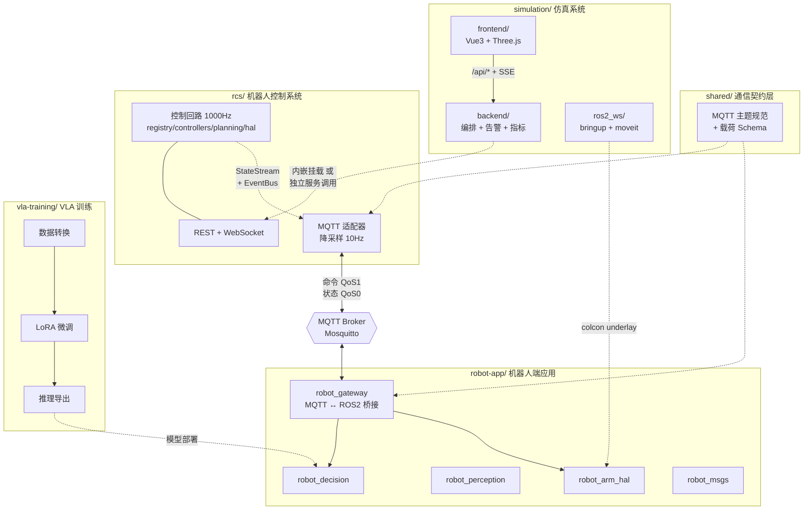

## 用户需求

将当前 `robot-logic` 单体工程整理分解为 **monorepo 下的 4 个子工程**，各自职责独立、边界清晰，并落地跨工程通信与训练骨架。

## 产品概述

把现有「FastAPI 后端 + Vue 前端 + ROS2 工作区」混合工程，重组为结构对称的四个子工程加一个共享契约层。RCS 运动控制从后端剥离为可独立部署的服务；仿真系统收拢为完整子工程；新增 VLA 训练工程骨架与机器人端应用；机器人端通过 MQTT 消息总线与 RCS 双向通信。

## 核心功能

### 1. RCS 机器人控制系统（`rcs/`）

- 承接现有 `backend/rcs/` 全部能力：设备注册表、控制回路、正逆运动学、轨迹规划、仿真 HAL、REST + WebSocket 接口
- **双运行模式**：既可独立启动为 FastAPI 服务（自带端口），也可被仿真后端以路由方式内嵌挂载，通过配置开关切换
- 新增 MQTT 适配层：把命令下发与状态上报映射到消息总线主题，原有 HTTP/WebSocket 接口保持不变
- 解除对仿真后端的依赖，自带鉴权与配置

### 2. 物流装卸仿真系统（`simulation/`）

- 收拢现有仿真编排后端（设备/任务/场地/告警/日志/指标 接口与 SSE 流）、Vue3 + Three.js 可视化前端、Gazebo 与 MoveIt 仿真 ROS2 包
- 保持前端调用路径与用户可见行为完全不变
- 可选择性接入独立部署的 RCS 服务

### 3. 装卸机器人端 VLA 模型训练工程（`vla-training/`）

- 全新建立，围绕开源 VLA 大模型微调路线组织
- 覆盖：数据采集与格式转换、微调配置、训练入口、评估、推理导出
- 提供依赖清单与示例配置，**不下载模型权重、不实际执行训练**

### 4. 装卸机器人端应用（`robot-app/`）

- 承接 ROS2 侧网关、决策、感知、消息定义、机械臂硬件抽象等包
- 实现网关与 RCS 之间基于 MQTT 的双向通信：接收控制命令并转为 ROS2 动作，上报机器人状态与遥测
- 补齐当前仅为占位的消息契约定义

### 5. 共享契约层（`shared/`）

- 统一维护 MQTT 主题命名规范与消息载荷结构定义，供 RCS 与机器人端应用共同引用，避免契约漂移

## 交付约束

- 分阶段推进，**每个阶段结束后系统仍可正常运行**
- 文件迁移保留 Git 历史
- 同步更新构建、部署、脚本、文档中的路径引用

## 技术栈选型

沿用项目既有技术栈，不引入非必要的新框架：

| 子工程 | 技术栈 | 依据 |
| --- | --- | --- |
| `rcs/` | Python 3.11 + FastAPI 0.104 + Pydantic 2.4 + NumPy 1.26 + `paho-mqtt`（新增） | 完全复用 `backend/rcs/` 现有实现 |
| `simulation/backend/` | FastAPI + SQLAlchemy 2.0(async) + aiosqlite + pydantic-settings | 保持现状 |
| `simulation/frontend/` | Vue 3 + Vite + Three.js + axios | 保持现状 |
| `simulation/ros2_ws/` | ROS2 Jazzy + Gazebo Harmonic + MoveIt2 (ament_python) | 保持现状 |
| `robot-app/ros2_ws/` | ROS2 Jazzy + rclpy + `paho-mqtt` | 沿用 ament_python 包格式 |
| `vla-training/` | Python + PyTorch + transformers + peft(LoRA) + accelerate（仅声明依赖） | 用户选定 OpenVLA/RT 微调路线 |
| `shared/` | JSON Schema + Python 契约包 | 零运行时依赖，双向引用 |


**新增依赖仅两项**：`paho-mqtt`（MQTT 客户端，RCS 与 robot-app 侧）、Mosquitto broker（以 docker-compose 提供，不侵入代码）。

---

## 实施策略

### 核心思路

采用 **「先物理迁移、再解耦、后扩展」** 的三段式重构。先用 `git mv` 完成目录搬迁并立刻修复引用使系统恢复可运行；再解除 RCS 对仿真后端的唯一横向依赖并实现双模式；最后在稳定的骨架上叠加 MQTT 桥接与 VLA 工程。这样每个阶段都有可验证的运行状态，避免「大爆炸式重构」导致长时间不可用。

### 关键技术决策

**决策一：RCS 双模式通过「工厂函数 + 门面对象」实现**

现有 `backend/rcs/__init__.py` 已存在 `_RCSFacade` 门面，暴露 `lifespan()` 与 `router()` 两个静态方法，`main.py:156` 通过 `app.include_router(rcs.router(), prefix="/api/rcs")` 挂载、`main.py:136` 通过 `async with rcs.lifespan()` 链式启动。**这个门面天然就是双模式的基础**，只需新增 `create_app()` 工厂：

- **内嵌模式**：仿真后端继续调用 `rcs.router()` / `rcs.lifespan()`，行为零变化
- **独立模式**：`rcs/app.py` 提供 `create_app()`，内部构造独立 `FastAPI` 实例并挂载同一个 `rcs_router`，走自己的 lifespan

选此方案而非「拆成两份代码」或「强制微服务化」，因为它复用了已有门面抽象，改动面最小，且两种模式共享同一份路由与控制回路代码，不存在行为漂移风险。

**决策二：解除 RCS → 仿真后端的唯一横向依赖**

已确认耦合点唯一：`backend/rcs/service.py:10` 的 `from backend.services.security import require_api_key`，而 `security.py:15` 又依赖 `backend.config.settings`。

处理方式：在 `rcs/` 内建立自己的 `config.py` 与 `security.py`（从 `backend/services/security.py` 复制鉴权与限流实现）。**选择复制而非抽到 `shared/`**，理由是：鉴权策略属于各服务的自治关切，两个服务未来的鉴权演进方向不同（RCS 面向机器人设备可能走证书/mTLS，仿真后端面向操作员走 API Key）；强行共享会制造反向耦合。`shared/` 只承载真正需要双方严格一致的**通信契约**。代码量仅约 70 行，DRY 的收益低于耦合的代价。

**决策三：MQTT 采用「适配器模式」旁挂，不侵入控制回路**

RCS 的 `ControlLoop`（`loop.py`）是高频热路径——`robot-01` 配置为 **1000Hz**（`registry.py:19`），每 tick 都要在 1ms 内完成 `hal.read → ctrl.update → hal.write`。**绝不能在 tick 循环内做网络 I/O**。

设计如下：

- **状态上报**：MQTT 适配器复用已有的 `StateStream.subscribe()` 机制（`loop.py:73` 每 tick `publish`，`service.py:131` 的 WebSocket 已是这种消费方式），在独立协程中消费队列，并**按可配置频率降采样**（默认 10Hz）后发布到 MQTT。1000Hz 原始流直接推 MQTT 会瞬时打满 broker，降采样是必须的。
- **命令下发**：适配器订阅命令主题，收到后调用与 REST 路由**完全相同**的 `registry.get_controller(device_id).on_command(cmd)` 路径，复用现有的队列背压检查（`service.py:79` 的 `COMMAND_QUEUE_MAXSIZE = 1024`）。
- **故障事件**：复用 `events.py` 的 `EventBus`。该总线已发布 `hal_read_timeout`、`hal_write_failure`、`controller_halted` 三类事件（`loop.py:58/68/72`），且其文档注释明确说明「为未来订阅者预留」——MQTT 适配器正是第一个订阅者，属于设计意图内的扩展。
- **可选启用**：通过环境变量开关控制，未配置 broker 时 RCS 行为与现在完全一致，保证零回归。

**决策四：`robot_arm_hal` 归属与跨工作区引用**

`robot_arm_hal` 同时被仿真侧（`robot_bringup/urdf/robot.urdf.xacro` 引用其 `arm_hal.ros2_control.xacro`，含 mock/gz 双后端）和机器人端需要。归入 `robot-app/ros2_ws/src/`（用户已确认），仿真侧通过 **colcon 多工作区叠加（underlay/overlay）** 引用：先 source `robot-app` 工作区再 build `simulation` 工作区。这是 ROS2 官方标准做法，优于符号链接（Windows 兼容性差）或复制（双份维护）。

**决策五：前端零改动**

`frontend/vite.config.ts` 的代理配置为 `'/api': 'http://localhost:8000'` 与 `'/ws'` WebSocket 代理，前端所有请求走相对路径 `/api/*`。只要仿真后端仍监听 8000 且保持路由前缀，**前端代码与配置均无需修改**，仅随目录整体迁移。若启用独立 RCS，在 vite 代理中新增一条 `/api/rcs` 指向 RCS 端口即可。

---

## 执行要点

### 性能

- **1000Hz 控制回路是绝对热路径**：MQTT 发布必须在独立协程 + 降采样，禁止在 `ControlLoop._run` 内新增任何阻塞或网络调用
- MQTT 客户端使用 QoS 0 发布状态（高频、可容忍丢失）、QoS 1 接收命令（不可丢失），发布失败静默计数不抛异常，避免影响控制
- `StateStream` 队列消费需处理背压：队列满时丢弃旧状态而非阻塞

### 迁移安全

- 全程使用 `git mv` 保留文件历史，便于后续追溯与 blame
- **`build/`、`install/`、`log/`、`__pycache__/`、`*.pyc` 为构建产物，不迁移**，迁移后清理并同步更新 `.gitignore`（新增 `simulation/ros2_ws/{build,install,log}/`、`robot-app/ros2_ws/{build,install,log}/`）
- 已确认需批量改写的引用点：
- `backend/rcs/tests/` 下 **18 个测试文件**的 `from backend.rcs.*` 导入
- `backend/main.py:19-25` 的 6 处 `from backend.*` 导入
- `backend/Dockerfile:11` 的 `uvicorn backend.main:app`
- `backend/pytest.ini` 的 `testpaths`
- `deploy/k8s/api.yaml` 的镜像构建上下文
- `scripts/verify_rcs1.sh` 等验证脚本路径

### 兼容性

- 仿真后端所有对外接口（REST 路径、SSE 流、`/metrics`、端口 8000）保持不变
- RCS 的 `/api/rcs/*` 在内嵌模式下路径不变
- MQTT 为纯增量特性，默认关闭

### 日志

复用各服务既有输出方式（仿真后端 `runtime.log`、RCS 的 `EventBus`），MQTT 适配器的连接/断开/重连记为 INFO，发布失败按频率采样记录避免刷屏，不记录完整状态载荷。

---

## 架构设计



### 关键数据流

**命令下行**：RCS REST/MQTT → `registry.get_controller(id).on_command(cmd)` → 控制器队列（容量 1024，背压保护）→ `ControlLoop._run` tick 消费 → `hal.write`

**状态上行**：`ControlLoop._run` 每 tick → `StateStream.publish` → 双路并行消费：① WebSocket 全量推送（现有）② MQTT 适配器降采样至 10Hz 后发布（新增）

**故障事件**：`ControlLoop` 检测异常 → `EventBus.publish` → MQTT 适配器订阅并转发告警主题

---

## 目录结构

### 结构总览

重构后形成 4 个对称子工程 + 1 个共享契约层。`rcs/` 与 `simulation/backend/` 由现有 `backend/` 拆分而来；`simulation/frontend/`、`simulation/ros2_ws/`、`robot-app/ros2_ws/` 由现有目录迁移而来；`vla-training/` 与 `shared/` 为全新建立。

```
robot-logic/
├── rcs/                                    # [NEW] 子工程1：RCS 机器人控制系统
│   ├── rcs/
│   │   ├── __init__.py                     # [MODIFY] 由 backend/rcs/__init__.py 迁移。保留 _RCSFacade 门面（lifespan/router/loop），新增 create_app 导出
│   │   ├── app.py                          # [NEW] 独立服务工厂 create_app()：构造独立 FastAPI 实例，挂载 rcs_router 于 /api/rcs，绑定自身 lifespan，供 uvicorn 直接启动
│   │   ├── config.py                       # [NEW] RCS 自治配置（pydantic-settings）：服务端口、鉴权开关与密钥、MQTT broker 地址/端口/凭据/主题前缀、状态发布频率、启用开关
│   │   ├── security.py                     # [NEW] 从 backend/services/security.py 复制 require_api_key 与 SlidingWindowLimiter，改为依赖 rcs.config.settings，解除对仿真后端的依赖
│   │   ├── service.py                      # [MODIFY] 迁移自 backend/rcs/service.py。仅改第10行导入为 from ..security import require_api_key，其余路由与 WS 逻辑保持不变
│   │   ├── loop.py                         # [MODIFY] 迁移自 backend/rcs/loop.py。仅改相对导入，1000Hz tick 逻辑严禁改动
│   │   ├── registry.py                     # [MODIFY] 迁移自 backend/rcs/registry.py，仅改相对导入
│   │   ├── events.py                       # [MODIFY] 迁移自 backend/rcs/events.py，无需改动内容
│   │   ├── controllers/                    # [MODIFY] 迁移 arm/agv/stacker/base/_common，仅改相对导入
│   │   ├── hal/                            # [MODIFY] 迁移 protocol.py 与 sim.py，仅改相对导入
│   │   ├── planning/                       # [MODIFY] 迁移 fk/ik/interpolator/trajectory，仅改相对导入
│   │   ├── state/                          # [MODIFY] 迁移 command/controller_state/error/joint/pose/profile/state_stream
│   │   └── mqtt/
│   │       ├── __init__.py                 # [NEW] MQTT 适配器包导出
│   │       ├── client.py                   # [NEW] paho-mqtt 客户端封装：连接管理、断线自动重连（指数退避）、发布失败计数、优雅关闭。禁止阻塞事件循环
│   │       ├── publisher.py                # [NEW] 状态发布器：独立协程消费 StateStream.subscribe() 队列，按 config 频率降采样（默认10Hz）后以 QoS0 发布；订阅 EventBus 的 hal_read_timeout/hal_write_failure/controller_halted 转发至告警主题；队列满时丢弃旧数据
│   │       └── subscriber.py               # [NEW] 命令订阅器：以 QoS1 订阅命令主题，按 shared 契约校验载荷，转为 Command 对象后走与 REST 相同的 registry.get_controller().on_command() 路径，复用 1024 队列容量背压检查
│   ├── tests/                              # [MODIFY] 迁移 backend/rcs/tests/ 全部18个文件，批量改写 from backend.rcs.* → from rcs.*
│   │   ├── conftest.py                     # [MODIFY] 改写 registry 导入路径
│   │   ├── unit/                           # [MODIFY] 9个单元测试改写导入
│   │   ├── integration/                    # [MODIFY] 5个集成测试改写导入
│   │   └── mqtt/                           # [NEW] MQTT 适配器测试：降采样正确性、断线重连、载荷契约一致性、命令背压（使用 mock broker）
│   ├── pyproject.toml                      # [NEW] 独立包定义与依赖：fastapi/uvicorn/numpy/scipy/pydantic/pydantic-settings/paho-mqtt
│   ├── pytest.ini                          # [NEW] testpaths=tests, asyncio_mode=auto
│   ├── Dockerfile                          # [NEW] 独立服务镜像，CMD uvicorn rcs.app:create_app --factory
│   └── README.md                           # [NEW] RCS 职责、双模式启动方式、MQTT 主题说明、环境变量清单
│
├── simulation/                             # 子工程2：物流装卸仿真系统
│   ├── backend/
│   │   ├── main.py                         # [MODIFY] 迁移自 backend/main.py。改动：①第25行 from backend.rcs import rcs 改为条件导入（内嵌模式导入 rcs 包，独立模式跳过）②第156行 include_router 与第136行 lifespan 由配置开关控制 ③其余导入前缀调整
│   │   ├── config.py                       # [MODIFY] 迁移自 backend/config.py，新增 rcs_embedded(bool) 与 rcs_service_url 两项配置
│   │   ├── services/                       # [MODIFY] 迁移 runtime/alerts/metrics/security，改导入前缀
│   │   ├── algorithm/                      # [MODIFY] 迁移 simulator/scheduler/planner/perception，改导入前缀
│   │   ├── data/                           # [MODIFY] 迁移 db.py 与 models.py，改导入前缀
│   │   ├── tests/                          # [MODIFY] 迁移 backend/tests/，改导入前缀
│   │   ├── requirements.txt                # [MODIFY] 迁移，移除 RCS 独有依赖
│   │   ├── pytest.ini                      # [MODIFY] 迁移
│   │   └── Dockerfile                      # [MODIFY] 迁移，调整 COPY 上下文与 uvicorn 模块路径
│   ├── frontend/                           # [MODIFY] 整体迁移，源码零改动
│   │   └── vite.config.ts                  # [MODIFY] 仅在启用独立 RCS 时新增 '/api/rcs' 代理条目，其余保持
│   └── ros2_ws/src/
│       ├── robot_bringup/                  # [MODIFY] 整体迁移。urdf/robot.urdf.xacro 对 robot_arm_hal 的引用改为跨工作区依赖
│       └── robot_moveit_config/            # [MODIFY] 整体迁移，配置内容不变
│
├── robot-app/                              # 子工程4：装卸机器人端应用
│   ├── ros2_ws/src/
│   │   ├── robot_msgs/                     # [MODIFY] 迁移并补齐契约：新增 RobotState.msg、RobotTelemetry.msg，MoveCommand.action（对齐 shared 契约字段）
│   │   ├── robot_gateway/
│   │   │   ├── robot_gateway/
│   │   │   │   ├── mqtt_bridge_node.py     # [NEW] 核心桥接节点：订阅 RCS 命令主题转为 ROS2 动作/话题下发；采集机器人状态按频率上报至 MQTT 状态主题；断线重连与本地缓存
│   │   │   │   ├── contract.py             # [NEW] 引用 shared 契约的载荷序列化/反序列化与校验
│   │   │   │   └── __init__.py             # [MODIFY] 导出节点
│   │   │   ├── setup.py                    # [MODIFY] 补充 console_scripts 入口 mqtt_bridge_node，描述由"FastAPI gateway"更新为"MQTT bridge to RCS"
│   │   │   ├── package.xml                 # [MODIFY] 修正重复的 rclpy 依赖，更新描述
│   │   │   └── tests/                      # [NEW] 桥接节点单元测试（mock MQTT + mock ROS2）
│   │   ├── robot_decision/                 # [MODIFY] 迁移，预留 VLA 推理接入点
│   │   ├── robot_perception/               # [MODIFY] 迁移
│   │   └── robot_arm_hal/                  # [MODIFY] 迁移，作为 underlay 供仿真工作区叠加引用
│   ├── requirements.txt                    # [NEW] paho-mqtt 等 Python 侧依赖
│   └── README.md                           # [NEW] 机器人端应用职责、构建方式、与 RCS 通信配置、跨工作区叠加说明
│
├── vla-training/                           # [NEW] 子工程3：VLA 模型训练工程
│   ├── configs/
│   │   ├── base.yaml                       # [NEW] 通用配置：数据路径、输出目录、随机种子、日志
│   │   ├── finetune_lora.yaml              # [NEW] LoRA 微调示例配置：基座模型标识、rank/alpha/dropout、学习率、批大小、梯度累积、训练轮次
│   │   └── dataset.yaml                    # [NEW] 数据集配置：采集来源（仿真/真机）、动作空间维度、图像分辨率、指令模板
│   ├── src/vla_training/
│   │   ├── data/
│   │   │   ├── collector.py                # [NEW] 从仿真系统与机器人端采集轨迹数据（观测图像 + 指令 + 动作序列）的接口定义与实现骨架
│   │   │   ├── converter.py                # [NEW] 原始轨迹转标准训练格式（RLDS/LeRobot 风格）的转换器骨架
│   │   │   └── dataset.py                  # [NEW] PyTorch Dataset 实现骨架：样本加载、图像预处理、动作归一化
│   │   ├── models/
│   │   │   └── loader.py                   # [NEW] 基座 VLA 模型加载与 LoRA 适配器注入骨架，仅定义接口不下载权重
│   │   ├── train/
│   │   │   └── finetune.py                 # [NEW] 微调训练入口骨架：配置解析、模型/数据装配、训练循环框架、检查点保存
│   │   ├── eval/
│   │   │   └── evaluate.py                 # [NEW] 评估骨架：动作预测误差、任务成功率指标定义
│   │   └── export/
│   │       └── to_inference.py             # [NEW] 训练产物导出为机器人端可用推理格式的骨架，对接 robot_decision
│   ├── scripts/
│   │   ├── prepare_data.py                 # [NEW] 数据准备命令行入口
│   │   └── run_finetune.py                 # [NEW] 微调启动命令行入口
│   ├── requirements.txt                    # [NEW] torch/transformers/peft/accelerate/datasets/pyyaml（仅声明版本，不安装）
│   └── README.md                           # [NEW] 训练工程说明：数据流程、微调步骤、导出部署链路、当前为骨架的明确声明
│
├── shared/                                 # [NEW] 共享通信契约层
│   ├── contracts/
│   │   ├── mqtt_topics.md                  # [NEW] MQTT 主题命名规范：命令下行 rcs/{device_id}/command、状态上行 rcs/{device_id}/state、告警 rcs/{device_id}/alert、遥测 robot/{device_id}/telemetry，含 QoS 与保留标志约定
│   │   ├── command.schema.json             # [NEW] 命令载荷 JSON Schema：对齐 service.py 的 CommandRequest（command_id/type 六种枚举/target_pose/target_joints/speed_scale/constraints）
│   │   ├── state.schema.json               # [NEW] 状态载荷 Schema：device_id/mode/active_command_id/last_error/joint_positions/tracking_error/timestamp
│   │   └── alert.schema.json               # [NEW] 告警载荷 Schema：对齐 EventBus 的三类事件
│   ├── python/robot_contracts/
│   │   ├── __init__.py                     # [NEW] 契约包导出
│   │   ├── topics.py                       # [NEW] 主题常量与构造函数，供 rcs 与 robot-app 共同 import，杜绝主题字符串硬编码
│   │   └── payloads.py                     # [NEW] Pydantic 载荷模型，与 JSON Schema 保持一致，提供序列化与校验
│   └── README.md                           # [NEW] 契约层用途、变更流程、双方引用方式
│
├── deploy/
│   ├── k8s/
│   │   ├── api.yaml                        # [MODIFY] 更新仿真后端镜像构建上下文路径
│   │   └── rcs.yaml                        # [NEW] RCS 独立服务的 Deployment 与 Service
│   └── docker-compose.yml                  # [NEW] 一键本地编排：Mosquitto broker + RCS 服务 + 仿真后端，含 broker 配置挂载
│
├── scripts/                                # [MODIFY] 全部脚本内路径引用更新
│   ├── verify_rcs1.sh                      # [MODIFY] 路径由 backend/rcs 改为 rcs/
│   ├── verify_m0.sh / verify_m1.sh / verify_m3.sh  # [MODIFY] ros2_ws 路径改为 simulation/ros2_ws 与 robot-app/ros2_ws
│   ├── check_gz_moveit.sh                  # [MODIFY] 工作区路径更新
│   └── verify_split.sh                     # [NEW] 拆分后整体验证：四个子工程各自测试 + 端到端 MQTT 链路连通性检查
│
├── docs/
│   ├── superpowers/specs/
│   │   └── 2026-08-07-four-subproject-split-design.md  # [NEW] 本次拆分设计文档（brainstorming 流程产物）：架构决策、边界划分、迁移映射表、通信契约设计
│   ├── ARCHITECTURE.md                     # [NEW] Monorepo 四子工程架构总览、职责边界、依赖方向、通信矩阵
│   ├── API.md                              # [MODIFY] 补充 RCS 独立服务地址与 MQTT 接口说明
│   └── OPERATIONS.md                       # [MODIFY] 更新部署与启动流程，新增 broker 运维说明
│
├── .gitignore                              # [MODIFY] 新增 simulation/ros2_ws/{build,install,log}/、robot-app/ros2_ws/{build,install,log}/、vla-training/{outputs,checkpoints,data}/
└── README.md                               # [MODIFY] 重写为 monorepo 导航页：四子工程简介、各自快速启动、整体架构图
```

---

## 关键代码结构

以下两项为跨工程强契约，必须精确定义以保证 RCS 与 robot-app 双方一致：

**MQTT 主题契约**（`shared/python/robot_contracts/topics.py`）

```python
COMMAND_TOPIC: str    # "rcs/{device_id}/command"   QoS1  下行
STATE_TOPIC: str      # "rcs/{device_id}/state"     QoS0  上行
ALERT_TOPIC: str      # "rcs/{device_id}/alert"     QoS1  上行
TELEMETRY_TOPIC: str  # "robot/{device_id}/telemetry" QoS0 上行

def command_topic(device_id: str) -> str: ...
def state_topic(device_id: str) -> str: ...
def alert_topic(device_id: str) -> str: ...
def telemetry_topic(device_id: str) -> str: ...
```

**RCS 双模式入口**（`rcs/rcs/app.py` 与 `rcs/rcs/__init__.py`）

```python
# app.py —— 独立服务模式
def create_app() -> FastAPI: ...

# __init__.py —— 门面，同时支持内嵌与独立（保留现有签名）
class _RCSFacade:
    lifespan: Callable[[], AsyncContextManager]  # 现有
    router: Callable[[], APIRouter]              # 现有
    loop: property                               # 现有
```

命令载荷字段严格对齐现有 `service.py` 的 `CommandRequest`（`type` 限定 `move_j|move_l|stop|home|estop|recover`，`speed_scale` 范围 0..10），避免 REST 与 MQTT 两条入口产生行为差异。