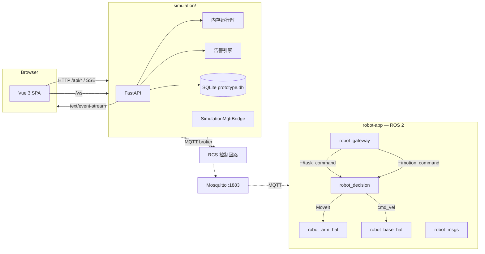

# 运维手册

> 本文介绍如何运行、打包和部署 robot-logic 原型系统。关于机器人端
> （延迟预算、故障策略、边缘/云角色）的设计意图，
> 请参阅 [`docs/algorithm/05-deployment.md`](algorithm/05-deployment.md)。

## 架构概览



- **仿真后端**（`simulation/backend/`）：FastAPI + SQLAlchemy（异步，SQLite）+
  内存 `Runtime` 驱动仿真。默认嵌入 RCS，或以独立服务模式调用。
  提供 REST、SSE 和 Prometheus 端点。包含 `SimulationMqttBridge` 用于 MQTT 通信。
  Phase 2 新增：`PointCloudGenerator`（合成深度相机）、`LaserScanGenerator`（合成 2D LIDAR）、
  感知检测 SSE (`/api/devices/{id}/detections` 10Hz) 和导航路径 SSE (`/api/devices/{id}/nav_path` 1Hz)。
- **前端**（`simulation/frontend/`）：Vue 3 + Vite + Three.js。Vite 开发模式
  将 `/api/*` 代理到后端。渲染 `LoaderRobot`（双臂 AGV）、`RobotArm` 和仓库场景。
- **RCS**（`rcs/`）：机器人控制系统，挂载在 `/api/rcs`（嵌入式）
  或以独立服务形式运行在 `:8100`。通过 MQTT 与机器人端通信。
- **robot-app**（`robot-app/ros2_ws/src/`）：物理机器人端的 ROS 2 包。
  `robot_gateway` 桥接 MQTT ↔ ROS 2；`robot_decision` 承载
  `TaskCoordinator`（9 阶段 FSM）、`SafetyMonitor`、`BaseExecutor`（Nav2
  NavigateToPose action client）、`ArmExecutor`、`HugController`；
  `robot_perception` 包含 7 步点云处理管线（`PointCloudProcessor`）。
- **shared**（`shared/`）：零依赖 MQTT 契约（JSON Schema + Pydantic 模型），
  由 `rcs/`、`simulation/` 和 `robot-app/` 共享。

---

## 本地开发

### 前置条件

| 工具 | 版本要求 | 用途 |
|------|----------|------|
| Python | ≥ 3.11 | 仿真后端、RCS、共享契约 |
| Node.js | ≥ 20 / npm ≥ 10 | 前端（Vue 3 + Vite） |
| Docker + docker compose | 最新稳定版 | 可选：Mosquitto + 全栈部署 |
| ROS 2 Humble | — | robot-app（仅物理机器人部署时需要） |
| Git | ≥ 2.30 | 版本控制 |

### 项目目录结构

```
robot-logic/
├── shared/              # MQTT 通信契约（JSON Schema + Pydantic）
├── rcs/                 # 机器人控制系统 (RCS)
├── simulation/
│   ├── backend/         # FastAPI 仿真后端
│   ├── frontend/        # Vue 3 + Three.js 可视化前端
│   └── ros2_ws/         # Gazebo/MoveIt 仿真工作区
├── robot-app/
│   └── ros2_ws/src/     # ROS 2 机器人端应用
│       ├── robot_gateway/    # MQTT ↔ ROS 2 桥接
│       ├── robot_decision/   # TaskCoordinator + 执行器
│       ├── robot_arm_hal/     # 单臂 HAL (robot_dual_arm_hal 的 underlay)
│       ├── robot_dual_arm_hal/ # 双臂 HAL (URDF + ros2_control, left/right)
│       ├── robot_base_hal/   # 底盘 HAL (URDF + diff_drive)
│       ├── robot_msgs/       # 本地消息契约
│       └── robot_perception/ # 感知（Phase 2）
├── vla-training/        # VLA 模型训练流水线
├── deploy/              # Docker Compose + K8s 配置
└── docs/                # 设计文档
```

### 快速启动（最小化：后端 + 前端）

这是最简单的启动方式，不需要 Docker 或 ROS 2。RCS 默认嵌入在仿真后端中。

**终端 1 — 仿真后端**：

```bash
cd simulation/backend
python -m venv .venv
# Windows:
.venv\Scripts\activate
# macOS/Linux:
# source .venv/bin/activate

pip install -r requirements.txt
# 可选：安装共享契约包以获得严格验证
pip install -e ../../shared/python

uvicorn backend.main:app --host 127.0.0.1 --port 8000 --reload
```

**终端 2 — 前端**：

```bash
cd simulation/frontend
npm install
npm run dev -- --host 127.0.0.1 --port 5173 --strictPort
```

打开 `http://localhost:5173`。Vite 自动代理 `/api/*` 到后端 `:8000`。

### 带 MQTT 全链路启动（含 RCS standalone + robot-app）

当需要测试 MQTT 通信链路或 robot-app ROS 2 节点时：

**终端 1 — Mosquitto MQTT Broker**：

```bash
# 方式 A：Docker（推荐）
docker run -d --name mosquitto \
  -p 1883:1883 -p 9001:9001 \
  -v $(pwd)/deploy/mosquitto/mosquitto.conf:/mosquitto/config/mosquitto.conf:ro \
  eclipse-mosquitto:2

# 方式 B：本地安装
mosquitto -c deploy/mosquitto/mosquitto.conf
```

**终端 2 — 仿真后端（启用 MQTT）**：

```bash
cd simulation/backend
# 设置环境变量启用 MQTT
export SIM_MQTT_ENABLED=true
export SIM_MQTT_HOST=127.0.0.1
export SIM_MQTT_PORT=1883

uvicorn backend.main:app --host 127.0.0.1 --port 8000 --reload
```

**终端 3 — RCS standalone（可选，替代 embedded 模式）**：

```bash
cd rcs
pip install -r requirements.txt
# 或
pip install -e .

export RCS_MQTT_ENABLED=true
export RCS_MQTT_HOST=127.0.0.1
export RCS_MQTT_PORT=1883

uvicorn rcs.app:create_app --factory --host 127.0.0.1 --port 8100 --reload
```

此时仿真后端需切换为 standalone 模式：

```bash
export RCS_EMBEDDED=false
export RCS_SERVICE_URL=http://127.0.0.1:8100
```

**终端 4 — robot-app ROS 2 节点**（需要 ROS 2 Humble 环境）：

```bash
# 在 ROS 2 环境中
cd robot-app/ros2_ws
colcon build --symlink-install
source install/setup.bash

# 启动 gateway 节点
ros2 run robot_gateway mqtt_bridge_node \
  --ros-args \
  -p device_id:=loader-01 \
  -p mqtt_host:=127.0.0.1 \
  -p mqtt_port:=1883

# 启动 TaskCoordinator 节点
ros2 run robot_decision task_coordinator_node
```

**终端 5 — 前端**：

```bash
cd simulation/frontend
npm install
npm run dev -- --host 127.0.0.1 --port 5173 --strictPort
```

### 验证启动

```bash
# 后端健康检查
curl http://localhost:8000/api/status
# 期望: {"running": true, "device_count": 5, ...}

# 设备列表（应包含 loader-01）
curl http://localhost:8000/api/devices

# SSE 日志流
curl -N http://localhost:8000/api/logs/stream

# Prometheus 指标
curl http://localhost:8000/metrics

# RCS 健康检查（standalone 模式）
curl http://localhost:8100/health

# 关节状态 SSE（loader-01 双臂 14 关节）
curl -N http://localhost:8000/api/devices/loader-01/joints

# 感知检测 SSE（Phase 2，10Hz）
curl -N http://localhost:8000/api/devices/loader-01/detections

# 导航路径 SSE（Phase 2，1Hz）
curl -N http://localhost:8000/api/devices/agv-01/nav_path
```

### 运行测试

项目包含 6 个独立测试套件，总计 308 个测试：

```bash
# 1. simulation/backend (89 tests)
cd simulation/backend
pip install -r requirements.txt
pytest -q

# 2. rcs (85 tests)
cd rcs
pip install -r requirements.txt
pytest -q

# 3. robot_decision (43 tests)
cd robot-app/ros2_ws/src/robot_decision
pytest -q

# 4. robot_gateway (44 tests)
cd robot-app/ros2_ws/src/robot_gateway
pytest -q

# 5. robot_perception (7 tests)
cd robot-app/ros2_ws/src/robot_perception
pytest -q

# 6. vla-training (40 tests)
cd vla-training
pip install -r requirements.txt
pytest -q
```

### 前端构建

```bash
cd simulation/frontend
npm install
npm run build    # vue-tsc 类型检查 + vite build
# 产物在 dist/ 目录
```

---

## 配置

### 仿真后端配置

配置位于 `simulation/backend/config.py`，通过环境变量（或后端目录下的 `.env` 文件）读取。

| 环境变量 | 默认值 | 说明 |
| --- | --- | --- |
| `DATABASE_URL` | `sqlite+aiosqlite:///./data/prototype.db` | 异步数据库 URL |
| `LOG_LEVEL` | `INFO` | uvicorn 日志级别 |
| `CLOUD_ENDPOINT` | `http://localhost:8080` | 未来 sidecar 的占位符 |
| `USE_CLOUD` | `false` | 是否切换到云端规划器 |
| `API_AUTH_ENABLED` | `false` | 是否启用 API Key 认证 |
| `API_API_KEYS` | _空_ | 逗号分隔的有效密钥列表 |
| `RATE_LIMIT_MAX` | `120` | 每窗口每 IP 最大请求数 |
| `RATE_LIMIT_WINDOW_SECONDS` | `60` | 窗口大小（秒） |
| `RCS_EMBEDDED` | `true` | 嵌入 RCS 路由到仿真后端进程 |
| `RCS_SERVICE_URL` | `http://127.0.0.1:8100` | standalone RCS 地址 |
| `SIM_MQTT_ENABLED` | `false` | 启用仿真后端 MQTT bridge |
| `SIM_MQTT_HOST` | `127.0.0.1` | MQTT broker 地址 |
| `SIM_MQTT_PORT` | `1883` | MQTT broker 端口 |

### RCS 配置

RCS 拥有独立的配置（`rcs/rcs/config.py`），环境变量前缀 `RCS_`：

| 环境变量 | 默认值 | 说明 |
| --- | --- | --- |
| `RCS_HOST` | `127.0.0.1` | standalone 绑定地址 |
| `RCS_PORT` | `8100` | standalone 端口 |
| `RCS_LOG_LEVEL` | `INFO` | 日志级别 |
| `RCS_MQTT_ENABLED` | `false` | 启用 MQTT 适配器 |
| `RCS_MQTT_HOST` | `127.0.0.1` | MQTT broker 地址 |
| `RCS_MQTT_PORT` | `1883` | MQTT broker 端口 |
| `RCS_MQTT_CLIENT_ID` | `rcs-adapter` | MQTT 客户端 ID |
| `RCS_MQTT_STATE_PUBLISH_HZ` | `10.0` | 状态发布频率 |
| `RCS_API_AUTH_ENABLED` | `false` | RCS 独立认证 |

`simulation/backend/.env.example` 提供了初始配置模板：

```ini
APP_NAME=Robot Logic System
DATABASE_URL=sqlite+aiosqlite:///./data/prototype.db
LOG_LEVEL=INFO
CLOUD_ENDPOINT=http://localhost:8080
USE_CLOUD=false
```

### 启用认证 + 限速

```bash
export API_AUTH_ENABLED=1
export API_API_KEYS="$(openssl rand -hex 16),$(openssl rand -hex 16)"
curl -H "X-API-Key: $(echo $API_API_KEYS | cut -d, -f1)" http://localhost:8000/api/devices
```

---

## Docker

仓库提供仿真后端的两阶段构建、独立 RCS 服务的 factory 镜像，以及前端的 Node 构建镜像。
`deploy/docker-compose.yml` 将它们与 Mosquitto broker 组装在一起。

### `simulation/backend/Dockerfile`

```dockerfile
FROM python:3.11-slim AS base
WORKDIR /app
ENV PYTHONUNBUFFERED=1 PIP_NO_CACHE_DIR=1
COPY simulation/backend/requirements.txt ./requirements.txt
RUN pip install -r requirements.txt
COPY simulation/backend/ ./simulation/backend/
COPY rcs/rcs/ ./rcs/rcs/
COPY shared/python/robot_contracts/ ./shared/python/robot_contracts/
EXPOSE 8000
CMD ["uvicorn", "backend.main:app", "--host", "0.0.0.0", "--port", "8000"]
```

### `rcs/Dockerfile`（独立模式）

```dockerfile
FROM python:3.11-slim AS base
WORKDIR /app
ENV PYTHONUNBUFFERED=1 PIP_NO_CACHE_DIR=1
COPY rcs/requirements.txt ./requirements.txt
RUN pip install -r requirements.txt
COPY rcs/ ./rcs/
COPY shared/python/robot_contracts/ ./shared/python/robot_contracts/
EXPOSE 8100
CMD ["uvicorn", "rcs.app:create_app", "--factory", "--host", "0.0.0.0", "--port", "8100"]
```

### `simulation/frontend/Dockerfile`

```dockerfile
FROM node:20-alpine AS build
WORKDIR /app
COPY package*.json ./
RUN npm ci
COPY . .
RUN npm run build

FROM nginx:1.27-alpine
COPY --from=build /app/dist /usr/share/nginx/html
COPY nginx.conf /etc/nginx/conf.d/default.conf
EXPOSE 80
```

### 本地运行（Docker Compose）

```bash
docker compose -f deploy/docker-compose.yml up --build
#   mosquitto   :1883
#   rcs         :8100  （MQTT 已启用）
#   simulation  :8000  （RCS_EMBEDDED=false -> 调用 rcs:8100）
```

或单独构建各镜像：

```bash
docker build -t robot-logic-api -f simulation/backend/Dockerfile .
docker build -t robot-logic-rcs -f rcs/Dockerfile .
docker build -t robot-logic-web -f simulation/frontend/Dockerfile ./simulation/frontend
```

在 nginx 配置（示例如下）中，SPA 将 `/api/*` 代理到后端：

```nginx
server {
  listen 80;
  root /usr/share/nginx/html;
  location / { try_files $uri /index.html; }

  location /api/ {
    proxy_pass http://host.docker.internal:8000;
    proxy_set_header Host $host;
    proxy_buffering off;
  }
}
```

---

## 持续集成

`.github/workflows/ci.yml` 在 push 或 PR 到 `master` 分支时运行：

```yaml
name: ci
on:
  push:
    branches: [master]
  pull_request:
    branches: [master]

jobs:
  backend:
    runs-on: ubuntu-latest
    steps:
      - uses: actions/checkout@v4
      - uses: actions/setup-python@v5
        with: { python-version: '3.11' }
      - run: pip install -r simulation/backend/requirements.txt
      - run: cd simulation/backend && pytest -q
  frontend:
    runs-on: ubuntu-latest
    steps:
      - uses: actions/checkout@v4
      - uses: actions/setup-node@v4
        with: { node-version: '20' }
      - run: cd simulation/frontend && npm ci && npx vue-tsc --noEmit
      - run: cd simulation/frontend && npm run build
  docker:
    runs-on: ubuntu-latest
    needs: [backend, frontend]
    steps:
      - uses: actions/checkout@v4
      - run: docker build -t robot-logic-api -f simulation/backend/Dockerfile .
      - run: docker build -t robot-logic-web -f simulation/frontend/Dockerfile ./simulation/frontend
```

> **注意**：`robot_decision` 和 `robot_gateway` 的测试需要 ROS 2 环境，
> 当前 CI 未包含。本地运行 `pytest` 在各包的 `tests/` 目录下即可。

---

## Kubernetes（概要）

```yaml
apiVersion: apps/v1
kind: Deployment
metadata: { name: robot-logic-api }
spec:
  replicas: 2
  selector: { matchLabels: { app: robot-logic-api } }
  template:
    metadata: { labels: { app: robot-logic-api } }
    spec:
      containers:
        - name: api
          image: registry/robot-logic-api:latest
          ports: [{ containerPort: 8000 }]
          env:
            - { name: API_AUTH_ENABLED, value: "1" }
            - { name: API_API_KEYS, valueFrom: { secretKeyRef: { name: api-keys, key: list } } }
          readinessProbe:
            httpGet: { path: /api/status, port: 8000 }
          livenessProbe:
            httpGet: { path: /, port: 8000 }
---
apiVersion: v1
kind: Service
metadata: { name: robot-logic-api }
spec:
  selector: { app: robot-logic-api }
  ports: [{ port: 80, targetPort: 8000 }]
```

RCS 以独立模式运行，通过 HTTP（嵌入式挂载点）和 MQTT 访问。需单独部署：

```yaml
apiVersion: apps/v1
kind: Deployment
metadata: { name: robot-logic-rcs }
spec:
  replicas: 2
  selector: { matchLabels: { app: robot-logic-rcs } }
  template:
    metadata: { labels: { app: robot-logic-rcs } }
    spec:
      containers:
        - name: rcs
          image: registry/robot-logic-rcs:latest
          ports: [{ containerPort: 8100 }]
          env:
            - { name: RCS_MQTT_ENABLED, value: "true" }
            - { name: RCS_MQTT_HOST, value: "mosquitto" }
            - { name: RCS_MQTT_PORT, value: "1883" }
          readinessProbe:
            httpGet: { path: /health, port: 8100 }
---
apiVersion: v1
kind: Service
metadata: { name: robot-logic-rcs }
spec:
  selector: { app: robot-logic-rcs }
  ports: [{ port: 80, targetPort: 8100 }]
```

仿真后端通过 `RCS_EMBEDDED=false` + `RCS_SERVICE_URL=http://robot-logic-rcs` 与 RCS 通信。
Mosquitto broker（`mosquitto` 服务）承载 command/state/alert/telemetry 四个 MQTT 主题；
机器人端（`robot-app`）作为设备侧的 MQTT 客户端。

对于 SSE，需配置 `nginx.ingress.kubernetes.io/proxy-buffering: "off"` 以及 `proxy-read-timeout` 设为大于心跳间隔的值（5s+）。

---

## 可观测性清单

- `/metrics` 适用于 Prometheus 采集；建议 10–15 秒抓取间隔。
- `GET /api/logs/stream` 和 `GET /api/alerts/stream` 应仅由仪表盘打开
  （浏览器自行处理重连）。服务端代理必须禁用缓冲。
- 推荐的 Grafana 面板：
  - `robot_logic_tasks_running` vs `tasks_pending`（队列健康度）
  - `robot_logic_devices_total`（车队规模）
  - `robot_logic_alerts_{warning,critical}`（活跃告警数）
  - 第 99 百分位 tick 延迟摘要

---

## 日常运维

- **扩缩容**：运行时状态存在于进程内存中；多副本部署会导致状态不一致。
  多副本部署需将所有实例指向同一 Redis pub/sub 后端，并将状态持久化到 Postgres。
- **备份**：SQLite 数据库位于 `data/prototype.db`。升级前请做快照。
- **升级**：原型阶段使用 `Strategy: Recreate` 即可；生产环境应使用蓝绿部署并排空 SSE 连接。
- **日志保留**：当前仅内存保留（500 条）；后续迭代应通过同一 SSE 事件流式传输到 ELK / Loki 管线。

---

## 故障排查

| 现象 | 可能原因 | 解决方法 |
| --- | --- | --- |
| `127.0.0.1:8000 refused to connect` | 后端未启动 | `uvicorn backend.main:app --port 8000` |
| Vite 显示 `Port 5173 in use` | 残留 Vite 进程 | `Get-NetTCPConnection -LocalPort 5173` → 终止 PID |
| `401 invalid api key` | `.env` 中设置了 `API_AUTH_ENABLED=1` | 设置请求头或本地关闭认证 |
| `429 rate limit exceeded` | 请求过多 | 调高 `RATE_LIMIT_MAX` 或移除限速 |
| SSE 仅有 ping | 无新日志 | 提交任务触发活动 |
| `/metrics` 无返回 | 进程刚重启 | 等待一个采集周期（0.5s） |
| 回滚返回 `409` | 任务仍在运行/排队 | 等待任务完成 |
| MQTT 消息未收到 | broker 未运行或 `SIM_MQTT_ENABLED=false` | 启动 Mosquitto + 设置环境变量 |
| `loader-01` 关节 SSE 为空 | 无 MQTT 状态流 | 检查 MQTT bridge 是否已连接到 broker |
| `robot_gateway` 节点启动崩溃 | 缺少 `robot_contracts` 包 | `pip install -e shared/python` |
| ROS 2 `colcon build` 失败 | 缺少 ROS 2 依赖 | `rosdep install --from-paths src --ignore-src -r -y` |
| 前端显示旧机器人模型 | 浏览器缓存 | 强制刷新（Ctrl+Shift+R） |

---

## Top 3 装卸场景端到端部署（Robot-App + RCS）

### 启动顺序

1. **MQTT Broker**：`docker run -d -p 1883:1883 eclipse-mosquitto:2.0`
2. **RCS 服务**：启动 ForkliftController 与 DualArmLoaderController（已在 rcs/rcs/presets/top3.py 中预置）。
3. **Robot-App**：
   ```bash
   cd robot-app
   HAL_MODE=sim docker-compose up -d
   ```
4. **Dashboard 验证**：访问 `/scenes`，切换 pallet/box/bag 场景，KPI 面板应在 5s 内刷新。

### KPI 验证

- `throughput_per_hour`：每个完成 task 必须 ≥ 3（pallet） / 12（box） / 8（bag）。
- `success_rate`：completed / total × 100。
- 实时进度可观察 SSE：`/api/logs/stream`。

### 故障排查

| 现象 | 可能原因 | 解决方法 |
| --- | --- | --- |
| Forklift 不响应命令 | 未订阅 `rcs/forklift-01/command` MQTT topic | 检查 bridge 日志 |
| Gripper 一直出力不释放（force 异常） | 调整 `gripper_monitor.max_force_n` 阈值 |  |
| ROS 2 桥接节点启动失败 | 未执行 `colcon build` 或未 `source install/setup.bash` | 重新构建并 source |
