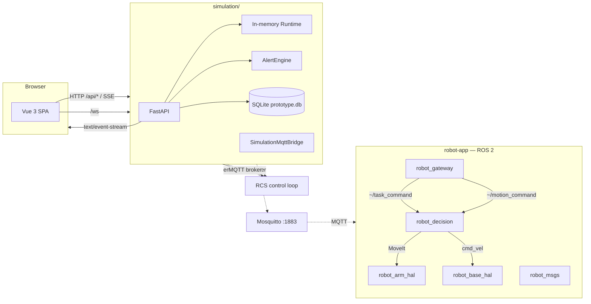

# Operations Runbook

> How to run, package, and ship the robot-logic prototype. For the design
> intent of the robot side (latency budgets, fault policies, edge/cloud
> roles), see [`docs/algorithm/05-deployment.md`](algorithm/05-deployment.md).

## Architecture at a glance



- **Simulation backend** (`simulation/backend/`): FastAPI + SQLAlchemy
  (async, SQLite) + an in-memory `Runtime` driving the simulator. Embeds RCS
  (default) or calls it as a standalone service. Hosts REST, SSE, and
  Prometheus endpoints. Includes `SimulationMqttBridge` for MQTT communication.
- **Frontend** (`simulation/frontend/`): Vue 3 + Vite + Three.js. Vite dev
  proxies `/api/*` to the backend. Renders `LoaderRobot` (dual-arm AGV),
  `RobotArm`, and warehouse scene.
- **RCS** (`rcs/`): robot control system, mounted under `/api/rcs` (embedded)
  or served standalone on `:8100`. Communicates with the robot side over MQTT.
- **robot-app** (`robot-app/ros2_ws/src/`): ROS 2 packages for the physical
  robot side. `robot_gateway` bridges MQTT ↔ ROS 2; `robot_decision` hosts
  `TaskCoordinator` (9-phase FSM), `SafetyMonitor`, `BaseExecutor`,
  `ArmExecutor`, `HugController`.
- **shared** (`shared/`): zero-dependency MQTT contracts (JSON Schema +
  Pydantic models) shared between `rcs/`, `simulation/`, and `robot-app/`.

---

## Local development

### Prerequisites

| 工具 | 版本要求 | 用途 |
|------|----------|------|
| Python | ≥ 3.11 | simulation backend, rcs, shared contracts |
| Node.js | ≥ 20 / npm ≥ 10 | frontend (Vue 3 + Vite) |
| Docker + docker compose | 最新稳定版 | 可选：Mosquitto + 全栈部署 |
| ROS 2 Humble | — | robot-app（仅物理机器人部署时需要） |
| Git | ≥ 2.30 | 版本控制 |

### 项目目录结构

```
robot-logic/
├── shared/              # MQTT 通信契约（JSON Schema + Pydantic）
├── rcs/                 # 机器人控制系统 (RCS)
├── simulation/
│   ├── backend/         # FastAPI 仿真后端
│   ├── frontend/        # Vue 3 + Three.js 可视化前端
│   └── ros2_ws/         # Gazebo/MoveIt 仿真工作区
├── robot-app/
│   └── ros2_ws/src/     # ROS 2 机器人端应用
│       ├── robot_gateway/    # MQTT ↔ ROS 2 桥接
│       ├── robot_decision/   # TaskCoordinator + 执行器
│       ├── robot_arm_hal/    # 双臂 HAL (URDF + ros2_control)
│       ├── robot_base_hal/   # 底盘 HAL (URDF + diff_drive)
│       ├── robot_msgs/       # 本地消息契约
│       └── robot_perception/ # 感知（Phase 2）
├── vla-training/        # VLA 模型训练流水线
├── deploy/              # Docker Compose + K8s 配置
└── docs/                # 设计文档
```

### 快速启动（最小化：后端 + 前端）

这是最简单的启动方式，不需要 Docker 或 ROS 2。RCS 默认嵌入在仿真后端中。

**终端 1 — 仿真后端**：

```bash
cd simulation/backend
python -m venv .venv
# Windows:
.venv\Scripts\activate
# macOS/Linux:
# source .venv/bin/activate

pip install -r requirements.txt
# 可选：安装共享契约包以获得严格验证
pip install -e ../../shared/python

uvicorn backend.main:app --host 127.0.0.1 --port 8000 --reload
```

**终端 2 — 前端**：

```bash
cd simulation/frontend
npm install
npm run dev -- --host 127.0.0.1 --port 5173 --strictPort
```

打开 `http://localhost:5173`。Vite 自动代理 `/api/*` 到后端 `:8000`。

### 带 MQTT 全链路启动（含 RCS standalone + robot-app）

当需要测试 MQTT 通信链路或 robot-app ROS 2 节点时：

**终端 1 — Mosquitto MQTT Broker**：

```bash
# 方式 A：Docker（推荐）
docker run -d --name mosquitto \
  -p 1883:1883 -p 9001:9001 \
  -v $(pwd)/deploy/mosquitto/mosquitto.conf:/mosquitto/config/mosquitto.conf:ro \
  eclipse-mosquitto:2

# 方式 B：本地安装
mosquitto -c deploy/mosquitto/mosquitto.conf
```

**终端 2 — 仿真后端（启用 MQTT）**：

```bash
cd simulation/backend
# 设置环境变量启用 MQTT
export SIM_MQTT_ENABLED=true
export SIM_MQTT_HOST=127.0.0.1
export SIM_MQTT_PORT=1883

uvicorn backend.main:app --host 127.0.0.1 --port 8000 --reload
```

**终端 3 — RCS standalone（可选，替代 embedded 模式）**：

```bash
cd rcs
pip install -r requirements.txt
# 或
pip install -e .

export RCS_MQTT_ENABLED=true
export RCS_MQTT_HOST=127.0.0.1
export RCS_MQTT_PORT=1883

uvicorn rcs.app:create_app --factory --host 127.0.0.1 --port 8100 --reload
```

此时仿真后端需切换为 standalone 模式：

```bash
export RCS_EMBEDDED=false
export RCS_SERVICE_URL=http://127.0.0.1:8100
```

**终端 4 — robot-app ROS 2 节点**（需要 ROS 2 Humble 环境）：

```bash
# 在 ROS 2 环境中
cd robot-app/ros2_ws
colcon build --symlink-install
source install/setup.bash

# 启动 gateway 节点
ros2 run robot_gateway mqtt_bridge_node \
  --ros-args \
  -p device_id:=loader-01 \
  -p mqtt_host:=127.0.0.1 \
  -p mqtt_port:=1883

# 启动 TaskCoordinator 节点
ros2 run robot_decision task_coordinator_node
```

**终端 5 — 前端**：

```bash
cd simulation/frontend
npm install
npm run dev -- --host 127.0.0.1 --port 5173 --strictPort
```

### 验证启动

```bash
# 后端健康检查
curl http://localhost:8000/api/status
# 期望: {"running": true, "device_count": 5, ...}

# 设备列表（应包含 loader-01）
curl http://localhost:8000/api/devices

# SSE 日志流
curl -N http://localhost:8000/api/logs/stream

# Prometheus 指标
curl http://localhost:8000/metrics

# RCS 健康检查（standalone 模式）
curl http://localhost:8100/health

# 关节状态 SSE（loader-01 双臂 14 关节）
curl -N http://localhost:8000/api/devices/loader-01/joints
```

### 运行测试

项目包含 4 个独立测试套件，总计 237 个测试：

```bash
# 1. simulation/backend (71 tests)
cd simulation/backend
pip install -r requirements.txt
pytest -q

# 2. rcs (85 tests)
cd rcs
pip install -r requirements.txt
pytest -q

# 3. robot_decision (37 tests)
cd robot-app/ros2_ws/src/robot_decision
pytest -q

# 4. robot_gateway (44 tests)
cd robot-app/ros2_ws/src/robot_gateway
pytest -q
```

### 前端构建

```bash
cd simulation/frontend
npm install
npm run build    # vue-tsc 类型检查 + vite build
# 产物在 dist/ 目录
```

---

## Configuration

### 仿真后端配置

Settings live in `simulation/backend/config.py` and read environment variables (or
`.env` in the backend folder).

| Env var | Default | Purpose |
| --- | --- | --- |
| `DATABASE_URL` | `sqlite+aiosqlite:///./data/prototype.db` | async DB URL |
| `LOG_LEVEL` | `INFO` | uvicorn log level |
| `CLOUD_ENDPOINT` | `http://localhost:8080` | placeholder for a future sidecar |
| `USE_CLOUD` | `false` | gate to swap the planner for a cloud one |
| `API_AUTH_ENABLED` | `false` | enable API key checking |
| `API_API_KEYS` | _empty_ | comma-separated valid keys |
| `RATE_LIMIT_MAX` | `120` | requests per window per IP |
| `RATE_LIMIT_WINDOW_SECONDS` | `60` | window size in seconds |
| `RCS_EMBEDDED` | `true` | 嵌入 RCS 路由到仿真后端进程 |
| `RCS_SERVICE_URL` | `http://127.0.0.1:8100` | standalone RCS 地址 |
| `SIM_MQTT_ENABLED` | `false` | 启用仿真后端 MQTT bridge |
| `SIM_MQTT_HOST` | `127.0.0.1` | MQTT broker 地址 |
| `SIM_MQTT_PORT` | `1883` | MQTT broker 端口 |

### RCS 配置

RCS 拥有独立的配置（`rcs/rcs/config.py`），环境变量前缀 `RCS_`：

| Env var | Default | Purpose |
| --- | --- | --- |
| `RCS_HOST` | `127.0.0.1` | standalone 绑定地址 |
| `RCS_PORT` | `8100` | standalone 端口 |
| `RCS_LOG_LEVEL` | `INFO` | 日志级别 |
| `RCS_MQTT_ENABLED` | `false` | 启用 MQTT 适配器 |
| `RCS_MQTT_HOST` | `127.0.0.1` | MQTT broker 地址 |
| `RCS_MQTT_PORT` | `1883` | MQTT broker 端口 |
| `RCS_MQTT_CLIENT_ID` | `rcs-adapter` | MQTT 客户端 ID |
| `RCS_MQTT_STATE_PUBLISH_HZ` | `10.0` | 状态发布频率 |
| `RCS_API_AUTH_ENABLED` | `false` | RCS 独立认证 |

`simulation/backend/.env.example` ships a starter file:

```ini
APP_NAME=Robot Logic System
DATABASE_URL=sqlite+aiosqlite:///./data/prototype.db
LOG_LEVEL=INFO
CLOUD_ENDPOINT=http://localhost:8080
USE_CLOUD=false
```

### 启用认证 + 限速

```bash
export API_AUTH_ENABLED=1
export API_API_KEYS="$(openssl rand -hex 16),$(openssl rand -hex 16)"
curl -H "X-API-Key: $(echo $API_API_KEYS | cut -d, -f1)" http://localhost:8000/api/devices
```

---

## Docker

The repository ships a two-stage build for the simulation backend, a factory
image for the standalone RCS service, and a Node-build image for the frontend.
A one-file `deploy/docker-compose.yml` wires them together with a Mosquitto
broker.

### `simulation/backend/Dockerfile`

```dockerfile
FROM python:3.11-slim AS base
WORKDIR /app
ENV PYTHONUNBUFFERED=1 PIP_NO_CACHE_DIR=1
COPY simulation/backend/requirements.txt ./requirements.txt
RUN pip install -r requirements.txt
COPY simulation/backend/ ./simulation/backend/
COPY rcs/rcs/ ./rcs/rcs/
COPY shared/python/robot_contracts/ ./shared/python/robot_contracts/
EXPOSE 8000
CMD ["uvicorn", "backend.main:app", "--host", "0.0.0.0", "--port", "8000"]
```

### `rcs/Dockerfile` (standalone)

```dockerfile
FROM python:3.11-slim AS base
WORKDIR /app
ENV PYTHONUNBUFFERED=1 PIP_NO_CACHE_DIR=1
COPY rcs/requirements.txt ./requirements.txt
RUN pip install -r requirements.txt
COPY rcs/ ./rcs/
COPY shared/python/robot_contracts/ ./shared/python/robot_contracts/
EXPOSE 8100
CMD ["uvicorn", "rcs.app:create_app", "--factory", "--host", "0.0.0.0", "--port", "8100"]
```

### `simulation/frontend/Dockerfile`

```dockerfile
FROM node:20-alpine AS build
WORKDIR /app
COPY package*.json ./
RUN npm ci
COPY . .
RUN npm run build

FROM nginx:1.27-alpine
COPY --from=build /app/dist /usr/share/nginx/html
COPY nginx.conf /etc/nginx/conf.d/default.conf
EXPOSE 80
```

### Run locally (compose)

```bash
docker compose -f deploy/docker-compose.yml up --build
#   mosquitto   :1883
#   rcs         :8100  (MQTT enabled)
#   simulation  :8000  (RCS_EMBEDDED=false -> calls rcs:8100)
```

Or build individual images:

```bash
docker build -t robot-logic-api -f simulation/backend/Dockerfile .
docker build -t robot-logic-rcs -f rcs/Dockerfile .
docker build -t robot-logic-web -f simulation/frontend/Dockerfile ./simulation/frontend
```

In the nginx config (sample below), the SPA proxies `/api/*` to the
backend:

```nginx
server {
  listen 80;
  root /usr/share/nginx/html;
  location / { try_files $uri /index.html; }

  location /api/ {
    proxy_pass http://host.docker.internal:8000;
    proxy_set_header Host $host;
    proxy_buffering off;
  }
}
```

---

## Continuous integration

`.github/workflows/ci.yml` runs on push/PR to `master`:

```yaml
name: ci
on:
  push:
    branches: [master]
  pull_request:
    branches: [master]

jobs:
  backend:
    runs-on: ubuntu-latest
    steps:
      - uses: actions/checkout@v4
      - uses: actions/setup-python@v5
        with: { python-version: '3.11' }
      - run: pip install -r simulation/backend/requirements.txt
      - run: cd simulation/backend && pytest -q
  frontend:
    runs-on: ubuntu-latest
    steps:
      - uses: actions/checkout@v4
      - uses: actions/setup-node@v4
        with: { node-version: '20' }
      - run: cd simulation/frontend && npm ci && npx vue-tsc --noEmit
      - run: cd simulation/frontend && npm run build
  docker:
    runs-on: ubuntu-latest
    needs: [backend, frontend]
    steps:
      - uses: actions/checkout@v4
      - run: docker build -t robot-logic-api -f simulation/backend/Dockerfile .
      - run: docker build -t robot-logic-web -f simulation/frontend/Dockerfile ./simulation/frontend
```

> **Note**: `robot_decision` 和 `robot_gateway` 的测试需要 ROS 2 环境，
> 当前 CI 未包含。本地运行 `pytest` 在各包的 `tests/` 目录下即可。

---

## Kubernetes (sketch)

```yaml
apiVersion: apps/v1
kind: Deployment
metadata: { name: robot-logic-api }
spec:
  replicas: 2
  selector: { matchLabels: { app: robot-logic-api } }
  template:
    metadata: { labels: { app: robot-logic-api } }
    spec:
      containers:
        - name: api
          image: registry/robot-logic-api:latest
          ports: [{ containerPort: 8000 }]
          env:
            - { name: API_AUTH_ENABLED, value: "1" }
            - { name: API_API_KEYS, valueFrom: { secretKeyRef: { name: api-keys, key: list } } }
          readinessProbe:
            httpGet: { path: /api/status, port: 8000 }
          livenessProbe:
            httpGet: { path: /, port: 8000 }
---
apiVersion: v1
kind: Service
metadata: { name: robot-logic-api }
spec:
  selector: { app: robot-logic-api }
  ports: [{ port: 80, targetPort: 8000 }]
```

The RCS service runs standalone and is reached over HTTP (embedded mount points
to it) and MQTT. Deploy it as its own Deployment:

```yaml
apiVersion: apps/v1
kind: Deployment
metadata: { name: robot-logic-rcs }
spec:
  replicas: 2
  selector: { matchLabels: { app: robot-logic-rcs } }
  template:
    metadata: { labels: { app: robot-logic-rcs } }
    spec:
      containers:
        - name: rcs
          image: registry/robot-logic-rcs:latest
          ports: [{ containerPort: 8100 }]
          env:
            - { name: RCS_MQTT_ENABLED, value: "true" }
            - { name: RCS_MQTT_HOST, value: "mosquitto" }
            - { name: RCS_MQTT_PORT, value: "1883" }
          readinessProbe:
            httpGet: { path: /health, port: 8100 }
---
apiVersion: v1
kind: Service
metadata: { name: robot-logic-rcs }
spec:
  selector: { app: robot-logic-rcs }
  ports: [{ port: 80, targetPort: 8100 }]
```

The simulation backend talks to RCS via `RCS_EMBEDDED=false` +
`RCS_SERVICE_URL=http://robot-logic-rcs`. A Mosquitto broker (`mosquitto`
service) carries the command/state/alert/telemetry topics; the robot side
(`robot-app`) is the MQTT client on the device.

For SSE specifically, configure `nginx.ingress.kubernetes.io/proxy-buffering: "off"` and `proxy-read-timeout` to a value > heartbeat interval (5s+).

---

## Observability checklist

- `/metrics` is Prometheus-friendly; scrape at 10–15s.
- `GET /api/logs/stream` and `GET /api/alerts/stream` should be opened
  by the dashboard only (browsers handle reconnect). Server-side proxies
  must disable buffering.
- Recommended Grafana panels:
  - `robot_logic_tasks_running` vs `tasks_pending` (queue health)
  - `robot_logic_devices_total` (fleet size)
  - `robot_logic_alerts_{warning,critical}` (active fires)
  - 99th-percentile tick latency summary

---

## Day-2 ops

- **Scaling**: the runtime lives in process memory; running multiple
  replicas will diverge. For a multi-replica deploy, point all instances
  at the same Redis pub/sub backend and persist state in Postgres.
- **Backups**: SQLite lives at `data/prototype.db`. Snapshot before
  upgrades.
- **Upgrades**: deploy with `Strategy: Recreate` is fine for the
  prototype; production should use blue/green and drain SSE streams.
- **Log retention**: in-memory only (500 entries); the next iteration
  should stream to an ELK / Loki pipeline via the same SSE event.

---

## Troubleshooting

| Symptom | Likely cause | Fix |
| --- | --- | --- |
| `127.0.0.1:8000 refused to connect` | backend not started | `uvicorn backend.main:app --port 8000` |
| Vite shows `Port 5173 in use` | stale Vite process | `Get-NetTCPConnection -LocalPort 5173` → kill PID |
| `401 invalid api key` | `API_AUTH_ENABLED=1` set in `.env` | set header or disable auth locally |
| `429 rate limit exceeded` | too many requests | raise `RATE_LIMIT_MAX` or drop key |
| SSE shows only pings | no new log lines | POST a task to trigger activity |
| `/metrics` returns nothing | process just restarted | wait one tick (0.5s) |
| Rollback returns `409` | task still pending/running | wait until completion |
| MQTT messages not received | broker not running or `SIM_MQTT_ENABLED=false` | start Mosquitto + set env var |
| `loader-01` joints SSE empty | no MQTT state flow | check MQTT bridge is connected to broker |
| `robot_gateway` node crashes on start | missing `robot_contracts` package | `pip install -e shared/python` |
| ROS 2 `colcon build` fails | missing ROS 2 deps | `rosdep install --from-paths src --ignore-src -r -y` |
| Frontend shows old robot model | browser cache | hard refresh (Ctrl+Shift+R) |
