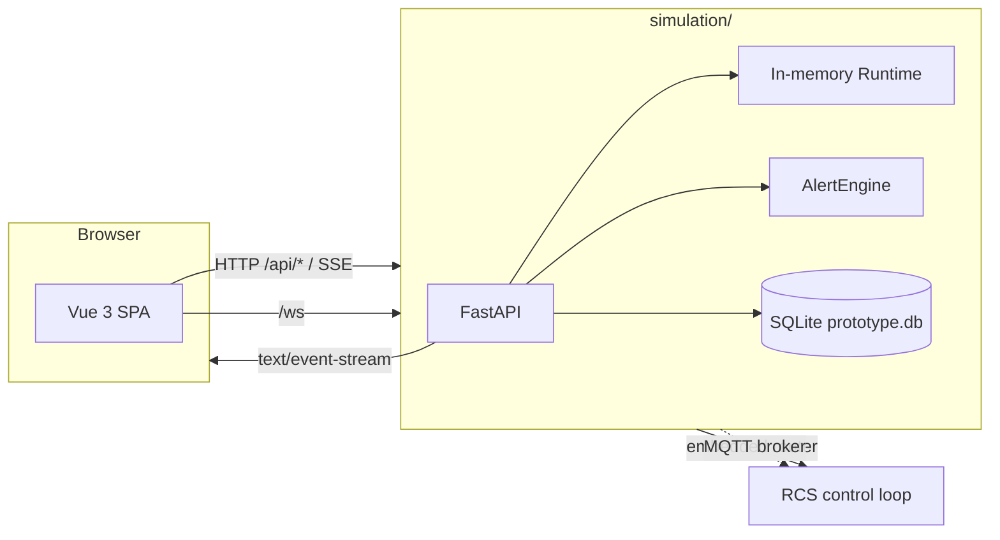

# Operations Runbook

> How to run, package, and ship the robot-logic prototype. For the design
> intent of the robot side (latency budgets, fault policies, edge/cloud
> roles), see [`docs/algorithm/05-deployment.md`](algorithm/05-deployment.md).

## Architecture at a glance



- **Simulation backend** (`simulation/backend/`): FastAPI + SQLAlchemy
  (async, SQLite) + an in-memory `Runtime` driving the simulator. Embeds RCS
  (default) or calls it as a standalone service. Hosts REST, SSE, and
  Prometheus endpoints.
- **Frontend** (`simulation/frontend/`): Vue 3 + Vite + Three.js. Vite dev
  proxies `/api/*` to the backend.
- **RCS** (`rcs/`): robot control system, mounted under `/api/rcs` (embedded)
  or served standalone on `:8100`. Communicates with the robot side over MQTT.

---

## Local development

### Prerequisites
- Python ≥ 3.11
- Node ≥ 20 / npm ≥ 10

### One-shot startup

```bash
# Simulation backend (RCS embedded by default)
cd simulation/backend
python -m venv .venv
. .venv/Scripts/activate       # Windows; on macOS/Linux use `source .venv/bin/activate`
pip install -r requirements.txt
uvicorn backend.main:app --host 127.0.0.1 --port 8000 --reload

# Frontend (separate shell)
cd simulation/frontend
npm install
npm run dev -- --host 127.0.0.1 --port 5173 --strictPort
```

Open `http://localhost:5173`. Vite proxies `/api/*` to the FastAPI server
on `:8000`.

### Verifying

```bash
curl http://localhost:8000/api/status
curl -N http://localhost:8000/api/logs/stream        # SSE
curl http://localhost:8000/metrics | head             # Prometheus text
```

---

## Configuration

Settings live in `simulation/backend/config.py` and read environment variables (or
`.env` in the backend folder).

| Env var | Default | Purpose |
| --- | --- | --- |
| `DATABASE_URL` | `sqlite+aiosqlite:///./data/prototype.db` | async DB URL |
| `LOG_LEVEL` | `INFO` | uvicorn log level |
| `CLOUD_ENDPOINT` | `http://localhost:8080` | placeholder for a future sidecar |
| `USE_CLOUD` | `false` | gate to swap the planner for a cloud one |
| `API_AUTH_ENABLED` | `false` | enable API key checking |
| `API_API_KEYS` | _empty_ | comma-separated valid keys |
| `RATE_LIMIT_MAX` | `120` | requests per window per IP |
| `RATE_LIMIT_WINDOW_SECONDS` | `60` | window size in seconds |

`simulation/backend/.env.example` ships a starter file:

```ini
DATABASE_URL=sqlite+aiosqlite:///./data/prototype.db
API_AUTH_ENABLED=false
API_API_KEYS=dev-key-1,dev-key-2
RATE_LIMIT_MAX=300
```

### Enabling auth + rate limit

```bash
export API_AUTH_ENABLED=1
export API_API_KEYS="$(openssl rand -hex 16),$(openssl rand -hex 16)"
curl -H "X-API-Key: $(echo $API_API_KEYS | cut -d, -f1)" http://localhost:8000/api/devices
```

---

## Docker

The repository ships a two-stage build for the simulation backend, a factory
image for the standalone RCS service, and a Node-build image for the frontend.
A one-file `deploy/docker-compose.yml` wires them together with a Mosquitto
broker.

### `simulation/backend/Dockerfile`

```dockerfile
FROM python:3.11-slim AS base
WORKDIR /app
ENV PYTHONUNBUFFERED=1 PIP_NO_CACHE_DIR=1
COPY simulation/backend/requirements.txt ./requirements.txt
RUN pip install -r requirements.txt
COPY simulation/backend/ ./simulation/backend/
COPY rcs/rcs/ ./rcs/rcs/
COPY shared/python/robot_contracts/ ./shared/python/robot_contracts/
EXPOSE 8000
CMD ["uvicorn", "backend.main:app", "--host", "0.0.0.0", "--port", "8000"]
```

### `rcs/Dockerfile` (standalone)

```dockerfile
FROM python:3.11-slim AS base
WORKDIR /app
ENV PYTHONUNBUFFERED=1 PIP_NO_CACHE_DIR=1
COPY rcs/requirements.txt ./requirements.txt
RUN pip install -r requirements.txt
COPY rcs/ ./rcs/
COPY shared/python/robot_contracts/ ./shared/python/robot_contracts/
EXPOSE 8100
CMD ["uvicorn", "rcs.app:create_app", "--factory", "--host", "0.0.0.0", "--port", "8100"]
```

### `simulation/frontend/Dockerfile`

```dockerfile
FROM node:20-alpine AS build
WORKDIR /app
COPY package*.json ./
RUN npm ci
COPY . .
RUN npm run build

FROM nginx:1.27-alpine
COPY --from=build /app/dist /usr/share/nginx/html
COPY nginx.conf /etc/nginx/conf.d/default.conf
EXPOSE 80
```

### Run locally (compose)

```bash
docker compose -f deploy/docker-compose.yml up --build
#   mosquitto   :1883
#   rcs         :8100  (MQTT enabled)
#   simulation  :8000  (RCS_EMBEDDED=false -> calls rcs:8100)
```

Or build individual images:

```bash
docker build -t robot-logic-api -f simulation/backend/Dockerfile .
docker build -t robot-logic-rcs -f rcs/Dockerfile .
docker build -t robot-logic-web -f simulation/frontend/Dockerfile ./simulation/frontend
```

In the nginx config (sample below), the SPA proxies `/api/*` to the
backend:

```nginx
server {
  listen 80;
  root /usr/share/nginx/html;
  location / { try_files $uri /index.html; }

  location /api/ {
    proxy_pass http://host.docker.internal:8000;
    proxy_set_header Host $host;
    proxy_buffering off;
  }
}
```

---

## Continuous integration

A minimal `.github/workflows/ci.yml`:

```yaml
name: ci
on: [push, pull_request]
jobs:
  test:
    runs-on: ubuntu-latest
    steps:
      - uses: actions/checkout@v4
      - uses: actions/setup-python@v5
        with: { python-version: '3.11' }
      - run: pip install -r simulation/backend/requirements.txt
      - run: pip install -r rcs/requirements.txt
      - run: cd simulation/backend && pytest -q
      - run: cd rcs && pytest -q
      - uses: actions/setup-node@v4
        with: { node-version: '20' }
      - run: cd simulation/frontend && npm ci && npx vue-tsc --noEmit
      - run: cd simulation/frontend && npm run build
```

---

## Kubernetes (sketch)

```yaml
apiVersion: apps/v1
kind: Deployment
metadata: { name: robot-logic-api }
spec:
  replicas: 2
  selector: { matchLabels: { app: robot-logic-api } }
  template:
    metadata: { labels: { app: robot-logic-api } }
    spec:
      containers:
        - name: api
          image: registry/robot-logic-api:latest
          ports: [{ containerPort: 8000 }]
          env:
            - { name: API_AUTH_ENABLED, value: "1" }
            - { name: API_API_KEYS, valueFrom: { secretKeyRef: { name: api-keys, key: list } } }
          readinessProbe:
            httpGet: { path: /api/status, port: 8000 }
          livenessProbe:
            httpGet: { path: /, port: 8000 }
---
apiVersion: v1
kind: Service
metadata: { name: robot-logic-api }
spec:
  selector: { app: robot-logic-api }
  ports: [{ port: 80, targetPort: 8000 }]
```

The RCS service runs standalone and is reached over HTTP (embedded mount points
to it) and MQTT. Deploy it as its own Deployment:

```yaml
apiVersion: apps/v1
kind: Deployment
metadata: { name: robot-logic-rcs }
spec:
  replicas: 2
  selector: { matchLabels: { app: robot-logic-rcs } }
  template:
    metadata: { labels: { app: robot-logic-rcs } }
    spec:
      containers:
        - name: rcs
          image: registry/robot-logic-rcs:latest
          ports: [{ containerPort: 8100 }]
          env:
            - { name: RCS_MQTT_ENABLED, value: "true" }
            - { name: RCS_MQTT_HOST, value: "mosquitto" }
            - { name: RCS_MQTT_PORT, value: "1883" }
          readinessProbe:
            httpGet: { path: /health, port: 8100 }
---
apiVersion: v1
kind: Service
metadata: { name: robot-logic-rcs }
spec:
  selector: { app: robot-logic-rcs }
  ports: [{ port: 80, targetPort: 8100 }]
```

The simulation backend talks to RCS via `RCS_EMBEDDED=false` +
`RCS_SERVICE_URL=http://robot-logic-rcs`. A Mosquitto broker (`mosquitto`
service) carries the command/state/alert/telemetry topics; the robot side
(`robot-app`) is the MQTT client on the device.

For SSE specifically, configure `nginx.ingress.kubernetes.io/proxy-buffering: "off"` and `proxy-read-timeout` to a value > heartbeat interval (5s+).

---

## Observability checklist

- `/metrics` is Prometheus-friendly; scrape at 10–15s.
- `GET /api/logs/stream` and `GET /api/alerts/stream` should be opened
  by the dashboard only (browsers handle reconnect). Server-side proxies
  must disable buffering.
- Recommended Grafana panels:
  - `robot_logic_tasks_running` vs `tasks_pending` (queue health)
  - `robot_logic_devices_total` (fleet size)
  - `robot_logic_alerts_{warning,critical}` (active fires)
  - 99th-percentile tick latency summary

---

## Day-2 ops

- **Scaling**: the runtime lives in process memory; running multiple
  replicas will diverge. For a multi-replica deploy, point all instances
  at the same Redis pub/sub backend and persist state in Postgres.
- **Backups**: SQLite lives at `data/prototype.db`. Snapshot before
  upgrades.
- **Upgrades**: deploy with `Strategy: Recreate` is fine for the
  prototype; production should use blue/green and drain SSE streams.
- **Log retention**: in-memory only (500 entries); the next iteration
  should stream to an ELK / Loki pipeline via the same SSE event.

---

## Troubleshooting

| Symptom | Likely cause | Fix |
| --- | --- | --- |
| `127.0.0.1:8000 refused to connect` | backend not started | `uvicorn backend.main:app --port 8000` |
| Vite shows `Port 5173 in use` | stale Vite process | `Get-NetTCPConnection -LocalPort 5173` → kill PID |
| `401 invalid api key` | `API_AUTH_ENABLED=1` set in `.env` | set header or disable auth locally |
| `429 rate limit exceeded` | too many mints | raise `RATE_LIMIT_MAX` or drop key |
| SSE shows only pings | new log lines aren't produced | POST a task to trigger |
| `/metrics` returns nothing | process just restarted | wait one tick (0.5s) |
| Rollback returns `409` | task still pending/running | wait until completion |
