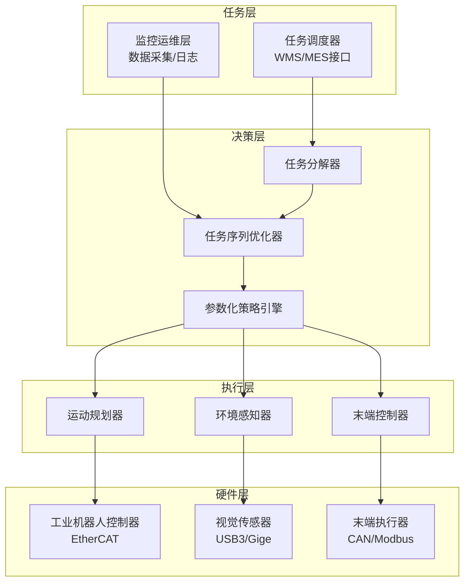
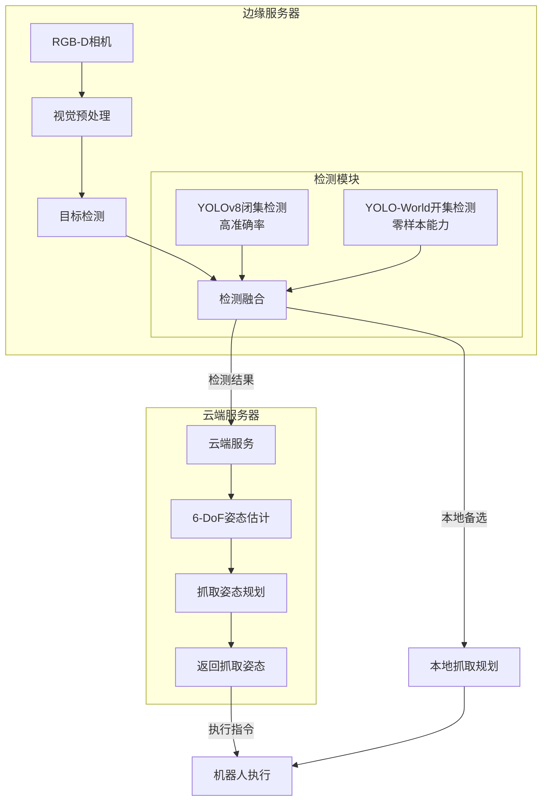
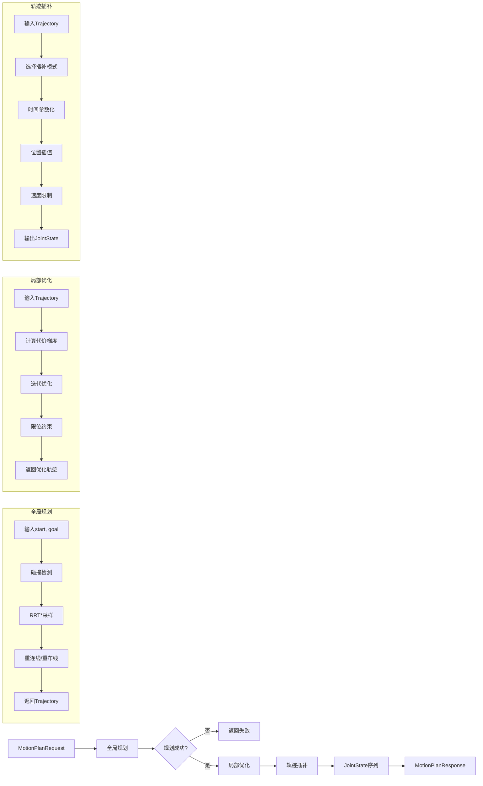

# 系统架构总览

> 本章介绍物流装卸机器人算法系统的整体架构、模块职责和参数化配置体系。

---

## 1.1 设计理念

本算法系统采用**通用化设计**，不区分集装箱机器人与散货机器人类型，通过统一的算法框架和可配置参数适配不同负载、不同精度要求的作业场景。

**核心设计原则：**

- 统一的数据结构和接口定义
- 基于参数的差异化配置（不写分支代码）
- 模块化架构，支持灵活组合
- 支持从轻载协作机器人到重载工业机器人的全谱系覆盖

---

## 1.2 系统架构图



**架构说明：**

| 层级 | 组件 | 功能 | 部署位置 |
|------|------|------|---------|
| 任务层 | 任务调度器 | WMS/MES接口、批次任务管理 | 云端 |
| 任务层 | 监控运维 | 数据采集、日志记录 | 边缘 |
| 决策层 | 任务分解器 | 高层任务分解为动作序列 | 云端 |
| 决策层 | 序列优化器 | 任务执行顺序优化 | 云端 |
| 决策层 | 策略引擎 | 参数化算法配置适配 | 云端+边缘 |
| 执行层 | 运动规划器 | 路径规划、轨迹优化 | 边缘 |
| 执行层 | 环境感知器 | 目标检测、姿态估计 | 边缘+云端 |
| 执行层 | 末端控制器 | 力位混合控制 | 边缘 |

---

## 1.3 模块职责总览

| 模块名称 | 位置 | 功能职责 | 实时性要求 |
|---------|------|---------|-----------|
| **运动规划器** | 边缘 | 全局路径+局部优化+轨迹插补 | <2s规划 |
| **目标检测** | 边缘 | 通用物体检测（闭集+开集） | <50ms |
| **6-DoF姿态估计** | 云端 | 物体精确位姿 | <80ms |
| **抓取姿态规划** | 云端 | 最优抓取计算 | <100ms |
| **任务调度器** | 云端 | 批次优化 | 秒级 |

---

## 1.4 参数化配置体系

### RobotConfig 数据结构

```python
@dataclass
class RobotConfig:
    """机器人通用配置"""
    num_joints: int = 6                    # 关节数量（6或7）
    payload_kg: float = 25.0               # 负载(kg)
    
    # 精度参数
    position_accuracy_mm: float = 0.5      # 定位精度(mm)
    repeatability_mm: float = 0.1          # 重复精度(mm)
    
    # 速度参数
    max_velocity_mps: float = 3.0          # 最大线速度(m/s)
    max_acceleration_mps2: float = 15.0    # 最大加速度(m/s²)
    
    # 控制频率
    control_frequency_hz: int = 250         # 控制频率
    
    # 工作空间
    workspace_radius_m: float = 2.0         # 工作半径(m)
```

### 参数派生机制

```python
class PlanningConfig:
    """规划算法配置"""
    max_iterations: int = 7000
    step_size: float = 0.08
    rewire_radius: float = 0.4
    smoothness_weight: float = 0.5
    collision_weight: float = 1.5
    interpolation_mode: str = "s_curve"
    
    @classmethod
    def from_robot_config(cls, robot_config: RobotConfig) -> PlanningConfig:
        # 高精度场景
        if robot_config.position_accuracy_mm < 1.0:
            return cls(
                max_iterations=10000,
                step_size=0.05,
                rewire_radius=0.3,
                smoothness_weight=0.6,
                collision_weight=2.0,
                interpolation_mode="s_curve"
            )
        # 高速场景
        elif robot_config.max_velocity_mps > 2.0:
            return cls(
                max_iterations=5000,
                step_size=0.1,
                rewire_radius=0.5,
                smoothness_weight=0.3,
                collision_weight=1.0,
                interpolation_mode="linear"
            )
        # 默认场景
        else:
            return cls(
                max_iterations=7000,
                step_size=0.08,
                rewire_radius=0.4,
                smoothness_weight=0.5,
                collision_weight=1.5,
                interpolation_mode="s_curve"
            )
```

### 场景配置对照表

| 场景 | 定位精度 | 最大速度 | 规划迭代 | 插补模式 |
|------|---------|---------|---------|---------|
| 高精度分拣 | <1mm | <2m/s | 10000次 | S曲线 |
| 高速搬运 | 1-2mm | >2m/s | 5000次 | 线性 |
| 通用场景 | 0.5mm | 3m/s | 7000次 | S曲线 |

---

## 1.5 云边协同架构



---

## 1.6 完整规划流程



---

**下一章**：[运动规划算法系统](02-motion-planning.md)
