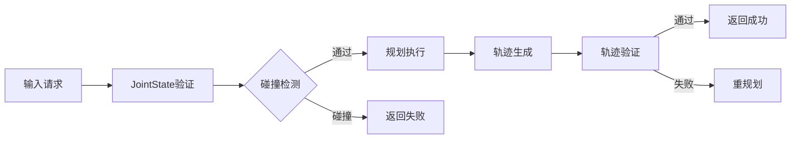
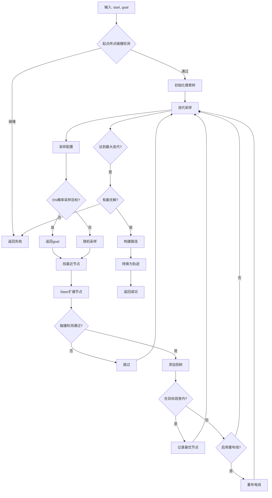
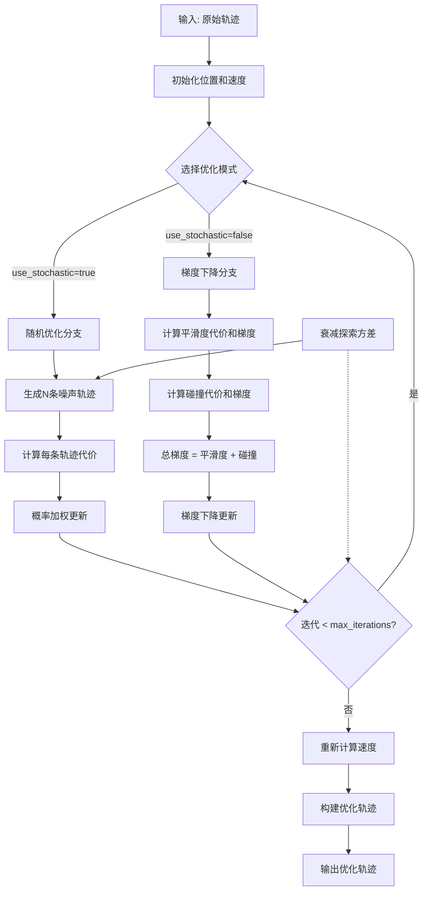
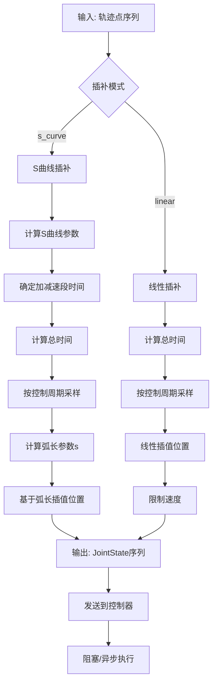

# 运动规划算法系统

> 本章介绍物流装卸机器人的运动规划算法，包括共用基础层、全局轨迹规划、局部轨迹优化和轨迹插补模块。
>
> **实现状态**：本章描述目标运动规划算法设计（RRT* + 梯度/随机优化 + S 曲线插补）。当前 Phase 2 已将 `BaseExecutor` 重构为 Nav2 `NavigateToPose` action client（`robot_decision/base_executor.py`），实际导航由 Nav2 栈处理。双臂 AGV 装卸机器人的 `ArmExecutor`（MoveIt）、`HugController`（双臂同步抱夹）已在 Phase 1 实现。

---

## 2.1 共用基础层

### 算法解析

共用基础层定义了运动规划所需的核心数据类型，它们是整个算法系统的基石：

| 数据结构 | 用途 | 关键字段 |
|---------|------|---------|
| `JointState` | 表示机器人当前关节状态 | positions, velocities, accelerations, efforts |
| `Pose6D` | 表示末端6自由度位姿 | position (3D), orientation (四元数) |
| `RobotConfig` | 机器人通用配置 | 负载、精度、速度等参数 |
| `JointLimits` | 关节物理限位 | 位置/速度/加速度/力矩上下限 |
| `Trajectory` | 关节空间轨迹 | 轨迹点序列，含时间信息 |
| `PlanningConfig` | 规划算法配置 | 迭代次数、步长、权重等 |
| `CollisionWorld` | 碰撞检测环境 | 障碍物管理、碰撞查询 |

### 共用数据流



### 实现代码

```python
# src/motion_planner/common/foundation.py

from __future__ import annotations
from dataclasses import dataclass, field
from typing import List, Tuple, Optional, Dict, Any
import numpy as np
from scipy.spatial.transform import Rotation
import time


@dataclass
class JointState:
    """关节状态"""
    positions: np.ndarray
    velocities: np.ndarray
    accelerations: np.ndarray
    efforts: np.ndarray
    timestamp: float = 0.0


@dataclass
class Pose6D:
    """6D位姿"""
    position: np.ndarray
    orientation: np.ndarray  # 四元数 [w, x, y, z]
    
    @classmethod
    def from_matrix(cls, matrix: np.ndarray) -> Pose6D:
        return cls(
            position=matrix[:3, 3],
            orientation=Rotation.from_matrix(matrix[:3, :3]).as_quat()
        )
    
    def to_matrix(self) -> np.ndarray:
        r = Rotation.from_quat(self.orientation)
        matrix = np.eye(4)
        matrix[:3, :3] = r.as_matrix()
        matrix[:3, 3] = self.position
        return matrix


@dataclass
class RobotConfig:
    """机器人通用配置"""
    num_joints: int = 6  # 单臂 6-DOF；双臂装卸机器人含 left+right 共 12 关节 + 2 抱板
    payload_kg: float = 20.0  # AUBO-i20 单臂额定负载 20kg
    position_accuracy_mm: float = 0.05
    repeatability_mm: float = 0.05  # AUBO-i20 重复定位精度 ±0.05mm
    max_velocity_mps: float = 3.0
    max_acceleration_mps2: float = 15.0
    control_frequency_hz: int = 250
    workspace_radius_m: float = 2.0
    
    def get_joint_limits(self) -> JointLimits:
        scale_factor = min(1.0, self.payload_kg / 100.0)
        return JointLimits(
            positions_lower=np.array([-np.pi, -170*np.pi/180, -85*np.pi/180, 
                                    -2*np.pi, -120*np.pi/180, -2*np.pi][:self.num_joints]),
            positions_upper=np.array([np.pi, 170*np.pi/180, 265*np.pi/180,
                                     2*np.pi, 120*np.pi/180, 2*np.pi][:self.num_joints]),
            velocities=np.array([2.5, 2.0, 2.5, 4.0, 4.0, 4.0][:self.num_joints]) * scale_factor,
            accelerations=np.array([15.0, 10.0, 12.0, 20.0, 20.0, 20.0][:self.num_joints]) * scale_factor,
            efforts=np.array([320, 200, 100, 40, 40, 15][:self.num_joints]) * scale_factor
        )


@dataclass
class JointLimits:
    """关节限位"""
    positions_lower: np.ndarray
    positions_upper: np.ndarray
    velocities: np.ndarray
    accelerations: np.ndarray
    efforts: np.ndarray


@dataclass
class TrajectoryPoint:
    """轨迹点"""
    positions: np.ndarray
    velocities: np.ndarray = field(default_factory=lambda: np.array([]))
    accelerations: np.ndarray = field(default_factory=lambda: np.array([]))
    time_from_start: float = 0.0


@dataclass 
class Trajectory:
    """关节空间轨迹"""
    joint_names: List[str]
    points: List[TrajectoryPoint]
    
    @property
    def num_joints(self) -> int:
        return len(self.joint_names)
    
    def get_duration(self) -> float:
        return self.points[-1].time_from_start if self.points else 0.0
    
    def sample(self, time: float) -> Tuple[np.ndarray, np.ndarray, np.ndarray]:
        if not self.points:
            raise ValueError("轨迹为空")
        if time <= self.points[0].time_from_start:
            p = self.points[0]
            return p.positions, p.velocities, p.accelerations
        if time >= self.points[-1].time_from_start:
            p = self.points[-1]
            return p.positions, p.velocities, p.accelerations
        
        for i in range(len(self.points) - 1):
            t0, t1 = self.points[i].time_from_start, self.points[i+1].time_from_start
            if t0 <= time <= t1:
                alpha = (time - t0) / (t1 - t0)
                p0, p1 = self.points[i], self.points[i+1]
                return ((1-alpha)*p0.positions + alpha*p1.positions,
                        (1-alpha)*p0.velocities + alpha*p1.velocities,
                        (1-alpha)*p0.accelerations + alpha*p1.accelerations)
        p = self.points[-1]
        return p.positions, p.velocities, p.accelerations


@dataclass
class PlanningConfig:
    """规划算法配置"""
    max_iterations: int = 7000
    step_size: float = 0.08
    rewire_radius: float = 0.4
    smoothness_weight: float = 0.5
    collision_weight: float = 1.5
    interpolation_mode: str = "s_curve"


class CollisionWorld:
    """碰撞检测世界"""
    
    def __init__(self):
        self._obstacles: Dict[str, Any] = {}
    
    def add_box_obstacle(self, name: str, pose: Pose6D, size: Tuple[float, float, float]):
        self._obstacles[name] = {'type': 'box', 'pose': pose, 'size': np.array(size)}
    
    def remove_obstacle(self, name: str):
        self._obstacles.pop(name, None)
    
    def check_collision(self, joint_positions: np.ndarray, 
                       forward_kinematics) -> Tuple[bool, Optional[str]]:
        return False, None


class PlanningPerformanceMonitor:
    """性能监控器"""
    
    def __init__(self, window_size: int = 100):
        self._planning_times: List[float] = []
        self._trajectory_lengths: List[float] = []
        self._window_size = window_size
        self._start_time: Optional[float] = None
    
    def start_timer(self):
        self._start_time = time.perf_counter()
    
    def stop_timer(self) -> float:
        if self._start_time is None:
            return 0.0
        elapsed = time.perf_counter() - self._start_time
        self._planning_times.append(elapsed)
        if len(self._planning_times) > self._window_size:
            self._planning_times.pop(0)
        self._start_time = None
        return elapsed
```

---

## 2.2 全局轨迹规划层

### 算法解析

**RRT* 算法核心原理**

RRT*（Rapidly-exploring Random Tree Star）是一种基于随机采样的最优路径规划算法，是对经典RRT算法的渐进最优改进。

| 特性 | 说明 |
|------|------|
| **随机采样** | 在关节空间随机采样新状态，引导搜索 |
| **最近邻搜索** | 找到树中距离采样点最近的节点 |
| **Steer扩展** | 从最近节点向采样点方向扩展固定步长 |
| **重连线** | 为新节点选择最小代价的父节点 |
| **重布线** | 优化树中其他节点的父节点，降低整体代价 |
| **渐进最优** | 迭代次数越多，解越接近最优 |

**核心参数含义：**

| 参数 | 作用 | 高精度建议 | 高速建议 |
|------|------|----------|---------|
| `max_iterations` | 最大迭代次数 | 10000 | 5000 |
| `step_size` | 每次扩展步长 | 0.05 (小步长) | 0.1 (大步长) |
| `rewire_radius` | 重布线的邻居范围 | 0.3 (紧密) | 0.5 (宽松) |

**算法优势：**
- 不需要对空间进行离散化，直接在连续空间搜索
- 对高维空间（多关节机器人）效果好
- 只需碰撞检测函数，通用性强
- 渐进最优保证长期运行解质量提升

### RRT* 流程图



### 实现代码

```python
# src/motion_planner/global_planner/planner.py

from __future__ import annotations
from dataclasses import dataclass
from typing import List, Tuple, Optional
import numpy as np
import random
import time

from ..common.foundation import (
    JointLimits, Trajectory, TrajectoryPoint, 
    KinematicsBase, CollisionWorld, PlanningConfig
)


@dataclass
class PlanningResult:
    """规划结果"""
    success: bool
    trajectory: Optional[Trajectory]
    planning_time: float
    nodes_visited: int
    message: str = ""


class TreeNode:
    """搜索树节点"""
    __slots__ = ['state', 'parent', 'cost']
    
    def __init__(self, state: np.ndarray, parent: Optional['TreeNode'] = None, cost: float = 0.0):
        self.state = state
        self.parent = parent
        self.cost = cost
    
    def get_path(self) -> List[np.ndarray]:
        path = []
        node = self
        while node is not None:
            path.append(node.state)
            node = node.parent
        return list(reversed(path))


class SamplingBasedPlanner:
    """
    基于采样的通用规划器
    
    算法流程：
    1. 初始化：从起点创建根节点
    2. 迭代采样：
       - 5%概率采样目标，其余随机
       - 找最近节点
       - Steer扩展（检查碰撞）
       - 重连线优化邻居
       - 重布线优化树结构
    3. 终止：达到目标容差或最大迭代
    4. 输出：最优路径转换为轨迹
    """
    
    def __init__(self, 
                 joint_limits: JointLimits,
                 collision_world: CollisionWorld,
                 kinematics: KinematicsBase,
                 config: Optional[PlanningConfig] = None):
        self.joint_limits = joint_limits
        self.collision_world = collision_world
        self.kinematics = kinematics
        self.config = config or PlanningConfig()
        self.num_joints = len(joint_limits.positions_lower)
    
    def sample_configuration(self, goal: Optional[np.ndarray] = None) -> np.ndarray:
        if goal is not None and random.random() < 0.05:
            return goal.copy()
        return np.random.uniform(
            self.joint_limits.positions_lower,
            self.joint_limits.positions_upper
        )
    
    def distance(self, q1: np.ndarray, q2: np.ndarray) -> float:
        return np.linalg.norm(q1 - q2)
    
    def check_limits(self, q: np.ndarray) -> bool:
        return np.all(q >= self.joint_limits.positions_lower) and \
               np.all(q <= self.joint_limits.positions_upper)
    
    def check_collision(self, q: np.ndarray) -> bool:
        is_collision, _ = self.collision_world.check_collision(q, self.kinematics.forward)
        return is_collision
    
    def _steer(self, from_node: TreeNode, to_point: np.ndarray) -> Tuple[Optional[TreeNode], float]:
        """Steer: 从from_node向目标点扩展一步"""
        direction = to_point - from_node.state
        dist = np.linalg.norm(direction)
        
        if dist < 1e-6:
            return None, 0.0
        
        direction = direction / dist
        step = min(self.config.step_size, dist)
        new_state = from_node.state + direction * step
        
        if not self.check_limits(new_state) or self.check_collision(new_state):
            return None, 0.0
        
        new_node = TreeNode(
            state=new_state,
            parent=from_node,
            cost=from_node.cost + step
        )
        return new_node, step
    
    def _get_nearby_nodes(self, nodes: List[TreeNode], state: np.ndarray) -> List[Tuple[TreeNode, float]]:
        """获取附近节点用于重连线"""
        nearby = []
        for node in nodes:
            dist = self.distance(node.state, state)
            if dist < self.config.rewire_radius:
                nearby.append((node, dist))
        return nearby
    
    def plan(self, start: np.ndarray, goal: np.ndarray) -> PlanningResult:
        """执行RRT*规划"""
        start_time = time.perf_counter()
        
        if self.check_collision(start) or self.check_collision(goal):
            return PlanningResult(
                success=False, trajectory=None,
                planning_time=time.perf_counter() - start_time,
                nodes_visited=0, message="起点或终点碰撞"
            )
        
        goal_tolerance = 0.05
        best_goal_node: Optional[TreeNode] = None
        
        root = TreeNode(state=start, cost=0.0)
        nodes = [root]
        
        for iteration in range(self.config.max_iterations):
            bias_toward_goal = min(0.5, iteration / self.config.max_iterations * 0.3)
            if random.random() < bias_toward_goal and best_goal_node is not None:
                sample = self._sample_near_goal(goal, radius=0.5)
            else:
                sample = self.sample_configuration(goal)
            
            nearest = min(nodes, key=lambda n: self.distance(n.state, sample))
            new_node, _ = self._steer(nearest, sample)
            if new_node is None:
                continue
            
            nearby = self._get_nearby_nodes(nodes, new_node.state)
            for nearby_node, dist in nearby:
                new_cost = nearby_node.cost + dist
                if new_cost < new_node.cost:
                    if not self._check_segment_collision(nearby_node.state, new_node.state):
                        new_node.parent = nearby_node
                        new_node.cost = new_cost
            
            nodes.append(new_node)
            
            for nearby_node, dist in nearby:
                new_cost = new_node.cost + dist
                if new_cost < nearby_node.cost:
                    if not self._check_segment_collision(new_node.state, nearby_node.state):
                        nearby_node.parent = new_node
                        nearby_node.cost = new_cost
            
            if self.distance(new_node.state, goal) < goal_tolerance:
                if best_goal_node is None or new_node.cost < best_goal_node.cost:
                    best_goal_node = new_node
        
        if best_goal_node is None:
            return PlanningResult(
                success=False, trajectory=None,
                planning_time=time.perf_counter() - start_time,
                nodes_visited=len(nodes), message="未找到可行路径"
            )
        
        trajectory = self._path_to_trajectory(best_goal_node.get_path())
        return PlanningResult(
            success=True, trajectory=trajectory,
            planning_time=time.perf_counter() - start_time,
            nodes_visited=len(nodes), message="规划成功"
        )
    
    def _path_to_trajectory(self, path: List[np.ndarray]) -> Trajectory:
        points = []
        cumulative_time = 0.0
        
        for i, state in enumerate(path):
            velocities = np.zeros(len(state)) if i == 0 else (state - path[i-1]) / 0.1
            points.append(TrajectoryPoint(
                positions=state.copy(),
                velocities=velocities,
                accelerations=np.zeros(len(state)),
                time_from_start=cumulative_time
            ))
            cumulative_time += 0.1
        
        joint_names = [f"joint_{i}" for i in range(len(path[0]))]
        return Trajectory(joint_names=joint_names, points=points)
```

---

## 2.3 局部轨迹优化层

### 算法解析

轨迹优化在RRT*生成的粗略路径基础上，通过迭代优化获得更平滑、无碰撞的优质轨迹。

**两种优化策略对比：**

| 策略 | 适用场景 | 特点 | 代价函数权重 |
|------|---------|------|------------|
| **梯度下降** | 高精度要求 | 稳定收敛，适合窄通道 | 平滑度权重高 |
| **随机优化** | 高速要求 | 探索能力强，适合开阔空间 | 碰撞权重高 |

**代价函数设计：**

```
Total_Cost = smoothness_weight × Smoothness + collision_weight × Collision + 10 × Limit_Violation
```

| 代价项 | 计算方式 | 物理意义 |
|--------|---------|---------|
| **平滑度** | 加速度范数的平方积分 | 轨迹是否平滑、电机冲击小 |
| **碰撞** | 碰撞检测结果累加 | 远离障碍物 |
| **限位违背** | 接近限位的程度 | 关节不超限 |

### 优化流程图



### 实现代码

```python
# src/motion_planner/local_optimizer/optimizer.py

from __future__ import annotations
from dataclasses import dataclass
from typing import Tuple, Optional
import numpy as np
from scipy.ndimage import gaussian_filter1d

from ..common.foundation import (
    Trajectory, TrajectoryPoint, JointLimits, 
    CollisionWorld, KinematicsBase, PlanningConfig
)


@dataclass
class OptimizationConfig:
    """优化配置"""
    max_iterations: int = 100
    learning_rate: float = 0.01
    smoothness_weight: float = 0.5
    collision_weight: float = 1.5
    use_stochastic: bool = False
    num_trajectories: int = 10
    exploration_variance: float = 1.0


class TrajectoryOptimizer:
    """通用轨迹优化器"""
    
    def __init__(self, 
                 trajectory: Trajectory,
                 joint_limits: JointLimits,
                 collision_world: CollisionWorld,
                 kinematics: KinematicsBase,
                 config: Optional[OptimizationConfig] = None):
        self.trajectory = trajectory
        self.joint_limits = joint_limits
        self.collision_world = collision_world
        self.kinematics = kinematics
        self.config = config or OptimizationConfig()
    
    @classmethod
    def from_planning_config(cls, trajectory: Trajectory,
                           joint_limits: JointLimits,
                           collision_world: CollisionWorld,
                           kinematics: KinematicsBase,
                           planning_config: PlanningConfig) -> 'TrajectoryOptimizer':
        use_stochastic = planning_config.smoothness_weight < planning_config.collision_weight
        
        return cls(
            trajectory=trajectory,
            joint_limits=joint_limits,
            collision_world=collision_world,
            kinematics=kinematics,
            config=OptimizationConfig(
                smoothness_weight=planning_config.smoothness_weight,
                collision_weight=planning_config.collision_weight,
                use_stochastic=use_stochastic,
                num_trajectories=15 if use_stochastic else 10,
                exploration_variance=1.5 if use_stochastic else 1.0
            )
        )
    
    def _calculate_smoothness_cost(self, positions: np.ndarray) -> Tuple[float, np.ndarray]:
        """计算平滑度代价及其梯度"""
        n = len(positions)
        if n < 3:
            return 0.0, np.zeros_like(positions)
        
        accelerations = positions[2:] - 2 * positions[1:-1] + positions[:-2]
        cost = 0.5 * np.sum(accelerations ** 2)
        
        gradient = np.zeros_like(positions)
        gradient[1:-1] = -2 * accelerations + 2 * np.roll(accelerations, 1)[:-2]
        gradient[1:-1] = np.clip(gradient[1:-1], -1, 1)
        
        return cost, gradient * self.config.smoothness_weight
    
    def _calculate_collision_cost(self, positions: np.ndarray) -> Tuple[float, np.ndarray]:
        """计算碰撞代价"""
        total_cost = 0.0
        gradient = np.zeros_like(positions)
        
        for i, pos in enumerate(positions):
            is_collision, _ = self.collision_world.check_collision(
                pos, self.kinematics.forward
            )
            if is_collision:
                total_cost += 0.01 ** 2
        
        return total_cost * self.config.collision_weight, gradient
    
    def _enforce_limits(self, positions: np.ndarray) -> np.ndarray:
        """强制执行关节限位"""
        return np.clip(
            positions,
            self.joint_limits.positions_lower,
            self.joint_limits.positions_upper
        )
    
    def optimize(self) -> Trajectory:
        """执行优化"""
        positions = np.array([p.positions for p in self.trajectory.points])
        velocities = np.array([
            p.velocities if len(p.velocities) > 0 else np.zeros(len(positions[0]))
            for p in self.trajectory.points
        ])
        
        n_joints = len(positions[0])
        
        for iteration in range(self.config.max_iterations):
            if self.config.use_stochastic:
                positions = self._stochastic_optimization_step(positions)
            else:
                positions, velocities = self._gradient_descent_step(positions, velocities)
            
            self.config.exploration_variance *= 0.98
        
        velocities = np.gradient(positions, axis=0, edge_order=2)
        
        points = []
        for i, pos in enumerate(positions):
            t = i * 0.1
            vel = velocities[i] if i < len(velocities) else np.zeros(n_joints)
            points.append(TrajectoryPoint(
                positions=pos,
                velocities=vel,
                accelerations=np.zeros(n_joints),
                time_from_start=t
            ))
        
        return Trajectory(joint_names=self.trajectory.joint_names, points=points)
```

---

## 2.4 轨迹插补与下发层

### 算法解析

轨迹插补将离散的轨迹点转换为控制器所需的高频率关节状态命令。

**两种插补模式对比：**

| 模式 | 适用场景 | 速度曲线 | 控制频率 |
|------|---------|---------|---------|
| **S曲线** | 高精度要求 | 加减速平滑，无冲击 | 125Hz |
| **线性插补** | 高速要求 | 恒定速度，直线轨迹 | 250Hz |

**S曲线时间参数化：**

```
T_total = T_accel + T_constant + T_decel

位置曲线：
- 加速段 (0 → T_accel): s = 0.5 × (t/T_accel)²
- 匀速段: s = 0.5 + 0.5 × (t-T_accel)/T_constant  
- 减速段: s = 1 - 0.5 × ((T_total-t)/T_decel)²
```

### 插补流程图



### 实现代码

```python
# src/motion_planner/interpolation/interpolator.py

from __future__ import annotations
from dataclasses import dataclass
from typing import List, Optional
import numpy as np
import time

from ..common.foundation import Trajectory, TrajectoryPoint, JointLimits, JointState


@dataclass
class InterpolationConfig:
    """插补配置"""
    control_frequency: int = 250
    max_velocity_scale: float = 1.0
    max_acceleration_scale: float = 1.0
    mode: str = "s_curve"


class TrajectoryInterpolator:
    """通用轨迹插补器"""
    
    def __init__(self, 
                 joint_limits: JointLimits,
                 config: Optional[InterpolationConfig] = None):
        self.joint_limits = joint_limits
        self.config = config or InterpolationConfig()
    
    def interpolate(self, trajectory: Trajectory) -> List[JointState]:
        if self.config.mode == "linear":
            return self._interpolate_linear(trajectory)
        else:
            return self._interpolate_s_curve(trajectory)
    
    def _interpolate_s_curve(self, trajectory: Trajectory) -> List[JointState]:
        """S曲线插补"""
        if not trajectory.points or len(trajectory.points) < 2:
            return []
        
        waypoints = np.array([p.positions for p in trajectory.points])
        
        v_max = self.joint_limits.velocities * self.config.max_velocity_scale
        a_max = self.joint_limits.accelerations * self.config.max_acceleration_scale
        
        segment_lengths = np.array([
            np.linalg.norm(waypoints[i+1] - waypoints[i])
            for i in range(len(waypoints) - 1)
        ])
        total_length = np.sum(segment_lengths)
        
        v_avg = total_length / 10.0
        t_accel = v_avg / max(np.max(a_max), 0.1)
        t_decel = v_avg / max(np.max(a_max), 0.1)
        t_constant = max(0, (total_length - v_avg * (t_accel + t_decel)) / v_avg)
        total_duration = t_accel + t_constant + t_decel
        
        dt = 1.0 / self.config.control_frequency
        joint_states = []
        t = 0.0
        
        while t <= total_duration + 1e-6:
            s = self._evaluate_s_curve(t, t_accel, t_constant, t_decel, total_duration)
            positions = self._interpolate_by_arc_length(waypoints, s)
            
            joint_states.append(JointState(
                positions=positions,
                velocities=np.zeros(len(positions)),
                accelerations=np.zeros(len(positions)),
                timestamp=t
            ))
            
            t += dt
        
        return joint_states
    
    def _evaluate_s_curve(self, t: float, t_a: float, t_c: float, 
                         t_d: float, T: float) -> float:
        """评估S曲线位置（归一化0-1）"""
        if t <= 0:
            return 0.0
        elif t <= t_a:
            ratio = t / max(t_a, 0.001)
            return 0.5 * ratio * ratio
        elif t <= t_a + t_c:
            ratio = (t - t_a) / max(t_c, 0.001)
            return 0.5 + 0.5 * ratio
        elif t <= T:
            ratio = (t - t_a - t_c) / max(t_d, 0.001)
            return 1.0 - 0.5 * (1.0 - ratio) * (1.0 - ratio)
        else:
            return 1.0
    
    def _interpolate_by_arc_length(self, waypoints: np.ndarray, 
                                  s: float) -> np.ndarray:
        """基于弧长参数s插值位置"""
        n_segments = len(waypoints) - 1
        if n_segments == 0:
            return waypoints[0]
        
        segment_lengths = np.array([
            np.linalg.norm(waypoints[i+1] - waypoints[i])
            for i in range(n_segments)
        ])
        cumulative_lengths = np.cumsum(segment_lengths)
        total_length = cumulative_lengths[-1]
        
        if total_length < 1e-6:
            return waypoints[0]
        
        target_length = s * total_length
        segment_idx = np.searchsorted(cumulative_lengths, target_length)
        segment_idx = min(segment_idx, n_segments - 1)
        
        start_length = cumulative_lengths[segment_idx - 1] if segment_idx > 0 else 0
        local_s = (target_length - start_length) / max(segment_lengths[segment_idx], 1e-6)
        
        return (1 - local_s) * waypoints[segment_idx] + local_s * waypoints[segment_idx + 1]


class RobotControllerInterface:
    """机器人控制器接口"""
    
    def __init__(self, connection_type: str = "ethercat"):
        self.connection_type = connection_type
        self._connected = False
        self._command_buffer: List[JointState] = []
    
    def connect(self, ip: str, port: int = 5000) -> bool:
        print(f"Connecting to robot controller at {ip}:{port}")
        self._connected = True
        return True
    
    def send_trajectory(self, joint_states: List[JointState], 
                       blocking: bool = True) -> bool:
        if not self._connected:
            raise RuntimeError("Not connected to robot controller")
        
        self._command_buffer = joint_states
        
        if blocking:
            return self._execute_trajectory_blocking(joint_states)
        return True
    
    def _execute_trajectory_blocking(self, joint_states: List[JointState]) -> bool:
        for state in joint_states:
            self._send_joint_command(state)
            time.sleep(1.0 / 125)
        return True
    
    def _send_joint_command(self, state: JointState):
        pass
    
    def get_current_state(self) -> JointState:
        return JointState(
            positions=np.zeros(6),
            velocities=np.zeros(6),
            accelerations=np.zeros(6),
            efforts=np.zeros(6),
            timestamp=time.time()
        )
    
    def emergency_stop(self):
        print("Emergency stop triggered!")
        self._command_buffer.clear()
```

---

## 2.5 运动规划器集成

### 当前实现状态（Phase 2）

当前运动执行层采用以下架构，与本章描述的目标算法设计互补：

| 组件 | 实际实现 | 文件位置 |
|------|---------|----------|
| **BaseExecutor** | Nav2 NavigateToPose action client，支持 IDLE/FOLLOWING/STOPPED 状态机 | `robot-app/ros2_ws/src/robot_decision/robot_decision/base_executor.py` |
| **ArmExecutor** | MoveIt action client，双臂独立控制 | `robot-app/ros2_ws/src/robot_decision/robot_decision/arm_executor.py` |
| **HugController** | 双臂同步抱夹控制器，支持 HugParams 配置 | `robot-app/ros2_ws/src/robot_decision/robot_decision/hug_controller.py` |
| **MotionPlannerNode** | ROS 2 节点，接收运动指令并分发到执行器 | `robot-app/ros2_ws/src/robot_decision/robot_decision/motion_planner_node.py` |
| **RCS planning/** | 运动学求解（FK/IK）、轨迹插补、路径规划 | `rcs/rcs/planning/` |

RCS 内置的 `planning/` 模块（`fk.py`、`ik.py`、`interpolator.py`、`trajectory.py`）提供了本章描述的运动学求解和轨迹插补能力，作为仿真和 RCS 内嵌模式下的运动规划后端。

### 完整规划流程

运动规划器将三个子模块串联成完整流水线：

```
MotionPlanRequest → 全局规划 → 局部优化 → 轨迹插补 → MotionPlanResponse
```

| 阶段 | 输入 | 输出 | 耗时占比 |
|------|------|------|---------|
| 全局规划 | start, goal | 粗略轨迹 | 80-90% |
| 局部优化 | 粗略轨迹 | 平滑轨迹 | 10-20% |
| 轨迹插补 | 平滑轨迹 | JointState序列 | <1% |

### 规划器集成代码

```python
# src/motion_planner/motion_planner.py

from __future__ import annotations
from dataclasses import dataclass
from typing import Optional, List
import numpy as np

from .common.foundation import (
    JointState, Pose6D, JointLimits, Trajectory,
    CollisionWorld, KinematicsBase, RobotConfig, 
    PlanningConfig, PlanningPerformanceMonitor
)
from .global_planner.planner import SamplingBasedPlanner, PlanningResult
from .local_optimizer.optimizer import TrajectoryOptimizer
from .interpolation.interpolator import (
    TrajectoryInterpolator, RobotControllerInterface, InterpolationConfig
)


@dataclass
class MotionPlanRequest:
    """运动规划请求"""
    start_joints: np.ndarray
    goal_joints: np.ndarray
    robot_config: RobotConfig


@dataclass
class MotionPlanResponse:
    """运动规划响应"""
    success: bool
    trajectory: Optional[Trajectory]
    joint_states: Optional[List[JointState]]
    planning_time: float
    message: str


class MotionPlanner:
    """通用运动规划器"""
    
    def __init__(self,
                 robot_config: RobotConfig,
                 collision_world: CollisionWorld,
                 kinematics: KinematicsBase,
                 controller: Optional[RobotControllerInterface] = None):
        self.robot_config = robot_config
        self.collision_world = collision_world
        self.kinematics = kinematics
        self.controller = controller
        
        self.joint_limits = robot_config.get_joint_limits()
        self.planning_config = PlanningConfig.from_robot_config(robot_config)
        
        self.global_planner = SamplingBasedPlanner(
            joint_limits=self.joint_limits,
            collision_world=self.collision_world,
            kinematics=self.kinematics,
            config=self.planning_config
        )
        
        self.interpolator = TrajectoryInterpolator(
            joint_limits=self.joint_limits,
            config=InterpolationConfig(
                control_frequency=125 if self.planning_config.interpolation_mode == "s_curve" else 250,
                mode=self.planning_config.interpolation_mode
            )
        )
        
        self.performance_monitor = PlanningPerformanceMonitor()
    
    def plan(self, request: MotionPlanRequest) -> MotionPlanResponse:
        """执行完整运动规划"""
        import time
        total_start = time.perf_counter()
        
        self.performance_monitor.start_timer()
        global_result = self.global_planner.plan(
            start=request.start_joints,
            goal=request.goal_joints
        )
        global_time = self.performance_monitor.stop_timer()
        
        if not global_result.success:
            return MotionPlanResponse(
                success=False, trajectory=None, joint_states=None,
                planning_time=time.perf_counter() - total_start,
                message=f"全局规划失败: {global_result.message}"
            )
        
        self.performance_monitor.start_timer()
        self.local_optimizer = TrajectoryOptimizer.from_planning_config(
            trajectory=global_result.trajectory,
            joint_limits=self.joint_limits,
            collision_world=self.collision_world,
            kinematics=self.kinematics,
            planning_config=self.planning_config
        )
        optimized_trajectory = self.local_optimizer.optimize()
        optimize_time = self.performance_monitor.stop_timer()
        
        self.performance_monitor.record_trajectory_metrics(optimized_trajectory)
        joint_states = self.interpolator.interpolate(optimized_trajectory)
        
        total_time = time.perf_counter() - total_start
        
        return MotionPlanResponse(
            success=True,
            trajectory=optimized_trajectory,
            joint_states=joint_states,
            planning_time=total_time,
            message=f"规划成功 (全局:{global_time*1000:.1f}ms + 优化:{optimize_time*1000:.1f}ms)"
        )
    
    def get_performance_report(self) -> dict:
        return self.performance_monitor.get_report()
```

---

**上一章**：[系统架构总览](01-overview.md)

**下一章**：[环境感知系统](03-perception.md)
