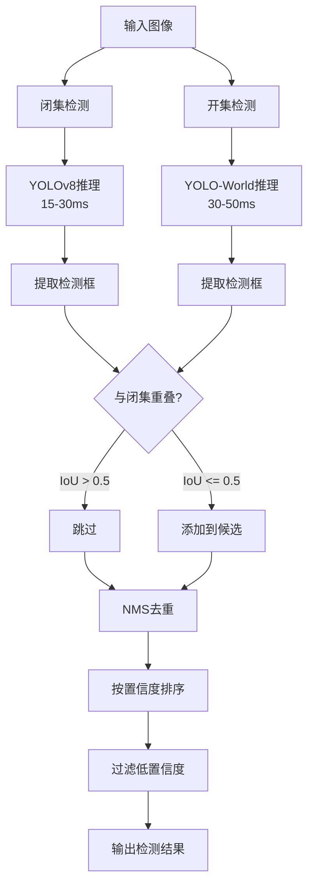
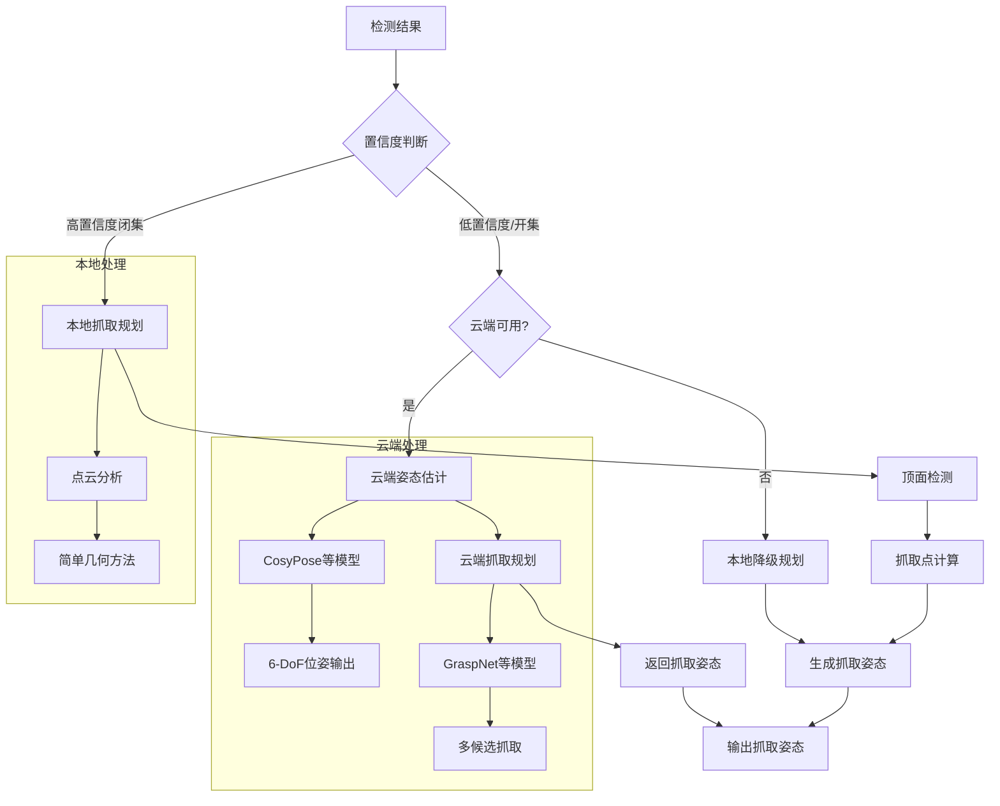

# 环境感知与决策算法系统

> 本章介绍物流装卸机器人的环境感知算法，包括视觉数据预处理、目标检测和云端深度感知模块。

---

## 3.1 视觉数据预处理

### 算法解析

深度图预处理影响后续点云质量和检测精度：

| 步骤 | 目的 | 方法 | 耗时 |
|------|------|------|------|
| 深度缩放 | 像素值→米 | 除以scale (通常1000) | <1ms |
| 无效值过滤 | 去除无效像素 | 阈值过滤、NaN处理 | <1ms |
| 双边滤波 | 保边去噪 | bilateral_filter | 3-5ms |

**点云生成原理**

从深度图到3D点云的转换（针孔相机模型）：

```
像素坐标 (u, v) → 归一化坐标 → 相机坐标 → 世界坐标

x_cam = (u - cx) × depth / fx
y_cam = (v - cy) × depth / fy  
z_cam = depth

[x_w, y_w, z_w, 1]ᵀ = extrinsic × [x_cam, y_cam, z_cam, 1]ᵀ
```

**点云滤波方法：**

| 方法 | 作用 | 参数 |
|------|------|------|
| 体素降采样 | 减少点数量，加速处理 | leaf_size (默认5mm) |
| 离群点移除 | 去除噪声点 | k近邻数、阈值倍数 |

### 处理流程图


### 实现代码

```python
# src/perception/preprocessing/preprocessing.py

from __future__ import annotations
from dataclasses import dataclass
from typing import Tuple, Optional
import numpy as np
from scipy.ndimage import bilateral_filter


@dataclass
class RGBDFrame:
    """RGB-D图像帧"""
    rgb: np.ndarray
    depth: np.ndarray
    intrinsic: np.ndarray
    extrinsic: np.ndarray
    timestamp: float


@dataclass
class PointCloud:
    """点云数据"""
    points: np.ndarray
    colors: Optional[np.ndarray]
    timestamp: float


@dataclass
class PreprocessingConfig:
    """预处理配置"""
    depth_scale: float = 1000.0
    depth_min: float = 0.1
    depth_max: float = 10.0
    bilateral_sigma_depth: float = 10.0
    bilateral_sigma_space: float = 10.0
    voxel_leaf_size: float = 0.005


class RGBDPreprocessor:
    """RGB-D图像预处理器"""
    
    def __init__(self, config: Optional[PreprocessingConfig] = None):
        self.config = config or PreprocessingConfig()
    
    def process_depth(self, depth: np.ndarray) -> np.ndarray:
        """深度图处理"""
        depth_m = depth.astype(np.float32) / self.config.depth_scale
        
        depth_m[depth_m <= 0] = 0
        depth_m[depth_m > self.config.depth_max] = 0
        depth_m = np.nan_to_num(depth_m, nan=0.0)
        
        if self.config.bilateral_sigma_depth > 0:
            depth_m = bilateral_filter(
                depth_m.astype(np.float64),
                sigma_depth=self.config.bilateral_sigma_depth,
                sigma_spatial=self.config.bilateral_sigma_space
            ).astype(np.float32)
        
        return depth_m


class PointCloudProcessor:
    """点云处理器"""
    
    def __init__(self, config: Optional[PreprocessingConfig] = None):
        self.config = config or PreprocessingConfig()
    
    def depth_to_pointcloud(self, 
                           frame: RGBDFrame,
                           mask: Optional[np.ndarray] = None) -> PointCloud:
        """从深度图生成点云"""
        depth = frame.depth.copy()
        rgb = frame.rgb
        h, w = depth.shape
        
        u_coords, v_coords = np.meshgrid(np.arange(w), np.arange(h))
        
        valid = mask > 0 if mask is not None else depth > 0
        u_valid = u_coords[valid]
        v_valid = v_coords[valid]
        z_valid = depth[valid]
        
        fx, fy = frame.intrinsic[0, 0], frame.intrinsic[1, 1]
        cx, cy = frame.intrinsic[0, 2], frame.intrinsic[1, 2]
        
        x_cam = (u_valid - cx) * z_valid / fx
        y_cam = (v_valid - cy) * z_valid / fy
        
        points_cam = np.stack([x_cam, y_cam, z_valid], axis=1)
        points_world = self._transform_points(points_cam, frame.extrinsic)
        
        colors = None
        if rgb is not None:
            r, g, b = rgb[valid, 0], rgb[valid, 1], rgb[valid, 2]
            colors = np.stack([r, g, b], axis=1).astype(np.uint8)
        
        return PointCloud(
            points=points_world.astype(np.float32),
            colors=colors,
            timestamp=frame.timestamp
        )
    
    def _transform_points(self, points: np.ndarray, transform: np.ndarray) -> np.ndarray:
        n = len(points)
        points_h = np.concatenate([points, np.ones((n, 1))], axis=1)
        return (transform @ points_h.T).T[:, :3]
    
    def downsample_voxel(self, cloud: PointCloud) -> PointCloud:
        """体素降采样"""
        if len(cloud.points) == 0:
            return cloud
        
        leaf_size = self.config.voxel_leaf_size
        voxel_indices = np.floor(cloud.points / leaf_size).astype(np.int32)
        unique_voxels, inverse_indices = np.unique(voxel_indices, axis=0, return_inverse=True)
        
        n_voxels = len(unique_voxels)
        downsampled_points = np.zeros((n_voxels, 3), dtype=np.float32)
        downsampled_colors = np.zeros((n_voxels, 3), dtype=np.uint8) if cloud.colors is not None else None
        
        for i in range(n_voxels):
            mask = inverse_indices == i
            downsampled_points[i] = cloud.points[mask].mean(axis=0)
            if downsampled_colors is not None and cloud.colors is not None:
                downsampled_colors[i] = cloud.colors[mask].mean(axis=0).astype(np.uint8)
        
        return PointCloud(
            points=downsampled_points,
            colors=downsampled_colors,
            timestamp=cloud.timestamp
        )
    
    def remove_outliers(self, cloud: PointCloud,
                       k: int = 20,
                       std_threshold: float = 2.0) -> PointCloud:
        """统计离群点移除"""
        if len(cloud.points) < k + 1:
            return cloud
        
        from scipy.spatial import KDTree
        tree = KDTree(cloud.points)
        distances, _ = tree.query(cloud.points, k=k+1)
        mean_distances = distances[:, 1:].mean(axis=1)
        
        mu, sigma = mean_distances.mean(), mean_distances.std()
        threshold = mu + std_threshold * sigma
        mask = mean_distances < threshold
        
        return PointCloud(
            points=cloud.points[mask],
            colors=cloud.colors[mask] if cloud.colors is not None else None,
            timestamp=cloud.timestamp
        )
```

---

## 3.2 通用目标检测

### 算法解析

单一检测器难以同时满足高准确率和泛化能力，本系统采用闭集+开集混合检测：

| 检测器 | 模型 | 能力 | 延迟 | 适用场景 |
|--------|------|------|------|---------|
| **YOLOv8闭集** | YOLOv8m | 固定类别，高准确率 | 15-30ms | 已知SKU |
| **YOLO-World开集** | YOLO-World | 零样本，文本提示 | 30-50ms | 新品类 |

**检测融合策略：**

```
融合规则：
1. 闭集检测结果加权 ×1.2（提高置信度）
2. 开集检测填补空白（IoU<0.5判定为空白）
3. NMS去重（IoU>0.45抑制）
```

**NMS（Non-Maximum Suppression）流程：**

1. 按置信度降序排列检测框
2. 选取最高置信度框作为保留框
3. 计算其余框与保留框的IoU
4. IoU>阈值则抑制该框
5. 重复直到所有框处理完毕

### 检测流程图



### 实现代码

```python
# src/perception/detection/detector.py

from __future__ import annotations
from dataclasses import dataclass, field
from typing import List, Tuple, Optional
import numpy as np

import torch
from ultralytics import YOLO


@dataclass
class BoundingBox:
    """检测框"""
    x1: float
    y1: float
    x2: float
    y2: float
    confidence: float
    class_id: int
    class_name: str
    
    @property
    def center(self) -> Tuple[float, float]:
        return (self.x1 + self.x2) / 2, (self.y1 + self.y2) / 2
    
    @property
    def area(self) -> float:
        return (self.x2 - self.x1) * (self.y2 - self.y1)
    
    def iou_with(self, other: 'BoundingBox') -> float:
        inter_x1 = max(self.x1, other.x1)
        inter_y1 = max(self.y1, other.y1)
        inter_x2 = min(self.x2, other.x2)
        inter_y2 = min(self.y2, other.y2)
        inter_area = max(0, inter_x2 - inter_x1) * max(0, inter_y2 - inter_y1)
        union_area = self.area + other.area - inter_area
        return inter_area / union_area if union_area > 0 else 0


@dataclass
class DetectedObject:
    """检测到的目标"""
    bbox: BoundingBox
    source: str  # "closed_set" / "open_set"


@dataclass
class DetectionConfig:
    """检测配置"""
    closed_set_model_path: str = "models/yolov8m.pt"
    open_set_model_path: str = "models/yolo-world.pt"
    closed_set_conf_thresh: float = 0.7
    open_set_conf_thresh: float = 0.5
    nms_iou_thresh: float = 0.45
    fusion_conf_thresh: float = 0.6
    closed_set_classes: List[str] = field(default_factory=lambda: [
        'box', 'package', 'pallet', 'container', 'bag', 'crate', 'object'
    ])
    device: str = "cuda" if torch.cuda.is_available() else "cpu"


class UnifiedDetector:
    """通用目标检测器"""
    
    def __init__(self, config: Optional[DetectionConfig] = None):
        self.config = config or DetectionConfig()
        
        self.closed_set_model = YOLO(self.config.closed_set_model_path)
        self.closed_set_model.to(self.config.device)
        
        self.open_set_model = YOLO(self.config.open_set_model_path)
        self.open_set_model.to(self.config.device)
    
    def detect(self, 
               image: np.ndarray,
               use_open_set: bool = True) -> List[DetectedObject]:
        """执行通用检测"""
        closed_results = self._detect_closed_set(image)
        
        if use_open_set:
            open_results = self._detect_open_set(image)
            fused = self._fuse_detections(closed_results, open_results)
        else:
            fused = closed_results
        
        return [d for d in fused if d.bbox.confidence >= self.config.fusion_conf_thresh]
    
    def _detect_closed_set(self, image: np.ndarray) -> List[DetectedObject]:
        """闭集检测"""
        results = self.closed_set_model.predict(
            image, conf=self.config.closed_set_conf_thresh, verbose=False
        )[0]
        
        detected = []
        if results.boxes is not None:
            boxes = results.boxes.xyxy.cpu().numpy()
            confidences = results.boxes.conf.cpu().numpy()
            class_ids = results.boxes.cls.cpu().numpy().astype(int)
            
            for box, conf, cls_id in zip(boxes, confidences, class_ids):
                if cls_id < len(self.config.closed_set_classes):
                    detected.append(DetectedObject(
                        bbox=BoundingBox(
                            x1=box[0], y1=box[1], x2=box[2], y2=box[3],
                            confidence=float(conf), class_id=int(cls_id),
                            class_name=self.config.closed_set_classes[int(cls_id)]
                        ),
                        source="closed_set"
                    ))
        
        return detected
    
    def _detect_open_set(self, image: np.ndarray) -> List[DetectedObject]:
        """开集检测"""
        results = self.open_set_model.predict(
            image, conf=self.config.open_set_conf_thresh, verbose=False
        )[0]
        
        detected = []
        if results.boxes is not None:
            boxes = results.boxes.xyxy.cpu().numpy()
            confidences = results.boxes.conf.cpu().numpy()
            
            for box, conf in zip(boxes, confidences):
                detected.append(DetectedObject(
                    bbox=BoundingBox(
                        x1=box[0], y1=box[1], x2=box[2], y2=box[3],
                        confidence=float(conf), class_id=-1,
                        class_name="unknown"
                    ),
                    source="open_set"
                ))
        
        return detected
    
    def _fuse_detections(self, 
                        closed_results: List[DetectedObject],
                        open_results: List[DetectedObject]) -> List[DetectedObject]:
        """融合检测结果"""
        all_detections = []
        
        for det in closed_results:
            weighted_conf = det.bbox.confidence * 1.2
            all_detections.append(DetectedObject(
                bbox=BoundingBox(
                    x1=det.bbox.x1, y1=det.bbox.y1,
                    x2=det.bbox.x2, y2=det.bbox.y2,
                    confidence=min(weighted_conf, 1.0),
                    class_id=det.bbox.class_id,
                    class_name=det.bbox.class_name
                ),
                source=det.source
            ))
        
        for det in open_results:
            should_add = True
            for closed_det in closed_results:
                if det.bbox.iou_with(closed_det.bbox) > 0.5:
                    should_add = False
                    break
            
            if should_add:
                all_detections.append(DetectedObject(
                    bbox=det.bbox,
                    source=det.source
                ))
        
        return self._nms(all_detections)
    
    def _nms(self, detections: List[DetectedObject]) -> List[DetectedObject]:
        """非极大值抑制"""
        if not detections:
            return []
        
        sorted_dets = sorted(detections, key=lambda x: x.bbox.confidence, reverse=True)
        keep = []
        
        while sorted_dets:
            current = sorted_dets.pop(0)
            keep.append(current)
            sorted_dets = [
                det for det in sorted_dets
                if det.bbox.iou_with(current.bbox) < self.config.nms_iou_thresh
            ]
        
        return keep
```

---

## 3.3 云端深度感知

### 算法解析

根据检测置信度动态选择感知路径：

| 置信度 | 路径 | 说明 |
|--------|------|------|
| ≥0.8 + 闭集 | 本地规划 | 已知品类，快速响应 |
| <0.8 或 开集 | 云端处理 | 未知品类，精确感知 |

**云端深度感知能力：**

| 能力 | 算法 | 延迟 | 输出 |
|------|------|------|------|
| 6-DoF姿态估计 | CosyPose等 | 30-80ms | 旋转矩阵+平移向量 |
| 抓取姿态规划 | GraspNet等 | 50-100ms | 抓取点+夹爪参数 |

**本地降级策略**

云端不可用时，使用简单几何方法：

```
抓取点 = 点云顶面区域中心
夹爪宽度 = 物体尺寸 × 1.2
接近方向 = 垂直向上
```

**抓取姿态三阶段：**

```
Pre-grasp → Grasp → Post-grasp
   ↑          ↑         ↑
抬起到安全    下降闭合    提升离开
高度+15cm   执行抓取    高度+30cm
```

### 感知决策流程图



### 实现代码

```python
# src/perception/cloud/pose_estimator.py

from __future__ import annotations
from dataclasses import dataclass
from typing import List, Optional
import numpy as np
import time
import requests

from ..common.types import PointCloud, RGBDFrame, Pose6D


@dataclass
class Object6DPose:
    """物体6D位姿"""
    object_id: str
    class_name: str
    rotation: np.ndarray
    translation: np.ndarray
    confidence: float
    
    def to_pose6d(self) -> Pose6D:
        from scipy.spatial.transform import Rotation
        return Pose6D(
            position=self.translation,
            orientation=Rotation.from_matrix(self.rotation).as_quat()
        )


@dataclass
class GraspPoint:
    """抓取点"""
    position: np.ndarray
    approach_direction: np.ndarray
    gripper_width: float
    score: float


@dataclass
class GraspPose:
    """完整抓取姿态"""
    object_id: str
    grasp_point: GraspPoint
    pre_grasp_pose: Pose6D
    grasp_pose: Pose6D
    post_grasp_pose: Pose6D
    score: float
    method: str


class CloudServiceClient:
    """云端服务客户端"""
    
    def __init__(self, endpoint: str = "http://cloud-robotics.local:8080",
                 timeout: float = 5.0):
        self.endpoint = endpoint
        self.timeout = timeout
    
    def estimate_pose(self, 
                     image: np.ndarray,
                     pointcloud: np.ndarray,
                     object_class: str) -> List[Object6DPose]:
        """请求云端6-DoF姿态估计"""
        import base64
        import cv2
        
        _, img_encoded = cv2.imencode('.jpg', cv2.cvtColor(image, cv2.COLOR_RGB2BGR))
        img_base64 = base64.b64encode(img_encoded).decode()
        
        payload = {
            'image': img_base64,
            'pointcloud': pointcloud.tolist(),
            'object_class': object_class,
            'timestamp': time.time()
        }
        
        try:
            response = requests.post(
                f"{self.endpoint}/api/v1/pose_estimation",
                json=payload, timeout=self.timeout
            )
            response.raise_for_status()
            result = response.json()
            
            poses = []
            for item in result.get('poses', []):
                poses.append(Object6DPose(
                    object_id=item['object_id'],
                    class_name=item['class_name'],
                    rotation=np.array(item['rotation']),
                    translation=np.array(item['translation']),
                    confidence=item['confidence']
                ))
            return poses
        except requests.exceptions.RequestException as e:
            print(f"Cloud service error: {e}")
            return []
    
    def plan_grasp(self,
                  pointcloud: np.ndarray,
                  object_poses: List[Object6DPose]) -> List[GraspPose]:
        """请求云端抓取规划"""
        payload = {
            'pointcloud': pointcloud.tolist(),
            'object_poses': [
                {
                    'object_id': p.object_id,
                    'rotation': p.rotation.tolist(),
                    'translation': p.translation.tolist()
                }
                for p in object_poses
            ]
        }
        
        try:
            response = requests.post(
                f"{self.endpoint}/api/v1/grasp_planning",
                json=payload, timeout=10.0
            )
            response.raise_for_status()
            result = response.json()
            
            grasps = []
            for item in result.get('grasps', []):
                grasp_point = GraspPoint(
                    position=np.array(item['position']),
                    approach_direction=np.array(item['approach']),
                    gripper_width=item['gripper_width'],
                    score=item['score']
                )
                
                grasps.append(GraspPose(
                    object_id=item['object_id'],
                    grasp_point=grasp_point,
                    pre_grasp_pose=Pose6D(
                        position=np.array(item['pre_grasp']['position']),
                        orientation=np.array(item['pre_grasp']['orientation'])
                    ),
                    grasp_pose=Pose6D(
                        position=np.array(item['grasp']['position']),
                        orientation=np.array(item['grasp']['orientation'])
                    ),
                    post_grasp_pose=Pose6D(
                        position=np.array(item['post_grasp']['position']),
                        orientation=np.array(item['post_grasp']['orientation'])
                    ),
                    score=item['score'],
                    method='cloud'
                ))
            return grasps
        except requests.exceptions.RequestException as e:
            print(f"Cloud grasp planning error: {e}")
            return []


class LocalGraspPlanner:
    """本地抓取规划器"""
    
    def __init__(self, gripper_max_width: float = 0.1):
        self.gripper_max_width = gripper_max_width
    
    def plan_grasp(self, pointcloud: PointCloud) -> List[GraspPose]:
        """本地抓取规划"""
        from scipy.spatial.transform import Rotation
        
        if len(pointcloud.points) == 0:
            return []
        
        z_max = pointcloud.points[:, 2].max()
        top_mask = pointcloud.points[:, 2] > z_max - 0.05
        top_points = pointcloud.points[top_mask]
        
        if len(top_points) == 0:
            return []
        
        grasp_center = top_points.mean(axis=0)
        
        obj_extent = pointcloud.points.max(axis=0) - pointcloud.points.min(axis=0)
        gripper_width = min(max(obj_extent) * 1.2, self.gripper_max_width)
        
        grasp_point = GraspPoint(
            position=grasp_center,
            approach_direction=np.array([0, 0, -1]),
            gripper_width=gripper_width,
            score=0.7
        )
        
        return [GraspPose(
            object_id="local_estimated",
            grasp_point=grasp_point,
            pre_grasp_pose=Pose6D(
                position=grasp_center + np.array([0, 0, 0.15]),
                orientation=Rotation.from_euler('xyz', [0, 0, 0]).as_quat()
            ),
            grasp_pose=Pose6D(
                position=grasp_center,
                orientation=Rotation.from_euler('xyz', [0, 0, 0]).as_quat()
            ),
            post_grasp_pose=Pose6D(
                position=grasp_center + np.array([0, 0, 0.3]),
                orientation=Rotation.from_euler('xyz', [0, 0, 0]).as_quat()
            ),
            score=0.7,
            method='local'
        )]


class PerceptionCoordinator:
    """感知协调器"""
    
    def __init__(self, 
                 cloud_endpoint: str = "http://cloud-robotics.local:8080",
                 use_cloud: bool = True):
        self.cloud_client = CloudServiceClient(endpoint=cloud_endpoint)
        self.local_grasp_planner = LocalGraspPlanner()
        self.use_cloud = use_cloud
        self._cloud_available = True
    
    def check_cloud_health(self) -> bool:
        try:
            response = requests.get(
                f"{self.cloud_client.endpoint}/health", timeout=2.0
            )
            self._cloud_available = response.status_code == 200
        except:
            self._cloud_available = False
        return self._cloud_available
    
    def estimate_and_grasp(self,
                          frame: RGBDFrame,
                          pointcloud: PointCloud,
                          detections: List,
                          min_confidence: float = 0.8) -> List[GraspPose]:
        """协调感知流程"""
        all_grasps = []
        
        for detection in detections:
            bbox = detection.bbox
            
            if detection.bbox.confidence >= min_confidence and detection.source == "closed_set":
                grasps = self.local_grasp_planner.plan_grasp(pointcloud)
                all_grasps.extend(grasps)
            else:
                if self.use_cloud and self.check_cloud_health():
                    try:
                        poses = self.cloud_client.estimate_pose(
                            image=frame.rgb,
                            pointcloud=pointcloud.points,
                            object_class=bbox.class_name
                        )
                        if poses:
                            cloud_grasps = self.cloud_client.plan_grasp(
                                pointcloud=pointcloud.points,
                                object_poses=poses
                            )
                            all_grasps.extend(cloud_grasps)
                    except:
                        pass
                
                if not any(g.method == 'cloud' for g in all_grasps):
                    grasps = self.local_grasp_planner.plan_grasp(pointcloud)
                    all_grasps.extend(grasps)
        
        all_grasps.sort(key=lambda x: x.score, reverse=True)
        return all_grasps
```

---

**上一章**：[运动规划算法系统](02-motion-planning.md)

**下一章**：[任务调度与决策](04-task-scheduling.md)
