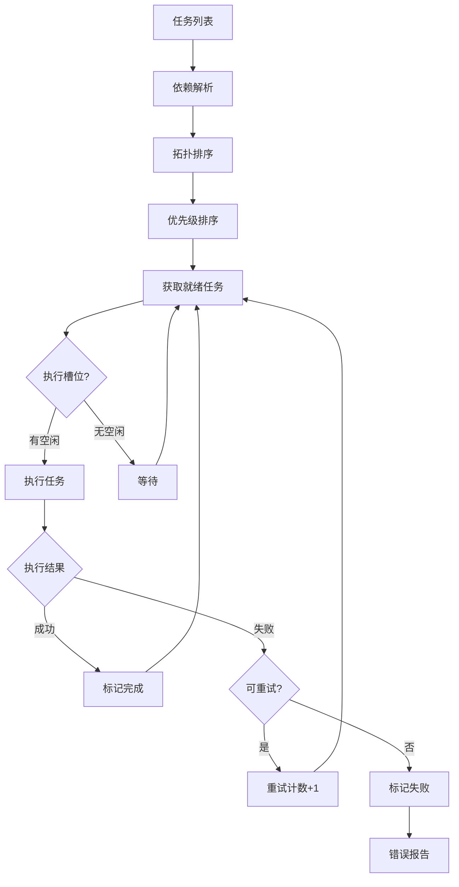
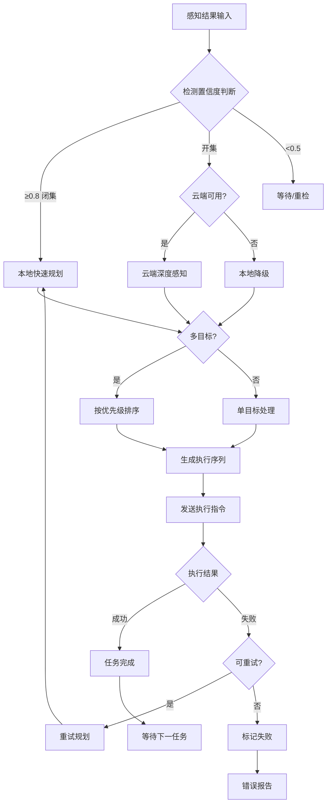

# 任务调度与决策

> 本章介绍物流装卸机器人的任务调度算法和决策逻辑。

---

## 3.4 任务调度与决策

### 算法解析

任务调度将高层任务（如"分拣包裹A到目标位"）分解为可执行的动作序列。

**任务建模：**

```
Task {
    task_id: 唯一标识
    task_type: pick / place / move
    dependencies: [前置任务ID列表]
    priority: CRITICAL / HIGH / NORMAL / LOW
    estimated_duration: 预估时长
}
```

**调度算法：Kahn拓扑排序 + 优先级队列**

| 步骤 | 操作 | 目的 |
|------|------|------|
| 1. 依赖解析 | 构建DAG | 确定执行顺序约束 |
| 2. 拓扑排序 | Kahn算法 | 消除依赖获得执行序列 |
| 3. 优先级排序 | 按priority+时间排序 | 同层任务优先级 |
| 4. 批次调度 | 按max_concurrent分配 | 资源高效利用 |

**优先级队列实现：**

Python `heapq` 实现最小堆，Task类实现 `__lt__` 方法，使得：
- 数值小的优先级高（CRITICAL=1 优先于 LOW=4）
- 同优先级按创建时间排序

### 调度流程图



### 实现代码

```python
# src/decision/task_scheduler.py

from __future__ import annotations
from dataclasses import dataclass, field
from typing import List, Optional, Dict
from enum import Enum
import numpy as np
import heapq
import time


class TaskPriority(Enum):
    CRITICAL = 1
    HIGH = 2
    NORMAL = 3
    LOW = 4


@dataclass
class Task:
    """任务"""
    task_id: str
    task_type: str  # "pick" / "place" / "move"
    source_pose: Optional[np.ndarray]
    target_pose: Optional[np.ndarray]
    object_class: Optional[str] = None
    priority: TaskPriority = TaskPriority.NORMAL
    dependencies: List[str] = field(default_factory=list)
    estimated_duration: float = 5.0
    created_time: float = field(default_factory=time.time)
    
    def __lt__(self, other):
        return self.priority.value < other.priority.value


@dataclass
class ExecutionStatus:
    """执行状态"""
    task_id: str
    status: str  # "pending" / "running" / "completed" / "failed"
    start_time: Optional[float] = None
    end_time: Optional[float] = None
    progress: float = 0.0
    error_message: Optional[str] = None


class TaskScheduler:
    """
    通用任务调度器
    
    调度流程：
    1. 任务入队：添加到优先队列
    2. 依赖解析：检查前置任务是否完成
    3. 拓扑排序：保证依赖顺序
    4. 优先级排序：同层任务按优先级+时间排序
    5. 执行调度：按批次分配执行槽位
    6. 结果处理：成功/失败/重试
    """
    
    def __init__(self, max_concurrent: int = 1):
        self.max_concurrent = max_concurrent
        self.task_queue: List[Task] = []
        self.executing_tasks: Dict[str, Task] = {}
        self.completed_tasks: Dict[str, ExecutionStatus] = {}
        self.failed_tasks: Dict[str, ExecutionStatus] = {}
    
    def add_task(self, task: Task):
        """添加任务"""
        self.task_queue.append(task)
        heapq.heapify(self.task_queue)
    
    def add_tasks(self, tasks: List[Task]):
        for task in tasks:
            self.add_task(task)
    
    def get_ready_tasks(self) -> List[Task]:
        """获取就绪任务（依赖已满足）"""
        ready = []
        for task in self.task_queue:
            deps_satisfied = all(tid in self.completed_tasks for tid in task.dependencies)
            if deps_satisfied:
                ready.append(task)
        return ready
    
    def get_next_batch(self, batch_size: Optional[int] = None) -> List[Task]:
        """获取下一批次任务"""
        if batch_size is None:
            batch_size = self.max_concurrent
        
        available_slots = self.max_concurrent - len(self.executing_tasks)
        if available_slots <= 0:
            return []
        
        ready_tasks = self.get_ready_tasks()
        ready_tasks.sort(key=lambda t: (t.priority.value, t.created_time))
        batch = ready_tasks[:batch_size]
        
        for task in batch:
            self.task_queue.remove(task)
        
        return batch
    
    def start_execution(self, tasks: List[Task]):
        """开始执行任务"""
        for task in tasks:
            self.executing_tasks[task.task_id] = task
            self.completed_tasks[task.task_id] = ExecutionStatus(
                task_id=task.task_id,
                status="running",
                start_time=time.time()
            )
    
    def complete_task(self, task_id: str, success: bool, 
                     error_message: Optional[str] = None):
        """完成任务"""
        if task_id not in self.executing_tasks:
            return
        
        self.executing_tasks.pop(task_id)
        status = self.completed_tasks[task_id]
        status.status = "completed" if success else "failed"
        status.end_time = time.time()
        status.progress = 1.0 if success else status.progress
        status.error_message = error_message
        
        if not success:
            self.failed_tasks[task_id] = status
    
    def update_progress(self, task_id: str, progress: float):
        """更新任务进度"""
        if task_id in self.completed_tasks:
            self.completed_tasks[task_id].progress = progress
    
    def optimize_sequence(self, tasks: List[Task]) -> List[Task]:
        """
        优化任务执行序列
        
        使用拓扑排序保证依赖顺序
        """
        task_map = {t.task_id: t for t in tasks}
        in_degree = {t.task_id: len(t.dependencies) for t in tasks}
        adj_list = {t.task_id: [] for t in tasks}
        
        for t in tasks:
            for dep in t.dependencies:
                if dep in task_map:
                    adj_list[dep].append(t.task_id)
        
        queue = [t.task_id for t in tasks if in_degree[t.task_id] == 0]
        sorted_ids = []
        
        while queue:
            queue.sort(key=lambda tid: (
                task_map[tid].priority.value,
                task_map[tid].created_time
            ))
            current = queue.pop(0)
            sorted_ids.append(current)
            
            for neighbor in adj_list[current]:
                in_degree[neighbor] -= 1
                if in_degree[neighbor] == 0:
                    queue.append(neighbor)
        
        if len(sorted_ids) != len(tasks):
            return tasks
        
        return [task_map[tid] for tid in sorted_ids]
```

---

## 3.5 决策引擎

### 决策矩阵

基于感知结果和系统状态的决策逻辑：

| 输入状态 | 决策动作 | 优先级 |
|---------|---------|--------|
| 高置信度闭集检测 | 本地抓取规划 | CRITICAL |
| 低置信度/开集检测 | 云端深度感知 | HIGH |
| 云端不可用 | 本地降级规划 | HIGH |
| 多目标冲突 | 优先级排序 | NORMAL |
| 执行失败 | 重试/跳过 | LOW |

### 决策流程



---

**上一章**：[环境感知系统](03-perception.md)

**下一章**：[部署配置](05-deployment.md)
