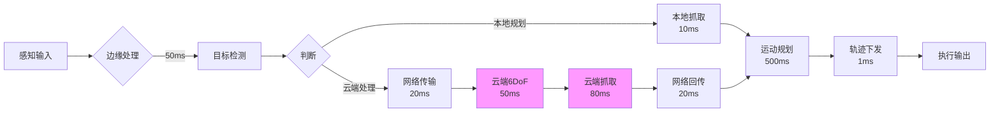

# 部署配置与性能指标

> 本章介绍物流装卸机器人算法系统的部署配置模板和性能指标要求。
>
> **实现状态**：本章描述目标部署配置与性能指标。当前已实际实现 Docker Compose 三服务部署（Mosquitto broker + RCS API + Simulation Backend），以及 FastAPI + Vue 3 前后端分离架构。详见下方 §4.0。

---

## 4.0 当前实际部署架构（已实现）

### 4.0.1 Docker Compose 部署

`deploy/docker-compose.yml` 定义了三个服务：

| 服务 | 镜像 | 端口 | 职责 |
|------|------|------|------|
| **broker** | eclipse-mosquitto:2 | 1883, 9001 | MQTT 消息代理 |
| **rcs** | 自构建 (Python 3.11-slim) | 8100 | RCS 独立模式 FastAPI |
| **api** | 自构建 (Python 3.11-slim) | 8000 | 仿真后端 FastAPI（内嵌 RCS） |

### 4.0.2 本地开发环境

| 组件 | 技术栈 | 启动方式 |
|------|--------|----------|
| 仿真后端 | FastAPI + uvicorn | `cd simulation/backend && uvicorn main:app --reload` |
| 仿真前端 | Vue 3 + Vite + Three.js | `cd simulation/frontend && npm run dev` |
| RCS 独立模式 | FastAPI + uvicorn | `cd rcs && uvicorn rcs.app:app --port 8100` |
| MQTT Broker | Mosquitto 2.x | `docker compose up broker` 或本地安装 |
| ROS 2 节点 | ROS 2 Humble + Python | `ros2 run robot_decision motion_planner_node` |

### 4.0.3 MQTT 通信架构

| 主题 | QoS | 方向 | 内容 |
|------|-----|------|------|
| `robot/{id}/command` | 1 | RCS → robot-app | 控制指令 |
| `robot/{id}/state` | 0 | robot-app → RCS | 设备状态 |
| `robot/{id}/telemetry` | 0 | robot-app → RCS | 遥测数据 |
| `robot/{id}/alert` | 1 | 双向 | 安全报警 |

### 4.0.4 测试覆盖

| 测试套件 | 测试数 | 运行方式 |
|---------|--------|----------|
| simulation/backend | 89 | `cd simulation/backend && pytest -q` |
| rcs | 85 | `cd rcs && pytest -q` |
| robot_decision | 43 | `cd robot-app/ros2_ws/src/robot_decision && pytest -q` |
| robot_gateway | 44 | `cd robot-app/ros2_ws/src/robot_gateway && pytest -q` |
| robot_perception | 7 | `cd robot-app/ros2_ws/src/robot_perception && pytest -q` |
| vla-training | 40 | `cd vla-training && pytest -q` |
| **总计** | **308** | **0 failures** |

---

## 4.1 通用配置模板

### 机器人配置 (robot_config.yaml)

```yaml
# config/robot_config.yaml

robot:
  # 运动学参数
  num_joints: 6                    # 关节数量（6或7）
  payload_kg: 25.0                 # 负载(kg)
  
  # 精度参数
  position_accuracy_mm: 0.5        # 定位精度(mm)
  repeatability_mm: 0.1            # 重复精度(mm)
  
  # 速度参数
  max_velocity_mps: 3.0            # 最大线速度(m/s)
  max_acceleration_mps2: 15.0    # 最大加速度(m/s²)
  
  # 控制参数
  control_frequency_hz: 250         # 控制频率
  
  # 工作空间
  workspace_radius_m: 2.0          # 工作半径(m)

perception:
  hybrid_detection:
    # 闭集检测配置
    closed_set:
      model: "models/yolov8m.pt"
      confidence: 0.7
      classes: 
        - "box"
        - "package"
        - "pallet"
        - "container"
        - "bag"
        - "crate"
    
    # 开集检测配置
    open_set:
      model: "models/yolo-world-m.pt"
      confidence: 0.5
      prompts: ["package", "object", "item"]
    
    # 融合配置
    fusion:
      nms_iou_threshold: 0.45
      fusion_confidence: 0.6

cloud:
  # 云端服务配置
  endpoint: "http://cloud-robotics.local:8080"
  timeout: 5.0
  fallback_to_local: true
  
  # 6-DoF姿态估计
  pose_estimation:
    enabled: true
    model: "cosypose"
    confidence_threshold: 0.8
  
  # 抓取规划
  grasp_planning:
    enabled: true
    model: "graspnet"
    num_candidates: 10
```

### 场景配置模板

```yaml
# config/scenarios/high_precision.yaml
# 高精度分拣场景

robot:
  position_accuracy_mm: 0.3
  max_velocity_mps: 2.0

planning:
  max_iterations: 10000
  step_size: 0.05
  rewire_radius: 0.3
  smoothness_weight: 0.6
  collision_weight: 2.0
  interpolation_mode: "s_curve"

---
# config/scenarios/high_speed.yaml
# 高速搬运场景

robot:
  position_accuracy_mm: 1.0
  max_velocity_mps: 3.5

planning:
  max_iterations: 5000
  step_size: 0.1
  rewire_radius: 0.5
  smoothness_weight: 0.3
  collision_weight: 1.0
  interpolation_mode: "linear"
```

---

## 4.2 性能指标

### 运动规划性能

| 模块 | 指标 | 要求 | 说明 |
|------|------|------|------|
| 全局规划 | 规划时间 | <2s | RRT*采样 |
| 全局规划 | 路径成功率 | ≥95% | 无碰撞路径 |
| 轨迹优化 | 优化时间 | 50-200ms | 梯度/随机优化 |
| 轨迹插补 | 插补延迟 | <1ms | 实时生成 |
| 整体流程 | 端到端延迟 | <3s | 从请求到下发 |

### 感知性能

| 模块 | 指标 | 要求 | 说明 |
|------|------|------|------|
| 深度图滤波 | 处理延迟 | <5ms | 双边滤波 |
| 点云降采样 | 处理延迟 | <10ms | 体素网格 |
| 目标检测 | 闭集检测 | 15-30ms | YOLOv8 |
| 目标检测 | 开集检测 | 30-50ms | YOLO-World |
| 检测融合 | 处理延迟 | <5ms | NMS去重 |
| 6-DoF姿态估计 | 估计延迟 | 30-80ms | 云端处理 |
| 抓取规划 | 规划延迟 | 50-100ms | 云端处理 |

### 系统性能

| 模块 | 指标 | 要求 | 说明 |
|------|------|------|------|
| 控制器通信 | EtherCAT周期 | 1ms | 实时控制 |
| 视觉采集 | 帧率 | 30fps | RGB-D相机 |
| 任务调度 | 批次优化 | <1s | 秒级调度 |
| 系统可靠性 | MTBF | >5000小时 | 平均无故障时间 |

---

## 4.3 部署架构

### 当前实际部署（已实现）

```
┌─────────────────────────────────────────────────────────────────┐
│                    当前部署架构                                      │
├─────────────────────────────────────────────────────────────────┤
│                                                                 │
│   ┌─────────────────────────────────────────────────────────┐ │
│   │              Docker Compose 服务组                      │ │
│   │  ┌─────────┐  ┌─────────┐  ┌─────────┐             │ │
│   │  │ Mosquitto │  │   RCS   │  │  API    │             │ │
│   │  │ Broker  │  │ :8100  │  │ :8000  │             │ │
│   │  │ :1883   │  │(standalone)│  │(embedded)│            │ │
│   │  └────┬────┘  └────┬────┘  └────┬────┘             │ │
│   │       │           │           │                     │ │
│   └───────┼───────────┼───────────┼─────────────────────┘ │
│           │           │           │                         │
│           └───────────┴───────────┘                         │
│                    MQTT + HTTP/SSE                          │
│                         │                                     │
│   ┌─────────────────────┼─────────────────────────────────┐ │
│   │              前端 (Vue 3 + Vite)                      │ │
│   │  ┌─────────┐  ┌─────────┐  ┌─────────┐             │ │
│   │  │ Three.js │  │ ECharts │  │  SSE    │             │ │
│   │  │ 3D场景  │  │  图表   │  │  实时流 │             │ │
│   │  └─────────┘  └─────────┘  └─────────┘             │ │
│   └─────────────────────────────────────────────────────────┘ │
│                                                                 │
└─────────────────────────────────────────────────────────────────┘
```

### 边缘服务器配置

```yaml
# 边缘服务器最低配置
edge_server:
  cpu: "Intel i7-12700K"      # 12核24线程
  gpu: "NVIDIA RTX 3080"        # 10GB显存
  ram: "32GB DDR4"
  storage: "1TB NVMe SSD"
  
  network:
    ethercat: "100Mbps"         # 机器人控制
    ethernet: "1Gbps"           # 云端通信
    usb: "USB3.0"              # 相机连接
  
  software:
    os: "Ubuntu 22.04 LTS"
    ros2: "Humble"
    cuda: "12.1"
```

### 云端服务器配置

```yaml
# 云端服务器配置
cloud_server:
  cpu: "AMD EPYC 7543"          # 32核64线程
  gpu: "NVIDIA A100"            # 40GB显存
  ram: "128GB DDR4"
  storage: "2TB NVMe SSD"
  
  services:
    - pose_estimation
    - grasp_planning
    - task_optimization
  
  scaling:
    min_instances: 1
    max_instances: 4
    auto_scale: true
```

---

## 4.4 网络延迟预算



**延迟预算：**

| 阶段 | 本地路径 | 云端路径 |
|------|---------|---------|
| 目标检测 | 50ms | 50ms |
| 抓取规划 | 10ms | 150ms |
| 运动规划 | 500ms | 500ms |
| **总计** | **560ms** | **700ms** |

---

## 4.5 可靠性设计

### 故障处理策略

| 故障类型 | 检测方法 | 处理策略 |
|---------|---------|---------|
| 云端不可用 | 健康检查超时 | 切换本地降级模式 |
| 检测失败 | 置信度低于阈值 | 重检或跳过 |
| 规划失败 | 超时或无解 | 重试或报告 |
| 通信中断 | 心跳检测 | 紧急停止 |
| 碰撞预警 | 距离传感器 | 立即停止 |

### 降级模式

```
┌─────────────────────────────────────────────────────────┐
│                      正常工作模式                        │
│  检测 → 云端姿态估计 → 云端抓取规划 → 运动规划 → 执行   │
└─────────────────────────────────────────────────────────┘
                         ↓ 云端故障
┌─────────────────────────────────────────────────────────┐
│                      降级模式1                           │
│  检测 → 本地几何抓取 → 运动规划 → 执行                  │
└─────────────────────────────────────────────────────────┘
                         ↓ 本地也故障
┌─────────────────────────────────────────────────────────┐
│                      降级模式2                           │
│  等待人工干预 / 安全停机                               │
└─────────────────────────────────────────────────────────┘
```

---

**上一章**：[任务调度与决策](04-task-scheduling.md)

**返回目录**：[README](README.md)
