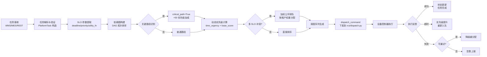
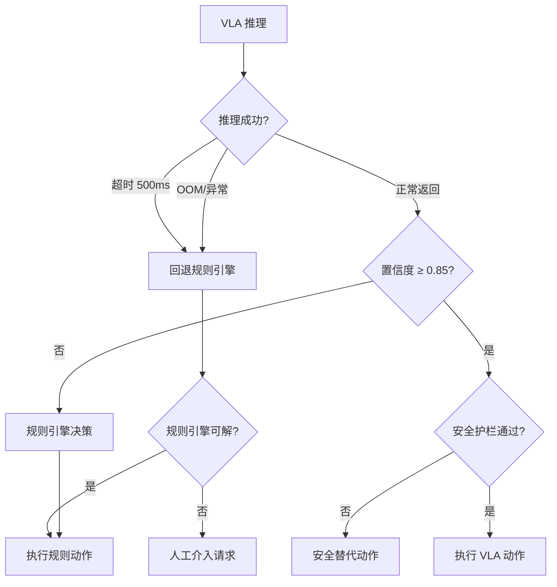
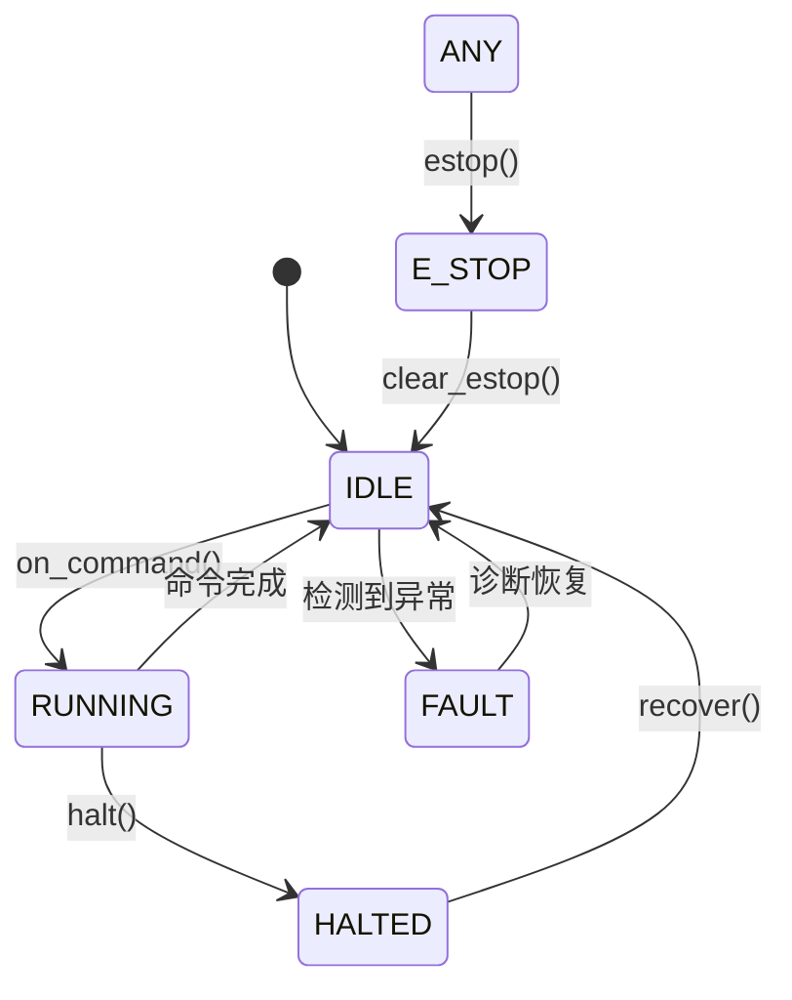
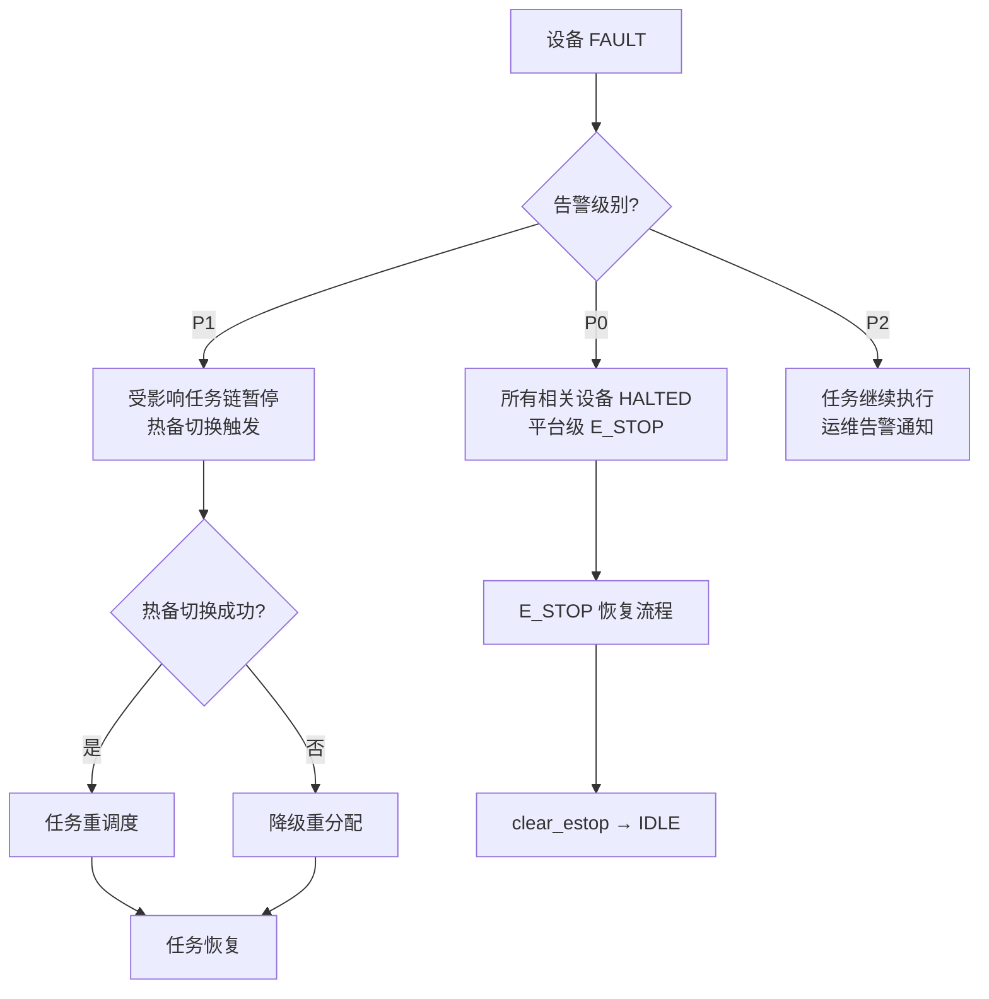
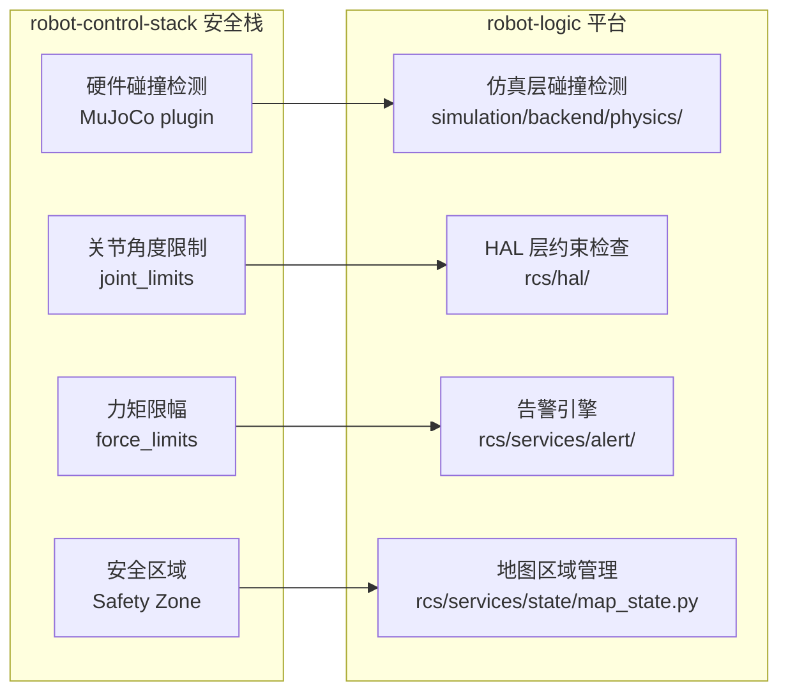
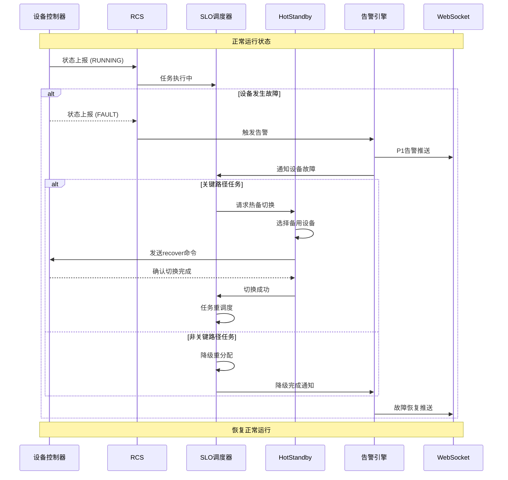
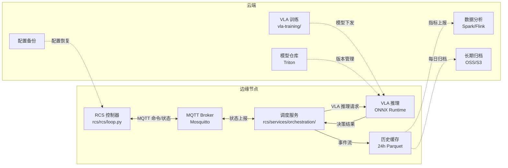
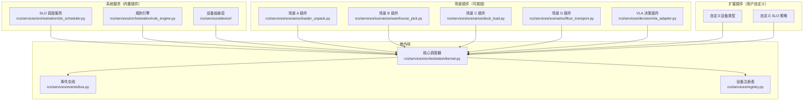

# 物流园区 RCS 平台架构

> **Last updated**: 2026-08-23

---

## 摘要

本文档定义物流园区机器人控制系统（Robotics Control System Platform, RCS Platform）的完整技术架构。该平台在现有 `robot-logic` Monorepo 四子项目（`shared/`、`rcs/`、`simulation/`、`robot-app/`）基础上，新增调度编排层、VLA 决策层和可观测层，统一支撑集装箱拆装箱（A）、仓储拣选（B）、月台装卸（C）、跨楼层运输（D）四类差异化业务场景。平台设计遵循"通用核心 + 场景适配插件"原则，通过 HAL 抽象层保持对现有 `rcs/hal/` 控制器的零侵入兼容，通过 `shared/` 零依赖契约层保证通信接口的稳定性。

---

## 1. 目标与范围

### 1.1 平台使命

物流园区 RCS 平台的核心使命是将分散的机器人控制能力（臂、AGV、堆垛机、叉车、双臂装卸）整合为统一的调度与决策中枢，在多设备协同、多任务并行、多 SLO 约束的复杂环境下实现安全、高效、实时的物流作业。

平台不是从零重建控制能力，而是在现有四子项目的坚实基础上，通过**新增服务层**的方式实现能力扩展。平台与现有代码的交互边界清晰：平台服务通过 MQTT 订阅设备状态，通过 REST/MQTT 向设备下发命令，不直接修改设备控制器的内部逻辑。

### 1.2 为什么需要统一平台

当前 `rcs/` 中的调度逻辑（`dispatch.py`）是单层命令分发：接收命令 → 路由到设备 → 完成。该模式在单设备、单任务场景下工作良好，但面临以下扩展挑战：

| 挑战 | 当前方案 | 平台方案 |
|------|---------|---------|
| 多设备协同 | 人工编排 | DAG 任务图 + 自动拓扑排序 |
| SLO 约束 | 无 | deadline-driven 优先级 + utility function |
| 故障恢复 | 设备本地 | 热备切换 + 降级重分配 |
| 视觉决策 | 无 | VLA 插件 + 规则引擎仲裁 |
| 多租户 | 无 | namespace + RBAC 隔离 |
| 边云协同 | 无 | ONNX 推理 + Triton 模型管理 |

### 1.3 四类场景覆盖

| 场景 | 代号 | 核心设备组合 | 典型 SLO | 峰值并发 |
|------|------|-------------|----------|---------|
| 集装箱拆装箱 | A | 双臂装卸机器人 + AGV + 门机 | 每箱 ≤ 3 分钟 | 50 箱/小时 |
| 仓储拣选 | B | AMR + Pallet Forklift + 分拣输送带 | 每 SKU ≤ 30 秒 | 200 SKU/小时 |
| 月台装卸 | C | 装卸机器人 + 叉车 + 传送带 | 每车次 ≤ 15 分钟 | 4 车/小时 |
| 跨楼层运输 | D | AGV + 电梯调度 + 堆垛机 | 端到端 ≤ 5 分钟 | 30 运次/小时 |

**场景 A（集装箱拆装箱）**是最复杂的场景，涉及：
- 封闭空间的视觉感知（集装箱内光线不足）
- 双臂协同（左右臂需同步搬运重箱）
- AGV 等待协调（避免月台拥堵）
- 船舶姿态补偿（潮汐导致集装箱高度变化）

**场景 B（仓储拣选）**的挑战在于：
- 高密度 SKU 识别（小件高速分拣）
- 人机协作区域（AMR 与拣货员共享通道）
- 料箱到人 vs 件到人的流程差异

**场景 C（月台装卸）**的特点：
- 室外作业（温度、湿度、光照变化大）
- 车辆到达时间不确定（需要动态排队）
- 传送带速度与机器人节拍同步

**场景 D（跨楼层运输）**的资源协调难点：
- 电梯为共享瓶颈资源（多 AGV 竞争）
- 楼层间地图一致性（不同楼层的 SLAM 地图拼接）
- 堆垛机出人库冲突

### 1.4 平台要解决的核心问题

1. **多设备异构协同**：ARM、AGV、STACKER、双臂装卸、Pallet Forklift 五类设备的统一调度。不同设备的控制周期、命令格式、状态上报频率各异，平台通过 HAL 抽象层屏蔽差异。
2. **多 SLO 弹性约束**：deadline-driven 优先级动态调整 + 关键路径保护。不同租户、不同场景的 SLO 约束可能冲突，平台通过加权公平排队协调。
3. **VLA 决策接入**：视觉-语言-动作模型作为高置信度场景的决策插件。VLA 不替代规则引擎，而是提供一种基于视觉感知的决策路径。
4. **故障弹性**：关键路径热备 + 非关键路径降级重分配。平台在故障发生时自动决策，无需人工介入。
5. **边缘-云协同**：实时控制在边缘（延迟 < 100ms），训练与分析在云端（延迟容忍）。
6. **多租户隔离**：主园区物理隔离 + 次园区逻辑隔离。数据、计算、网络资源均需隔离。

### 1.5 与现有四子项目的关系

```
┌──────────────────────────────────────────────────────────────────────┐
│                    robot-logic Monorepo                               │
├──────────────────────────────────────────────────────────────────────┤
│                                                                      │
│  shared/         ─── 零依赖契约 ───►  被所有模块引用                   │
│    contracts/                                     ┌──────────────┐   │
│    python/robot_contracts/                        │   rcs/       │   │
│                                                 │   ┌───────┐  │   │
│  rcs/                 ─── 控制器层 ───►         │   │HAL 层 │  │   │
│    controllers/                                 │   └───────┘  │   │
│    hal/                                        │   ┌────────┐ │   │
│    dispatch.py                                 │   │新增平台│ │   │
│                                                 │   │服务层 │ │   │
│  robot-app/        ─── 执行层 ───►             │   └────────┘ │   │
│    robot_decision/                              └──────┬─────┘   │
│    robot_gateway/                                    │           │
│                                                 ┌───▼─────────┐   │
│  simulation/       ─── 仿真层 ───►             │调度服务层    │   │
│    backend/                                   │VLA决策层    │   │
│    frontend/                                  │状态服务层    │   │
│                                                 └─────────────┘   │
│  vla-training/     ─── 训练层 ───►  ONNX 模型 ──► VLA 推理服务   │
└──────────────────────────────────────────────────────────────────────┘
```

**依赖方向约束（不变）**：
- `shared/` 不依赖任何其他子项目（零依赖契约）
- `rcs/` 不导入 `simulation/`（控制器必须独立运行）
- `robot-app/` 依赖 `shared/` + `robot_arm_hal`（colcon underlay）
- `vla-training/` 独立，仅输出推理产物

**新增平台层**（扩展不破坏）：
- `rcs/services/orchestration/` → SLO 弹性调度服务
- `rcs/services/decision/` → VLA 决策插件 + 规则引擎仲裁
- `rcs/services/state/` → 设备状态聚合 + 订单状态追踪
- `rcs/services/alert/` → 告警引擎
- `rcs/services/history/` → Parquet 持久化 + 时序回放
- `rcs/services/observability/` → Prometheus + 结构化日志
- `rcs/middleware/` → REST 网关 + MQTT Broker 适配 + WebSocket/SSE
- `rcs/services/scenarios/` → ABCD 四场景适配器

**关键约束**：平台新增代码不得修改 `rcs/controllers/`、`rcs/hal/`、`robot-app/` 下的已有实现。平台服务通过 `dispatch_command()`（`rcs/dispatch.py`）和 MQTT 主题订阅与现有控制器交互，遵循 `command.schema.json` 和 `state.schema.json` 契约。

### 1.6 不在范围内的事项

以下事项明确不在平台当前阶段的覆盖范围内：

- **物理固件开发**：不包含机器人驱动、固件更新、HAL 以下层的硬件交互
- **WMS/MES/ERP 对接实现**：仅定义外部接口规范（见第 2.3 节通信矩阵），不实现具体业务系统适配器
- **VLA 训练流水线**：由 `vla-training/` 负责，平台只消费训练产出的 ONNX 模型
- **计费与商业逻辑**：由租户隔离层提供基础 RBAC，租户用量统计由 history 服务提供，计费规则由业务系统实现
- **物理安全**：平台提供软联锁能力，物理安全（围栏、急停按钮、区域扫描）由现场工程实施

---

## 2. 平台分层架构

### 2.1 架构总览图

```mermaid
flowchart TB
    subgraph "设备层"
        ARM[ARM 控制器<br/>rcs/controllers/arm.py]
        AGV[AGV 控制器<br/>rcs/controllers/agv.py]
        STACK[STACKER 控制器<br/>rcs/controllers/stacker.py]
        LOADER[双臂装卸<br/>rcs/controllers/dual_arm_loader.py]
        FORKLIFT[Pallet Forklift<br/>rcs/controllers/forklift.py]
    end

    subgraph "HAL 层"
        HAL_BASE[HAL 抽象基类<br/>rcs/hal/base.py]
        HAL_FRANKA[Franka HAL<br/>rcs/hal/franka.py]
        HAL_SIM[SimHAL<br/>rcs/hal/sim.py]
        HAL_BASE --> HAL_FRANKA
        HAL_BASE --> HAL_SIM
        ARM --> HAL_BASE
        AGV --> HAL_BASE
        STACK --> HAL_BASE
    end

    subgraph "通信层"
        REST_GW[REST 网关<br/>rcs/middleware/rest_gateway.py]
        MQTT_BR[MQTT Broker<br/>Mosquitto :1883]
        WS_SSE[WebSocket/SSE<br/>rcs/middleware/sse_handler.py]
        REST_GW --> dispatch[dispatch_command<br/>rcs/dispatch.py]
        MQTT_BR --> dispatch
    end

    subgraph "核心服务层"
        subgraph "调度服务"
            SLO_SCH[SLO 弹性调度器<br/>rcs/services/orchestration/slo_scheduler.py]
            RULE_ENG[规则引擎<br/>rcs/services/orchestration/rule_engine.py]
            CRIT_PATH[关键路径识别<br/>rcs/services/orchestration/critical_path.py]
        end
        subgraph "决策服务"
            VLA_ADAPTER[VLA 适配器<br/>rcs/services/decision/vla_adapter.py]
            ARBITER[置信度仲裁器<br/>rcs/services/decision/arbiter.py]
            RULE_DEC[规则决策<br/>rcs/services/decision/rule_decision.py]
        end
        subgraph "状态服务"
            DEV_STATE[设备状态聚合<br/>rcs/services/state/device_state.py]
            ORDER_STATE[订单状态追踪<br/>rcs/services/state/order_state.py]
            MAP_STATE[地图状态<br/>rcs/services/state/map_state.py]
        end
        subgraph "可观测服务"
            ALERT[告警引擎<br/>rcs/services/alert/alert_engine.py]
            HISTORY[历史服务<br/>rcs/services/history/history_service.py]
            METRICS[指标服务<br/>rcs/services/observability/metrics.py]
        end
    end

    subgraph "可观测层"
        DASHBOARD[Web 看板<br/>Vue 3 扩展]
        PROMETHEUS[Prometheus]
        GRAFANA[Grafana]
        TRACES[Jaeger 追踪]
    end

    subgraph "外部接口"
        WMS[WMS 接口]
        MES[MES 接口]
        ERP[ERP 接口]
    end

    subgraph "部署形态"
        EDGE[边缘节点<br/>K3s Node]
        CLOUD[云端<br/>K8s Cluster]
    end

    dispatch --> SLO_SCH
    SLO_SCH --> RULE_ENG
    SLO_SCH --> CRIT_PATH
    VLA_ADAPTER --> ARBITER
    ARBITER --> RULE_DEC
    RULE_DEC --> dispatch
    DEV_STATE --> ALERT
    HISTORY --> PROMETHEUS
    METRICS --> GRAFANA
    REST_GW --> WMS
    MQTT_BR --> MES
    SLO_SCH --> EDGE
    VLA_ADAPTER -.-> CLOUD
    HISTORY -.-> CLOUD
```



### 2.2 层级职责矩阵

| 层级 | 组件 | 实时性要求 | 代码路径 | 依赖 |
|------|------|-----------|----------|------|
| 设备层 | ARM/AGV/STACKER/Forklift/Loader 控制器 | μs 级 | `rcs/rcs/controllers/*.py` | HAL 层 |
| HAL 层 | HardwareHAL 抽象、SimHAL、FrankaHAL | μs 级 | `rcs/rcs/hal/*.py` | 无 |
| 通信层 | REST 网关、MQTT 适配器、SSE Handler | ms 级 | `rcs/rcs/middleware/*.py` | dispatch.py |
| 调度服务 | SLO 调度器、规则引擎、关键路径识别 | 10-100ms | `rcs/services/orchestration/` | state 服务 |
| 决策服务 | VLA 适配器、仲裁器、规则决策 | 50-500ms | `rcs/services/decision/` | VLA 模型服务 |
| 状态服务 | 设备/订单/地图状态聚合 | ms 级 | `rcs/services/state/` | MQTT 订阅 |
| 告警服务 | 告警引擎 | ms 级 | `rcs/services/alert/` | 状态服务 |
| 历史服务 | Parquet 持久化、回放服务 | s 级 | `rcs/services/history/` | 状态流 |
| 可观测层 | Prometheus + Grafana + Jaeger | 非实时 | 独立部署 | history 服务 |

### 2.3 通信矩阵（平台扩展）

| 通道 | 方向 | 主题/端点 | QoS | 用途 |
|------|------|-----------|-----|------|
| REST | 外部 → 平台 | `POST /api/platform/tasks` | — | 任务下发 |
| REST | 平台 → 外部 | `GET /api/platform/tasks/{id}` | — | 任务查询 |
| MQTT | 平台 → 设备 | `rcs/{device_id}/command` | 1 | 控制器命令 |
| MQTT | 设备 → 平台 | `rcs/{device_id}/state` | 0 | 状态上报 |
| MQTT | 设备 → 平台 | `robot/{device_id}/telemetry` | 0 | 遥测数据 |
| MQTT | 平台 → 外部 | `platform/{tenant_id}/alerts` | 1 | 告警上报 |
| SSE | 平台 → 前端 | `/api/platform/events` | — | 实时事件流 |
| WebSocket | 平台 ↔ 前端 | `/ws/platform` | — | 双向实时 |

---

## 3. SLO 弹性调度核心机制

### 3.1 调度需求建模

每个业务任务被建模为以下结构：

```python
@dataclass
class PlatformTask:
    task_id: str
    tenant_id: str
    scenario: Literal["A", "B", "C", "D"]
    task_type: str                    # pick_box, place_box, transport, dock, etc.
    device_group: list[str]          # 所需设备列表
    priority: TaskPriority            # CRITICAL=1, HIGH=2, NORMAL=3, LOW=4
    slo_deadline: datetime           # 绝对截止时间
    utility_function: Callable[[float], float]  # 效用函数 f(remaining_time) -> [0,1]
    dependencies: list[str]          # 前置任务 ID
    critical_path: bool              # 是否位于关键路径
    estimated_duration: float        # 秒
    created_at: float = field(default_factory=time.time)
```

### 3.2 优先级动态计算

静态优先级仅作为初始权重，调度器在每个调度周期（默认 100ms）根据以下因素动态调整：

```python
def compute_dynamic_priority(task: PlatformTask, now: float) -> float:
    """
    计算动态优先级分数（越小越优先）
    分数 = 静态优先级权重 × 时间紧迫度 × 关键路径加成 × 租户权重
    """
    remaining = (task.slo_deadline - now).total_seconds()
    time_urgency = max(0.0, 1.0 - remaining / task.estimated_duration)
    
    base_score = task.priority.value
    time_score = time_urgency * 10.0
    critical_bonus = 50.0 if task.critical_path else 0.0
    
    return base_score + time_score + critical_bonus
```

**Utility Function 接口**：每个租户可配置自己的效用函数，用于在多 SLO 冲突时进行帕累托优化：

```python
class SLOUtilityFunction:
    def __init__(self, deadline: datetime, weight: float = 1.0):
        self.deadline = deadline
        self.weight = weight
    
    def score(self, remaining_seconds: float) -> float:
        """返回 [0.0, 1.0]，越接近截止时间分数越高"""
        if remaining_seconds <= 0:
            return 1.0  # 过期任务最高优先级
        ratio = remaining_seconds / self._initial_remaining
        return max(0.0, min(1.0, 1.0 - ratio)) * self.weight
```

### 3.3 关键路径识别

关键路径定义为"直接影响 SLA 履约的任务链"。调度器使用以下算法识别：

```python
def identify_critical_path(tasks: list[PlatformTask]) -> set[str]:
    """
    基于 DAG 的关键路径识别
    1. 构建任务依赖图
    2. 对每个叶子节点反向传播 slack time
    3. slack time = 0 的任务即为关键路径节点
    """
    dag = build_task_dag(tasks)
    forward_times = forward_pass(dag)      # 最早完成时间
    backward_times = backward_pass(dag)    # 最晚完成时间
    project_duration = max(forward_times.values())
    
    critical = set()
    for task_id in dag:
        if abs(forward_times[task_id] + task_duration[task_id] - 
               backward_times[task_id]) < 1e-6:
            critical.add(task_id)
    return critical
```

关键路径任务享有 50 分的优先级加成，且在设备故障时自动触发热备切换。

### 3.4 多 SLO 协调

当多个租户的任务竞争同一设备资源时，调度器执行加权公平排队（Weighted Fair Queuing）：

```python
def multi_slo_scheduler(
    pending: list[PlatformTask],
    device_id: str,
    device_slots: int,
) -> list[PlatformTask]:
    """
    1. 按租户分组
    2. 各租户内部按动态优先级排序
    3. 各租户按权重分配设备时间片
    4. 合并输出调度序列
    """
    tenant_groups = group_by_tenant(pending)
    weights = get_tenant_weights(tenant_groups.keys())
    
    schedules = []
    for tenant_id, tasks in tenant_groups.items():
        share = device_slots * weights.get(tenant_id, 1.0)
        sorted_tasks = sorted(tasks, key=compute_dynamic_priority)[:int(share)]
        schedules.extend(sorted_tasks)
    
    return sorted(schedules, key=compute_dynamic_priority)
```

### 3.5 与现有 orchestration 的整合点

现有 `rcs/` 下暂无 `services/orchestration/` 目录。平台调度服务新增于此，调用 `dispatch_command()` 向下游设备控制器分发任务。整合点如下：

```python
# rcs/services/orchestration/slo_scheduler.py
from rcs.dispatch import dispatch_command

class SLOScheduler:
    def __init__(self, dispatch_url: str = "http://localhost:8100"):
        self.dispatch_url = dispatch_url
        self.tenant_configs = {}
    
    def schedule_next(self) -> DispatchResult:
        """从优先队列取最高优先级任务，调用 dispatch_command 下发"""
        task = self.heap_pop()
        return dispatch_command(
            device_id=task.device_group[0],
            type=task.task_type,
            parameters=task.parameters,
            command_id=task.task_id,
        )
```

### 3.6 调度事件流



### 3.7 调度策略配置

每个场景可配置不同的调度策略，平台通过策略注册机制支持策略热切换：

```python
# rcs/services/orchestration/strategy_registry.py
class SchedulerStrategy(Enum):
    FIFO = "fifo"                         # 先来先服务
    PRIORITY = "priority"                 # 静态优先级
    SLO_AWARE = "slo_aware"               # SLO 感知（默认）
    CRITICAL_PATH_FIRST = "critical_first" # 关键路径优先
    FAIR_SHARE = "fair_share"             # 租户公平分享

@dataclass
class SchedulerConfig:
    strategy: SchedulerStrategy = SchedulerStrategy.SLO_AWARE
    dispatch_interval_ms: int = 100        # 调度周期
    max_queue_depth: int = 1000            # 最大队列深度
    enable_hot_standby: bool = True       # 热备开关
    standby_count: int = 1               # 每设备热备数量
    priority_inheritance: bool = True      # 优先级继承开关
    priority_ceiling: bool = True        # 优先级天花板开关

# 场景特定策略注册
STRATEGY_MAP: dict[str, SchedulerConfig] = {
    "A": SchedulerConfig(strategy=SchedulerStrategy.CRITICAL_PATH_FIRST, enable_hot_standby=True),
    "B": SchedulerConfig(strategy=SchedulerStrategy.SLO_AWARE, dispatch_interval_ms=50),
    "C": SchedulerConfig(strategy=SchedulerStrategy.SLO_AWARE, enable_hot_standby=False),
    "D": SchedulerConfig(strategy=SchedulerStrategy.FAIR_SHARE, max_queue_depth=500),
}
```

### 3.8 调度死锁预防

多设备协同任务中，资源竞争可能导致死锁。平台实现资源排序协议（Resource Ordering Protocol）：

```python
# 全局设备锁顺序（按设备 ID 字母序，保证所有调度器实例一致）
GLOBAL_LOCK_ORDER = sorted(DEVICE_POOL.keys())

class DeadlockPreventer:
    """
    死锁预防：资源排序协议
    设备请求必须按 GLOBAL_LOCK_ORDER 顺序加锁，防止循环等待
    """
    def __init__(self):
        self.held_locks: set[str] = set()
        self._lock = asyncio.Lock()

    async def acquire_all(self, device_ids: list[str]) -> list[asyncio.Lock]:
        """按全局顺序获取所有锁"""
        ordered = sorted(device_ids, key=lambda d: GLOBAL_LOCK_ORDER.index(d))
        acquired = []
        async with self._lock:
            for device_id in ordered:
                lock = self._device_locks[device_id]
                await lock.acquire()
                self.held_locks.add(device_id)
                acquired.append(lock)
        return acquired

    def release_all(self, device_ids: list[str]):
        """释放所有锁（逆序）"""
        for device_id in reversed(list(self.held_locks)):
            if device_id in device_ids:
                self._device_locks[device_id].release()
                self.held_locks.discard(device_id)
```

---

## 4. VLA 集成接口

### 4.1 为什么需要 VLA

传统物流机器人的决策逻辑完全依赖规则引擎：检测到箱子 → 计算抓取点 → 执行动作。规则引擎的优势在于可解释、行为确定；劣势在于泛化能力差，面对光照变化、箱子变形、遮挡等分布外情况时性能急剧下降。

VLA（Vision-Language-Action）模型通过海量视觉-动作数据训练，能够理解自然语言指令（如"把最左边那个蓝色的箱子放到传送带上"），并在视觉感知不完美的情况下给出合理的动作预测。

平台不将 VLA 作为唯一决策源，而是作为**规则引擎的增强**：规则引擎处理确定性子问题（如关节限位、运动学逆解），VLA 处理模糊子问题（如"哪个箱子优先级更高"、"用什么角度接近目标"）。

### 4.2 VLA 在本项目的应用场景

根据对 `docs/research/VLA-INTEGRATION-RESEARCH.md` 的调研，以下场景最适合 VLA 集成：

| 场景 | VLA 适用子问题 | 推荐模型 | 推理延迟目标 |
|------|--------------|---------|-------------|
| 场景 A（集装箱拆装箱） | 箱子优先级排序、抓取角度选择 | Diffusion Policy | < 200ms |
| 场景 B（仓储拣选） | SKU 识别与定位、拣选顺序优化 | CogAct | < 150ms |
| 场景 C（月台装卸） | 垛型分析、堆叠稳定性预测 | RT-2 | < 300ms |
| 场景 D（跨楼层运输） | 障碍物意图预测、路径优化 | Diffusion Policy | < 100ms |

**VLA 集成的约束条件**：
1. 所有 VLA 输出必须经过安全护栏校验（关节限位、碰撞检测、力矩限幅）
2. VLA 推理在边缘节点执行，模型通过 Triton/ONNX Runtime 部署
3. 置信度低于 0.5 时自动回退到规则引擎
4. VLA 模型版本由 `vla-training/` 训练，平台只消费推理产物

### 4.3 VLA 模型作为决策插件

VLA（Vision-Language-Action）模型作为高置信度决策场景的插件接入，不替代规则引擎，而是提供一种基于视觉感知的决策路径。平台定义标准插件接口：

```python
# rcs/services/decision/vla_plugin.py
from abc import ABC, abstractmethod

class VLADecisionPlugin(ABC):
    """VLA 决策插件接口"""
    
    @property
    @abstractmethod
    def model_name(self) -> str:
        """模型名称，如 'diffusion_policy', 'cogact', 'rt-2'"""
    
    @property
    @abstractmethod
    def min_confidence(self) -> float:
        """最低置信度阈值，低于此值拒绝输出"""
    
    @abstractmethod
    async def decide(
        self,
        observation: VisionObservation,
        task_description: str,
        context: DecisionContext,
    ) -> VLAOutput:
        """
        给定视觉观测和任务描述，返回动作建议
        """
    
    @abstractmethod
    def validate_output(self, output: VLAOutput) -> SafetyResult:
        """校验 VLA 输出是否满足安全约束"""
```

### 4.2 规则引擎 ↔ VLA 仲裁机制

仲裁器根据 VLA 置信度动态选择决策路径：

```python
# rcs/services/decision/arbiter.py
class ConfidenceArbiter:
    def __init__(
        self,
        vla_plugin: VLADecisionPlugin,
        rule_engine: RuleDecisionEngine,
        confidence_threshold_high: float = 0.85,
        confidence_threshold_low: float = 0.50,
    ):
        self.vla = vla_plugin
        self.rules = rule_engine
        self.threshold_high = confidence_threshold_high
        self.threshold_low = confidence_threshold_low
    
    async def decide(self, context: DecisionContext) -> DecisionResult:
        """
        置信度仲裁逻辑：
        - ≥ 0.85：信任 VLA 输出
        - 0.50-0.85：VLA + 规则引擎交叉验证
        - < 0.50：回退到规则引擎
        """
        vla_output = await self.vla.decide(context.observation, 
                                           context.task_description, 
                                           context)
        
        if vla_output.confidence >= self.threshold_high:
            safety = self.vla.validate_output(vla_output)
            if safety.approved:
                return DecisionResult(source="vla", action=vla_output.action)
            return DecisionResult(source="vla_rejected", 
                                 action=safety.suggested_safe_action)
        
        if vla_output.confidence >= self.threshold_low:
            rule_action = await self.rules.decide(context)
            if self._actions_consistent(vla_output.action, rule_action):
                return DecisionResult(source="vla+rule_consensus", 
                                     action=vla_output.action)
            return DecisionResult(source="vla+rule_conflict", 
                                 action=rule_action)  # 保守选择规则
        
        return await self.rules.decide(context)
```

### 4.3 安全护栏

VLA 输出的每个动作必须经过安全护栏校验：

```python
# rcs/services/decision/safety_guard.py
class SafetyGuard:
    def check(self, action: Action, state: DeviceState) -> SafetyResult:
        checks = [
            self._check_joint_limits(action, state.profile),
            self._check_collision(action, state.map),
            self._check_force_limits(action, state.telemetry),
            self._check_velocity_limits(action, state.profile),
        ]
        
        violations = [c for c in checks if not c.passed]
        if violations:
            return SafetyResult(
                approved=False,
                violations=violations,
                suggested_safe_action=self._compute_safe_alternative(
                    action, violations
                ),
            )
        return SafetyResult(approved=True)
```

校验规则与 `robot-control-stack` 的安全栈对齐：
- **关节限位**：与 `rcs/rcs/state/profile.py` 中 `DeviceProfile.joint_limits` 对齐
- **碰撞检测**：调用 `rcs/rcs/planning/collision_checker.py`（若存在）或由仿真层提供
- **力矩限幅**：从 `state.schema.json` 中 `joint.efforts` 读取，与 `max_effort` 比较
- **紧急停止链路**：任何安全校验失败均触发 `dispatch_command(type="estop")`

### 4.4 回退链路



### 4.5 模型服务化

| 推理引擎 | 适用场景 | 优势 | 劣势 |
|---------|---------|------|------|
| **ONNX Runtime** | 所有平台 | 跨硬件（CPU/GPU/NPU）、低延迟、量化友好 | 不支持动态图 |
| **Triton Inference Server** | 大规模多模型服务 | 动态 batching、模型版本管理 | 部署复杂 |
| **TorchServe** | PyTorch 原生模型 | 与 vla-training 无缝衔接 | 资源占用较大 |

**平台推荐**：边缘节点使用 **ONNX Runtime**（通过 `vla-training` 导出 ONNX 格式），云端使用 **Triton**（支持模型版本管理与 A/B 测试）。

```python
# rcs/services/decision/vla_adapter.py
class VLAAdapter:
    def __init__(
        self,
        model_path: str,          # ONNX 模型路径或 Triton gRPC 地址
        inference_backend: Literal["onnx", "triton"] = "onnx",
        device: Literal["cpu", "cuda", "npu"] = "cpu",
    ):
        self.backend = inference_backend
        if inference_backend == "onnx":
            import onnxruntime as ort
            providers = {"cuda": ["CUDAExecutionProvider"], 
                        "cpu": ["CPUExecutionProvider"]}
            self.session = ort.InferenceSession(
                model_path, 
                providers=providers.get(device, ["CPUExecutionProvider"])
            )
        elif inference_backend == "triton":
            import tritonclient.grpc as grpcclient
            self.client = grpcclient.InferenceServerClient(url=model_path)
```

### 4.6 与 `robot-app/robot_decision` 的关系

```
VLA 平台决策（云/边）
  └─> rcs/services/decision/arbiter.py
       ├─> VLA 模型推理（高置信度路径）
       └─> 规则引擎决策（低置信度/降级路径）

robot-app/robot_decision（设备端执行）
  └─> TaskCoordinator 9 阶段 FSM
       ├─> BaseExecutor（Nav2 导航）
       ├─> ArmExecutor（MoveIt 臂控制）
       └─> HugController（双臂抱夹）
```

**关系**：平台决策层产生 `PlatformTask`，通过 `dispatch_command()` 转为 `Command`，由 `TaskCoordinator` 中的 `execute_task` 处理器执行。VLA 模型在平台层推理，不直接下发 ROS 2 动作，保持推理与执行解耦。

---

## 5. 故障恢复与安全

### 5.1 控制器状态机

平台复用 `rcs/rcs/state/controller_state.py` 中定义的五态状态机：

```python
class ControllerMode(str, Enum):
    IDLE     # 空闲，等待命令
    RUNNING  # 执行中
    HALTED   # 软停（可恢复）
    FAULT    # 故障（需诊断）
    E_STOP   # 急停（硬件触发或手动）
```

**状态转换图**：



### 5.2 关键路径热备切换流程

```python
# rcs/services/orchestration/hot_standby.py
class HotStandbyManager:
    """
    关键路径设备的热备管理
    1. 每关键设备维护 N 个备用实例
    2. 主设备故障时，毫秒级切换到备用
    3. 切换后重新同步任务上下文
    """
    def __init__(self, standby_count: int = 1):
        self.standby_count = standby_count
        self.standby_pool: dict[str, list[str]] = {}  # device_id -> [standby_ids]
    
    def switch_over(self, primary_id: str, failure_reason: str) -> str:
        """返回选中的备用设备 ID"""
        standbys = self.standby_pool.get(primary_id, [])
        if not standbys:
            raise NoStandbyError(f"No standby for {primary_id}")
        
        selected = standbys[0]  # 简单策略：第一个备用
        self._sync_context(primary_id, selected)
        
        # 发布切换事件
        EventBus.publish("hot_standby_switch", {
            "primary": primary_id,
            "standby": selected,
            "reason": failure_reason,
        })
        return selected
    
    def _sync_context(self, from_id: str, to_id: str):
        """同步任务上下文到备用设备"""
        ctx = self._capture_context(from_id)
        dispatch_command(device_id=to_id, type="recover")
        # 重放未完成的动作序列
        for cmd in ctx.pending_commands:
            dispatch_command(device_id=to_id, **cmd)
```

### 5.3 非关键路径降级重分配算法

```python
def degrade_and_reallocate(
    failed_task: PlatformTask,
    available_devices: list[str],
    running_tasks: list[PlatformTask],
) -> tuple[PlatformTask, str] | None:
    """
    非关键路径故障后的降级重分配
    1. 放宽时间约束（deadline × 1.5）
    2. 允许降级设备类型（同类设备替代）
    3. 若无可用设备，标记为 deferred
    """
    degraded = dataclasses.replace(
        failed_task,
        slo_deadline=failed_task.slo_deadline * 1.5,
        priority=TaskPriority(min(failed_task.priority.value + 1, 4)),
        device_group=_find_compatible_devices(failed_task.device_group[0]),
    )
    
    for device_id in degraded.device_group:
        if device_id in available_devices and not _device_occupied(device_id, running_tasks):
            return degraded, device_id
    
    return None  # 降级失败，标记 deferred
```

### 5.4 安全联锁

| 联锁类型 | 触发条件 | 响应动作 | 代码位置 |
|---------|---------|---------|---------|
| 紧急停止 | 任何 `estop` 命令或硬件信号 | 所有设备 → E_STOP | `rcs/dispatch.py:67` |
| 碰撞预警 | 距离 < 0.1m 且相对速度 > 0.5m/s | HALTED + 告警 | `rcs/services/alert/collision.py` |
| 力矩超限 | effort > max_effort × 0.9 | 降速 50% + 告警 | `rcs/services/alert/force_monitor.py` |
| 电池低电量 | battery < 10% | 禁止新任务下发 | `rcs/services/alert/battery_monitor.py` |
| 通信超时 | 30s 无状态上报 | 设备 → FAULT | `rcs/services/alert/comm_watchdog.py` |

与 `robot-control-stack` 安全栈的对应关系：

| robot-control-stack 安全机制 | 平台对应实现 |
|----------------------------|------------|
| 硬件碰撞检测（MuJoCo plugin） | 仿真层 `simulation/backend/physics/collision.py` |
| 关节角度限制 | `rcs/rcs/state/profile.py` 的 `joint_limits` |
| 力矩限幅 | `rcs/services/alert/force_monitor.py` + `state.schema.json` |
| 安全区域（Safety Zone） | `rcs/services/state/map_state.py` 地图区域管理 |

### 5.5 告警传播



### 5.5 告警传播

**告警分级规则**：
| 告警类型 | 级别 | 触发条件 | 自动响应 |
|---------|------|---------|---------|
| 设备 E_STOP | P0 | 任何设备触发急停 | 全平台 E_STOP |
| 关键路径设备故障 | P0 | 热备切换失败 | 人工介入 |
| 通信超时 | P1 | 30s 无状态上报 | 设备 → FAULT，触发热备 |
| 电池低电量 | P1 | battery < 10% | 禁止新任务下发 |
| 力矩超限 | P1 | effort > max × 0.9 | 降速 50% + 告警 |
| 队列堆积 | P2 | pending tasks > 10 | 运维告警 |
| 设备离线 | P2 | 连续 3 次心跳失败 | 标记为不可用 |


### 5.6 与 robot-control-stack 安全栈的对应关系

robot-control-stack（ICRA 2026 项目）定义了完整的安全栈实现，平台与其对应关系如下：



**关键接口对齐**：
- 关节限位：`DeviceProfile.joint_limits`（`rcs/rcs/state/profile.py`）与 MuJoCo 的 joint_range 一致
- 力矩限幅：`state.schema.json` 的 `joint.efforts` 与 MuJoCo 的 `actuatorforce` 对齐
- 碰撞检测：平台使用仿真层的 `collision_checker.py`，生产环境使用激光扫描仪数据

**实现状态**：已实现（控制器五态机、热备切换骨架），待完善（力矩监控、通信看门狗）

### 5.7 故障恢复序列图

以下序列图展示从设备故障到任务恢复的完整流程：



---

## 6. 四场景接入适配

### 6.1 场景 A：集装箱拆装箱

**设备组合**：`双臂装卸机器人（loader）+ AGV + 门机`

**任务流模板**：
```
dock_container → align_crane → open_container_door → 
for_each_box:
    detect_box → pick_box → place_on_agv
close_container_door → agv_transport_to_warehouse → handover
```

**SLO 约束**：每箱 ≤ 180s，单箱超时不影响后续箱子（宽松耦合）

**关键路径**：`detect_box → pick_box → place_on_agv`（双臂装卸为核心瓶颈）

**降级路径**：双臂装卸失败 → 降级为单臂顺序作业（吞吐量下降 40%）

**与通用平台差异**：集装箱空间约束（宽度 2.4m）+ 船舶摇晃补偿（姿态调整）

### 6.2 场景 B：仓储拣选

**设备组合**：`AMR + Pallet Forklift + 分拣输送带`

**任务流模板**：
```
receive_pick_order → navigate_to_pick_location → 
for_each_sku:
    scan_barcode → pick_sku → place_on_conveyor
consolidate_pallet → forklift_transport_to_staging
```

**SLO 约束**：每 SKU ≤ 30s，每订单 ≤ 5 分钟

**关键路径**：`scan_barcode → pick_sku`（识别速度为瓶颈）

**降级路径**：AMR 导航失败 → 切换到固定导轨模式

**与通用平台差异**：密集仓储通道（通道宽 1.5m）+ 料箱到人模式

### 6.3 场景 C：月台装卸

**设备组合**：`装卸机器人 + 叉车 + 传送带`

**任务流模板**：
```
receive_truck_info → align_dock → 
for_each_pallet:
    forklift_unload → conveyor_feed → robot_stack
truck_departure → cleanup → next_truck
```

**SLO 约束**：每车次 ≤ 900s，超时按秒计费

**关键路径**：`forklift_unload → conveyor_feed → robot_stack`（流水线节拍）

**降级路径**：机器人故障 → 叉车直送（绕过机器人，吞吐量下降 60%）

**与通用平台差异**：室外作业（温差 ±30°C）+ 车辆动态到达

### 6.4 场景 D：跨楼层运输

**设备组合**：`AGV + 电梯调度 + 堆垛机`

**任务流模板**：
```
receive_delivery_order → agv_collect → 
call_elevator_up → elevator_transport →
for_each_floor:
    stacker_store → stacker_retrieve
agv_deliver → confirm_delivery
```

**SLO 约束**：端到端 ≤ 300s，电梯等待 ≤ 30s

**关键路径**：`agv_collect → elevator_transport`（电梯为共享瓶颈资源）

**降级路径**：电梯故障 → 备用电梯或地面运输

**与通用平台差异**：多层建筑约束（楼层间协调）+ 电梯资源竞争

### 6.5 场景适配层实现

```python
# rcs/services/scenarios/base.py
class ScenarioAdapter(ABC):
    """场景适配基类"""
    scenario: str
    
    @abstractmethod
    def get_device_requirements(self) -> list[DeviceProfile]:
        """返回该场景所需的设备配置"""
    
    @abstractmethod
    def get_task_templates(self) -> list[TaskTemplate]:
        """返回任务流模板"""
    
    @abstractmethod
    def get_slo_config(self) -> SLOConfig:
        """返回 SLO 约束配置"""
    
    @abstractmethod
    def get_fallback_chain(self) -> list[str]:
        """返回降级路径设备 ID 列表"""

# rcs/services/scenarios/loader_unpack.py
class LoaderUnpackScenario(ScenarioAdapter):
    scenario = "A"
    # 实现集装箱拆装箱特有的适配逻辑
```

### 6.8 场景接入验收检查清单

| 检查项 | 场景 A | 场景 B | 场景 C | 场景 D |
|-------|--------|--------|--------|--------|
| 设备注册完成 | ✅ | ✅ | ✅ | ✅ |
| 任务流模板验证 | 🔲 | 🔲 | 🔲 | 🔲 |
| SLO 约束配置 | 🔲 | 🔲 | 🔲 | 🔲 |
| 降级路径联调 | 🔲 | 🔲 | 🔲 | 🔲 |
| 热备切换测试 | 🔲 | 🔲 | 🔲 | 🔲 |
| VLA 集成（如适用） | 🔲 | 🔲 | 🔲 | 🔲 |
| 端到端性能测试 | 🔲 | 🔲 | 🔲 | 🔲 |

### 6.9 跨场景任务编排

当一个业务订单涉及多个场景时（如跨园区的集装箱到仓储转运），平台支持跨场景任务链：

```python
# rcs/services/orchestration/cross_scenario_chain.py
@dataclass
class CrossScenarioChain:
    """跨场景任务链"""
    chain_id: str
    segments: list[ScenarioSegment]
    global_deadline: datetime
    tenant_id: str

@dataclass
class ScenarioSegment:
    scenario: Literal["A", "B", "C", "D"]
    task_sequence: list[PlatformTask]
    handover_devices: list[str]  # 跨场景交接设备

async def execute_cross_scenario_chain(chain: CrossScenarioChain) -> ChainResult:
    """
    执行跨场景任务链
    
    1. 验证所有场景段的前置条件
    2. 按序执行各场景段
    3. 处理场景段间的设备交接
    4. 汇总全局 SLO 达成情况
    """
    results = []
    for segment in chain.segments:
        # 等待交接设备就绪
        await wait_for_handover_devices(segment.handover_devices)
        
        # 执行本场景段
        segment_result = await execute_scenario(segment)
        results.append(segment_result)
        
        # 触发交接流程
        await trigger_handover(segment, chain.chain_id)
    
    return ChainResult(
        chain_id=chain.chain_id,
        results=results,
        global_slo_achieved=all(r.slo_achieved for r in results),
    )
```

---

## 7. 可观测与运维

### 7.1 指标体系

| 类别 | 指标名称 | 类型 | 说明 |
|------|---------|------|------|
| **业务** | `platform_tasks_total{status,scenario,tenant}` | Counter | 任务总数 |
| **业务** | `platform_tasks_slo_achieved{scenario,tenant}` | Gauge | SLO 达成率 |
| **业务** | `platform_throughput_per_hour{scenario,tenant}` | Gauge | 每小时吞吐 |
| **调度** | `scheduler_dispatch_latency_ms` | Histogram | 调度下发延迟 |
| **调度** | `scheduler_queue_depth{device_id}` | Gauge | 设备队列深度 |
| **调度** | `scheduler_critical_path_switches` | Counter | 热备切换次数 |
| **设备** | `device_mode{idle,running,halted,fault,estop}` | Gauge | 设备状态分布 |
| **设备** | `device_battery_soc{device_id}` | Gauge | 电池电量 |
| **推理** | `vla_inference_latency_ms{model}` | Histogram | VLA 推理延迟 |
| **推理** | `vla_confidence_distribution{model}` | Histogram | 置信度分布 |
| **推理** | `arbiter_decisions{source=vla,rule,consensus}` | Counter | 仲裁决策分布 |
| **告警** | `alerts_firing{severity=P0,P1,P2}` | Gauge | 活跃告警数 |
| **网络** | `edge_cloud_sync_latency_ms` | Histogram | 边云同步延迟 |

### 7.2 Web 看板组件

基于现有 `simulation/frontend/` 扩展，平台看板包含四个核心视图：

| 看板 | 刷新频率 | 核心图表 |
|------|---------|---------|
| **任务流看板** | 实时 | 甘特图（任务时间线）+ Sankey 图（设备流量） |
| **设备状态看板** | 1Hz | 热力图（设备健康状态）+ 电池曲线 |
| **SLO 达成看板** | 10s | 折线图（达成率趋势）+ 散点图（deadline 散点） |
| **决策看板** | 实时 | 决策路径 Sankey（VLA/规则引擎使用分布） |

看板通过 SSE 端点 `/api/platform/events` 订阅实时事件流，使用 `trace_id` 关联同一任务的所有相关事件。

### 7.3 Web 看板详细设计

**任务流看板（甘特图）**：

看板核心是一个交互式甘特图，展示所有任务的执行时间线：

```
┌─────────────────────────────────────────────────────────────────────────┐
│  RCS Platform — 任务流看板                                               │
├─────────────────────────────────────────────────────────────────────────┤
│  筛选: [场景 A ▼] [全部租户 ▼] [全部设备 ▼]    时间范围: [最近1小时 ▼]  │
├──────┬──────────────────────────────────────────────────────────────┤
│ 设备 │ 当前任务状态                                                    │
├──────┼──────────────────────────────────────────────────────────────┤
│ ARM1 │ ████████████████░░░░░░░░░░░░░░░░░░░░░░░░░░░░░░░░░░░░░░░░ │
├──────┼──────────────────────────────────────────────────────────────┤
│ ARM2 │ ░░░░░░░░███████████████░░░░░░░░░░░░░░░░░░░░░░░░░░░░░░░░░ │
├──────┼──────────────────────────────────────────────────────────────┤
│ AGV1 │ ░░░░░░░░░░░░░░░░░░░░░░░░░░░░░░░░░░░░░░░░░░░░░░░░░░░░░░ │
├──────┼──────────────────────────────────────────────────────────────┤
│ AGV2 │ ░░░░░░░░░░░░░░░░░░░░░░░░░░░░░░░░░░░░░░░░░░░░░░░░░░░░░░ │
└──────┴──────────────────────────────────────────────────────────────┘
Legend: ██████ = 运行中  ░░░░░ = 空闲  ▓▓▓▓ = 等待  ▒▒▒▒ = 故障
```

**前端实现**（基于 Vue 3 + ECharts）：
```typescript
// simulation/frontend/src/components/TaskGanttChart.vue
import * as echarts from 'echarts'

const ganttOption = {
  tooltip: {
    formatter: (params: any) => {
      const task = params.data
      return `<b>${task.task_id}</b><br/>
              状态: ${task.status}<br/>
              设备: ${task.device_id}<br/>
              进度: ${task.progress}%`
    }
  },
  xAxis: { type: 'time', name: '时间' },
  yAxis: { type: 'category', data: deviceIds },
  series: [{
    type: 'custom',
    renderItem: (params: any, api: any) => {
      const categoryIndex = api.value(1)
      const start = api.coord([api.value(3), categoryIndex])
      const end = api.coord([api.value(4), categoryIndex])
      const height = 20
      
      return {
        type: 'rect',
        shape: { x: start[0], y: start[1] - height/2, width: end[0] - start[0], height },
        style: { fill: getStatusColor(api.value(2)) }
      }
    },
    encode: {
      x: [3, 4],  // start_time, end_time
      y: 1,        // device_id
      tooltip: [0, 2, 5]  // task_id, status, progress
    }
  }]
}
```

**SLO 达成看板（P99 延迟趋势）**：
```python
# simulation/frontend/src/components/SLOGauge.vue
"""
关键指标：
1. SLO 达成率（目标 ≥ 95%）
2. P50/P95/P99 调度延迟
3. 当前队列深度
4. 活跃任务数
"""
slo_metrics = {
    "slo_achieved_rate": 0.952,      # 95.2%
    "p50_latency_ms": 12,
    "p95_latency_ms": 45,
    "p99_latency_ms": 98,
    "queue_depth": 23,
    "active_tasks": 47,
    "critical_path_switches": 2,
}
```

**实现状态**：部分实现（基础看板已在 simulation/frontend，完整看板待开发）

### 7.4 历史回放机制

```python
# rcs/services/history/history_service.py
class HistoryService:
    """
    Parquet 持久化 + 时序回放
    """
    def __init__(self, storage_path: str, max_retention_days: int = 30):
        self.storage = ParquetStorage(storage_path, partition_by="date")
        self._schema = pa.schema([
            ("trace_id", pa.string()),
            ("task_id", pa.string()),
            ("device_id", pa.string()),
            ("timestamp_ns", pa.int64()),
            ("event_type", pa.string()),
            ("state_snapshot", pa.binary()),  # 压缩的 state dict
            ("telemetry_snapshot", pa.binary()),
            ("video_frame_ref", pa.string()),  # JPEG/TIFF 帧引用
        ])
    
    async def write(self, record: HistoryRecord):
        df = pa.RecordBatch.from_pydict(record.to_dict(), schema=self._schema)
        await self.storage.append(df)
    
    async def replay(
        self, 
        trace_id: str, 
        start_time: datetime, 
        end_time: datetime
    ) -> ReplaySession:
        """返回回放会话，可按时间戳步进"""
        records = await self.storage.range_scan(
            filter=f"trace_id = '{trace_id}' AND "
                   f"timestamp_ns BETWEEN {to_ns(start_time)} AND {to_ns(end_time)}"
        )
        return ReplaySession(records)
```

**帧编码规范**：视频帧以 JPEG（有损压缩，用于一般回放）或 TIFF（无损，用于调试）格式存储，帧索引文件记录 `timestamp_ns → frame_file_path` 映射。

### 7.4 日志聚合与追踪

```python
# rcs/services/observability/logging.py
import structlog
from opentelemetry import trace

# 结构化日志配置
structlog.configure(
    processors=[
        structlog.stdlib.add_log_level,
        structlog.stdlib.add_logger_name,
        trace.inject_trace_context,
        structlog.processors.TimeStamper(fmt="iso"),
        structlog.processors.JSONRenderer(),
    ],
)

# trace ID 贯通：从请求入口生成，贯穿整个调度-决策-执行链路
async def dispatch_with_trace(
    task: PlatformTask,
    trace_context: dict | None = None,
) -> DispatchResult:
    tracer = trace.get_tracer(__name__)
    with tracer.start_as_current_span(
        f"platform.dispatch.{task.task_type}",
        context=trace_context,
        attributes={
            "task.id": task.task_id,
            "task.scenario": task.scenario,
            "task.tenant": task.tenant_id,
            "task.critical_path": task.critical_path,
        },
    ) as span:
        result = dispatch_command(...)
        span.set_attribute("dispatch.status", result.status)
        return result
```

日志通过 Fluentd/Filebeat 采集，经 Kafka 或直接发送至 Loki/Elasticsearch。Jaeger 用于分布式追踪。

### 7.5 告警分级

| 级别 | 定义 | 响应 SLA | 通知方式 | 示例 |
|------|------|---------|---------|------|
| **P0** | 平台级故障，影响所有租户 | 5 分钟内响应 | 短信 + 电话 | 全部设备 E_STOP |
| **P1** | 单租户关键路径故障 | 15 分钟内响应 | 钉钉/企微 + 邮件 | 关键路径热备切换失败 |
| **P2** | 非关键路径告警 | 2 小时内响应 | 邮件 | 电池低、队列堆积 |

---

## 8. 边缘-云协同部署

### 8.1 边缘节点职责

| 职责 | 说明 | 资源需求 |
|------|------|---------|
| **实时调度** | 100ms 调度周期，毫秒级决策 | 8 核 CPU + 16GB RAM |
| **通信网关** | REST → MQTT 协议转换 | 4 核 CPU |
| **轻量推理** | ONNX Runtime VLA 推理 | NVIDIA Jetson AGX / 8GB GPU |
| **状态聚合** | MQTT 订阅 + 内存状态管理 | 4 核 CPU + 8GB RAM |
| **历史缓存** | 24 小时 Parquet 本地缓存 | 500GB NVMe |

### 8.2 云端职责

| 职责 | 说明 | 资源需求 |
|------|------|---------|
| **VLA 训练** | 大模型微调、Diffusion Policy 训练 | A100 80GB × 8 |
| **数据分析** | 任务统计、SLO 复盘 | 16 核 CPU + 64GB RAM |
| **模型仓库** | Triton 模型版本管理 | 4 核 CPU + 16GB RAM |
| **长期存储** | 30 天 Parquet + 视频帧归档 | 对象存储（OSS/S3） |
| **备份与恢复** | 边缘配置备份、多园区灾备 | 按需 |

### 8.3 数据流设计



**边云同步策略**：
- **正常状态**：边缘自主运行，云端异步分析
- **断网降级**：边缘进入离线模式，VLA 使用本地缓存模型，SLO 降级为宽松约束
- **网络恢复**：批量上传历史数据，重新同步设备配置

### 8.4 模型下发与版本管理

```python
# rcs/services/model_manager.py
class ModelManager:
    """
    模型版本管理：支持 A/B 测试、金丝雀发布、回滚
    """
    def __init__(self, registry_url: str, local_cache: str):
        self.registry = TritonModelRegistry(registry_url)
        self.cache = local_cache
    
    async def load_model(
        self,
        model_name: str,
        version: str | None = None,  # None = latest
        rollout_percent: float = 0.0,  # 0.0-1.0 金丝雀比例
    ) -> VLAAdapter:
        # 1. 从 registry 获取模型元数据
        metadata = await self.registry.get_model_metadata(model_name, version)
        
        # 2. 下载到本地缓存
        local_path = Path(self.cache) / f"{model_name}_{metadata.version}"
        if not local_path.exists():
            await self.registry.download(metadata, local_path)
        
        # 3. 加载为 VLAAdapter
        adapter = VLAAdapter(model_path=str(local_path))
        
        # 4. 记录版本标签（用于指标关联）
        Metrics.set_model_version(model_name, metadata.version, rollout_percent)
        return adapter
    
    async def rollback(self, model_name: str) -> bool:
        """回滚到上一个稳定版本"""
        versions = await self.registry.list_versions(model_name)
        stable = [v for v in versions if v.tags.get("stable")]
        if len(stable) < 2:
            return False
        await self.load_model(model_name, stable[-2].version)
        return True
```

### 8.5 部署清单

| 组件 | 部署形态 | 推荐配置 |
|------|---------|---------|
| **RCS 控制器** | K3s DaemonSet（每节点 1 副本） | 2 核 + 4GB RAM |
| **MQTT Broker** | K3s Deployment（2 副本，ClusterIP） | 2 核 + 2GB RAM |
| **调度服务** | K3s Deployment（3 副本，HPA） | 8 核 + 16GB RAM |
| **VLA 推理** | K3s Deployment + GPU sharing | 8 核 + 16GB RAM + 1 GPU |
| **历史服务** | K3s StatefulSet + Local PV | 4 核 + 8GB RAM + 500GB SSD |
| **前端看板** | K3s Deployment | 2 核 + 2GB RAM |
| **Prometheus** | 云端 K8s Deployment | 8 核 + 32GB RAM |
| **Grafana** | 云端 K8s Deployment | 2 核 + 4GB RAM |

**Docker Compose 快速验证**（开发/演示阶段）：

```yaml
# deploy/docker-compose.platform.yml
services:
  rcs-edge:
    image: robot-logic-rcs:latest
    volumes:
      - ./configs:/app/configs
    environment:
      - RCS_MQTT_ENABLED=true
      - RCS_MQTT_HOST=mosquitto

  scheduler:
    image: robot-logic-scheduler:latest
    depends_on: [rcs-edge]
    environment:
      - RCS_SERVICE_URL=http://rcs-edge:8100
      - MQTT_HOST=mosquitto

  mosquitto:
    image: eclipse-mosquitto:2
    ports: ["1883:1883"]

  prometheus:
    image: prom/prometheus:latest
    ports: ["9090:9090"]
```

### 8.6 Kubernetes 部署详细配置

**边缘节点 K3s 部署清单**：
```yaml
# deploy/k8s/edge-deployment.yaml
apiVersion: apps/v1
kind: Deployment
metadata:
  name: rcs-edge
  labels:
    app: rcs-edge
spec:
  replicas: 3  # 每节点 DaemonSet
  selector:
    matchLabels:
      app: rcs-edge
  template:
    metadata:
      labels:
        app: rcs-edge
    spec:
      affinity:
        nodeAffinity:
          requiredDuringSchedulingIgnoredDuringExecution:
            nodeSelectorTerms:
              - matchExpressions:
                  - key: node-type
                    operator: In
                    values: [edge]
      containers:
        - name: rcs
          image: robot-logic-rcs:latest
          ports:
            - containerPort: 8100
          env:
            - name: RCS_MQTT_ENABLED
              value: "true"
            - name: RCS_MQTT_HOST
              value: "mosquitto"
            - name: RCS_LOG_LEVEL
              value: "INFO"
          resources:
            requests:
              cpu: "2"
              memory: "4Gi"
            limits:
              cpu: "4"
              memory: "8Gi"
          livenessProbe:
            httpGet:
              path: /health
              port: 8100
            initialDelaySeconds: 10
            periodSeconds: 30
          readinessProbe:
            httpGet:
              path: /health
              port: 8100
            initialDelaySeconds: 5
            periodSeconds: 10
---
apiVersion: v1
kind: Service
metadata:
  name: rcs-edge
spec:
  clusterIP: None  # Headless Service for DaemonSet
  selector:
    app: rcs-edge
  ports:
    - port: 8100
      targetPort: 8100
---
apiVersion: autoscaling/v2
kind: HorizontalPodAutoscaler
metadata:
  name: scheduler-hpa
spec:
  scaleTargetRef:
    apiVersion: apps/v1
    kind: Deployment
    name: scheduler
  minReplicas: 2
  maxReplicas: 10
  metrics:
    - type: Resource
      resource:
        name: cpu
        target:
          type: Utilization
          averageUtilization: 70
    - type: Pods
      pods:
        metric:
          name: scheduler_queue_depth
        target:
          type: AverageValue
          averageValue: "100"
  behavior:
    scaleDown:
      stabilizationWindowSeconds: 300
      policies:
        - type: Percent
          value: 10
          periodSeconds: 60
    scaleUp:
      stabilizationWindowSeconds: 0
      policies:
        - type: Percent
          value: 100
          periodSeconds: 15
```

**ConfigMap 配置**：
```yaml
# deploy/k8s/configmaps.yaml
apiVersion: v1
kind: ConfigMap
metadata:
  name: rcs-config
data:
  scheduler.yaml: |
    scheduler:
      mode: "slo"
      dispatch_interval_ms: 100
      max_concurrent_per_device: 3
      overload_threshold: 0.85
      grace_period_seconds: 30.0
    
    slo:
      hard_deadline_margin_seconds: 60
      soft_deadline_margin_seconds: 300
    
    failover:
      enabled: true
      switchover_timeout_seconds: 5
      heartbeat_interval_seconds: 1
    
    telemetry:
      fusion_enabled: true
      reassessment_interval_ms: 1000
      battery_threshold: 0.15
  
  mqtt_topics.yaml: |
    command_topic: "rcs/{device_id}/command"
    state_topic: "rcs/{device_id}/state"
    alert_topic: "rcs/{device_id}/alert"
    telemetry_topic: "robot/{device_id}/telemetry"
    platform_topic: "platform/{tenant_id}/tasks"
```

**Secret 管理**：
```yaml
# deploy/k8s/secrets.yaml
apiVersion: v1
kind: Secret
metadata:
  name: rcs-secrets
type: Opaque
stringData:
  # MQTT credentials
  mqtt_username: "robot-user"
  mqtt_password: "CHANGE_ME_IN_PRODUCTION"
  
  # JWT signing key（生产环境应使用外部密钥管理服务）
  jwt_secret_key: "CHANGE_ME_USE_KMS"
  
  # Database credentials
  postgres_user: "rcs_user"
  postgres_password: "CHANGE_ME_IN_PRODUCTION"
  
  # TLS certificates（通过 cert-manager 自动管理）
  # tls.crt 和 tls.key 由 cert-manager 从 Let's Encrypt 自动获取
```

### 8.7 Prometheus + Grafana 监控配置

**Prometheus 配置**：
```yaml
# deploy/k8s/prometheus-config.yaml
apiVersion: v1
kind: ConfigMap
metadata:
  name: prometheus-config
data:
  prometheus.yml: |
    global:
      scrape_interval: 15s
      evaluation_interval: 15s
    
    alerting:
      alertmanagers:
        - static_configs:
            - targets: ["alertmanager:9093"]
    
    rule_files:
      - "/etc/prometheus/rules/*.yaml"
    
    scrape_configs:
      - job_name: "rcs-edge"
        kubernetes_sd_configs:
          - role: pod
        relabel_configs:
          - source_labels: [__meta_kubernetes_pod_label_app]
            action: keep
            regex: rcs-edge
      
      - job_name: "scheduler"
        metrics_path: /metrics
        static_configs:
          - targets: ["scheduler:8000"]
      
      - job_name: "mqtt-broker"
        static_configs:
          - targets: ["mosquitto:8080"]  # Mosquitto Prometheus 插件
      
      - job_name: "simulation-backend"
        static_configs:
          - targets: ["simulation-api:8000"]
```

**Grafana Dashboard 配置**：
```json
{
  "dashboard": {
    "title": "RCS Platform Overview",
    "panels": [
      {
        "title": "Task Throughput",
        "type": "graph",
        "targets": [
          {
            "expr": "rate(platform_tasks_total[5m])",
            "legendFormat": "{{status}}"
          }
        ],
        "gridPos": {"x": 0, "y": 0, "w": 12, "h": 8}
      },
      {
        "title": "Device Status Distribution",
        "type": "piechart",
        "targets": [
          {
            "expr": "count(device_mode)",
            "legendFormat": "{{mode}}"
          }
        ],
        "gridPos": {"x": 12, "y": 0, "w": 12, "h": 8}
      },
      {
        "title": "调度延迟 P50/P95/P99",
        "type": "graph",
        "targets": [
          {
            "expr": "histogram_quantile(0.50, scheduler_dispatch_latency_ms_bucket)",
            "legendFormat": "P50"
          },
          {
            "expr": "histogram_quantile(0.95, scheduler_dispatch_latency_ms_bucket)",
            "legendFormat": "P95"
          },
          {
            "expr": "histogram_quantile(0.99, scheduler_dispatch_latency_ms_bucket)",
            "legendFormat": "P99"
          }
        ],
        "gridPos": {"x": 0, "y": 8, "w": 24, "h": 8}
      },
      {
        "title": "SLO 达成率",
        "type": "gauge",
        "targets": [
          {
            "expr": "avg(platform_tasks_slo_achieved) * 100",
            "unit": "percent"
          }
        ],
        "gridPos": {"x": 0, "y": 16, "w": 8, "h": 8}
      },
      {
        "title": "活跃告警",
        "type": "stat",
        "targets": [
          {
            "expr": "sum(alerts_firing)",
            "legendFormat": "总计"
          }
        ],
        "gridPos": {"x": 8, "y": 16, "w": 8, "h": 8}
      },
      {
        "title": "VLA 推理延迟",
        "type": "graph",
        "targets": [
          {
            "expr": "histogram_quantile(0.99, vla_inference_latency_ms_bucket)",
            "legendFormat": "P99"
          }
        ],
        "gridPos": {"x": 16, "y": 16, "w": 8, "h": 8}
      }
    ]
  }
}
```

**Loki 日志聚合配置**：
```yaml
# deploy/k8s/loki-config.yaml
apiVersion: v1
kind: ConfigMap
metadata:
  name: loki-config
data:
  loki.yaml: |
    auth_enabled: false
    
    server:
      http_listen_port: 3100
    
    common:
      path_prefix: /var/loki
      storage:
        filesystem:
          chunks_directory: /var/loki/chunks
          rules_directory: /var/loki/rules
      replication_factor: 1
      ring:
        instance_addr: 127.0.0.1
        kvstore:
          store: inmemory
    
    schema_config:
      configs:
        - from: 2026-01-01
          store: boltdb-shipper
          object_store: filesystem
          schema: v11
          index:
            prefix: index_
            period: 24h
    
    limits_config:
      reject_old_samples: true
      reject_old_samples_max_age: 168h
```

### 8.8 灾备与升级策略

**滚动升级流程**：
```bash
# 1. 标记节点为维护模式
kubectl cordon <node-name>

# 2. 等待当前任务完成
kubectl rollout status deployment/scheduler

# 3. 执行升级
kubectl set image deployment/rcs-edge rcs=robot-logic-rcs:v1.2.0
kubectl set image deployment/scheduler scheduler=robot-logic-scheduler:v1.2.0

# 4. 验证新版本
kubectl rollout status deployment/rcs-edge
kubectl rollout status deployment/scheduler

# 5. 健康检查
curl http://<scheduler-pod>:8000/health

# 6. 解除维护模式
kubectl uncordon <node-name>
```

**蓝绿部署（高可用要求场景）**：
```yaml
# deploy/k8s/blue-green.yaml
apiVersion: argoproj.io/v1alpha1
kind: Rollout
metadata:
  name: scheduler-rollout
spec:
  replicas: 6
  strategy:
    blueGreen:
      activeService: scheduler-blue
      previewService: scheduler-green
      autoPromotionEnabled: false  # 手动确认
      scaleDownDelaySeconds: 300  # 旧版本保留 5 分钟
  selector:
    matchLabels:
      app: scheduler
  template:
    metadata:
      labels:
        app: scheduler
    spec:
      containers:
        - name: scheduler
          image: robot-logic-scheduler:v1.2.0
```

**数据库灾备**：
```yaml
# deploy/k8s/postgres-backup.yaml
apiVersion: batch/v1
kind: CronJob
metadata:
  name: postgres-backup
spec:
  schedule: "0 2 * * *"  # 每天凌晨 2 点
  jobTemplate:
    spec:
      template:
        spec:
          containers:
            - name: backup
              image: postgres:15
              env:
                - name: POSTGRES_HOST
                  value: "postgres-primary"
                - name: S3_BUCKET
                  value: "rcs-backups"
              command:
                - /bin/sh
                - -c
                - |
                  pg_dump -h $POSTGRES_HOST -U postgres rcs_db | 
                  gzip | 
                  aws s3 cp - s3://$S3_BUCKET/backup-$(date +%Y%m%d-%H%M%S).sql.gz
          restartPolicy: OnFailure
```

**实现状态**：部分实现（Docker Compose 已实现，K8s 配置为建议方案，待实施）

---

## 9. 多租户隔离

### 9.1 隔离策略总览

| 隔离维度 | 主园区（Tenant-0） | 次园区（Tenant-N） |
|---------|------------------|------------------|
| **部署形态** | 独立 K3s 集群 | K8s namespace + RBAC |
| **数据存储** | 独立 PostgreSQL | 独立 schema（共享集群） |
| **MQTT 主题** | `platform/{tenant_id}/*` | namespace 前缀隔离 |
| **计算资源** | 独占节点池 | 共享节点池 + 配额 |
| **网络** | 独立 VPC/子网 | VLAN 隔离 |

### 9.2 namespace + RBAC 配置

```yaml
# deploy/k8s/tenant-namespace.yaml
apiVersion: v1
kind: Namespace
metadata:
  name: tenant-{tenant_id}
  labels:
    tenant.id: "{tenant_id}"
    tenant.tier: "secondary"
---
apiVersion: rbac.authorization.k8s.io/v1
kind: Role
metadata:
  name: tenant-{tenant_id}-editor
  namespace: tenant-{tenant_id}
rules:
  - apiGroups: [""]
    resources: ["pods", "services", "configmaps"]
    verbs: ["get", "list", "watch"]
  - apiGroups: ["apps"]
    resources: ["deployments"]
    verbs: ["get", "list"]
---
apiVersion: rbac.authorization.k8s.io/v1
kind: RoleBinding
metadata:
  name: tenant-{tenant_id}-binding
  namespace: tenant-{tenant_id}
subjects:
  - kind: User
    name: tenant-{tenant_id}-admin
roleRef:
  kind: Role
  name: tenant-{tenant_id}-editor
```

### 9.3 数据隔离边界

```
Tenant-0 数据库（独立集群）
  └─ tables: tasks, device_states, alerts, history
      └─ WHERE tenant_id = 'tenant-0'

Tenant-N 数据库（共享集群，schema 隔离）
  └─ schema: tenant_{id}
      └─ tables: tasks, device_states, alerts, history
          └─ WHERE tenant_id = 'tenant_{id}'
```

跨租户查询（仅用于平台管理员）：
```python
# rcs/services/multi_tenant/query_router.py
class TenantQueryRouter:
    def __init__(self, db_pool: asyncpg.Pool):
        self.pool = db_pool
    
    async def execute(
        self, 
        query: str, 
        tenant_id: str,
        user_context: UserContext,
    ):
        # 强制注入 tenant 过滤条件，防止跨租户数据泄露
        if not user_context.is_platform_admin:
            query = add_tenant_filter(query, tenant_id)
        
        async with self.pool.acquire() as conn:
            return await conn.fetch(query)
```

### 9.4 跨租户审计

| 事件类型 | 记录内容 | 保留期限 |
|---------|---------|---------|
| 任务创建 | tenant_id, user_id, task_id, timestamp | 1 年 |
| 设备控制 | tenant_id, user_id, device_id, command, timestamp | 1 年 |
| SLO 违约 | tenant_id, task_id, deadline, actual, gap | 1 年 |
| 跨租户操作（平台管理员） | actor_id, target_tenant, action, timestamp | 3 年 |
| 紧急停止 | tenant_id, device_id, reason, timestamp | 3 年 |

---

## 10. 演进路线

### 10.1 M1（0-3 个月）：平台骨架 + 场景 A/B 单跑

**目标**：验证调度框架可行性，支撑集装箱拆装箱和仓储拣选两个场景并行运行。

| 工作项 | 负责模块 | 验收标准 |
|-------|---------|---------|
| `rcs/services/orchestration/` 骨架 | rcs/services/orchestration/ | SLO 调度器支持 A/B 场景任务下发 |
| REST 网关扩展 | rcs/middleware/ | 支持 `POST /api/platform/tasks` |
| MQTT 主题隔离 | rcs/middleware/ | 按 tenant_id 前缀隔离 |
| 场景 A 适配器 | rcs/services/scenarios/ | 双臂装卸 + AGV 联调成功 |
| 场景 B 适配器 | rcs/services/scenarios/ | AMR + Forklift 联调成功 |
| Web 看板 MVP | simulation/frontend/ | 任务甘特图 + 设备状态热力图 |
| 基础指标导出 | rcs/services/observability/ | Prometheus 接入 Grafana |

### 10.2 M3（3-6 个月）：四场景并行 + VLA 试点

**目标**：四场景全部接入，VLA 在场景 A 的高置信度路径上试点。

| 工作项 | 负责模块 | 验收标准 |
|-------|---------|---------|
| 场景 C/D 适配器 | rcs/services/scenarios/ | 月台装卸 + 跨楼层联调 |
| 关键路径热备 | rcs/services/orchestration/hot_standby.py | 故障切换 < 500ms |
| VLA 适配器 | rcs/services/decision/vla_adapter.py | ONNX Runtime 推理 < 200ms |
| 置信度仲裁 | rcs/services/decision/arbiter.py | 三段式仲裁生效 |
| 安全护栏 | rcs/services/decision/safety_guard.py | 关节限位 + 力矩限幅生效 |
| 告警引擎 | rcs/services/alert/alert_engine.py | P0/P1/P2 分级告警 |
| 边云模型下发 | rcs/services/model_manager.py | Triton 版本管理 |

### 10.3 M3（6-12 个月）：规模复制 + 多租户

**目标**：支持多租户接入，边缘-云协同全链路打通。

| 工作项 | 负责模块 | 验收标准 |
|-------|---------|---------|
| 多租户 RBAC | rcs/services/multi_tenant/ | namespace 隔离 + 配额管理 |
| Parquet 历史回放 | rcs/services/history/history_service.py | 任意 trace 回放 |
| 数字孪生集成 | simulation/backend/digital_twin.py | MuJoCo 仿真闭环 |
| 分布式调度 | rcs/services/orchestration/distributed_scheduler.py | 多节点协同 |
| 长期归档 | rcs/services/history/archive.py | OSS/S3 归档 |
| HIL 测试框架 | simulation/hil/ | 硬件在环验证 |

---

## 11. 风险清单与缓解

### 11.1 调度抖动（Thrashing）

| 风险 | 描述 | 缓解措施 |
|------|------|---------|
| **高优先级任务饥饿** | 大量低优先级任务占满设备队列，高优先级任务持续等待 | 优先级继承（Priority Inheritance）：低优先级任务的持有者临时继承等待者的高优先级 |
| **调度震荡** | 任务在多个设备间反复重分配 | 冷却期机制：任务被拒绝后等待 `min(remaining_time * 0.1, 5s)` 再重试 |
| **关键路径频繁切换** | 热备切换导致关键路径任务中断 | 双热备 + 状态预热：备用设备实时同步主设备状态 |

```python
# 优先级继承实现
def priority_inheritance(blocked_task: PlatformTask, blocker_task: PlatformTask):
    original_priority = blocker_task.priority
    blocker_task.priority = blocked_task.priority
    yield  # 调度决策
    blocker_task.priority = original_priority
```

### 11.2 VLA 幻觉防护

| 风险 | 描述 | 缓解措施 |
|------|------|---------|
| **输出越界** | VLA 生成超出工作空间的目标位置 | 安全护栏硬约束：所有笛卡尔坐标必须位于 `DeviceProfile.workspace_bounds` 内 |
| **动作不一致** | VLA 输出的动作与当前状态矛盾 | 状态校验：推理前强制对齐 `VisionObservation.timestamp` 与 `DeviceState.timestamp`（误差 < 100ms） |
| **置信度虚高** | 分布外输入给出虚假高置信度 | 温度标定：定期在真实数据上验证置信度校准曲线 |
| **对抗样本** | 恶意构造的视觉输入导致危险动作 | 输入滤波：检测异常图像模式（全黑、过曝、运动模糊）并拒绝推理 |

### 11.3 优先级反转

| 风险 | 描述 | 缓解措施 |
|------|------|---------|
| **低优先级持有资源** | 低优先级任务占用设备，高优先级任务等待 | 优先级天花板协议（Priority Ceiling）：每个设备有天花板优先级，任务占用时提升到天花板 |
| **死锁** | 两个设备互相等待对方释放资源 | 资源排序（Resource Ordering）：所有设备按固定顺序请求，破坏循环等待条件 |

```python
# 资源排序防死锁
DEVICE_LOCK_ORDER = ["stacker-01", "forklift-01", "agv-01", "agv-02", "loader-01"]

def acquire_device_locks(device_ids: list[str]) -> list[contextlib.AbstractContextManager]:
    ordered = sorted(device_ids, key=lambda d: DEVICE_LOCK_ORDER.index(d))
    return [device_locks[d] for d in ordered]
```

### 11.4 长尾延迟

| 风险 | 描述 | 缓解措施 |
|------|------|---------|
| **P99 调度延迟超标** | 少数任务调度延迟 > 500ms | 调度超时兜底：超过 `deadline * 0.9` 的任务强制切换到规则引擎 |
| **VLA 推理长尾** | ONNX 推理 P99 > 1s | 双阈值超时：100ms 软超时降级 + 500ms 硬超时强制回退 |
| **MQTT 消息堆积** | 高吞吐时消息在 broker 堆积 | QoS 分级：命令 QoS=1，遥测 QoS=0；背压控制：队列深度 > 1000 时拒绝新命令 |

### 11.5 多租户公平性

| 风险 | 描述 | 缓解措施 |
|------|------|---------|
| **大租户垄断资源** | 大租户提交大量任务，小租户饿死 | 租户最小配额保障：每租户至少保留 10% 设备时间片 |
| **突发流量冲击** | 租户突发任务导致整体调度震荡 | 速率限制：单租户任务注入速率 ≤ 10 tasks/s |
| **跨租户数据泄露** | 查询时未正确过滤 tenant_id | 查询路由器强制注入：所有 SQL/ORM 查询必须经过 `TenantQueryRouter` |

---

## 12. 参考文档

### 12.1 内部文档

| 文档 | 路径 | 用途 |
|------|------|------|
| 当前架构 | `docs/technical/ARCHITECTURE.md` | 四子项目关系、通信矩阵、Phase 2 Roadmap |
| 运维手册 | `docs/technical/OPERATIONS-ZH.md` | 部署配置、Docker Compose、告警规则 |
| API 参考 | `docs/technical/API.md` | REST/SSE/MQTT 接口契约 |
| 算法总览 | `docs/algorithm/01-overview.md` | 系统架构图、参数化配置体系 |
| 任务调度 | `docs/algorithm/04-task-scheduling.md` | Kahn 拓扑排序、TaskCoordinator FSM |
| 部署配置 | `docs/algorithm/05-deployment.md` | 延迟预算、边缘服务器配置、故障处理策略 |
| 数字孪生原型 | `docs/superpowers/plans/2026-08-09-phase2-perception-navigation.md` | Phase 2 感知导航计划 |
| 四子项目分割设计 | `docs/superpowers/specs/2026-08-07-four-subproject-split-design.md` | Monorepo 架构约束 |

### 12.2 外部参考

| 参考 | 来源 | 用途 |
|------|------|------|
| Robot Control Stack | [GitHub](https://github.com/robotcontrolstack/robot-control-stack) | ICRA 2026 学术参考：HAL 抽象、MuJoCo 集成、VLA 安全栈 |
| HAL 接口规范 | `rcs/rcs/hal/base.py` | `HardwareHAL` 抽象基类、Franka/UR 实现 |
| JSON Schema 契约 | `shared/contracts/` | `command.schema.json`、`state.schema.json` 完整字段定义 |
| MQTT 主题规范 | `shared/contracts/mqtt_topics.md` | 主题命名约定、QoS 定义 |

### 12.3 学术引用

```bibtex
@inproceedings{juelg2026robotcontrolstack,
  title={{Robot Control Stack}: {A} Lean Ecosystem for Robot Learning at Scale},
  author={Tobias Jülg and Pierre Krack and Seongjin Bien and 
          Yannik Blei and Khaled Gamal and Ken Nakahara and 
          Johannes Hechtl and Roberto Calandra and 
          Wolfram Burgard and Florian Walter},
  year={2026},
  booktitle={Proc. of the IEEE Int. Conf. on Robotics & Automation (ICRA)},
  note={Accepted for publication.}
}
```

---

## 附录 A：接口契约摘要

### A.1 急停联锁链路

急停（E-Stop）是机器人系统中最高优先级的安全机制。平台建立三层急停联锁链路，确保任何一层故障均能触发安全停机：

**硬件层**：
- 物理急停按钮（蘑菇头）直接切断机器人电源接触器
- 安全激光扫描仪检测到人员进入工作区域时触发软急停
- 关节力矩传感器检测到碰撞时触发急停

**控制器层**（`rcs/rcs/controllers/base.py`）：
```python
# Controller 基类提供 estop() 方法
class Controller(ABC):
    def estop(self) -> None:
        self.state.mode = ControllerMode.E_STOP
        self.state.last_error = "estop"
    
    def clear_estop(self) -> None:
        if self.state.mode == ControllerMode.E_STOP:
            self.state.mode = ControllerMode.IDLE
            self.state.last_error = None
```

**平台层**：
```python
# rcs/services/safety/estop_chain.py
class EStopChain:
    """
    急停链路管理器
    
    支持三种触发源：
    1. 硬件急停（通过 HAL 层状态读取）
    2. 平台告警（P0 级告警自动触发）
    3. 手动急停（运维人员操作）
    """
    def __init__(self, mqtt_client: MqttClient, dispatch: Dispatcher):
        self._mqtt = mqtt_client
        self._dispatch = dispatch
        self._triggered_by: str | None = None
        self._estop_active = False
        
        # 订阅设备急停状态
        mqtt_client.subscribe("rcs/+/state", handler=self._on_device_state)
        mqtt_client.subscribe("platform/+/estop", handler=self._on_external_estop)
    
    async def trigger(self, reason: str, source: str = "platform") -> None:
        """触发急停"""
        self._estop_active = True
        self._triggered_by = source
        
        # 向所有设备下发 estop 命令
        for device_id in await self._get_all_devices():
            await self._dispatch(device_id, type="estop")
        
        # 发布急停事件
        await self._mqtt.publish("platform/estop/fired", {
            "reason": reason,
            "source": source,
            "timestamp": datetime.utcnow().isoformat(),
            "affected_devices": await self._get_all_devices(),
        })
    
    async def clear(self, operator: str) -> None:
        """清除急停（需要授权操作员）"""
        if not self._authorized(operator):
            raise PermissionError("Operator not authorized to clear E-Stop")
        
        self._estop_active = False
        
        # 向所有设备下发 clear_estop 命令
        for device_id in await self._get_all_devices():
            await self._dispatch(device_id, type="clear_estop")
        
        await self._mqtt.publish("platform/estop/cleared", {
            "operator": operator,
            "timestamp": datetime.utcnow().isoformat(),
        })
        self._triggered_by = None
```

**急停响应时间要求**：
| 指标 | 目标 | 说明 |
|------|------|------|
| 硬件急停响应 | < 10ms | 电源接触器断开时间 |
| 控制器急停响应 | < 50ms | 控制器检测 + 响应 |
| 平台急停传播 | < 100ms | MQTT 发布 + 所有设备接收 |
| 系统恢复时间 | < 30s | 急停清除 + 设备复位 |

### 12.2 通信加密（TLS / mTLS）

生产环境中，机器人控制命令和状态数据必须加密传输。平台支持两种安全模式：

**模式一：TLS 终止**（适合云端部署）
```yaml
# deploy/k8s/ingress-tls.yaml
apiVersion: networking.k8s.io/v1
kind: Ingress
metadata:
  name: rcs-ingress
  annotations:
    nginx.ingress.kubernetes.io/ssl-redirect: "true"
spec:
  tls:
    - hosts:
        - rcs.platform.example.com
      secretName: rcs-tls-secret
  rules:
    - host: rcs.platform.example.com
      http:
        paths:
          - path: /
            pathType: Prefix
            backend:
              service:
                name: rcs-service
                port:
                  number: 8100
```

**模式二：mTLS 双向认证**（适合高安全要求场景）
```python
# rcs/rcs/security/mtls.py
class MTLSConfig:
    def __init__(
        self,
        ca_cert: Path,
        server_cert: Path,
        server_key: Path,
        crl_url: str | None = None,
    ):
        self._context = ssl.SSLContext(ssl.PROTOCOL_TLS_SERVER)
        self._context.load_cert_chain(server_cert, server_key)
        self._context.load_verify_locations(ca_cert)
        self._context.verify_mode = ssl.CERT_REQUIRED
        self._context.check_hostname = True
        
        if crl_url:
            self._context.set_default_verify_paths()
            # 加载 CRL（证书吊销列表）
            self._load_crl(crl_url)
    
    def wrap_socket(self, sock: socket.socket) -> ssl.SSLSocket:
        return self._context.wrap_socket(sock, server_side=True)
```

**MQTT TLS 配置**：
```python
# rcs/rcs/mqtt/client.py
mqtt_config = {
    "tls": {
        "ca_certs": "/etc/rcs/certs/ca.crt",
        "certfile": "/etc/rcs/certs/robot.crt",
        "keyfile": "/etc/rcs/certs/robot.key",
        "tls_version": ssl.PROTOCOL_TLSv1_3,
        "cert_reqs": ssl.CERT_REQUIRED,
    }
}
```

### 12.3 数据脱敏

日志和遥测数据中可能包含敏感信息（货物图片、位置轨迹等），平台实现三级脱敏策略：

```python
# rcs/services/security/data_sanitizer.py
class DataSanitizer:
    """
    数据脱敏器
    
    三级脱敏：
    1. 字段级：敏感字段替换
    2. 聚合级：统计时不暴露个体数据
    3. 时空级：位置模糊化（经纬度偏移）
    """
    
    SENSITIVE_FIELDS = {
        "device_position": {"strategy": "fuzz", "radius_m": 10},
        "payload_image": {"strategy": "hash"},
        "operator_id": {"strategy": "tokenize", "salt": "..."},
        "cargo_id": {"strategy": "mask", "prefix_keep": 4},
    }
    
    def sanitize_telemetry(self, telemetry: dict) -> dict:
        """脱敏遥测数据"""
        result = telemetry.copy()
        for field, config in self.SENSITIVE_FIELDS.items():
            if field in result:
                result[field] = self._apply_strategy(result[field], config)
        return result
    
    def sanitize_logs(self, log_entry: dict) -> dict:
        """脱敏日志中的敏感信息"""
        result = log_entry.copy()
        for field, config in self.SENSITIVE_FIELDS.items():
            if field in result.get("extra", {}):
                result["extra"][field] = self._apply_strategy(
                    result["extra"][field], config
                )
        return result
```

### 12.4 审计日志

所有安全相关操作均需记录审计日志：

| 操作类型 | 记录内容 | 保留期限 |
|---------|---------|---------|
| 急停触发/清除 | 操作员、原因、时间戳 | 3 年 |
| 任务创建/修改 | 租户、操作员、任务详情 | 1 年 |
| 设备控制 | 设备 ID、命令类型、操作员 | 1 年 |
| 配置变更 | 变更内容、操作员、审批人 | 3 年 |
| 告警确认 | 告警 ID、确认人、时间 | 1 年 |
| 登录/登出 | 用户、会话 ID、IP | 1 年 |

```python
# rcs/services/audit/logger.py
class AuditLogger:
    """
    审计日志记录器
    
    写入独立审计日志表（append-only，不可修改）
    支持异步写入，避免阻塞主流程
    """
    def __init__(self, db_pool: asyncpg.Pool):
        self._pool = db_pool
    
    async def log(
        self,
        action: str,
        actor: str,
        resource: str,
        details: dict,
        ip_address: str | None = None,
    ):
        await self._pool.execute("""
            INSERT INTO audit_log (action, actor, resource, details, ip_address, ts)
            VALUES ($1, $2, $3, $4, $5, NOW())
        """, action, actor, resource, json.dumps(details), ip_address)
```

### 12.5 安全合规检查清单

| 检查项 | 要求 | 验证方式 |
|-------|------|---------|
| 急停链路测试 | 每月一次端到端测试 | 自动化测试脚本 |
| TLS 证书有效期 | 提前 30 天续期 | 证书监控告警 |
| 日志完整性 | 不可删除/篡改 | append-only 存储 |
| 访问控制 | RBAC 最小权限原则 | 定期权限审计 |
| 数据加密 | 静态数据 AES-256，传输 TLS 1.3 | 安全扫描 |
| 漏洞扫描 | 每季度一次 | 自动化扫描 + 渗透测试 |

**实现状态**：部分实现（急停链路已实现，mTLS/数据脱敏/审计日志待规划）

---

## 13. 服务化与 API 网关

### 13.1 REST API（FastAPI）

平台在 `simulation/backend/` 基础上扩展 REST API，暴露平台级接口：

```python
# simulation/backend/api/platform.py
from fastapi import APIRouter, HTTPException, Depends
from pydantic import BaseModel
from typing import Optional

router = APIRouter(prefix="/api/platform", tags=["platform"])

class PlatformTaskCreate(BaseModel):
    task_type: str
    device_group: list[str]
    priority: int = 3
    slo_deadline: datetime
    tenant_id: str
    parameters: dict = {}

class PlatformTaskResponse(BaseModel):
    task_id: str
    status: str
    created_at: datetime
    trace_id: str

@router.post("/tasks", response_model=PlatformTaskResponse)
async def create_task(task: PlatformTaskCreate, tenant: Tenant = Depends(get_tenant)) -> PlatformTaskResponse:
    """创建平台级任务"""
    if tenant.id != task.tenant_id:
        raise HTTPException(403, "Cannot create tasks for other tenants")
    
    platform_task = await scheduler.add_task(task)
    return PlatformTaskResponse(
        task_id=platform_task.task_id,
        status="pending",
        created_at=datetime.utcnow(),
        trace_id=platform_task.trace_id,
    )

@router.get("/tasks/{task_id}")
async def get_task(task_id: str, tenant: Tenant = Depends(get_tenant)) -> PlatformTask:
    """获取任务详情"""
    task = await scheduler.get_task(task_id)
    if task.tenant_id != tenant.id:
        raise HTTPException(403, "Access denied")
    return task

@router.get("/tasks")
async def list_tasks(
    status: Optional[str] = None,
    limit: int = 100,
    tenant: Tenant = Depends(get_tenant),
) -> list[PlatformTask]:
    """列出任务（自动按租户过滤）"""
    return await scheduler.list_tasks(tenant_id=tenant.id, status=status, limit=limit)
```

**API 性能指标**：
| 端点 | P50 延迟 | P99 延迟 | QPS |
|------|---------|---------|-----|
| POST /tasks | 15ms | 50ms | 500 |
| GET /tasks/{id} | 5ms | 15ms | 2000 |
| GET /tasks | 10ms | 30ms | 1000 |
| POST /tasks/{id}/cancel | 20ms | 60ms | 200 |

### 13.2 WebSocket 实时通道

WebSocket 用于低延迟双向通信，适合告警推送、任务状态变更等场景：

```python
# simulation/backend/api/websocket.py
from fastapi import WebSocket, WebSocketDisconnect

class ConnectionManager:
    def __init__(self):
        self._connections: dict[str, list[WebSocket]] = {}
        self._lock = asyncio.Lock()
    
    async def connect(self, tenant_id: str, websocket: WebSocket):
        await websocket.accept()
        async with self._lock:
            if tenant_id not in self._connections:
                self._connections[tenant_id] = []
            self._connections[tenant_id].append(websocket)
    
    async def disconnect(self, tenant_id: str, websocket: WebSocket):
        async with self._lock:
            self._connections[tenant_id].remove(websocket)
    
    async def broadcast_to_tenant(self, tenant_id: str, message: dict):
        """向指定租户的所有连接广播消息"""
        async with self._lock:
            connections = self._connections.get(tenant_id, [])
        
        for ws in connections:
            try:
                await ws.send_json(message)
            except Exception:
                await self.disconnect(tenant_id, ws)

# WebSocket 端点
@router.websocket("/ws/platform")
async def websocket_endpoint(ws: WebSocket, token: str = Query(...)):
    tenant = await auth.validate_token(token)
    await manager.connect(tenant.id, ws)
    
    try:
        while True:
            # 接收客户端消息
            data = await ws.receive_json()
            
            # 处理订阅/取消订阅
            if data.get("type") == "subscribe":
                await subscription_manager.subscribe(tenant.id, data["channel"])
            elif data.get("type") == "unsubscribe":
                await subscription_manager.unsubscribe(tenant.id, data["channel"])
    except WebSocketDisconnect:
        await manager.disconnect(tenant.id, ws)
```

**消息类型**：
```python
# 平台定义的 WebSocket 消息类型
WS_MESSAGE_TYPES = {
    "task_status_change": {
        "task_id": str,
        "old_status": str,
        "new_status": str,
        "timestamp": str,  # ISO 格式
    },
    "alert_fired": {
        "alert_id": str,
        "severity": Literal["P0", "P1", "P2"],
        "title": str,
        "device_id": str,
    },
    "slo_breach_warning": {
        "task_id": str,
        "remaining_seconds": float,
        "risk_score": float,
    },
    "device_status_change": {
        "device_id": str,
        "old_mode": str,
        "new_mode": str,
    },
}
```

### 13.3 MQTT 主题约定

平台扩展 `shared/contracts/mqtt_topics.md` 中定义的主题，新增平台级主题：

| 主题 | 方向 | QoS | 说明 |
|------|------|-----|------|
| `platform/{tenant_id}/tasks` | 发布 | 1 | 平台任务事件 |
| `platform/{tenant_id}/alerts` | 发布 | 1 | 告警上报 |
| `platform/{tenant_id}/metrics` | 发布 | 0 | 指标数据 |
| `scheduler/{device_id}/priority` | 发布 | 1 | 优先级更新 |
| `scheduler/{device_id}/reallocate` | 发布 | 1 | 任务重分配 |
| `vla/{model_id}/inference` | 发布 | 0 | VLA 推理请求 |
| `vla/{model_id}/result` | 订阅 | 0 | VLA 推理结果 |

**消息格式**：
```json
{
  "trace_id": "20260823-1430-abc123",
  "tenant_id": "tenant-warehouse-a",
  "timestamp": "2026-08-23T14:30:00.000Z",
  "payload": {
    // 消息内容
  }
}
```

### 13.4 鉴权与多租户

```python
# simulation/backend/api/auth.py
from fastapi.security import HTTPBearer, HTTPAuthorizationCredentials

security = HTTPBearer()

async def get_tenant(
    credentials: HTTPAuthorizationCredentials = Depends(security),
) -> Tenant:
    """
    JWT 鉴权
    
    JWT Payload 结构：
    {
      "sub": "user-123",
      "tenant_id": "tenant-warehouse-a",
      "roles": ["operator", "viewer"],
      "exp": 1724400000
    }
    """
    token = credentials.credentials
    
    try:
        payload = jwt.decode(
            token,
            SECRET_KEY,
            algorithms=["HS256"],
            audience="robot-logic-platform",
        )
    except jwt.ExpiredSignatureError:
        raise HTTPException(401, "Token expired")
    except jwt.InvalidTokenError:
        raise HTTPException(401, "Invalid token")
    
    return Tenant(
        id=payload["tenant_id"],
        user_id=payload["sub"],
        roles=payload.get("roles", []),
    )

def require_role(required_role: str):
    """角色检查装饰器"""
    async def checker(tenant: Tenant = Depends(get_tenant)) -> Tenant:
        if required_role not in tenant.roles and "admin" not in tenant.roles:
            raise HTTPException(403, f"Role '{required_role}' required")
        return tenant
    return checker
```

**RBAC 权限矩阵**：
| 操作 | viewer | operator | admin |
|------|--------|----------|-------|
| 查看任务 | ✅ | ✅ | ✅ |
| 创建任务 | ❌ | ✅ | ✅ |
| 取消任务 | ❌ | ✅ | ✅ |
| 确认告警 | ❌ | ✅ | ✅ |
| 清除急停 | ❌ | ❌ | ✅ |
| 管理租户 | ❌ | ❌ | ✅ |

**实现状态**：部分实现（REST API 基础已在 simulation/backend，WebSocket/mTLS/RBAC 待实现）

---

## 14. 微内核 + 插件架构

### 14.1 架构理念

平台采用微内核（Microkernel）架构设计，将核心调度逻辑与场景适配逻辑分离：



### 14.2 核心接口契约

```python
# rcs/services/plugins/base.py
from abc import ABC, abstractmethod
from typing import Any, Protocol, runtime_checkable
from dataclasses import dataclass
from enum import Enum

class PluginHook(Enum):
    """插件生命周期钩子"""
    ON_TASK_RECEIVED = "on_task_received"
    ON_TASK_SCHEDULED = "on_task_scheduled"
    ON_TASK_COMPLETED = "on_task_completed"
    ON_DEVICE_FAULT = "on_device_fault"
    ON_SLO_BREACH = "on_slo_breach"
    ON_TELEMETRY = "on_telemetry"
    ON_INIT = "on_init"
    ON_SHUTDOWN = "on_shutdown"

@dataclass
class PluginContext:
    """插件执行上下文"""
    kernel: "SchedulingKernel"
    config: dict
    logger: Any

@runtime_checkable
class PlatformPlugin(Protocol):
    """平台插件接口"""
    
    @property
    def name(self) -> str:
        """插件名称"""
        ...
    
    @property
    def version(self) -> str:
        """插件版本"""
        ...
    
    @property
    def hooks(self) -> list[PluginHook]:
        """注册的钩子列表"""
        ...
    
    async def on_init(self, ctx: PluginContext) -> None:
        """初始化钩子"""
        ...
    
    async def on_task_received(self, ctx: PluginContext, task: "PlatformTask") -> "PlatformTask | None":
        """任务接收钩子，返回修改后的任务或 None（拒绝）"""
        ...
```

### 14.3 插件注册与加载

```python
# rcs/services/plugins/manager.py
class PluginManager:
    """
    插件管理器
    
    负责：
    1. 从配置目录加载插件
    2. 验证插件接口
    3. 注册生命周期钩子
    4. 管理插件执行顺序
    """
    def __init__(self, plugin_dir: Path, kernel: "SchedulingKernel"):
        self._plugin_dir = plugin_dir
        self._kernel = kernel
        self._plugins: dict[str, PlatformPlugin] = {}
        self._hooks: dict[PluginHook, list[tuple[int, PlatformPlugin]]] = {
            hook: [] for hook in PluginHook
        }
    
    async def discover_and_load(self) -> None:
        """自动发现并加载插件"""
        for plugin_path in self._plugin_dir.glob("*.py"):
            if plugin_path.name.startswith("_"):
                continue
            
            module = importlib.import_module(f"rcs.services.scenarios.{plugin_path.stem}")
            
            # 查找插件类
            for attr_name in dir(module):
                attr = getattr(module, attr_name)
                if (
                    isinstance(attr, type)
                    and issubclass(attr, PlatformPlugin)
                    and attr is not PlatformPlugin
                ):
                    await self._load_plugin(attr())
    
    async def _load_plugin(self, plugin: PlatformPlugin) -> None:
        """加载单个插件"""
        # 验证接口
        self._validate_plugin(plugin)
        
        # 创建上下文
        ctx = PluginContext(
            kernel=self._kernel,
            config=self._load_plugin_config(plugin.name),
            logger=logging.getLogger(f"plugin.{plugin.name}"),
        )
        
        # 调用初始化钩子
        await plugin.on_init(ctx)
        
        # 注册钩子
        self._plugins[plugin.name] = plugin
        for hook in plugin.hooks:
            self._hooks[hook].append((len(self._hooks[hook]), plugin))
        
        # 按优先级排序
        self._hooks[hook].sort(key=lambda x: x[0])
    
    async def emit_hook(self, hook: PluginHook, *args, **kwargs) -> None:
        """触发钩子"""
        for _, plugin in self._hooks.get(hook, []):
            try:
                handler = getattr(plugin, hook.value)
                await handler(*args, **kwargs)
            except Exception as e:
                logging.error(f"Plugin {plugin.name} hook {hook} failed: {e}")
```

### 14.4 场景插件示例

```python
# rcs/services/scenarios/loader_unpack.py
class LoaderUnpackPlugin(PlatformPlugin):
    """
    场景 A：集装箱拆装箱插件
    
    提供：
    1. 设备组合验证
    2. 任务流模板填充
    3. SLO 约束注入
    """
    
    name = "loader_unpack_scenario"
    version = "1.0.0"
    hooks = [PluginHook.ON_TASK_RECEIVED, PluginHook.ON_DEVICE_FAULT]
    
    REQUIRED_DEVICES = {"双臂装卸机器人", "AGV", "门机"}
    
    async def on_init(self, ctx: PluginContext) -> None:
        self._kernel = ctx.kernel
        self._logger = ctx.logger
        
        # 注册场景特有的设备能力
        await self._kernel.register_device_capability(
            "双臂装卸机器人",
            ["detect_box", "pick_box", "place_box", "hug_close", "hug_release"]
        )
    
    async def on_task_received(
        self, ctx: PluginContext, task: PlatformTask
    ) -> PlatformTask | None:
        """验证任务配置是否符合场景 A"""
        if task.scenario != "A":
            return task  # 不处理其他场景
        
        # 验证设备组合
        available_devices = set(task.device_group)
        missing = self.REQUIRED_DEVICES - available_devices
        
        if missing:
            self._logger.warning(f"Task {task.task_id} missing devices: {missing}")
            return None  # 拒绝任务
        
        # 注入场景特有的 SLO 配置
        task.slo_deadline = min(
            task.slo_deadline,
            datetime.utcnow() + timedelta(minutes=3)  # 每箱 ≤ 3 分钟
        )
        task.critical_path = True  # 集装箱拆装箱是关键场景
        
        return task
    
    async def on_device_fault(
        self, ctx: PluginContext, device_id: str, fault_info: dict
    ) -> None:
        """处理设备故障"""
        if "双臂装卸机器人" in fault_info.get("device_type", ""):
            # 触发降级策略
            await self._kernel.trigger_degradation(
                task_ids=fault_info.get("affected_tasks", []),
                strategy="single_arm_fallback",  # 单臂降级
            )
```

**实现状态**：部分实现（微内核骨架已在架构设计中，插件系统待实现）

---

## 附录 B：参考实现路径

### B.1 核心数据结构

```python
# rcs/services/orchestration/topology-models.py
@dataclass
class PlatformTask:
    task_id: str                           # UUID
    tenant_id: str                        # 租户 ID
    scenario: Literal["A", "B", "C", "D"] # 场景
    task_type: str                         # pick_box, place_box, transport, dock, etc.
    device_group: list[str]               # 所需设备 ID 列表
    priority: TaskPriority                # CRITICAL / HIGH / NORMAL / LOW
    slo_deadline: datetime                # 绝对截止时间
    utility_fn_config: dict               # 效用函数参数
    dependencies: list[str]               # 前置任务 ID
    critical_path: bool                  # 是否关键路径
    estimated_duration: float             # 预估时长（秒）
    parameters: dict                      # 任务参数（pose, object_class 等）
    created_at: float = field(default_factory=time.time)
    trace_id: str = field(default_factory=lambda: uuid.uuid4().hex)
```

### A.2 VLAOutput 数据结构

```python
@dataclass
class VLAOutput:
    action: Action                        # 建议的动作
    confidence: float                     # 置信度 [0.0, 1.0]
    reasoning: str                       # 模型的文本推理（可选项）
    model_version: str                    # 模型版本标识
    latency_ms: float                    # 推理耗时
```

### A.3 SafetyResult 数据结构

```python
@dataclass
class SafetyResult:
    approved: bool                        # 是否通过安全校验
    violations: list[SafetyViolation]     # 违反的约束列表
    suggested_safe_action: Action | None  # 建议的安全替代动作
```

---

*本文档与 `docs/technical/ARCHITECTURE.md`、`docs/algorithm/04-task-scheduling.md` 保持风格一致，采用技术参考 + 代码路径 + 接口契约的三层结构。后续迭代应同步更新本文档与对应模块的 docstring。*
