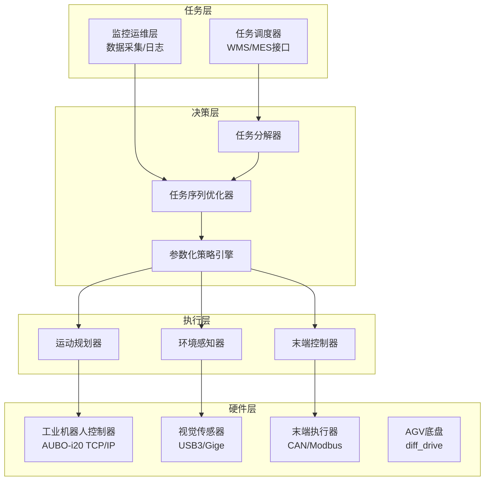
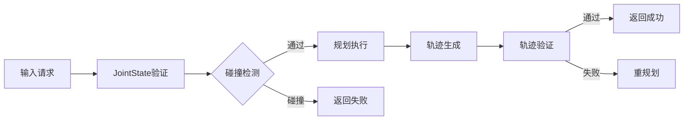
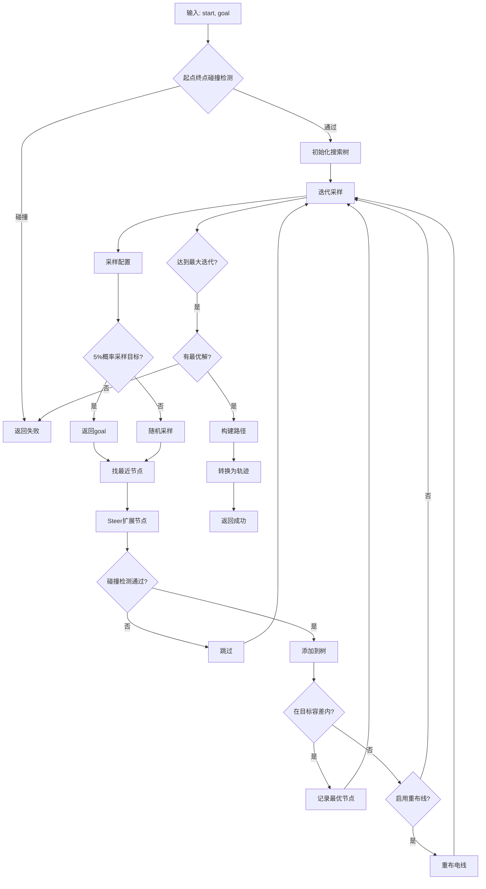
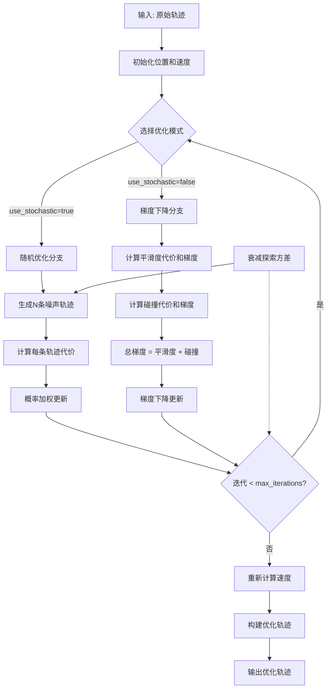
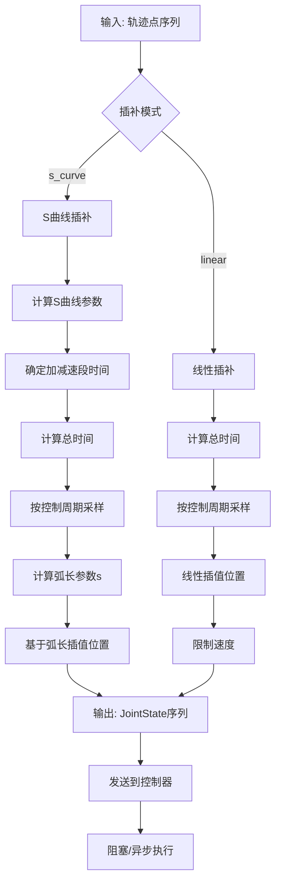
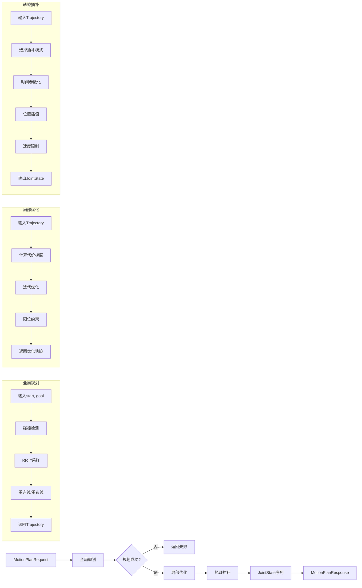
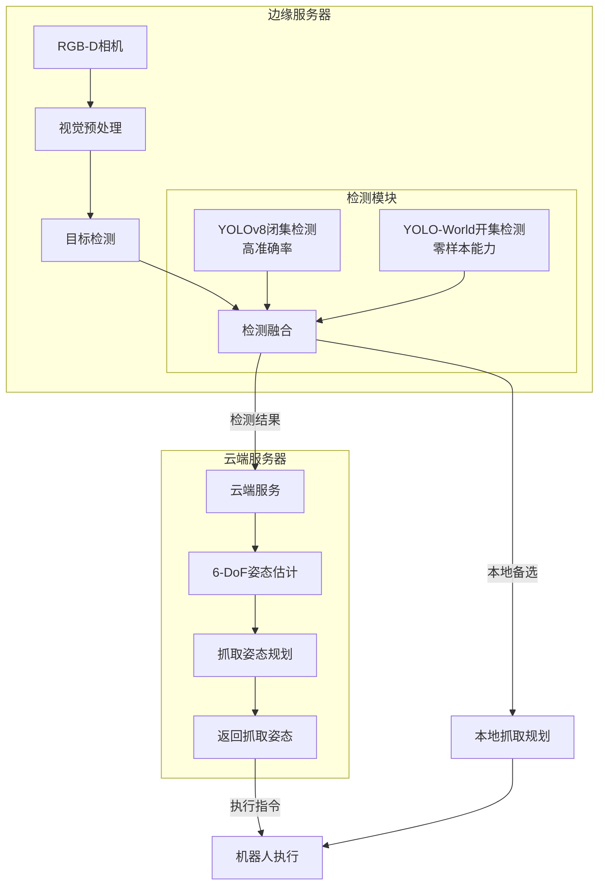
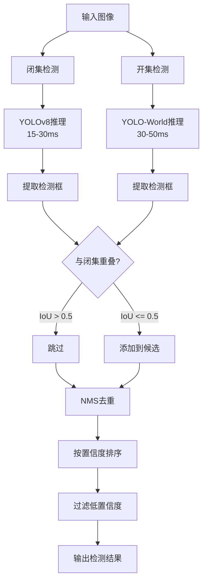
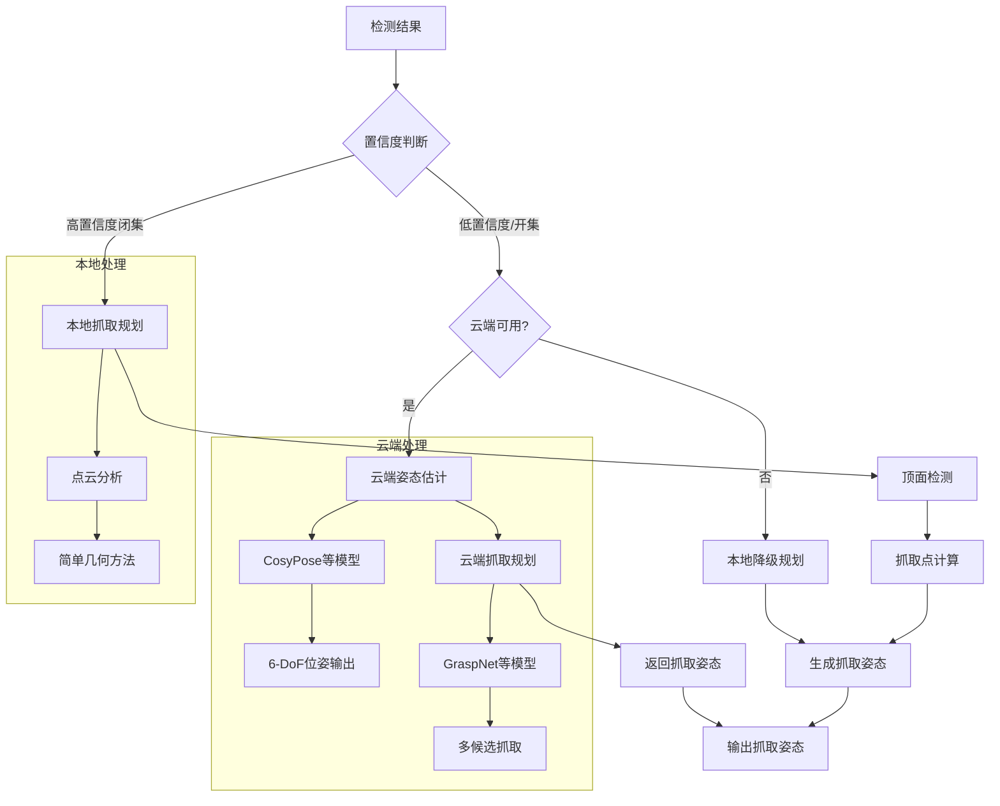
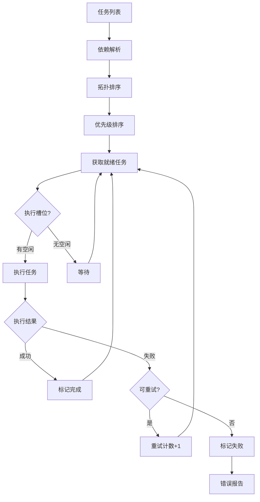

# 物流装卸机器人算法系统设计

> **文档版本**：V2.2  
> **编制日期**：2026年7月21日  
> **上次更新**：2026年8月9日（Phase 2 感知与导航 Task 1-6 完成）  
> **文档类型**：算法技术设计  
> **适用范围**：物流装卸机器人通用算法系统

---

## 目录

1. [系统整体架构](#1-系统整体架构)
2. [运动规划算法系统](#2-运动规划算法系统)
3. [环境感知与决策算法系统](#3-环境感知与决策算法系统)
4. [部署配置与性能指标](#4-部署配置与性能指标)

---

## 1. 系统整体架构

### 1.1 设计理念

本算法系统采用**通用化设计**，不区分集装箱机器人与散货机器人类型，通过统一的算法框架和可配置参数适配不同负载、不同精度要求的作业场景。

**核心设计原则：**
- 统一的数据结构和接口定义
- 基于参数的差异化配置（不写分支代码）
- 模块化架构，支持灵活组合
- 支持从轻载协作机器人到重载工业机器人的全谱系覆盖

### 1.2 系统架构图



### 1.3 模块职责总览

| 模块名称 | 位置 | 功能职责 | 实时性要求 |
|---------|------|---------|-----------|
| **运动规划器** | 边缘 | 全局路径+局部优化+轨迹插补 | <2s规划 |
| **目标检测** | 边缘 | 通用物体检测（闭集+开集） | <50ms |
| **6-DoF姿态估计** | 云端 | 物体精确位姿 | <80ms |
| **抓取姿态规划** | 云端 | 最优抓取计算 | <100ms |
| **任务调度器** | 云端 | 批次优化 | 秒级 |

### 1.4 参数化配置体系

```python
@dataclass
class RobotConfig:
    """机器人通用配置"""
    num_joints: int = 6  # 单臂 6-DOF；双臂装卸机器人含 left+right 共 12 关节 + 2 抱板
    payload_kg: float = 20.0  # AUBO-i20 单臂额定负载 20kg
    position_accuracy_mm: float = 0.05
    repeatability_mm: float = 0.05  # AUBO-i20 重复定位精度 ±0.05mm
    max_velocity_mps: float = 3.0
    max_acceleration_mps2: float = 15.0
    control_frequency_hz: int = 250
    workspace_radius_m: float = 2.0
```

---

## 2. 运动规划算法系统

### 2.1 共用基础层

#### 算法解析

**核心数据结构定义**

共用基础层定义了运动规划所需的核心数据类型，它们是整个算法系统的基石：

| 数据结构 | 用途 | 关键字段 |
|---------|------|---------|
| `JointState` | 表示机器人当前关节状态 | positions, velocities, accelerations, efforts |
| `Pose6D` | 表示末端6自由度位姿 | position (3D), orientation (四元数) |
| `RobotConfig` | 机器人通用配置 | 负载、精度、速度等参数 |
| `JointLimits` | 关节物理限位 | 位置/速度/加速度/力矩上下限 |
| `Trajectory` | 关节空间轨迹 | 轨迹点序列，含时间信息 |
| `PlanningConfig` | 规划算法配置 | 迭代次数、步长、权重等 |
| `CollisionWorld` | 碰撞检测环境 | 障碍物管理、碰撞查询 |

**参数派生机制**

`RobotConfig` 根据负载自动派生关节限位（重载机器人限位更保守）和规划配置（高精度场景用更多迭代）。



```python
# src/motion_planner/common/foundation.py
"""
共用基础层模块
"""

from __future__ import annotations
from dataclasses import dataclass, field
from typing import List, Tuple, Optional, Dict, Any
import numpy as np
from scipy.spatial.transform import Rotation
import time


@dataclass
class JointState:
    """关节状态"""
    positions: np.ndarray
    velocities: np.ndarray
    accelerations: np.ndarray
    efforts: np.ndarray
    timestamp: float = 0.0


@dataclass
class Pose6D:
    """6D位姿"""
    position: np.ndarray
    orientation: np.ndarray  # 四元数 [w, x, y, z]
    
    @classmethod
    def from_matrix(cls, matrix: np.ndarray) -> Pose6D:
        return cls(
            position=matrix[:3, 3],
            orientation=Rotation.from_matrix(matrix[:3, :3]).as_quat()
        )
    
    def to_matrix(self) -> np.ndarray:
        r = Rotation.from_quat(self.orientation)
        matrix = np.eye(4)
        matrix[:3, :3] = r.as_matrix()
        matrix[:3, 3] = self.position
        return matrix


@dataclass
class RobotConfig:
    """机器人通用配置"""
    num_joints: int = 6  # 单臂 6-DOF；双臂装卸机器人含 left+right 共 12 关节 + 2 抱板
    payload_kg: float = 20.0  # AUBO-i20 单臂额定负载 20kg
    position_accuracy_mm: float = 0.05
    repeatability_mm: float = 0.05  # AUBO-i20 重复定位精度 ±0.05mm
    max_velocity_mps: float = 3.0
    max_acceleration_mps2: float = 15.0
    control_frequency_hz: int = 250
    workspace_radius_m: float = 2.0
    
    def get_joint_limits(self) -> JointLimits:
        scale_factor = min(1.0, self.payload_kg / 100.0)
        return JointLimits(
            positions_lower=np.array([-np.pi, -170*np.pi/180, -85*np.pi/180, 
                                    -2*np.pi, -120*np.pi/180, -2*np.pi][:self.num_joints]),
            positions_upper=np.array([np.pi, 170*np.pi/180, 265*np.pi/180,
                                     2*np.pi, 120*np.pi/180, 2*np.pi][:self.num_joints]),
            velocities=np.array([2.5, 2.0, 2.5, 4.0, 4.0, 4.0][:self.num_joints]) * scale_factor,
            accelerations=np.array([15.0, 10.0, 12.0, 20.0, 20.0, 20.0][:self.num_joints]) * scale_factor,
            efforts=np.array([320, 200, 100, 40, 40, 15][:self.num_joints]) * scale_factor
        )


@dataclass
class JointLimits:
    """关节限位"""
    positions_lower: np.ndarray
    positions_upper: np.ndarray
    velocities: np.ndarray
    accelerations: np.ndarray
    efforts: np.ndarray


@dataclass
class TrajectoryPoint:
    """轨迹点"""
    positions: np.ndarray
    velocities: np.ndarray = field(default_factory=lambda: np.array([]))
    accelerations: np.ndarray = field(default_factory=lambda: np.array([]))
    time_from_start: float = 0.0


@dataclass 
class Trajectory:
    """关节空间轨迹"""
    joint_names: List[str]
    points: List[TrajectoryPoint]
    
    @property
    def num_joints(self) -> int:
        return len(self.joint_names)
    
    def get_duration(self) -> float:
        return self.points[-1].time_from_start if self.points else 0.0
    
    def sample(self, time: float) -> Tuple[np.ndarray, np.ndarray, np.ndarray]:
        if not self.points:
            raise ValueError("轨迹为空")
        if time <= self.points[0].time_from_start:
            p = self.points[0]
            return p.positions, p.velocities, p.accelerations
        if time >= self.points[-1].time_from_start:
            p = self.points[-1]
            return p.positions, p.velocities, p.accelerations
        
        for i in range(len(self.points) - 1):
            t0, t1 = self.points[i].time_from_start, self.points[i+1].time_from_start
            if t0 <= time <= t1:
                alpha = (time - t0) / (t1 - t0)
                p0, p1 = self.points[i], self.points[i+1]
                return ((1-alpha)*p0.positions + alpha*p1.positions,
                        (1-alpha)*p0.velocities + alpha*p1.velocities,
                        (1-alpha)*p0.accelerations + alpha*p1.accelerations)
        p = self.points[-1]
        return p.positions, p.velocities, p.accelerations


@dataclass
class PlanningConfig:
    """规划算法配置"""
    max_iterations: int = 7000
    step_size: float = 0.08
    rewire_radius: float = 0.4
    smoothness_weight: float = 0.5
    collision_weight: float = 1.5
    interpolation_mode: str = "s_curve"
    
    @classmethod
    def from_robot_config(cls, robot_config: RobotConfig) -> PlanningConfig:
        if robot_config.position_accuracy_mm < 1.0:
            return cls(max_iterations=10000, step_size=0.05, rewire_radius=0.3,
                      smoothness_weight=0.6, collision_weight=2.0, interpolation_mode="s_curve")
        elif robot_config.max_velocity_mps > 2.0:
            return cls(max_iterations=5000, step_size=0.1, rewire_radius=0.5,
                      smoothness_weight=0.3, collision_weight=1.0, interpolation_mode="linear")
        else:
            return cls(max_iterations=7000, step_size=0.08, rewire_radius=0.4,
                      smoothness_weight=0.5, collision_weight=1.5, interpolation_mode="s_curve")


class CollisionWorld:
    """碰撞检测世界"""
    
    def __init__(self):
        self._obstacles: Dict[str, Any] = {}
    
    def add_box_obstacle(self, name: str, pose: Pose6D, size: Tuple[float, float, float]):
        self._obstacles[name] = {'type': 'box', 'pose': pose, 'size': np.array(size)}
    
    def remove_obstacle(self, name: str):
        self._obstacles.pop(name, None)
    
    def check_collision(self, joint_positions: np.ndarray, 
                       forward_kinematics) -> Tuple[bool, Optional[str]]:
        return False, None


class PlanningPerformanceMonitor:
    """性能监控器"""
    
    def __init__(self, window_size: int = 100):
        self._planning_times: List[float] = []
        self._trajectory_lengths: List[float] = []
        self._window_size = window_size
        self._start_time: Optional[float] = None
    
    def start_timer(self):
        self._start_time = time.perf_counter()
    
    def stop_timer(self) -> float:
        if self._start_time is None:
            return 0.0
        elapsed = time.perf_counter() - self._start_time
        self._planning_times.append(elapsed)
        if len(self._planning_times) > self._window_size:
            self._planning_times.pop(0)
        self._start_time = None
        return elapsed
    
    def record_trajectory_metrics(self, trajectory: Trajectory):
        if not trajectory.points:
            return
        total_length = sum(
            np.linalg.norm(trajectory.points[i+1].positions - trajectory.points[i].positions)
            for i in range(len(trajectory.points) - 1)
        )
        self._trajectory_lengths.append(total_length)
        if len(self._trajectory_lengths) > self._window_size:
            self._trajectory_lengths.pop(0)
    
    @property
    def avg_planning_time(self) -> float:
        return np.mean(self._planning_times) if self._planning_times else 0.0
    
    def get_report(self) -> Dict[str, float]:
        return {
            'avg_planning_time_ms': self.avg_planning_time * 1000,
            'p95_planning_time_ms': np.percentile(self._planning_times, 95) * 1000 if self._planning_times else 0,
            'avg_trajectory_length': np.mean(self._trajectory_lengths) if self._trajectory_lengths else 0
        }
```

---

### 2.2 全局轨迹规划层

#### 算法解析

**RRT* 算法核心原理**

RRT*（Rapidly-exploring Random Tree Star）是一种基于随机采样的最优路径规划算法，是对经典RRT算法的渐进最优改进。

**关键特性：**

| 特性 | 说明 |
|------|------|
| **随机采样** | 在关节空间随机采样新状态，引导搜索 |
| **最近邻搜索** | 找到树中距离采样点最近的节点 |
| **Steer扩展** | 从最近节点向采样点方向扩展固定步长 |
| **重连线** | 为新节点选择最小代价的父节点 |
| **重布线** | 优化树中其他节点的父节点，降低整体代价 |
| **渐进最优** | 迭代次数越多，解越接近最优 |

**核心参数含义：**

| 参数 | 作用 | 高精度建议 | 高速建议 |
|------|------|----------|---------|
| `max_iterations` | 最大迭代次数 | 10000 | 5000 |
| `step_size` | 每次扩展步长 | 0.05 (小步长) | 0.1 (大步长) |
| `rewire_radius` | 重布线的邻居范围 | 0.3 (紧密) | 0.5 (宽松) |

**算法优势：**
- 不需要对空间进行离散化，直接在连续空间搜索
- 对高维空间（多关节机器人）效果好
- 只需碰撞检测函数，通用性强
- 渐进最优保证长期运行解质量提升



```python
# src/motion_planner/global_planner/planner.py
"""
全局轨迹规划器
基于采样的通用规划算法（RRT*）
"""

from __future__ import annotations
from dataclasses import dataclass
from typing import List, Tuple, Optional
import numpy as np
import random
import time

from ..common.foundation import (
    JointLimits, Trajectory, TrajectoryPoint, 
    KinematicsBase, CollisionWorld, PlanningConfig
)


@dataclass
class PlanningResult:
    """规划结果"""
    success: bool
    trajectory: Optional[Trajectory]
    planning_time: float
    nodes_visited: int
    message: str = ""


class TreeNode:
    """搜索树节点"""
    __slots__ = ['state', 'parent', 'cost']
    
    def __init__(self, state: np.ndarray, parent: Optional['TreeNode'] = None, cost: float = 0.0):
        self.state = state
        self.parent = parent
        self.cost = cost
    
    def get_path(self) -> List[np.ndarray]:
        path = []
        node = self
        while node is not None:
            path.append(node.state)
            node = node.parent
        return list(reversed(path))


class SamplingBasedPlanner:
    """
    基于采样的通用规划器
    
    算法流程：
    1. 初始化：从起点创建根节点
    2. 迭代采样：
       - 5%概率采样目标，其余随机
       - 找最近节点
       - Steer扩展（检查碰撞）
       - 重连线优化邻居
       - 重布线优化树结构
    3. 终止：达到目标容差或最大迭代
    4. 输出：最优路径转换为轨迹
    """
    
    def __init__(self, 
                 joint_limits: JointLimits,
                 collision_world: CollisionWorld,
                 kinematics: KinematicsBase,
                 config: Optional[PlanningConfig] = None):
        self.joint_limits = joint_limits
        self.collision_world = collision_world
        self.kinematics = kinematics
        self.config = config or PlanningConfig()
        self.num_joints = len(joint_limits.positions_lower)
    
    def sample_configuration(self, goal: Optional[np.ndarray] = None) -> np.ndarray:
        if goal is not None and random.random() < 0.05:
            return goal.copy()
        return np.random.uniform(
            self.joint_limits.positions_lower,
            self.joint_limits.positions_upper
        )
    
    def distance(self, q1: np.ndarray, q2: np.ndarray) -> float:
        return np.linalg.norm(q1 - q2)
    
    def check_limits(self, q: np.ndarray) -> bool:
        return np.all(q >= self.joint_limits.positions_lower) and \
               np.all(q <= self.joint_limits.positions_upper)
    
    def check_collision(self, q: np.ndarray) -> bool:
        is_collision, _ = self.collision_world.check_collision(q, self.kinematics.forward)
        return is_collision
    
    def _steer(self, from_node: TreeNode, to_point: np.ndarray) -> Tuple[Optional[TreeNode], float]:
        """Steer: 从from_node向目标点扩展一步"""
        direction = to_point - from_node.state
        dist = np.linalg.norm(direction)
        
        if dist < 1e-6:
            return None, 0.0
        
        direction = direction / dist
        step = min(self.config.step_size, dist)
        new_state = from_node.state + direction * step
        
        if not self.check_limits(new_state) or self.check_collision(new_state):
            return None, 0.0
        
        new_node = TreeNode(
            state=new_state,
            parent=from_node,
            cost=from_node.cost + step
        )
        return new_node, step
    
    def _get_nearby_nodes(self, nodes: List[TreeNode], state: np.ndarray) -> List[Tuple[TreeNode, float]]:
        """获取附近节点用于重连线"""
        nearby = []
        for node in nodes:
            dist = self.distance(node.state, state)
            if dist < self.config.rewire_radius:
                nearby.append((node, dist))
        return nearby
    
    def _check_segment_collision(self, q1: np.ndarray, q2: np.ndarray) -> bool:
        """检查线段碰撞"""
        steps = max(int(np.linalg.norm(q2 - q1) / (self.config.step_size / 2)), 2)
        for i in range(steps):
            alpha = i / (steps - 1)
            q = q1 + alpha * (q2 - q1)
            if self.check_collision(q):
                return True
        return False
    
    def plan(self, start: np.ndarray, goal: np.ndarray) -> PlanningResult:
        """执行RRT*规划"""
        start_time = time.perf_counter()
        
        if self.check_collision(start) or self.check_collision(goal):
            return PlanningResult(
                success=False, trajectory=None,
                planning_time=time.perf_counter() - start_time,
                nodes_visited=0, message="起点或终点碰撞"
            )
        
        goal_tolerance = 0.05
        best_goal_node: Optional[TreeNode] = None
        
        root = TreeNode(state=start, cost=0.0)
        nodes = [root]
        
        for iteration in range(self.config.max_iterations):
            bias_toward_goal = min(0.5, iteration / self.config.max_iterations * 0.3)
            if random.random() < bias_toward_goal and best_goal_node is not None:
                sample = self._sample_near_goal(goal, radius=0.5)
            else:
                sample = self.sample_configuration(goal)
            
            nearest = min(nodes, key=lambda n: self.distance(n.state, sample))
            
            new_node, _ = self._steer(nearest, sample)
            if new_node is None:
                continue
            
            nearby = self._get_nearby_nodes(nodes, new_node.state)
            for nearby_node, dist in nearby:
                new_cost = nearby_node.cost + dist
                if new_cost < new_node.cost:
                    if not self._check_segment_collision(nearby_node.state, new_node.state):
                        new_node.parent = nearby_node
                        new_node.cost = new_cost
            
            nodes.append(new_node)
            
            for nearby_node, dist in nearby:
                new_cost = new_node.cost + dist
                if new_cost < nearby_node.cost:
                    if not self._check_segment_collision(new_node.state, nearby_node.state):
                        nearby_node.parent = new_node
                        nearby_node.cost = new_cost
            
            if self.distance(new_node.state, goal) < goal_tolerance:
                if best_goal_node is None or new_node.cost < best_goal_node.cost:
                    best_goal_node = new_node
        
        if best_goal_node is None:
            return PlanningResult(
                success=False, trajectory=None,
                planning_time=time.perf_counter() - start_time,
                nodes_visited=len(nodes), message="未找到可行路径"
            )
        
        trajectory = self._path_to_trajectory(best_goal_node.get_path())
        return PlanningResult(
            success=True, trajectory=trajectory,
            planning_time=time.perf_counter() - start_time,
            nodes_visited=len(nodes), message="规划成功"
        )
    
    def _sample_near_goal(self, goal: np.ndarray, radius: float) -> np.ndarray:
        sample = goal + np.random.uniform(-radius, radius, len(goal))
        return np.clip(sample, self.joint_limits.positions_lower, 
                      self.joint_limits.positions_upper)
    
    def _path_to_trajectory(self, path: List[np.ndarray]) -> Trajectory:
        points = []
        cumulative_time = 0.0
        
        for i, state in enumerate(path):
            velocities = np.zeros(len(state)) if i == 0 else (state - path[i-1]) / 0.1
            points.append(TrajectoryPoint(
                positions=state.copy(),
                velocities=velocities,
                accelerations=np.zeros(len(state)),
                time_from_start=cumulative_time
            ))
            cumulative_time += 0.1
        
        joint_names = [f"joint_{i}" for i in range(len(path[0]))]
        return Trajectory(joint_names=joint_names, points=points)
```

---

### 2.3 局部轨迹优化层

#### 算法解析

**轨迹优化核心原理**

轨迹优化在RRT*生成的粗略路径基础上，通过迭代优化获得更平滑、无碰撞的优质轨迹。

**两种优化策略对比：**

| 策略 | 适用场景 | 特点 | 代价函数权重 |
|------|---------|------|------------|
| **梯度下降** | 高精度要求 | 稳定收敛，适合窄通道 | 平滑度权重高 |
| **随机优化** | 高速要求 | 探索能力强，适合开阔空间 | 碰撞权重高 |

**代价函数设计：**

```
Total_Cost = smoothness_weight × Smoothness + collision_weight × Collision + 10 × Limit_Violation
```

| 代价项 | 计算方式 | 物理意义 |
|--------|---------|---------|
| **平滑度** | 加速度范数的平方积分 | 轨迹是否平滑、电机冲击小 |
| **碰撞** | 碰撞检测结果累加 | 远离障碍物 |
| **限位违背** | 接近限位的程度 | 关节不超限 |

**优化流程：**

1. **初始化**：加载RRT*轨迹的位置和速度
2. **迭代优化**：
   - 计算各代价项及其梯度
   - 更新位置/速度
   - 衰减探索方差（随机优化）
3. **约束满足**：强制执行关节限位
4. **输出**：优化后的平滑轨迹



```python
# src/motion_planner/local_optimizer/optimizer.py
"""
局部轨迹优化器
通用轨迹优化算法（梯度下降+随机优化混合）
"""

from __future__ import annotations
from dataclasses import dataclass
from typing import Tuple, Optional
import numpy as np
from scipy.ndimage import gaussian_filter1d

from ..common.foundation import (
    Trajectory, TrajectoryPoint, JointLimits, 
    CollisionWorld, KinematicsBase, PlanningConfig
)


@dataclass
class OptimizationConfig:
    """优化配置"""
    max_iterations: int = 100
    learning_rate: float = 0.01
    smoothness_weight: float = 0.5
    collision_weight: float = 1.5
    use_stochastic: bool = False
    num_trajectories: int = 10
    exploration_variance: float = 1.0


class TrajectoryOptimizer:
    """
    通用轨迹优化器
    
    优化策略：
    1. 梯度下降：适合高精度场景，稳定收敛
    2. 随机优化：适合高速场景，探索能力强
    
    代价函数：
    - 平滑度代价：基于加速度范数
    - 碰撞代价：基于碰撞检测结果
    - 限位代价：惩罚接近限位的关节
    """
    
    def __init__(self, 
                 trajectory: Trajectory,
                 joint_limits: JointLimits,
                 collision_world: CollisionWorld,
                 kinematics: KinematicsBase,
                 config: Optional[OptimizationConfig] = None):
        self.trajectory = trajectory
        self.joint_limits = joint_limits
        self.collision_world = collision_world
        self.kinematics = kinematics
        self.config = config or OptimizationConfig()
    
    @classmethod
    def from_planning_config(cls, trajectory: Trajectory,
                           joint_limits: JointLimits,
                           collision_world: CollisionWorld,
                           kinematics: KinematicsBase,
                           planning_config: PlanningConfig) -> 'TrajectoryOptimizer':
        use_stochastic = planning_config.smoothness_weight < planning_config.collision_weight
        
        return cls(
            trajectory=trajectory,
            joint_limits=joint_limits,
            collision_world=collision_world,
            kinematics=kinematics,
            config=OptimizationConfig(
                smoothness_weight=planning_config.smoothness_weight,
                collision_weight=planning_config.collision_weight,
                use_stochastic=use_stochastic,
                num_trajectories=15 if use_stochastic else 10,
                exploration_variance=1.5 if use_stochastic else 1.0
            )
        )
    
    def _calculate_smoothness_cost(self, positions: np.ndarray) -> Tuple[float, np.ndarray]:
        """计算平滑度代价及其梯度"""
        n = len(positions)
        if n < 3:
            return 0.0, np.zeros_like(positions)
        
        accelerations = positions[2:] - 2 * positions[1:-1] + positions[:-2]
        cost = 0.5 * np.sum(accelerations ** 2)
        
        gradient = np.zeros_like(positions)
        gradient[1:-1] = -2 * accelerations + 2 * np.roll(accelerations, 1)[:-2]
        gradient[1:-1] = np.clip(gradient[1:-1], -1, 1)
        
        return cost, gradient * self.config.smoothness_weight
    
    def _calculate_collision_cost(self, positions: np.ndarray) -> Tuple[float, np.ndarray]:
        """计算碰撞代价"""
        total_cost = 0.0
        gradient = np.zeros_like(positions)
        
        collision_padding = 0.01
        
        for i, pos in enumerate(positions):
            is_collision, _ = self.collision_world.check_collision(
                pos, self.kinematics.forward
            )
            if is_collision:
                total_cost += collision_padding ** 2
        
        return total_cost * self.config.collision_weight, gradient
    
    def _enforce_limits(self, positions: np.ndarray) -> np.ndarray:
        """强制执行关节限位"""
        return np.clip(
            positions,
            self.joint_limits.positions_lower,
            self.joint_limits.positions_upper
        )
    
    def _compute_cost(self, positions: np.ndarray) -> float:
        """计算总代价"""
        smoothness_cost, _ = self._calculate_smoothness_cost(positions)
        collision_cost, _ = self._calculate_collision_cost(positions)
        
        limit_cost = 0.0
        near_limit = 0.1
        for pos in positions:
            lower_diff = self.joint_limits.positions_lower - pos
            upper_diff = pos - self.joint_limits.positions_upper
            violation = np.maximum(0, -near_limit - lower_diff) + \
                       np.maximum(0, -near_limit - upper_diff)
            limit_cost += np.sum(violation ** 2)
        
        return smoothness_cost * self.config.smoothness_weight + \
               collision_cost * self.config.collision_weight + \
               limit_cost * 10.0
    
    def _gradient_descent_step(self, positions: np.ndarray, 
                               velocities: np.ndarray) -> Tuple[np.ndarray, np.ndarray]:
        """梯度下降优化步骤"""
        smoothness_cost, smoothness_grad = self._calculate_smoothness_cost(positions)
        collision_cost, collision_grad = self._calculate_collision_cost(positions)
        
        total_grad = (
            self.config.smoothness_weight * smoothness_grad +
            self.config.collision_weight * collision_grad
        )
        
        velocities = velocities - self.config.learning_rate * total_grad
        positions = positions + 0.1 * velocities
        positions = self._enforce_limits(positions)
        
        return positions, velocities
    
    def _stochastic_optimization_step(self, base_positions: np.ndarray) -> np.ndarray:
        """随机优化步骤"""
        updated = np.zeros_like(base_positions)
        
        for _ in range(self.config.num_trajectories):
            noise = np.random.normal(0, self.config.exploration_variance, base_positions.shape)
            noise_smoothed = gaussian_filter1d(noise, sigma=2, axis=0)
            noisy_trajectory = base_positions + noise_smoothed
            noisy_trajectory = self._enforce_limits(noisy_trajectory)
            
            cost = self._compute_cost(noisy_trajectory)
            weight = np.exp(-cost * 10)
            updated += weight * noisy_trajectory
        
        updated = updated / self.config.num_trajectories
        return self._enforce_limits(updated)
    
    def optimize(self) -> Trajectory:
        """执行优化"""
        positions = np.array([p.positions for p in self.trajectory.points])
        velocities = np.array([
            p.velocities if len(p.velocities) > 0 else np.zeros(len(positions[0]))
            for p in self.trajectory.points
        ])
        
        n_joints = len(positions[0])
        
        for iteration in range(self.config.max_iterations):
            if self.config.use_stochastic:
                positions = self._stochastic_optimization_step(positions)
            else:
                positions, velocities = self._gradient_descent_step(positions, velocities)
            
            self.config.exploration_variance *= 0.98
        
        velocities = np.gradient(positions, axis=0, edge_order=2)
        
        points = []
        for i, pos in enumerate(positions):
            t = i * 0.1
            vel = velocities[i] if i < len(velocities) else np.zeros(n_joints)
            points.append(TrajectoryPoint(
                positions=pos,
                velocities=vel,
                accelerations=np.zeros(n_joints),
                time_from_start=t
            ))
        
        return Trajectory(
            joint_names=self.trajectory.joint_names,
            points=points
        )
```

---

### 2.4 轨迹插补与下发层

#### 算法解析

**轨迹插补核心原理**

轨迹插补将离散的轨迹点转换为控制器所需的高频率关节状态命令。

**两种插补模式对比：**

| 模式 | 适用场景 | 速度曲线 | 控制频率 |
|------|---------|---------|---------|
| **S曲线** | 高精度要求 | 加减速平滑，无冲击 | 125Hz |
| **线性插补** | 高速要求 | 恒定速度，直线轨迹 | 250Hz |

**S曲线时间参数化：**

```
T_total = T_accel + T_constant + T_decel

位置曲线：
- 加速段 (0 → T_accel): s = 0.5 × (t/T_accel)²
- 匀速段: s = 0.5 + 0.5 × (t-T_accel)/T_constant  
- 减速段: s = 1 - 0.5 × ((T_total-t)/T_decel)²
```

**弧长参数化插值：**

1. 计算相邻路点间的欧氏距离
2. 累积得到总弧长
3. 目标弧长 = s × 总弧长
4. 二分搜索确定所在段
5. 线性插值计算精确位置

**控制器下发：**



```python
# src/motion_planner/interpolation/interpolator.py
"""
轨迹插补与下发模块
通用插补算法，支持S曲线和线性插补
"""

from __future__ import annotations
from dataclasses import dataclass
from typing import List, Optional
import numpy as np
import time

from ..common.foundation import Trajectory, TrajectoryPoint, JointLimits, JointState


@dataclass
class InterpolationConfig:
    """插补配置"""
    control_frequency: int = 250
    max_velocity_scale: float = 1.0
    max_acceleration_scale: float = 1.0
    mode: str = "s_curve"


class TrajectoryInterpolator:
    """
    通用轨迹插补器
    
    S曲线插补流程：
    1. 计算加速度限制、速度限制
    2. 确定加速段时间、匀速段时间、减速段时间
    3. 按控制频率采样
    4. 计算归一化弧长参数s
    5. 基于弧长插值关节位置
    
    线性插补流程：
    1. 计算总时间
    2. 按控制频率采样
    3. 线性插值关节位置
    4. 应用速度限制
    """
    
    def __init__(self, 
                 joint_limits: JointLimits,
                 config: Optional[InterpolationConfig] = None):
        self.joint_limits = joint_limits
        self.config = config or InterpolationConfig()
    
    def interpolate(self, trajectory: Trajectory) -> List[JointState]:
        if self.config.mode == "linear":
            return self._interpolate_linear(trajectory)
        else:
            return self._interpolate_s_curve(trajectory)
    
    def _interpolate_linear(self, trajectory: Trajectory) -> List[JointState]:
        """线性插补"""
        if not trajectory.points or len(trajectory.points) < 2:
            return []
        
        dt = 1.0 / self.config.control_frequency
        joint_states = []
        
        start_point = trajectory.points[0]
        end_point = trajectory.points[-1]
        total_duration = end_point.time_from_start
        
        num_steps = int(total_duration / dt) + 1
        
        for i in range(num_steps):
            t = min(i * dt, total_duration)
            alpha = t / total_duration if total_duration > 0 else 0
            
            positions = (1 - alpha) * start_point.positions + alpha * end_point.positions
            
            if i == 0:
                velocities = np.zeros(len(positions))
            else:
                velocities = (positions - joint_states[-1].positions) / dt
            
            velocities = self._limit_velocities(velocities, positions)
            
            joint_states.append(JointState(
                positions=positions,
                velocities=velocities,
                accelerations=np.zeros(len(positions)),
                timestamp=t
            ))
        
        return joint_states
    
    def _interpolate_s_curve(self, trajectory: Trajectory) -> List[JointState]:
        """S曲线插补"""
        if not trajectory.points or len(trajectory.points) < 2:
            return []
        
        waypoints = np.array([p.positions for p in trajectory.points])
        
        v_max = self.joint_limits.velocities * self.config.max_velocity_scale
        a_max = self.joint_limits.accelerations * self.config.max_acceleration_scale
        
        segment_lengths = np.array([
            np.linalg.norm(waypoints[i+1] - waypoints[i])
            for i in range(len(waypoints) - 1)
        ])
        total_length = np.sum(segment_lengths)
        
        v_avg = total_length / 10.0
        t_accel = v_avg / max(np.max(a_max), 0.1)
        t_decel = v_avg / max(np.max(a_max), 0.1)
        t_constant = max(0, (total_length - v_avg * (t_accel + t_decel)) / v_avg)
        total_duration = t_accel + t_constant + t_decel
        
        dt = 1.0 / self.config.control_frequency
        joint_states = []
        t = 0.0
        
        while t <= total_duration + 1e-6:
            s = self._evaluate_s_curve(t, t_accel, t_constant, t_decel, total_duration)
            positions = self._interpolate_by_arc_length(waypoints, s)
            
            joint_states.append(JointState(
                positions=positions,
                velocities=np.zeros(len(positions)),
                accelerations=np.zeros(len(positions)),
                timestamp=t
            ))
            
            t += dt
        
        return joint_states
    
    def _evaluate_s_curve(self, t: float, t_a: float, t_c: float, 
                         t_d: float, T: float) -> float:
        """评估S曲线位置（归一化0-1）"""
        if t <= 0:
            return 0.0
        elif t <= t_a:
            ratio = t / max(t_a, 0.001)
            return 0.5 * ratio * ratio
        elif t <= t_a + t_c:
            ratio = (t - t_a) / max(t_c, 0.001)
            return 0.5 + 0.5 * ratio
        elif t <= T:
            ratio = (t - t_a - t_c) / max(t_d, 0.001)
            return 1.0 - 0.5 * (1.0 - ratio) * (1.0 - ratio)
        else:
            return 1.0
    
    def _interpolate_by_arc_length(self, waypoints: np.ndarray, 
                                  s: float) -> np.ndarray:
        """基于弧长参数s插值位置"""
        n_segments = len(waypoints) - 1
        if n_segments == 0:
            return waypoints[0]
        
        segment_lengths = np.array([
            np.linalg.norm(waypoints[i+1] - waypoints[i])
            for i in range(n_segments)
        ])
        cumulative_lengths = np.cumsum(segment_lengths)
        total_length = cumulative_lengths[-1]
        
        if total_length < 1e-6:
            return waypoints[0]
        
        target_length = s * total_length
        segment_idx = np.searchsorted(cumulative_lengths, target_length)
        segment_idx = min(segment_idx, n_segments - 1)
        
        start_length = cumulative_lengths[segment_idx - 1] if segment_idx > 0 else 0
        local_s = (target_length - start_length) / max(segment_lengths[segment_idx], 1e-6)
        
        return (1 - local_s) * waypoints[segment_idx] + local_s * waypoints[segment_idx + 1]
    
    def _limit_velocities(self, velocities: np.ndarray, 
                         positions: np.ndarray) -> np.ndarray:
        v_max = self.joint_limits.velocities * self.config.max_velocity_scale
        return np.clip(velocities, -v_max, v_max)


class RobotControllerInterface:
    """机器人控制器接口"""
    
    def __init__(self, connection_type: str = "ethercat"):
        self.connection_type = connection_type
        self._connected = False
        self._command_buffer: List[JointState] = []
    
    def connect(self, ip: str, port: int = 5000) -> bool:
        print(f"Connecting to robot controller at {ip}:{port}")
        self._connected = True
        return True
    
    def disconnect(self):
        self._connected = False
    
    def send_trajectory(self, joint_states: List[JointState], 
                       blocking: bool = True) -> bool:
        if not self._connected:
            raise RuntimeError("Not connected to robot controller")
        
        self._command_buffer = joint_states
        
        if blocking:
            return self._execute_trajectory_blocking(joint_states)
        return True
    
    def _execute_trajectory_blocking(self, joint_states: List[JointState]) -> bool:
        for state in joint_states:
            self._send_joint_command(state)
            time.sleep(1.0 / 125)
        return True
    
    def _send_joint_command(self, state: JointState):
        pass
    
    def get_current_state(self) -> JointState:
        return JointState(
            positions=np.zeros(6),
            velocities=np.zeros(6),
            accelerations=np.zeros(6),
            efforts=np.zeros(6),
            timestamp=time.time()
        )
    
    def emergency_stop(self):
        print("Emergency stop triggered!")
        self._command_buffer.clear()
```

---

### 2.5 运动规划器集成

#### 算法解析

**完整规划流程**

运动规划器将三个子模块串联成完整流水线：

```
MotionPlanRequest → 全局规划 → 局部优化 → 轨迹插补 → MotionPlanResponse
```

| 阶段 | 输入 | 输出 | 耗时占比 |
|------|------|------|---------|
| 全局规划 | start, goal | 粗略轨迹 | 80-90% |
| 局部优化 | 粗略轨迹 | 平滑轨迹 | 10-20% |
| 轨迹插补 | 平滑轨迹 | JointState序列 | <1% |

**参数派生链：**

```
RobotConfig → PlanningConfig → [SamplingBasedPlanner, TrajectoryOptimizer, TrajectoryInterpolator]
```

不同机器人配置自动适配不同算法参数：

| 场景 | RobotConfig | PlanningConfig | 插补模式 |
|------|------------|----------------|---------|
| 高精度 | accuracy<1mm | 10000次迭代, 0.05步长 | S曲线 |
| 高速 | velocity>2m/s | 5000次迭代, 0.1步长 | 线性 |
| 默认 | 其他 | 7000次迭代, 0.08步长 | S曲线 |



```python
# src/motion_planner/motion_planner.py
"""
运动规划器主模块
整合全局规划、局部优化、轨迹插补
"""

from __future__ import annotations
from dataclasses import dataclass
from typing import Optional, List
import numpy as np

from .common.foundation import (
    JointState, Pose6D, JointLimits, Trajectory,
    CollisionWorld, KinematicsBase, RobotConfig, 
    PlanningConfig, PlanningPerformanceMonitor
)
from .global_planner.planner import SamplingBasedPlanner, PlanningResult
from .local_optimizer.optimizer import TrajectoryOptimizer, OptimizationConfig
from .interpolation.interpolator import (
    TrajectoryInterpolator, RobotControllerInterface, InterpolationConfig
)


@dataclass
class MotionPlanRequest:
    """运动规划请求"""
    start_joints: np.ndarray
    goal_joints: np.ndarray
    robot_config: RobotConfig


@dataclass
class MotionPlanResponse:
    """运动规划响应"""
    success: bool
    trajectory: Optional[Trajectory]
    joint_states: Optional[List[JointState]]
    planning_time: float
    message: str


class MotionPlanner:
    """
    通用运动规划器
    
    完整流程：
    1. 初始化: 根据RobotConfig生成PlanningConfig
    2. 全局规划: RRT*采样规划
    3. 局部优化: 梯度下降/随机优化
    4. 轨迹插补: S曲线/线性插补
    5. 返回结果: Trajectory + JointState序列
    """
    
    def __init__(self,
                 robot_config: RobotConfig,
                 collision_world: CollisionWorld,
                 kinematics: KinematicsBase,
                 controller: Optional[RobotControllerInterface] = None):
        self.robot_config = robot_config
        self.collision_world = collision_world
        self.kinematics = kinematics
        self.controller = controller
        
        self.joint_limits = robot_config.get_joint_limits()
        self.planning_config = PlanningConfig.from_robot_config(robot_config)
        
        self._init_planner()
        self._init_interpolator()
        
        self.performance_monitor = PlanningPerformanceMonitor()
    
    def _init_planner(self):
        self.global_planner = SamplingBasedPlanner(
            joint_limits=self.joint_limits,
            collision_world=self.collision_world,
            kinematics=self.kinematics,
            config=self.planning_config
        )
    
    def _init_interpolator(self):
        self.interpolator = TrajectoryInterpolator(
            joint_limits=self.joint_limits,
            config=InterpolationConfig(
                control_frequency=self.planning_config.interpolation_mode == "s_curve" and 125 or 250,
                mode=self.planning_config.interpolation_mode
            )
        )
    
    def plan(self, request: MotionPlanRequest) -> MotionPlanResponse:
        """执行完整运动规划"""
        import time
        total_start = time.perf_counter()
        
        self.performance_monitor.start_timer()
        global_result: PlanningResult = self.global_planner.plan(
            start=request.start_joints,
            goal=request.goal_joints
        )
        global_time = self.performance_monitor.stop_timer()
        
        if not global_result.success:
            return MotionPlanResponse(
                success=False, trajectory=None, joint_states=None,
                planning_time=time.perf_counter() - total_start,
                message=f"全局规划失败: {global_result.message}"
            )
        
        self.performance_monitor.start_timer()
        self.local_optimizer = TrajectoryOptimizer.from_planning_config(
            trajectory=global_result.trajectory,
            joint_limits=self.joint_limits,
            collision_world=self.collision_world,
            kinematics=self.kinematics,
            planning_config=self.planning_config
        )
        optimized_trajectory = self.local_optimizer.optimize()
        optimize_time = self.performance_monitor.stop_timer()
        
        self.performance_monitor.record_trajectory_metrics(optimized_trajectory)
        
        joint_states = self.interpolator.interpolate(optimized_trajectory)
        
        total_time = time.perf_counter() - total_start
        
        return MotionPlanResponse(
            success=True,
            trajectory=optimized_trajectory,
            joint_states=joint_states,
            planning_time=total_time,
            message=f"规划成功 (全局:{global_time*1000:.1f}ms + 优化:{optimize_time*1000:.1f}ms)"
        )
    
    def get_performance_report(self) -> dict:
        return self.performance_monitor.get_report()
```

---

## 3. 环境感知与决策算法系统

### 3.1 云边协同架构



---

### 3.2 视觉数据预处理

#### 算法解析

**深度图处理流程**

深度图预处理影响后续点云质量和检测精度：

| 步骤 | 目的 | 方法 | 耗时 |
|------|------|------|------|
| 深度缩放 | 像素值→米 | 除以scale (通常1000) | <1ms |
| 无效值过滤 | 去除无效像素 | 阈值过滤、NaN处理 | <1ms |
| 双边滤波 | 保边去噪 | bilateral_filter | 3-5ms |

**点云生成原理**

从深度图到3D点云的转换（针孔相机模型）：

```
像素坐标 (u, v) → 归一化坐标 → 相机坐标 → 世界坐标

x_cam = (u - cx) × depth / fx
y_cam = (v - cy) × depth / fy  
z_cam = depth

[x_w, y_w, z_w, 1]ᵀ = extrinsic × [x_cam, y_cam, z_cam, 1]ᵀ
```

**点云滤波方法：**

| 方法 | 作用 | 参数 |
|------|------|------|
| 体素降采样 | 减少点数量，加速处理 | leaf_size (默认5mm) |
| 离群点移除 | 去除噪声点 | k近邻数、阈值倍数 |


```python
# src/perception/preprocessing/preprocessing.py
"""
视觉数据预处理模块
"""

from __future__ import annotations
from dataclasses import dataclass
from typing import Tuple, Optional
import numpy as np
from scipy.ndimage import bilateral_filter


@dataclass
class RGBDFrame:
    """RGB-D图像帧"""
    rgb: np.ndarray
    depth: np.ndarray
    intrinsic: np.ndarray
    extrinsic: np.ndarray
    timestamp: float


@dataclass
class PointCloud:
    """点云数据"""
    points: np.ndarray
    colors: Optional[np.ndarray]
    timestamp: float


@dataclass
class PreprocessingConfig:
    """预处理配置"""
    depth_scale: float = 1000.0
    depth_min: float = 0.1
    depth_max: float = 10.0
    bilateral_sigma_depth: float = 10.0
    bilateral_sigma_space: float = 10.0
    voxel_leaf_size: float = 0.005


class RGBDPreprocessor:
    """
    RGB-D图像预处理器
    
    处理流程：
    1. 深度值缩放（像素值 -> 米）
    2. 无效值过滤（0、过大值、NaN）
    3. 双边滤波（保边去噪）
    """
    
    def __init__(self, config: Optional[PreprocessingConfig] = None):
        self.config = config or PreprocessingConfig()
    
    def process_depth(self, depth: np.ndarray) -> np.ndarray:
        """深度图处理"""
        depth_m = depth.astype(np.float32) / self.config.depth_scale
        
        depth_m[depth_m <= 0] = 0
        depth_m[depth_m > self.config.depth_max] = 0
        depth_m = np.nan_to_num(depth_m, nan=0.0)
        
        if self.config.bilateral_sigma_depth > 0:
            depth_m = bilateral_filter(
                depth_m.astype(np.float64),
                sigma_depth=self.config.bilateral_sigma_depth,
                sigma_spatial=self.config.bilateral_sigma_space
            ).astype(np.float32)
        
        return depth_m


class PointCloudProcessor:
    """
    点云处理器
    
    处理流程：
    1. 深度图反投影到3D点云
    2. 坐标变换（相机 -> 世界）
    3. 体素降采样
    4. 离群点移除
    """
    
    def __init__(self, config: Optional[PreprocessingConfig] = None):
        self.config = config or PreprocessingConfig()
    
    def depth_to_pointcloud(self, 
                           frame: RGBDFrame,
                           mask: Optional[np.ndarray] = None) -> PointCloud:
        """从深度图生成点云"""
        depth = frame.depth.copy()
        rgb = frame.rgb
        h, w = depth.shape
        
        u_coords, v_coords = np.meshgrid(np.arange(w), np.arange(h))
        
        valid = mask > 0 if mask is not None else depth > 0
        u_valid = u_coords[valid]
        v_valid = v_coords[valid]
        z_valid = depth[valid]
        
        fx, fy = frame.intrinsic[0, 0], frame.intrinsic[1, 1]
        cx, cy = frame.intrinsic[0, 2], frame.intrinsic[1, 2]
        
        x_cam = (u_valid - cx) * z_valid / fx
        y_cam = (v_valid - cy) * z_valid / fy
        
        points_cam = np.stack([x_cam, y_cam, z_valid], axis=1)
        points_world = self._transform_points(points_cam, frame.extrinsic)
        
        colors = None
        if rgb is not None:
            r, g, b = rgb[valid, 0], rgb[valid, 1], rgb[valid, 2]
            colors = np.stack([r, g, b], axis=1).astype(np.uint8)
        
        return PointCloud(
            points=points_world.astype(np.float32),
            colors=colors,
            timestamp=frame.timestamp
        )
    
    def _transform_points(self, points: np.ndarray, transform: np.ndarray) -> np.ndarray:
        n = len(points)
        points_h = np.concatenate([points, np.ones((n, 1))], axis=1)
        return (transform @ points_h.T).T[:, :3]
    
    def downsample_voxel(self, cloud: PointCloud) -> PointCloud:
        """体素降采样"""
        if len(cloud.points) == 0:
            return cloud
        
        leaf_size = self.config.voxel_leaf_size
        voxel_indices = np.floor(cloud.points / leaf_size).astype(np.int32)
        unique_voxels, inverse_indices = np.unique(voxel_indices, axis=0, return_inverse=True)
        
        n_voxels = len(unique_voxels)
        downsampled_points = np.zeros((n_voxels, 3), dtype=np.float32)
        downsampled_colors = np.zeros((n_voxels, 3), dtype=np.uint8) if cloud.colors is not None else None
        
        for i in range(n_voxels):
            mask = inverse_indices == i
            downsampled_points[i] = cloud.points[mask].mean(axis=0)
            if downsampled_colors is not None and cloud.colors is not None:
                downsampled_colors[i] = cloud.colors[mask].mean(axis=0).astype(np.uint8)
        
        return PointCloud(
            points=downsampled_points,
            colors=downsampled_colors,
            timestamp=cloud.timestamp
        )
    
    def remove_outliers(self, cloud: PointCloud,
                       k: int = 20,
                       std_threshold: float = 2.0) -> PointCloud:
        """统计离群点移除"""
        if len(cloud.points) < k + 1:
            return cloud
        
        from scipy.spatial import KDTree
        tree = KDTree(cloud.points)
        distances, _ = tree.query(cloud.points, k=k+1)
        mean_distances = distances[:, 1:].mean(axis=1)
        
        mu, sigma = mean_distances.mean(), mean_distances.std()
        threshold = mu + std_threshold * sigma
        mask = mean_distances < threshold
        
        return PointCloud(
            points=cloud.points[mask],
            colors=cloud.colors[mask] if cloud.colors is not None else None,
            timestamp=cloud.timestamp
        )
```

---

### 3.3 通用目标检测

#### 算法解析

**混合检测策略**

单一检测器难以同时满足高准确率和泛化能力，本系统采用闭集+开集混合检测：

| 检测器 | 模型 | 能力 | 延迟 | 适用场景 |
|--------|------|------|------|---------|
| **YOLOv8闭集** | YOLOv8m | 固定类别，高准确率 | 15-30ms | 已知SKU |
| **YOLO-World开集** | YOLO-World | 零样本，文本提示 | 30-50ms | 新品类 |

**检测融合策略：**

```
融合规则：
1. 闭集检测结果加权 ×1.2（提高置信度）
2. 开集检测填补空白（IoU<0.5判定为空白）
3. NMS去重（IoU>0.45抑制）
```

**NMS（Non-Maximum Suppression）流程：**

1. 按置信度降序排列检测框
2. 选取最高置信度框作为保留框
3. 计算其余框与保留框的IoU
4. IoU>阈值则抑制该框
5. 重复直到所有框处理完毕



```python
# src/perception/detection/detector.py
"""
通用目标检测模块
整合闭集检测与开集检测
"""

from __future__ import annotations
from dataclasses import dataclass, field
from typing import List, Tuple, Optional
import numpy as np
import time

import torch
from ultralytics import YOLO


@dataclass
class BoundingBox:
    """检测框"""
    x1: float
    y1: float
    x2: float
    y2: float
    confidence: float
    class_id: int
    class_name: str
    
    @property
    def center(self) -> Tuple[float, float]:
        return (self.x1 + self.x2) / 2, (self.y1 + self.y2) / 2
    
    @property
    def area(self) -> float:
        return (self.x2 - self.x1) * (self.y2 - self.y1)
    
    def iou_with(self, other: 'BoundingBox') -> float:
        inter_x1 = max(self.x1, other.x1)
        inter_y1 = max(self.y1, other.y1)
        inter_x2 = min(self.x2, other.x2)
        inter_y2 = min(self.y2, other.y2)
        inter_area = max(0, inter_x2 - inter_x1) * max(0, inter_y2 - inter_y1)
        union_area = self.area + other.area - inter_area
        return inter_area / union_area if union_area > 0 else 0


@dataclass
class DetectedObject:
    """检测到的目标"""
    bbox: BoundingBox
    source: str  # "closed_set" / "open_set"


@dataclass
class DetectionConfig:
    """检测配置"""
    closed_set_model_path: str = "models/yolov8m.pt"
    open_set_model_path: str = "models/yolo-world.pt"
    closed_set_conf_thresh: float = 0.7
    open_set_conf_thresh: float = 0.5
    nms_iou_thresh: float = 0.45
    fusion_conf_thresh: float = 0.6
    closed_set_classes: List[str] = field(default_factory=lambda: [
        'box', 'package', 'pallet', 'container', 'bag', 'crate', 'object'
    ])
    device: str = "cuda" if torch.cuda.is_available() else "cpu"


class UnifiedDetector:
    """
    通用目标检测器
    
    检测流程：
    1. 闭集检测：YOLOv8，固定类别库，高准确率
    2. 开集检测：YOLO-World，自然语言提示，零样本能力
    3. 检测融合：
       - 闭集结果加权（1.2x）
       - 开集填补空白区域
       - IoU去重
    4. NMS后处理
    """
    
    def __init__(self, config: Optional[DetectionConfig] = None):
        self.config = config or DetectionConfig()
        
        self.closed_set_model = YOLO(self.config.closed_set_model_path)
        self.closed_set_model.to(self.config.device)
        
        self.open_set_model = YOLO(self.config.open_set_model_path)
        self.open_set_model.to(self.config.device)
    
    def detect(self, 
               image: np.ndarray,
               use_open_set: bool = True) -> List[DetectedObject]:
        """执行通用检测"""
        closed_results = self._detect_closed_set(image)
        
        if use_open_set:
            open_results = self._detect_open_set(image)
            fused = self._fuse_detections(closed_results, open_results)
        else:
            fused = closed_results
        
        return [d for d in fused if d.bbox.confidence >= self.config.fusion_conf_thresh]
    
    def _detect_closed_set(self, image: np.ndarray) -> List[DetectedObject]:
        """闭集检测"""
        results = self.closed_set_model.predict(
            image, conf=self.config.closed_set_conf_thresh, verbose=False
        )[0]
        
        detected = []
        if results.boxes is not None:
            boxes = results.boxes.xyxy.cpu().numpy()
            confidences = results.boxes.conf.cpu().numpy()
            class_ids = results.boxes.cls.cpu().numpy().astype(int)
            
            for box, conf, cls_id in zip(boxes, confidences, class_ids):
                if cls_id < len(self.config.closed_set_classes):
                    detected.append(DetectedObject(
                        bbox=BoundingBox(
                            x1=box[0], y1=box[1], x2=box[2], y2=box[3],
                            confidence=float(conf), class_id=int(cls_id),
                            class_name=self.config.closed_set_classes[int(cls_id)]
                        ),
                        source="closed_set"
                    ))
        
        return detected
    
    def _detect_open_set(self, image: np.ndarray) -> List[DetectedObject]:
        """开集检测"""
        results = self.open_set_model.predict(
            image, conf=self.config.open_set_conf_thresh, verbose=False
        )[0]
        
        detected = []
        if results.boxes is not None:
            boxes = results.boxes.xyxy.cpu().numpy()
            confidences = results.boxes.conf.cpu().numpy()
            
            for box, conf in zip(boxes, confidences):
                detected.append(DetectedObject(
                    bbox=BoundingBox(
                        x1=box[0], y1=box[1], x2=box[2], y2=box[3],
                        confidence=float(conf), class_id=-1,
                        class_name="unknown"
                    ),
                    source="open_set"
                ))
        
        return detected
    
    def _fuse_detections(self, 
                        closed_results: List[DetectedObject],
                        open_results: List[DetectedObject]) -> List[DetectedObject]:
        """融合检测结果"""
        all_detections = []
        
        for det in closed_results:
            weighted_conf = det.bbox.confidence * 1.2
            all_detections.append(DetectedObject(
                bbox=BoundingBox(
                    x1=det.bbox.x1, y1=det.bbox.y1,
                    x2=det.bbox.x2, y2=det.bbox.y2,
                    confidence=min(weighted_conf, 1.0),
                    class_id=det.bbox.class_id,
                    class_name=det.bbox.class_name
                ),
                source=det.source
            ))
        
        for det in open_results:
            should_add = True
            for closed_det in closed_results:
                if det.bbox.iou_with(closed_det.bbox) > 0.5:
                    should_add = False
                    break
            
            if should_add:
                all_detections.append(DetectedObject(
                    bbox=det.bbox,
                    source=det.source
                ))
        
        return self._nms(all_detections)
    
    def _nms(self, detections: List[DetectedObject]) -> List[DetectedObject]:
        """非极大值抑制"""
        if not detections:
            return []
        
        sorted_dets = sorted(detections, key=lambda x: x.bbox.confidence, reverse=True)
        keep = []
        
        while sorted_dets:
            current = sorted_dets.pop(0)
            keep.append(current)
            sorted_dets = [
                det for det in sorted_dets
                if det.bbox.iou_with(current.bbox) < self.config.nms_iou_thresh
            ]
        
        return keep
```

---

### 3.4 云端深度感知

#### 算法解析

**感知决策流程**

根据检测置信度动态选择感知路径：

| 置信度 | 路径 | 说明 |
|--------|------|------|
| ≥0.8 + 闭集 | 本地规划 | 已知品类，快速响应 |
| <0.8 或 开集 | 云端处理 | 未知品类，精确感知 |

**云端深度感知能力：**

| 能力 | 算法 | 延迟 | 输出 |
|------|------|------|------|
| 6-DoF姿态估计 | CosyPose等 | 30-80ms | 旋转矩阵+平移向量 |
| 抓取姿态规划 | GraspNet等 | 50-100ms | 抓取点+夹爪参数 |

**本地降级策略**

云端不可用时，使用简单几何方法：

```
抓取点 = 点云顶面区域中心
夹爪宽度 = 物体尺寸 × 1.2
接近方向 = 垂直向上
```

**抓取姿态三阶段：**

```
Pre-grasp → Grasp → Post-grasp
   ↑          ↑         ↑
抬起到安全    下降闭合    提升离开
高度+15cm   执行抓取    高度+30cm
```



```python
# src/perception/cloud/pose_estimator.py
"""
云端深度感知模块
通用6-DoF姿态估计与抓取规划
"""

from __future__ import annotations
from dataclasses import dataclass
from typing import List, Tuple, Optional
import numpy as np
import time
import requests

from ..common.types import PointCloud, RGBDFrame, Pose6D


@dataclass
class Object6DPose:
    """物体6D位姿"""
    object_id: str
    class_name: str
    rotation: np.ndarray
    translation: np.ndarray
    confidence: float
    
    def to_pose6d(self) -> Pose6D:
        from scipy.spatial.transform import Rotation
        return Pose6D(
            position=self.translation,
            orientation=Rotation.from_matrix(self.rotation).as_quat()
        )


@dataclass
class GraspPoint:
    """抓取点"""
    position: np.ndarray
    approach_direction: np.ndarray
    gripper_width: float
    score: float


@dataclass
class GraspPose:
    """完整抓取姿态"""
    object_id: str
    grasp_point: GraspPoint
    pre_grasp_pose: Pose6D
    grasp_pose: Pose6D
    post_grasp_pose: Pose6D
    score: float
    method: str


class CloudServiceClient:
    """云端服务客户端"""
    
    def __init__(self, endpoint: str = "http://cloud-robotics.local:8080",
                 timeout: float = 5.0):
        self.endpoint = endpoint
        self.timeout = timeout
    
    def estimate_pose(self, 
                     image: np.ndarray,
                     pointcloud: np.ndarray,
                     object_class: str) -> List[Object6DPose]:
        """请求云端6-DoF姿态估计"""
        import base64
        import cv2
        
        _, img_encoded = cv2.imencode('.jpg', cv2.cvtColor(image, cv2.COLOR_RGB2BGR))
        img_base64 = base64.b64encode(img_encoded).decode()
        
        payload = {
            'image': img_base64,
            'pointcloud': pointcloud.tolist(),
            'object_class': object_class,
            'timestamp': time.time()
        }
        
        try:
            response = requests.post(
                f"{self.endpoint}/api/v1/pose_estimation",
                json=payload, timeout=self.timeout
            )
            response.raise_for_status()
            result = response.json()
            
            poses = []
            for item in result.get('poses', []):
                poses.append(Object6DPose(
                    object_id=item['object_id'],
                    class_name=item['class_name'],
                    rotation=np.array(item['rotation']),
                    translation=np.array(item['translation']),
                    confidence=item['confidence']
                ))
            return poses
        except requests.exceptions.RequestException as e:
            print(f"Cloud service error: {e}")
            return []
    
    def plan_grasp(self,
                  pointcloud: np.ndarray,
                  object_poses: List[Object6DPose]) -> List[GraspPose]:
        """请求云端抓取规划"""
        payload = {
            'pointcloud': pointcloud.tolist(),
            'object_poses': [
                {
                    'object_id': p.object_id,
                    'rotation': p.rotation.tolist(),
                    'translation': p.translation.tolist()
                }
                for p in object_poses
            ]
        }
        
        try:
            response = requests.post(
                f"{self.endpoint}/api/v1/grasp_planning",
                json=payload, timeout=10.0
            )
            response.raise_for_status()
            result = response.json()
            
            grasps = []
            for item in result.get('grasps', []):
                grasp_point = GraspPoint(
                    position=np.array(item['position']),
                    approach_direction=np.array(item['approach']),
                    gripper_width=item['gripper_width'],
                    score=item['score']
                )
                
                grasps.append(GraspPose(
                    object_id=item['object_id'],
                    grasp_point=grasp_point,
                    pre_grasp_pose=Pose6D(
                        position=np.array(item['pre_grasp']['position']),
                        orientation=np.array(item['pre_grasp']['orientation'])
                    ),
                    grasp_pose=Pose6D(
                        position=np.array(item['grasp']['position']),
                        orientation=np.array(item['grasp']['orientation'])
                    ),
                    post_grasp_pose=Pose6D(
                        position=np.array(item['post_grasp']['position']),
                        orientation=np.array(item['post_grasp']['orientation'])
                    ),
                    score=item['score'],
                    method='cloud'
                ))
            return grasps
        except requests.exceptions.RequestException as e:
            print(f"Cloud grasp planning error: {e}")
            return []


class LocalGraspPlanner:
    """
    本地抓取规划器
    
    简单几何方法流程：
    1. 找点云顶面区域
    2. 计算顶面中心作为抓取点
    3. 估计物体尺寸确定夹爪开口宽度
    4. 生成预抓取、抓取、抓取后姿态
    """
    
    def __init__(self, gripper_max_width: float = 0.1):
        self.gripper_max_width = gripper_max_width
    
    def plan_grasp(self, pointcloud: PointCloud) -> List[GraspPose]:
        """本地抓取规划"""
        from scipy.spatial.transform import Rotation
        
        if len(pointcloud.points) == 0:
            return []
        
        z_max = pointcloud.points[:, 2].max()
        top_mask = pointcloud.points[:, 2] > z_max - 0.05
        top_points = pointcloud.points[top_mask]
        
        if len(top_points) == 0:
            return []
        
        grasp_center = top_points.mean(axis=0)
        
        obj_extent = pointcloud.points.max(axis=0) - pointcloud.points.min(axis=0)
        gripper_width = min(max(obj_extent) * 1.2, self.gripper_max_width)
        
        grasp_point = GraspPoint(
            position=grasp_center,
            approach_direction=np.array([0, 0, -1]),
            gripper_width=gripper_width,
            score=0.7
        )
        
        return [GraspPose(
            object_id="local_estimated",
            grasp_point=grasp_point,
            pre_grasp_pose=Pose6D(
                position=grasp_center + np.array([0, 0, 0.15]),
                orientation=Rotation.from_euler('xyz', [0, 0, 0]).as_quat()
            ),
            grasp_pose=Pose6D(
                position=grasp_center,
                orientation=Rotation.from_euler('xyz', [0, 0, 0]).as_quat()
            ),
            post_grasp_pose=Pose6D(
                position=grasp_center + np.array([0, 0, 0.3]),
                orientation=Rotation.from_euler('xyz', [0, 0, 0]).as_quat()
            ),
            score=0.7,
            method='local'
        )]


class PerceptionCoordinator:
    """感知协调器"""
    
    def __init__(self, 
                 cloud_endpoint: str = "http://cloud-robotics.local:8080",
                 use_cloud: bool = True):
        self.cloud_client = CloudServiceClient(endpoint=cloud_endpoint)
        self.local_grasp_planner = LocalGraspPlanner()
        self.use_cloud = use_cloud
        self._cloud_available = True
    
    def check_cloud_health(self) -> bool:
        try:
            response = requests.get(
                f"{self.cloud_client.endpoint}/health", timeout=2.0
            )
            self._cloud_available = response.status_code == 200
        except:
            self._cloud_available = False
        return self._cloud_available
    
    def estimate_and_grasp(self,
                          frame: RGBDFrame,
                          pointcloud: PointCloud,
                          detections: List,
                          min_confidence: float = 0.8) -> List[GraspPose]:
        """协调感知流程"""
        all_grasps = []
        
        for detection in detections:
            bbox = detection.bbox
            
            if detection.bbox.confidence >= min_confidence and detection.source == "closed_set":
                grasps = self.local_grasp_planner.plan_grasp(pointcloud)
                all_grasps.extend(grasps)
            else:
                if self.use_cloud and self.check_cloud_health():
                    try:
                        poses = self.cloud_client.estimate_pose(
                            image=frame.rgb,
                            pointcloud=pointcloud.points,
                            object_class=bbox.class_name
                        )
                        if poses:
                            cloud_grasps = self.cloud_client.plan_grasp(
                                pointcloud=pointcloud.points,
                                object_poses=poses
                            )
                            all_grasps.extend(cloud_grasps)
                    except:
                        pass
                
                if not any(g.method == 'cloud' for g in all_grasps):
                    grasps = self.local_grasp_planner.plan_grasp(pointcloud)
                    all_grasps.extend(grasps)
        
        all_grasps.sort(key=lambda x: x.score, reverse=True)
        return all_grasps
```

---

### 3.5 任务调度与决策

#### 算法解析

**任务调度核心原理**

任务调度将高层任务（如"分拣包裹A到目标位"）分解为可执行的动作序列。

**任务建模：**

```
Task {
    task_id: 唯一标识
    task_type: goto / dock / pick_box / place_box / transport / hug_close / hug_release / home_all
    dependencies: [前置任务ID列表]
    priority: CRITICAL / HIGH / NORMAL / LOW
    estimated_duration: 预估时长
}
```

**调度算法：Kahn拓扑排序 + 优先级队列**

| 步骤 | 操作 | 目的 |
|------|------|------|
| 1. 依赖解析 | 构建DAG | 确定执行顺序约束 |
| 2. 拓扑排序 | Kahn算法 | 消除依赖获得执行序列 |
| 3. 优先级排序 | 按priority+时间排序 | 同层任务优先级 |
| 4. 批次调度 | 按max_concurrent分配 | 资源高效利用 |

**优先级队列实现：**

Python `heapq` 实现最小堆，Task类实现 `__lt__` 方法，使得：
- 数值小的优先级高（CRITICAL=1 优先于 LOW=4）
- 同优先级按创建时间排序



```python
# src/decision/task_scheduler.py
"""
任务调度器
"""

from __future__ import annotations
from dataclasses import dataclass, field
from typing import List, Tuple, Optional, Dict
from enum import Enum
import numpy as np
import heapq
import time


class TaskPriority(Enum):
    CRITICAL = 1
    HIGH = 2
    NORMAL = 3
    LOW = 4


@dataclass
class Task:
    """任务"""
    task_id: str
    task_type: str  # "goto" / "dock" / "pick_box" / "place_box" / "transport" / "hug_close" / "hug_release" / "home_all"
    source_pose: Optional[np.ndarray]
    target_pose: Optional[np.ndarray]
    object_class: Optional[str] = None
    priority: TaskPriority = TaskPriority.NORMAL
    dependencies: List[str] = field(default_factory=list)
    estimated_duration: float = 5.0
    created_time: float = field(default_factory=time.time)
    
    def __lt__(self, other):
        return self.priority.value < other.priority.value


@dataclass
class ExecutionStatus:
    """执行状态"""
    task_id: str
    status: str  # "pending" / "running" / "completed" / "failed"
    start_time: Optional[float] = None
    end_time: Optional[float] = None
    progress: float = 0.0
    error_message: Optional[str] = None


class TaskScheduler:
    """
    通用任务调度器
    
    调度流程：
    1. 任务入队：添加到优先队列
    2. 依赖解析：检查前置任务是否完成
    3. 拓扑排序：保证依赖顺序
    4. 优先级排序：同层任务按优先级+时间排序
    5. 执行调度：按批次分配执行槽位
    6. 结果处理：成功/失败/重试
    """
    
    def __init__(self, max_concurrent: int = 1):
        self.max_concurrent = max_concurrent
        self.task_queue: List[Task] = []
        self.executing_tasks: Dict[str, Task] = {}
        self.completed_tasks: Dict[str, ExecutionStatus] = {}
        self.failed_tasks: Dict[str, ExecutionStatus] = {}
    
    def add_task(self, task: Task):
        """添加任务"""
        self.task_queue.append(task)
        heapq.heapify(self.task_queue)
    
    def add_tasks(self, tasks: List[Task]):
        for task in tasks:
            self.add_task(task)
    
    def get_ready_tasks(self) -> List[Task]:
        """获取就绪任务（依赖已满足）"""
        ready = []
        for task in self.task_queue:
            deps_satisfied = all(tid in self.completed_tasks for tid in task.dependencies)
            if deps_satisfied:
                ready.append(task)
        return ready
    
    def get_next_batch(self, batch_size: Optional[int] = None) -> List[Task]:
        """获取下一批次任务"""
        if batch_size is None:
            batch_size = self.max_concurrent
        
        available_slots = self.max_concurrent - len(self.executing_tasks)
        if available_slots <= 0:
            return []
        
        ready_tasks = self.get_ready_tasks()
        ready_tasks.sort(key=lambda t: (t.priority.value, t.created_time))
        batch = ready_tasks[:batch_size]
        
        for task in batch:
            self.task_queue.remove(task)
        
        return batch
    
    def start_execution(self, tasks: List[Task]):
        """开始执行任务"""
        for task in tasks:
            self.executing_tasks[task.task_id] = task
            self.completed_tasks[task.task_id] = ExecutionStatus(
                task_id=task.task_id,
                status="running",
                start_time=time.time()
            )
    
    def complete_task(self, task_id: str, success: bool, 
                     error_message: Optional[str] = None):
        """完成任务"""
        if task_id not in self.executing_tasks:
            return
        
        self.executing_tasks.pop(task_id)
        status = self.completed_tasks[task_id]
        status.status = "completed" if success else "failed"
        status.end_time = time.time()
        status.progress = 1.0 if success else status.progress
        status.error_message = error_message
        
        if not success:
            self.failed_tasks[task_id] = status
    
    def update_progress(self, task_id: str, progress: float):
        """更新任务进度"""
        if task_id in self.completed_tasks:
            self.completed_tasks[task_id].progress = progress
    
    def optimize_sequence(self, tasks: List[Task]) -> List[Task]:
        """
        优化任务执行序列
        
        使用拓扑排序保证依赖顺序
        """
        task_map = {t.task_id: t for t in tasks}
        in_degree = {t.task_id: len(t.dependencies) for t in tasks}
        adj_list = {t.task_id: [] for t in tasks}
        
        for t in tasks:
            for dep in t.dependencies:
                if dep in task_map:
                    adj_list[dep].append(t.task_id)
        
        queue = [t.task_id for t in tasks if in_degree[t.task_id] == 0]
        sorted_ids = []
        
        while queue:
            queue.sort(key=lambda tid: (
                task_map[tid].priority.value,
                task_map[tid].created_time
            ))
            current = queue.pop(0)
            sorted_ids.append(current)
            
            for neighbor in adj_list[current]:
                in_degree[neighbor] -= 1
                if in_degree[neighbor] == 0:
                    queue.append(neighbor)
        
        if len(sorted_ids) != len(tasks):
            return tasks
        
        return [task_map[tid] for tid in sorted_ids]
```

---

## 4. 部署配置与性能指标

### 4.1 通用配置模板

```yaml
# config/robot_config.yaml
robot:
  num_joints: 6  # 单臂 6-DOF；双臂装卸机器人共 12 关节 + 2 抱板
  payload_kg: 20.0  # AUBO-i20 单臂额定负载 20kg
  position_accuracy_mm: 0.05
  repeatability_mm: 0.05  # AUBO-i20 重复定位精度 ±0.05mm
  max_velocity_mps: 3.0
  max_acceleration_mps2: 15.0
  control_frequency_hz: 250
  workspace_radius_m: 2.0

perception:
  hybrid_detection:
    closed_set:
      model: "models/yolov8m.pt"
      confidence: 0.7
      classes: ["box", "package", "pallet", "container", "bag", "crate"]
    open_set:
      model: "models/yolo-world-m.pt"
      confidence: 0.5
    fusion:
      nms_iou_threshold: 0.45
      fusion_confidence: 0.6

cloud:
  endpoint: "http://cloud-robotics.local:8080"
  timeout: 5.0
  fallback_to_local: true
```

### 4.2 性能指标

| 模块 | 位置 | 延迟预算 | 说明 |
|------|------|---------|------|
| 深度图滤波 | 边缘 | <5ms | 双边滤波 |
| 点云降采样 | 边缘 | <10ms | 体素网格 |
| 目标检测 | 边缘 | 15-50ms | 闭集+开集 |
| 检测融合+NMS | 边缘 | <5ms | 轻量计算 |
| 6-DoF姿态估计 | 云端 | 30-80ms | 深度网络 |
| 抓取姿态规划 | 云端 | 50-100ms | 抓取优化 |
| 全局轨迹规划 | 边缘 | 0.5-2s | RRT*采样 |
| 轨迹优化 | 边缘 | 50-200ms | 梯度/随机 |
| 轨迹插补 | 边缘 | <1ms | 实时生成 |

---

## 5. 实际实现状态（Phase 1 完成）

> 本节记录算法系统在当前工程中的实际实现状态，与上文理论设计对应。

### 5.1 已实现的核心模块

| 模块 | 对应设计章节 | 实现位置 | 状态 |
|------|-------------|----------|------|
| **TaskCoordinator** | §1.2 任务分解器 | `robot_decision/task_coordinator.py` | ✅ 9 阶段 FSM + ABORTING |
| **ArmExecutor** | §2 运动规划器 | `robot_decision/arm_executor.py` | ✅ MoveIt 规划 + FollowJointTrajectory |
| **BaseExecutor** | §2 运动规划器 | `robot_decision/base_executor.py` | ✅ Nav2 NavigateToPose action client |
| **HugController** | §3 末端控制器 | `robot_decision/hug_controller.py` | ✅ 双臂同步抱拿状态机 |
| **SafetyMonitor** | §3 安全互锁 | `robot_decision/safety_monitor.py` | ✅ 三级安全状态机 |
| **FK/IK/轨迹规划** | §2 运动学 | `rcs/planning/` | ✅ FK/DH、IK/数值、插值器 |
| **MQTT 通信** | §4 部署配置 | `rcs/mqtt/` + `robot_gateway/` | ✅ 双向 MQTT 桥接 |
| **数字孪生** | §4 部署配置 | `simulation/` | ✅ FastAPI + Three.js |

### 5.2 Phase 2 已实现（感知与导航）

| 模块 | 对应设计章节 | 实现位置 | 状态 |
|------|-------------|----------|------|
| **PointCloudGenerator** | §3 环境感知器 | `simulation/backend/algorithm/simulator/point_cloud_gen.py` | ✅ 合成深度相机点云 |
| **LaserScanGenerator** | §3 环境感知器 | `simulation/backend/algorithm/simulator/laser_scan_gen.py` | ✅ 合成 2D LIDAR |
| **PointCloudProcessor** | §3 点云处理 | `robot_perception/point_cloud_processor.py` | ✅ 7 步管线（Union-Find 聚类） |
| **Nav2 参数配置** | §2 导航规划 | `robot_decision/config/nav2_params.yaml` | ✅ costmap + DWB + recovery |
| **Runtime 传感器集成** | §4 数字孪生 | `simulation/backend/services/runtime.py` | ✅ tick() 内生成合成数据 |
| **SSE 感知端点** | §4 数字孪生 | `simulation/backend/main.py` | ✅ detections (10Hz) + nav_path (1Hz) |

### 5.3 待实现（Phase 2 剩余 + Phase 3）

| 模块 | 对应设计章节 | 计划阶段 |
|------|-------------|----------|
| **前端 Overlay 组件** | §4 可视化 | Phase 2 Task 7-10 |
| **6-DoF 姿态估计** | §3 姿态估计 | Phase 2/3 |
| **真实 HAL** | §4 硬件层 | Phase 3 |
| **VLA 推理** | §3 智能决策 | Phase 3 |

### 5.4 测试覆盖

| 测试套件 | 测试数 | 状态 |
|----------|--------|------|
| simulation/backend | 89 | ✅ |
| rcs | 85 | ✅ |
| robot_decision | 43 | ✅ |
| robot_gateway | 44 | ✅ |
| robot_perception | 7 | ✅ |
| vla-training | 40 | ✅ |
| **总计** | **308** | **0 failures** |

---

**算法系统设计文档结束**

---
