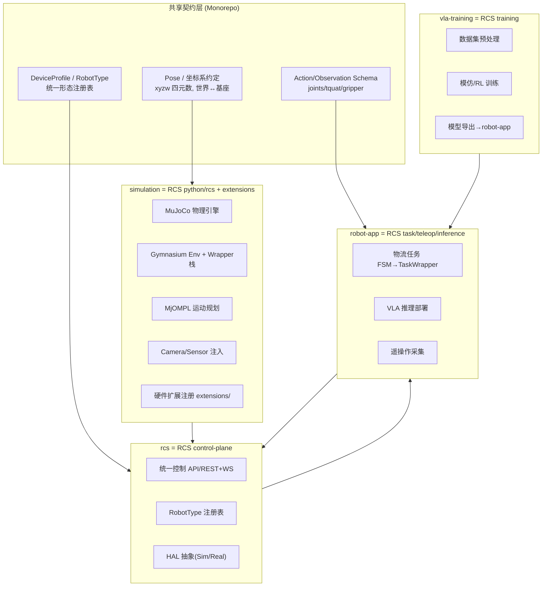

## 用户需求

基于 robot-control-stack（RCS）的架构设计与能力标准，为 `d:\projects\robot-logic` 下四个子工程分别制定优化改造方案，使其具备与 RCS 同等或更优的系统能力，并最终实现四个子工程的无缝集成。

## 产品概述

RCS 是一个无 ROS 的轻量级机器人控制框架，核心能力为：MuJoCo 物理仿真 + Pinocchio 运动学的 C++/Python 混合栈、统一的 Gymnasium 环境接口与 wrapper 组合机制、RobotType 形态注册表、世界系↔基座系 Pose 转换、OMPL 无碰撞运动规划、硬件/传感器扩展插件化、遥操作/推理部署/模仿学习应用链路。robot-logic 当前由 rcs（异步控制服务）、robot-app（ROS2 物流决策 FSM）、vla-training（占位数据集工程）、simulation（逻辑设备仿真后端）四个独立子工程组成，尚缺物理仿真引擎、Gym 环境、统一坐标系约定、运动规划与训练链路。

## 核心特性

- 建立统一数据契约（Pose/坐标系/Action/Observation/DeviceProfile 标准 schema），贯穿四子工程解耦集成
- simulation 升级为物理仿真引擎（MuJoCo/Pinocchio），提供 Gymnasium 环境与 OMPL 运动规划、相机/传感器注入、硬件扩展注册机制
- rcs 标准化为控制平面（control plane），统一 RobotType/形态注册表、世界系↔基座系转换、控制模式、HAL 抽象，兼容既有异步服务风格
- robot-app 重构为任务/策略执行层，将物流 FSM 封装为 RCS 风格任务包装器，承接 VLA 推理与遥操作
- vla-training 补齐数据集预处理→模仿/RL 训练→模型导出全链路，向 robot-app 提供策略
- 引入统一构建与质量门禁工具链（scikit-build-core/CMake/Makefile 质量命令/CI）

## 技术栈选择

- 物理仿真：MuJoCo（pip `mujoco`）+ Pinocchio（`pin`）+ OMPL（`ompl`），优先 Python 落地，必要时按 RCS 方式用 scikit-build-core 编译 C++ 扩展
- 环境接口：Gymnasium（robot-logic 现状已用 FastAPI 异步风格，保留并扩展）
- 类型/数据契约：pydantic v2（rcs 已用）+ numpy
- 训练链路：torch + transformers + peft（vla-training 已规划）
- 既有保留：rcs 的 FastAPI/WebSocket 异步控制服务；robot-app 的 ROS2 决策栈与纯 Python FSM（可单测）
- 构建：保留各子工程 pyproject，顶层增加 Monorepo 共享契约与统一 lint/format/test 门禁

## 实施方法

采用"能力对齐 + 接口标准化 + 渐进式集成"策略：以 RCS 为标杆，在不破坏 robot-logic 既有异步服务与 ROS2 栈的前提下，引入统一坐标系/Pose/DeviceProfile 契约作为四子工程的集成骨架；将 simulation 定位为 RCS 的 `python/rcs + extensions`（物理引擎 + Gym 环境 + 规划 + 扩展），rcs 定位为 RCS 的 app/control-plane（统一控制 API + HAL），robot-app 定位为 RCS 的 teleop/inference/task-wrapper 层，vla-training 定位为 RCS 的 training/datasets 层。关键决策：

1. Pose/坐标系先于一切——四子工程强制采用 RCS 约定（右手系 x前/y左/z上，四元数内部 xyzw，MuJoCo 状态 wxyz），避免历史 `w` 歧义。
2. simulation 用 Python MuJoCo 先行，避免初期 C++ 构建门槛；将 robot-logic 现有 `planner/foundation.py` 的 RRT* 雏形对齐为 RCS `MjOMPL` 接口（plan/碰撞检测/IK 注入）。
3. rcs 的 Registry/Morphology 扩展为统一 RobotType 注册表，向下对接 simulation 的 MuJoCo 模型与 robot-app 的真实设备 HAL。
4. 性能：Gym 环境采用 RCS 的 `render_on_demand`、相对动作空间裁剪、状态编码 compact 数组；运动规划复用现有 RRT* 并补充 RRTConnect/PRM。

## 实施要点

- 复用 robot-logic 既有代码：rcs 的 `registry.py`/`hal`/`controllers`、`robot-app` 的 `state_machine.py` FSM 基类、`simulation/backend/algorithm/planner/foundation.py` 的 Trajectory/规划器、`perception/detector.py` 的 UnifiedDetector，避免重写
- 不引入 ROS 到 simulation/rcs，保持异步服务边界；robot-app 维持 ROS2 作为真机执行侧
- 日志复用既有 logger 风格，新增契约校验错误用明确异常（FileNotFoundError/ValueError/ImportError）

## 架构设计



## 目录结构

```
robot-logic/
├── shared/                        # [NEW] Monorepo 共享契约
│   ├── pose.py                   # [NEW] Pose/RPY/RotVec + 世界↔基座转换（对齐 RCS conventions）
│   ├── device_profile.py         # [NEW] DeviceProfile/RobotType 形态注册表 schema
│   └── action_obs.py             # [NEW] Action(tquat/joints/gripper)/Observation 标准 schema
├── simulation/
│   ├── backend/
│   │   ├── algorithm/simulator/  # [MODIFY] 引入 MuJoCo 物理设备仿真，保留逻辑仿真作为 fallback
│   │   ├── algorithm/planner/    # [MODIFY] foundation.py 对齐 RCS MjOMPL 接口 (plan/IK/碰撞)
│   │   ├── gym/                  # [NEW] Gymnasium Env + Wrapper栈 (Robot/Gripper/Camera/Task)
│   │   └── extensions/           # [NEW] 硬件/传感器扩展注册机制 (rcs_fr3 风格)
│   └── pyproject.toml            # [MODIFY] 增加 mujoco/pin/ompl/gymnasium 依赖与构建组
├── rcs/
│   ├── rcs/
│   │   ├── registry.py           # [MODIFY] 扩展 Morphology→统一 RobotType 注册表，对接 shared
│   │   ├── state/profile.py      # [MODIFY] DeviceProfile 复用 shared 契约
│   │   ├── hal/                  # [MODIFY] HAL 抽象增加 MuJoCo/真实设备双后端
│   │   ├── controllers/          # [MODIFY] 控制器输出对齐 Action schema
│   │   └── app.py                # [MODIFY] 暴露统一控制 API（含坐标系转换端点）
│   └── pyproject.toml            # [MODIFY] 增加 shared 依赖、可选 mujoco 组
├── robot-app/
│   ├── ros2_ws/src/robot_decision/
│   │   ├── state_machine.py      # [MODIFY] FSM 封装为 RCS 风格 TaskWrapper 接口
│   │   ├── planning/             # [MODIFY] 对接 simulation MjOMPL
│   │   ├── perception/           # [MODIFY] 接入 RGB/深度注入 (CameraSetWrapper 风格)
│   │   └── inference/            # [NEW] VLA 推理部署层 (承接 vla-training 导出模型)
│   └── teleop/                   # [NEW] 遥操作采集链路 (对齐 RCS teleop)
├── vla-training/
│   ├── datasets/                 # [MODIFY] 接入 simulation Gym 观测/动作格式
│   ├── training/                 # [NEW] 模仿/RL 训练 (对齐 RCS imitation)
│   ├── export/                   # [NEW] 模型导出 (InferenceManifest 自描述校验)
│   └── configs/                  # [MODIFY] action.dim 绑定 shared DeviceProfile
└── Makefile / CI                 # [NEW] 顶层统一 lint/format/test/构建门禁
```

## 关键技术结构（接口级）

```python
# shared/pose.py —— 统一坐标系与姿态（对齐 RCS conventions）
class Pose:
    def __init__(self, translation: np.ndarray, quat_xyzw: np.ndarray): ...
    def to_world(self, base_pose: "Pose") -> "Pose": ...      # world = base * robot
    def to_robot(self, base_pose: "Pose") -> "Pose": ...      # robot = base.inv() * world
    def as_tquat(self) -> list[float]: ...                    # [x,y,z,qx,qy,qz,qw]
```