# 如何从零 DIY 复刻一只可爱的 Microduck

> 来源：X（原 Twitter）帖子 [@tspy（yishan）](https://x.com/tspy/status/2094963381220622638)
> 发布时间：2026 年 9 月 2 日 · 原文为长文教程，本文件为其完整中文整理版（含原文插图，见文末“配图”）。
> 原文链接：https://x.com/tspy/status/2094963381220622638

---

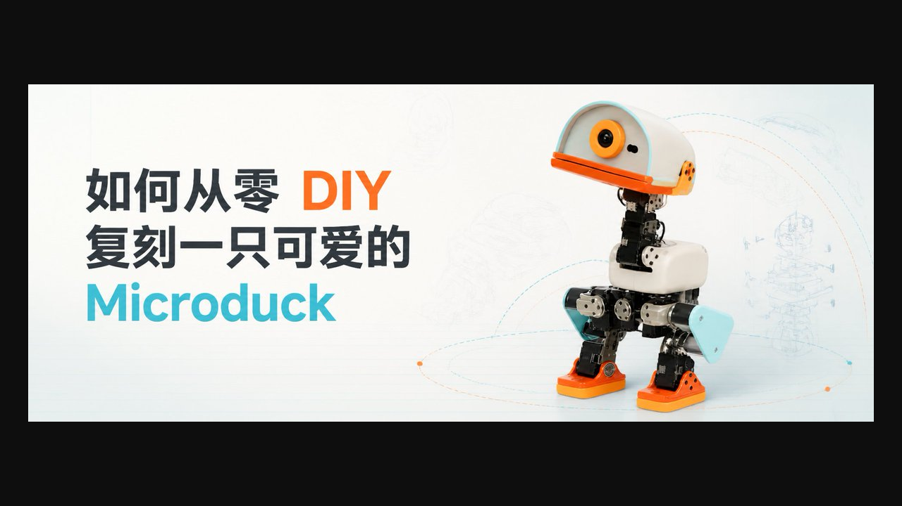

## 1. Microduck 简介

- Microduck 是一只约 **25 cm 高**的小型双足机器人。
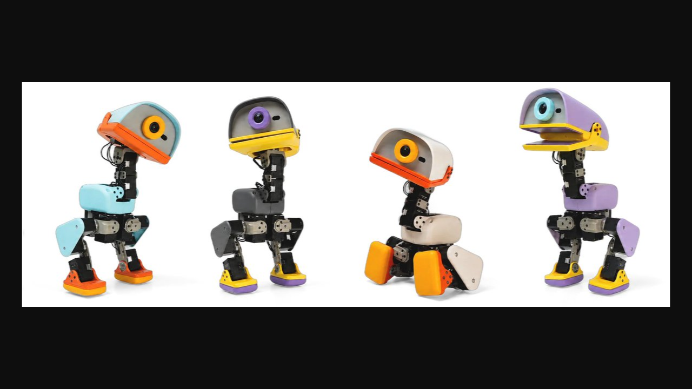

- 它用 **15 个 Dynamixel 舵机**构成双腿、颈部、头部和嘴部，其中 **14 个关节**由行走策略控制，嘴部单独控制。
- 主控板持续读取舵机位置和 IMU 姿态，把这些数据交给一个 **ONNX 神经网络**，再把网络输出转换成新的关节目标。这个循环**每秒运行 50 次（每 20 ms 一次）**。
- 与传统预先写死每一步关节角度的机器人不同，Microduck 的步态先在 **MuJoCo 仿真器**中通过**强化学习**训练，再部署到真机。
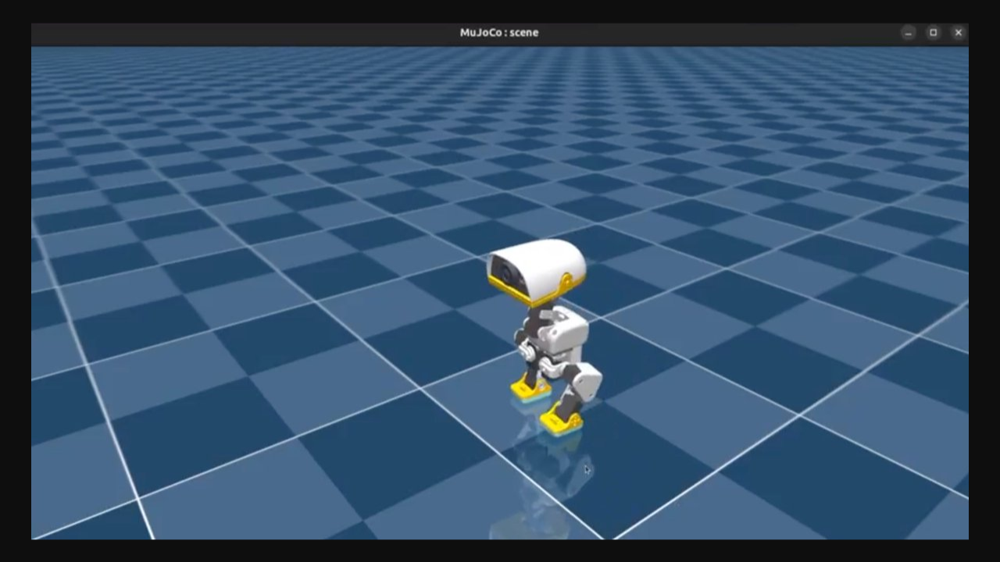


因此，复刻工作需同时完成四件事：

1. 重建与仿真模型一致的机械结构
2. 搭建舵机、电源、IMU 和主控系统
3. 让真机使用与训练一致的关节顺序、坐标系和控制频率
4. 将训练策略导出为 ONNX，并分阶段调试到能够站立和行走

## 2. 机器人组成部分

从机械上看，Microduck 可以分为躯干、左右腿和头颈三条运动链：

- **躯干**是整机根节点，安装主控、电源、电池和通信板
- 每条腿有**髋 yaw、髋 roll、髋 pitch、膝和踝**五个关节，两条腿共 10 个
- **头颈**有颈俯仰、头俯仰、头偏航和头侧倾四个策略关节
- **嘴部**还有一个单独舵机，因此总数是 15 个舵机、14 个策略动作
- 运动 **IMU** 安装在机身上，为策略提供角速度和重力方向

机器人站立时，神经网络每 20 ms 根据最新姿态重新计算下一组关节目标。被轻推或落脚产生偏差后，下一周期的动作会随状态变化，这就是它能够闭环保持平衡的基础。

## 3. 开始前需要什么基础

你不需要是强化学习专家，但最好具备以下基础：

- 会使用终端执行命令，能安装 Linux 软件和查看日志
- 会使用一种 CAD 软件，并做过基本的 3D 打印装配
- 能使用万用表，理解电压、电流、共地和稳压的概念
- 了解舵机的 ID、零位、方向和机械限位

如某一项还不熟悉，可先完成仿真和单舵机台架，暂时不要直接制作整机。

## 4. 七个关键词

| 词语 | 在本项目中的含义 |
|------|------------------|
| MJCF | 描述机器人刚体、关节、质量、惯量、网格和碰撞关系的 XML 模型 |
| MuJoCo | 运行 MJCF、模拟机器人运动和接触的物理仿真器 |
| Dynamixel | 带位置反馈、可设 ID、能通过总线批量通信的智能舵机 |
| ONNX policy | 训练完成后导出的神经网络；输入机器人状态，输出 14 个关节动作 |
| sim-to-real | 让仿真中学会的动作尽可能迁移到真实机器人上的过程 |
| home pose | 所有关节共同使用的参考姿态；策略动作会在这组基准角度上叠加 |
| commit | Git 仓库某一时刻的版本哈希；记录它才能复现同一套代码和模型 |

## 5. 本教程带你做到的程度

最终目标是一只能够完成以下闭环的复刻鸭：IMU 和舵机产生状态数据，主控以 50 Hz 运行策略，15 个舵机收到目标位置，机器人完成站立和行走。

摄像头、ToF、音频和 NFC 属于后续扩展，不影响第一版行走闭环。

整个过程分成八个阶段：

1. 固定源码版本
2. 跑通仿真
3. MJCF → 装配图与 CAD
4. 机械试制：电源、总线与 IMU
5. 主控与运行时
6. 校准、训练与 ONNX
7. 分级真机调试
8. 验收

官方仓库用于确定控制接口、仿真和部署流程；第三方 **microduck-replica** 用于恢复装配关系并辅助 CAD 重建。

## 目录

1. 系统架构与控制链
2. 舵机、动作与关节顺序
3. 61 维观测与 ONNX 契约
4. 材料与工具
5. 跑通仿真
6. 从 MJCF 重建装配图与 CAD
7. 电源与 Dynamixel 总线
8. IMU 到 Dynamixel 桥接
9. 主控、Linux 与运行时
10. 舵机编号、零位与整机校准
11. 训练、导出与部署策略
12. 分级真机调试
13. 硬件变化与重新训练
14. 常见故障排查
15. 项目验收清单

---

## 1. 系统架构与控制链

先不要急着购买零件，理解数据怎样在机器人里流动，后面的接线、校准和部署才不会变成照抄命令。

可以把 Microduck 看成“**主控电脑 + 一条设备总线 + 传感器 + 神经网络**”：

- 主控从总线读取状态
- 神经网络计算动作
- 主控再把动作写回舵机

### 1.1 硬件路径

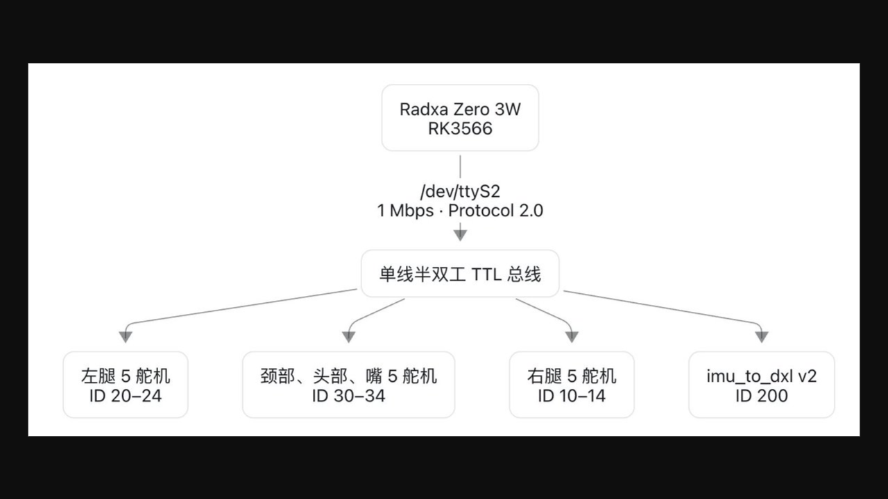
> 这里的“单线”指单根数据线，完整连接仍包含数据、VDD 和 GND。

### 1.2 每个 20 ms 周期发生什么

官方 `robotd` 当前设计为 50 Hz：
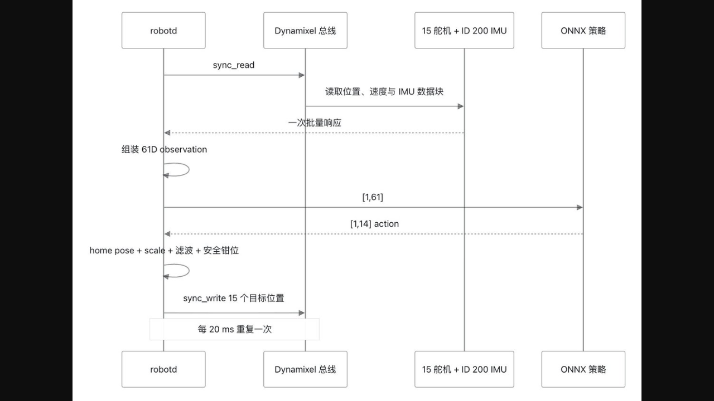

- 电压和温度不需要塞进每个 20 ms 周期。官方设计每秒另读一次慢速传感器寄存器，降低总线占用。

### 1.3 软件服务

官方运行时是 **Rust workspace**，没有采用 ROS 作为核心框架。当前架构把职责拆成多个守护进程：

| 服务 | 主要职责 |
|------|----------|
| robotd | 50 Hz 控制环、舵机总线、IMU、策略、安全 |
| configd | Wi-Fi、身份、配对和系统配置 |
| updaterd | 签名更新、健康检查和自动回滚 |
| btd | 手机 BLE 入口 |
| padd | 手柄输入并发送高层 intent |
| mediad | 摄像头、音频、WebRTC 和部分感知 |
| tofd | 8×8 ToF 深度流 |

控制接口使用 **Unix socket 上的 JSON-RPC**。客户端发送“走多快、头看哪里、执行什么动作”，不是直接远程写舵机寄存器。

## 2. 舵机、动作与关节顺序

现在把控制链落到具体关节上。Microduck 有 15 个物理舵机，但行走策略只输出 14 个动作，因为嘴部不参加步态控制。运行时需要把 14 个动作插入一个包含嘴部槽位的 15 元目标数组，再发送到总线。

这是整个项目最不能凭直觉重排的部分。顺序错一位，网络仍然能正常推理，但动作会被送到错误的关节。

### 2.1 策略动作顺序

| Action 索引 | 关节 | 对应总线 ID |
|-------------|------|-------------|
| 0 | 左 hip_yaw | 20 |
| 1 | 左 hip_roll | 21 |
| 2 | 左 hip_pitch | 22 |
| 3 | 左 knee | 23 |
| 4 | 左 ankle | 24 |
| 5 | neck_pitch | 30 |
| 6 | head_pitch | 31 |
| 7 | head_yaw | 32 |
| 8 | head_roll | 33 |
| — | mouth（不在策略动作中） | 34 |
| 9 | 右 hip_yaw | 10 |
| 10 | 右 hip_roll | 11 |
| 11 | 右 hip_pitch | 12 |
| 12 | 右 knee | 13 |
| 13 | 右 ankle | 14 |

### 2.2 14 维动作到 15 槽目标数组

在运行时内部，15 个电机目标可以理解为：

```
[左腿 5 | 头颈 4 | 嘴 1 | 右腿 5]
  0..4     5..8     9     10..14
```

策略动作数组则是：

```
[左腿 5 | 头颈 4 | 右腿 5]
  0..4     5..8      9..13
```

不能把 action 9 直接写给 15 槽数组的 index 9。那会把右髋命令写到嘴上，并让整条右腿错位。

### 2.3 被动关节不是策略关节

轮子和回差模型中的关节使用 `passive_*` 命名。它们可能出现在 MuJoCo 的 `qpos`/`qvel` 中，但不进入 14 维策略关节列表。

对 roller 或 backlash 模型写自定义代码时，应使用官方辅助函数解析舵机关节，不要硬编码 MuJoCo 索引。

## 3. 61 维观测与 ONNX 契约

神经网络并不会直接看到机器人，它只接收一个按固定顺序排列的 **61 维数字数组**，其中包含 IMU、关节状态、上一时刻动作和运动命令，网络返回 14 个动作值。

所谓部署契约，就是训练端和真机端必须对这些数字的顺序、单位和缩放达成完全一致。最容易犯的错是网络能够运行、输入形状也正确，但某些字段顺序或单位不一致，导致真机做出错误动作。

### 3.1 完整布局

| 区间 | 维度 | 内容 |
|------|------|------|
| 0..3 | 3 | 躯干坐标系角速度 `gyro`，rad/s |
| 3..6 | 3 | 躯干坐标系中的投影重力 `projected_gravity`，单位向量 |
| 6..20 | 14 | 关节位置减去 home pose，rad（嘴部除外） |
| 20..34 | 14 | 关节速度，rad/s（嘴部除外） |
| 34..48 | 14 | 上一时刻策略的原始输出（动作缩放前） |
| 48..61 | 13 | 命令块 |

命令块为：

```
twist(3) + head_pose(4) + body_pose(6)
```

当前运行时文档进一步明确其顺序：

```
48..51  vx, vy, vyaw
51..55  neck_pitch, head_pitch, head_yaw, head_roll
55..61  body x, y, z, roll, pitch, yaw
```

其中 `vx`、`vy` 使用 m/s，`vyaw` 使用 rad/s。四个头部目标和 body 的 `roll`、`pitch` 使用 rad，body 的 `z` 使用 m。运行时把 body 的 `x`、`y` 和 `yaw` 固定为零，`z`、`roll`、`pitch` 只有在 body-pose 模式下才非零。

固定为零不代表可以删掉这些槽位，共享 61 维布局正是不同策略能够切换的前提。

### 3.2 ONNX 必须满足的条件

- 输入形状是 `[1, 61]`
- 输出形状是 `[1, 14]`
- 关节顺序与上节一致
- 单位、符号、home pose 和动作缩放与训练一致
- 观测归一化器已经烘进 ONNX
- 推理前应先做一次 warm-up，避免第一次调用延迟出现在控制周期中

### 3.3 归一化与导出

在仿真里直接 `play` 时，框架会应用训练时的观测归一化器，因此一个错误导出的网络可能仍然表现正常。真机运行时没有外部 Python 训练器替你补这一步，必须使用官方导出路径：

```bash
uv run scripts/export.py \
  Mjlab-Velocity-Flat-MicroDuck \
  --wandb-run-path <entity/project/run_id>
```

不要手工把 `.pt` checkpoint 转 ONNX 后就部署。

## 4. 材料与工具

第一版先围绕“能站、能走”的核心闭环采购。摄像头、ToF、音频和 NFC 不参与基础行走，可以在步态稳定后再增加。下面的 BOM 是功能清单，不要求一次买齐。建议先购买主控、1–3 个舵机、总线接口和限流电源完成台架测试，再扩展到 15 个舵机和整机结构。

### 4.1 最小核心 BOM

| 类别 | 建议 | 说明 |
|------|------|------|
| 主控 | Radxa Zero 3W，RK3566 | 当前运行时目标平台 |
| 舵机 | Dynamixel XL330 ×15 | 14 个策略关节 + 1 个嘴部舵机 |
| 具体舵机变体 | 第三方资料推断为 XL330-M288-T | 市售版电压规格与 RL 电压模型存在差异，采购前必须核对 |
| 运动 IMU | imu_to_dxl v2 兼容板 | 总线 ID 200 |
| IMU 芯片 | LSM6DSV16X | 与当前 v2 数据路径匹配 |
| 电池 | NP-F550 类 2S 锂离子 | 可拆卸电池形态 |
| 结构件 | 从 MJCF/STL 重建并参数化 | 不能直接把仿真网格当生产件 |
| 总线接口 | 1 Mbps、3.3 V 逻辑、单线半双工 TTL | Dynamixel Protocol 2.0 |
| 电源转换 | 主控稳定 5 V；舵机侧独立稳压母线 | 电压按舵机数据手册设计 |
| 电源保护 | 保险丝、总开关、快速断电和反接保护 | 台架和整机都需要 |

### 4.2 可选感知与交互

| 功能 | 当前资料指向 | 说明 |
|------|--------------|------|
| 摄像头 | IMX219 / Raspberry Pi Camera v2 路径 | 第三方根据设备树推导 |
| ToF | VL53L5CX 或 VL53L8CX，8×8 | 当前 `tofd` 支持两代 |
| 音频 codec | TLV320AIC3104 | 第三方逆向 HAT |
| 第二 IMU | BMI088，当前路径可能 dormant | 不进入当前 RL 观测 |
| NFC | 官方产品有两天线 | 第一版行走验证不需要 |

### 4.3 工具

- 数字万用表
- 可调限流电源
- 逻辑分析仪或示波器
- Dynamixel USB/TTL 调试接口
- 精度至少 0.1 g 的电子秤
- 游标卡尺
- FDM 或树脂打印机
- CAD 软件
- 螺纹规、钻头、铰刀和热熔螺母工具
- 机械吊架或测试绳
- 护目镜和耐火电池袋

第三方逆向认为，整机主要使用 M2 紧固系统，并推断了轴承尺寸和孔型。

## 5. 跑通仿真

第一项实际操作是在电脑上跑通官方训练环境，这样做有两个目的：

1. 确认软件依赖和任务名称正确
2. 在制作硬件前，亲眼看到策略的输入、输出和机器人关节如何对应

不需要真实舵机，主要是测试通过、训练冒烟测试能够运行，并能在仿真中播放一个策略。

### 5.1 获取三套资料

```bash
git clone https://github.com/pollen-robotics/microduck.git
git clone https://github.com/pollen-robotics/microduck_rl.git
git clone https://github.com/fanhao375/microduck-replica.git
```

| 仓库 | 用途 |
|------|------|
| microduck | 真机 Rust 运行时、服务、设备树、配置和控制设计 |
| microduck_rl | MuJoCo 模型、训练环境、PPO、BAM、导出和 CPU 推理 |
| microduck-replica | 第三方装配重建、紧固件和电控逆向参考 |

### 5.2 准备训练环境

当前 `microduck_rl` 要求 Python `>=3.12,<3.13`，并使用 `uv` 管理环境。先按 uv 官方安装文档（https://docs.astral.sh/uv/getting-started/installation/）完成安装。再检查工具和显卡：

```bash
uv --version
nvidia-smi
```

进入 `microduck_rl` 后，后续的 `uv run ...` 会根据项目锁文件自动创建和同步 Python 环境，不需要先手工建立虚拟环境。ARM 主机首次同步约 2 GB CUDA 依赖时，可先执行 `export UV_HTTP_TIMEOUT=600`，避免默认下载超时。

训练主路径要求 NVIDIA CUDA GPU。查看任务、运行部分 CPU 测试和 ONNX CPU 复演不需要本地 CUDA 训练。

### 5.3 检查任务注册表

```bash
cd microduck_rl
uv run list-envs
```

仓库当前包含行走、行走加跌倒恢复、起身、坐站、触地拾取、踢球、前滚翻和多种轮滑任务。

### 5.4 运行测试

```bash
uv run --with pytest pytest tests/
```

这些 CPU 测试会检查关节索引、奖励符号、NaN 防护等基础约束。

### 5.5 训练冒烟测试

```bash
uv run train \
  Mjlab-Velocity-Flat-MicroDuck \
  --env.scene.num-envs 64 \
  --agent.max_iterations 5
```

官方项目把“64 个环境、5 次迭代”作为低成本冒烟测试，用来提前发现配置、观测和导出问题。

### 5.6 正式训练

```bash
uv run train \
  Mjlab-Velocity-Flat-MicroDuck \
  --env.scene.num-envs 4096
```

官方给出的参考是现代 CUDA GPU 上约 1–2 小时可得到可用步态，但实际时间取决于 GPU、代码版本和训练配置，不能作为保证。

本地没有 CUDA GPU 时，可以让同一条命令通过 Hugging Face Jobs 执行：

```bash
uv run train \
  Mjlab-Velocity-Flat-MicroDuck \
  --env.scene.num-envs 4096 \
  --hf-jobs
```

会把任务提交到 Hugging Face Jobs，需要相应账号、权限和算力额度。当前官方 MuJoCo Warp 训练路径要求 CUDA。

## 6. 从 MJCF 重建装配图与 CAD

仿真仓库里的网格不是一套可以直接生产的 CAD 图纸，每个 STL 只描述一个局部网格，真正的装配位置、父子关系和旋转轴保存在 MJCF 中。

本阶段任务是先恢复“零件应该摆在哪里、绕哪里转”，再把这些几何参考重建为可加工、可装配的参数化零件。完成后，应得到一个包含 15 个刚体组和正确关节基准的 CAD 装配，而不是一堆堆在原点的 STL。

### 6.1 MJCF 比单个 STL 更重要

STL 只保存三角网格。MJCF 还保存：

- 刚体父子关系
- 关节轴线
- 关节限位
- 相对位姿
- 质量和惯量
- 碰撞几何
- keyframe

官方 RL 仓库当前主要模型包括：

| 模型 | 用途 |
|------|------|
| robot_walk.xml | 行走，简化部分躯干/头部碰撞 |
| robot_allcollisions.xml | 起身、坐站、拾取、踢球、翻滚等全身接触任务 |
| robot_allcollisions_rollers.xml | 被动轮子任务 |
| robot_*_backlash.xml | 带关节回差的派生模型 |

行走模型为训练效率删除部分碰撞，不应直接拿它当完整机械干涉检查模型。

### 6.2 第三方装配恢复项目的输出

第三方 `microduck-replica`（https://github.com/fanhao375/microduck-replica）使用官方 `robot_allcollisions.xml` 和其中引用的视觉网格完成了四类输出：

- 从 MJCF 恢复零位姿态下的运动学装配关系
- 将 47 个局部坐标系网格按刚体归并为 15 个装配部件
- 生成四张普通视图、两张爆炸图和一张分色对照图
- 导出 15 个已应用世界变换的 STL、一个整机合并 STL，以及源网格对照 JSON

该项目报告的零位外包尺寸约为 **144 × 141 × 264 mm**，整机合并网格为 **796,792 个三角面**，仿真刚体总质量约 **737.2 g**。这些是第三方脚本对特定版本模型的输出，不是官方制造尺寸或成品称重值。
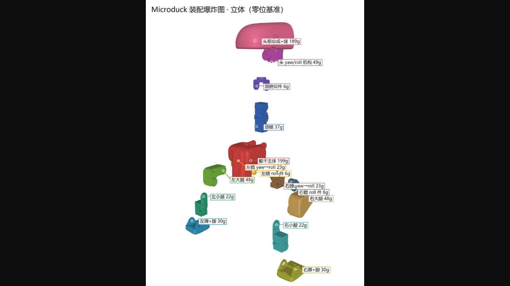


仓库导出的是已经摆到正确世界坐标的三角网格集合，便于一起导入 FreeCAD、Fusion 360、SolidWorks 或 Blender。它不是带特征树、配合约束、材料表和可编辑尺寸的原生 STEP/FCStd/SLDASM 装配体。

### 6.3 从 MJCF 得到装配树

第三方脚本按 MJCF 的 body 层级把网格归到 15 个刚体组。零位结构可概括为：
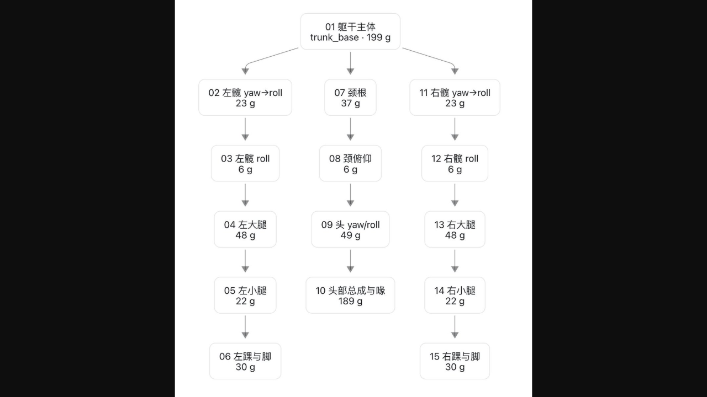

躯干和头部总成在仿真中分别约 199 g 和 189 g。这个质量分布提示头部对整机质心影响很大，摄像头、屏幕、扬声器或外壳材料一旦变化，应重新测量头部质量和惯量。  
| 输出部件 | MJCF body | 合并的源网格数 | 仿真质量口径 |
|----------|-----------|----------------|--------------|
| 01 躯干主体 | trunk_base | 10 | 199 g |
| 02 左髋 yaw→roll | yaw2roll | 4 | 23 g |
| 03 左髋 roll | hip_l | 2 | 6 g |
| 04 左大腿 | upper_leg_left | 5 | 48 g |
| 05 左小腿 | leg | 2 | 22 g |
| 06 左踝与脚 | ankle_left | 4 | 30 g |
| 07 颈根 | neck | 4 | 37 g |
| 08 颈俯仰 | neck_pitch | 2 | 6 g |
| 09 头 yaw/roll | yaw_roll_motion | 4 | 49 g |
| 10 头部总成与喙 | jaw_soft | 16 | 189 g |
| 11 右髋 yaw→roll | bearing_roll | 4 | 23 g |
| 12 右髋 roll | hip_l_2 | 2 | 6 g |
| 13 右大腿 | upper_leg_right | 5 | 48 g |
| 14 右小腿 | leg_2 | 2 | 22 g |
| 15 右踝与脚 | ankle_right | 4 | 30 g |

躯干和头部总成在仿真中分别约 199 g 和 189 g。这个质量分布提示头部对整机质心影响很大，摄像头、屏幕、扬声器或外壳材料一旦变化，应重新测量头部质量和惯量。

同名源网格可能在多个位置实例化，因此源网格数是各刚体引用次数，不等于唯一 STL 文件数。

### 6.4 坐标变换

上游网格的顶点位于各自局部坐标系。直接把 47 个 STL 一起导入 CAD，它们会堆在原点附近，恢复装配必须使用 MuJoCo 在零位前向运动学后给出的每个 geom 世界位姿。
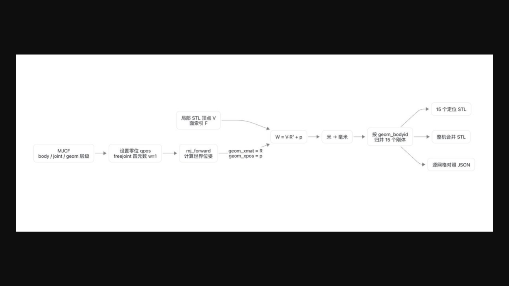


对应的数学关系是：

```
p_world = R_world_geom · p_local + t_world_geom
```

第三方导出脚本中的等价实现为：

```python
d.qpos[:] = 0
d.qpos[3] = 1.0  # freejoint: qw = 1
mujoco.mj_forward(m, d)
R = d.geom_xmat[g].reshape(3, 3)
p = d.geom_xpos[g]
W = (V @ R.T) + p
W_mm = W * 1000.0
```

脚本只选择 `geom_group == 2` 的视觉网格，并按 `geom_bodyid` 分组。这一选择适合生成外观装配图，不代表碰撞几何、关节标记或工程基准已经被写入导出的 STL。

### 6.5 重现装配图与定位 STL

第三方脚本有一套独立于 RL 训练环境的轻量依赖。进入 `microduck-replica` 后，先建立虚拟环境：

```bash
python3 -m venv .venv
source .venv/bin/activate
python -m pip install mujoco numpy pillow
```

然后在仓库根目录执行：

```bash
# 拉取官方 microduck_rl 与 microduck 仓库
bash scripts/fetch_upstream.sh

# 从 robot_allcollisions.xml 重新渲染 7 张装配图
python scripts/render_assembly.py upstream/microduck_rl assembly-drawings

# 导出 15 个刚体分组 STL、整机 STL 和零件对照表
python scripts/export_assembly_stl.py upstream/microduck_rl cad
```

脚本依赖 mujoco、numpy 和 pillow，渲染还需要可用的 OpenGL 离屏上下文。复现时先记录 `microduck_rl` 与 `microduck-replica` 的 commit，因为 MJCF 路径、body 名称和 geom 分组可能变化。

爆炸图不是从 CAD 约束自动生成的。第三方渲染脚本沿每个 body 的父链累加偏移，并以约 48 mm 的步长将链末端逐级移远。它表达的是运动学层级，不是实际拆装方向、螺丝抽出方向或线束拆卸顺序。

### 6.6 从定位 STL 建立可编辑 CAD 装配体

按以下步骤把第三方转成自己的工程装配：

1. 将 01–15 的定位 STL 一次性导入，保持原始毫米单位和导入变换不变；
2. 用 `07_分色对照_装配态.png` 和 `零件对照表.json` 检查是否有漏件、镜像错误或单位错误；
3. 把每个网格转换为独立 mesh/body，仅把它当作外形参考；
4. 从 MJCF 重新创建 14 个策略旋转副，并单独创建嘴部机构；
5. 在每个 joint 的 `pos` 建局部坐标系，以 `axis` 定义旋转轴，以 `range` 定义运动限位；
6. 用参数化实体重画舵机支架、轴承座、壳体分缝、连接器孔和紧固件结构；
7. 将视觉网格隐藏，只保留重画后的可制造零件做干涉和运动检查；
8. 为每个总成建立质量、材料、版本和实测偏差属性。

若需要从 MJCF 计算 CAD 中的关节基准，可使用：

```
T_world_body = T_world_parent · T_parent_body(q=0)
p_world_joint = p_world_body + R_world_body · p_body_joint
axis_world_joint = R_world_body · axis_body_joint
```

定位 STL 本身不保存 `joint pos`、`axis` 或 `range`，所以只把网格导入 CAD 并不能得到可运动装配，必须同时读取 MJCF 关节定义。

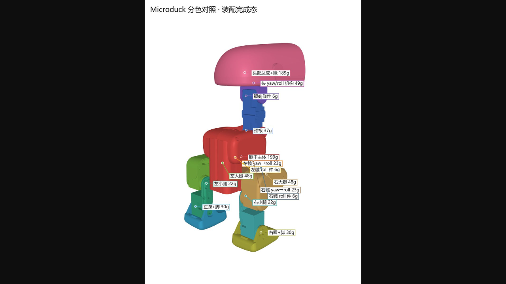


### 6.7 从仿真网格到可打印工程件
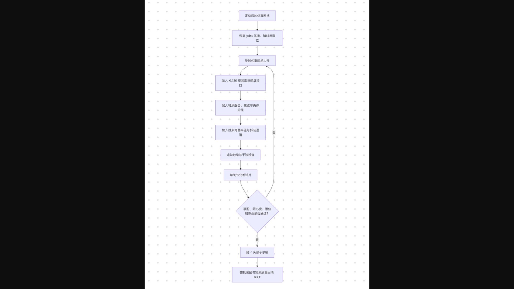

必须补做的工程内容包括：

- STL 网格修复、封闭和合理减面；
- XL330 本体、舵盘、从动轴承和紧固件的真实安装界面；
- 热熔螺母、嵌件、螺钉头和工具操作空间；
- 轴承座压配或间隙配合公差；
- 关节全行程线束弯曲半径、夹线风险和连接器拔插空间；
- 壳体分件、打印方向、支撑面和层间受力；
- 软限位之外的物理止挡以及摔倒碰撞路径。

第三方紧固件分析可以作为孔型调查的起点，但孔径统计不能自动确定每一颗螺丝的长度、材料、锁紧方式和装配顺序。

### 6.8 单关节试制

至少验证：

- XL330 能否装入
- 输出轴与从动轴承是否同心
- 舵盘和外壳是否干涉
- 螺丝刀是否有实际操作空间
- 舵机线是否能转弯并承受全行程
- 正负限位是否与 MJCF 一致
- 连续摆动后孔位是否松动
- 摔落冲击是否会沿层纹劈裂

### 6.9 质量与质心

对每个装配总成单独称重，并记录：

- 左/右腿各段质量
- 躯干质量
- 头部与嘴部质量
- 电池、主控、HAT 和线束质量
- 整机质心位置

结构从约 800 g 增长到 1.2 kg，不是小误差，而是另一套执行器和动力学系统。若质量或质心明显改变，应更新 MJCF 并重训，不要只提高动作缩放硬顶。

### 6.10 材料选择

- 尺寸验证件：PLA
- 第一版可用结构：PETG、ABS 或 ASA
- 高负载关节：考虑 PA 或纤维增强材料，但先验证层间强度
- 轴承座：按实际打印机和材料做公差样条
- 螺纹位置：优先热熔螺母或贯穿螺栓，不要依赖薄壁塑料直接攻丝承受冲击

## 7. 电源与 Dynamixel 总线

机械件能够装起来以后，先在台架上完成电气系统，不要直接把 15 个舵机全部装进机身。Dynamixel 允许多颗舵机共用一条数据线，但每颗设备必须有唯一 ID，供电还要承受多个关节同时启动造成的瞬时电流。让主控稳定发现所有设备，并在 1 Mbps 下连续批量读取和写入，不是让机器人马上运动。

### 7.1 电源树

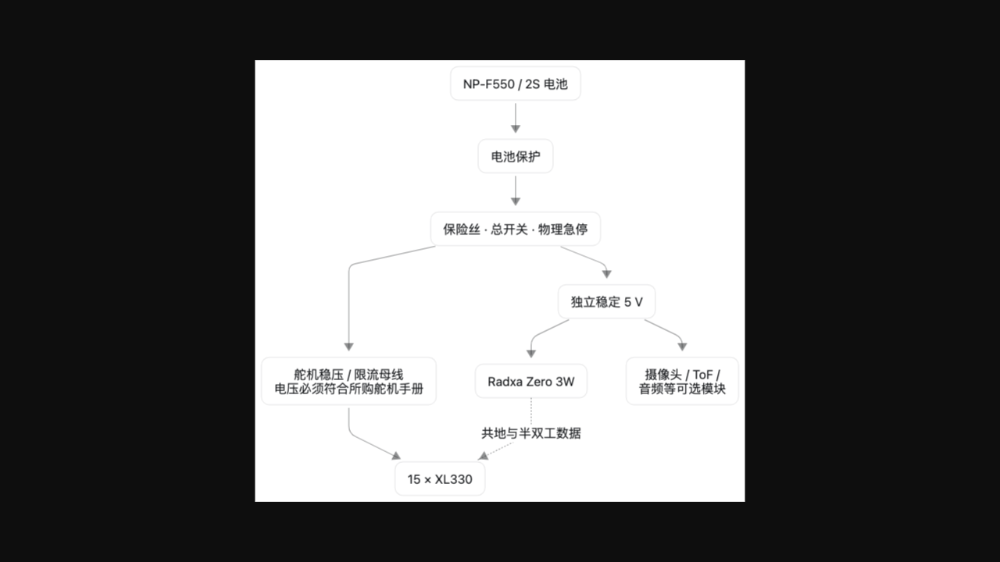

不要把主控直接接到未经确认的舵机母线。主控、摄像头、ToF 和音频的稳压与瞬态需求应单独计算。

供电要点：XL330-M288 手册给出的工作电压上限为 **6.0 V**，而满电 2S 电池约为 **8.4 V**。舵机侧应使用数据手册范围内的稳压电源，不要直接连接 2S 电池。

> **资料矛盾**：官方 RL 的 XL330 执行器模型把输入电压随机化在 6.5–8.2 V，运行时也从舵机回报值估计 2S 电池电压。但 ROBOTIS 对市售 XL330-M288-T 标出的输入范围是 3.7–6.0 V、推荐 5.0 V。当前公开资料没有说明量产机是否使用特殊版本舵机，或电源路径是否还有未公开设计。因此，复刻时不能仅凭 RL 参数把市售 XL330 直接接到 2S。应按手中实物的手册设计稳压，并把实测母线和执行器响应回填到 BAM 模型后重新训练。若希望复用官方 ONNX，则还需先独立确认原机舵机版本与供电路径，不能把第三方推断当作电气规格。

### 7.2 电源设计要求

- 按多舵机同时起动和堵转瞬态选择线径、连接器与保险丝
- 主干尽量短，避免细线菊花链造成远端压降
- 主控 5 V 电源要能承受舵机动作造成的输入扰动
- 所有模块共地
- 首次上电使用限流电源，不直接插电池
- 预留物理急停或一拉即断的总电源插头
- 连接器必须防反插
- 电池应使用带保护的可靠成品包和适配充电器

运行时通过舵机报告值估计母线电压，台架阶段仍应测量稳态电压、启动瞬态和动态压降。若实际母线与 RL 的 6.5–8.2 V 建模范围不同，应修改执行器模型并重新训练、验证策略。

### 7.3 总线物理层

当前官方基线：

- 接口：TTL 半双工
- 数据线：单线
- 数据逻辑：3.3 V TTL（ROBOTIS 标注 5 V tolerant）
- 协议：Dynamixel Protocol 2.0
- 速率：1,000,000 baud
- 端口：`/dev/ttyS2`

这里的 3.3 V 指数据线逻辑电平，不是舵机供电电压。不要用普通 USB-UART 的 TX、RX 两线直接并在一起。需要正确的半双工收发或自动方向电路，并确认高阻态、上拉和电平兼容。

### 7.4 台架顺序

1. 不接舵机，只看串口是否空闲
2. 接一颗舵机，读取型号、ID、位置、电压和温度
3. 设置唯一 ID
4. 验证 1 Mbps
5. 增加第二颗并做 `sync_read`
6. 扩展到一条腿
7. 扩展到 15 颗
8. 最后加入 ID 200 的 IMU 板

每次只增加一个变量。重复 ID 会让回复碰撞，看起来很像电源或串口噪声。

## 8. IMU 到 Dynamixel 桥接

行走策略除了关节位置，还必须知道机器人正在向哪边倾斜。Microduck 没有让主控通过另一条 USB 或 I²C 路径单独读取运动 IMU，而是把 IMU 包装成一个 Dynamixel 从设备，与舵机共用同一条总线。

如果直接使用官方兼容板，本章用于理解它的接口；如果需要自制替代板，则必须复现 ID、寄存器布局、采样频率和坐标方向。

### 8.1 运行时接口

`imu_to_dxl v2` 作为 ID 200 的 Dynamixel 从设备，与 15 个舵机在同一次 `sync_read` 中返回数据。控制环从地址 124 开始读取 12 字节，源码以半开区间 124–136 表示，末地址 136 本身不属于数据块。

当前 v2 路径使用 LSM6DSV16X 的 SFLP 姿态融合，12 字节块包含三轴陀螺和压缩的四元数分量。

| 字节 | 编码 |
|------|------|
| 0..6 | gyro x/y/z，三个小端有符号 `i16`，量程 ±500 dps，17.5 mdps/LSB；运行时转为 rad/s |
| 6..12 | SFLP 四元数 x/y/z，三个 IEEE fp16；运行时按单位四元数恢复 `w` |

当前运行时默认把传感器原始轴映射为躯干轴 `[+raw_z, +raw_y, -raw_x]`，并等待至少 25 个有效融合姿态样本后才把 IMU 标为就绪，约相当于 100 Hz 下的 0.25 s。替代板若安装方向不同，应修改安装四元数或固件映射，而不是在策略输入端临时交换数组槽位。

### 8.2 兼容板功能框图
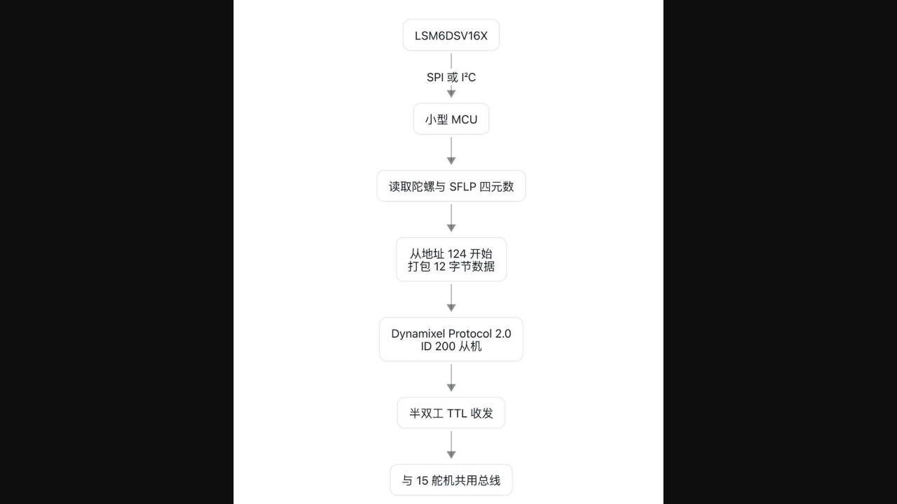

（见文末配图）

### 8.3 验收条件

- 1 Mbps 下连续运行至少一小时无 CRC/超时错误
- 50 Hz 下每个样本都更新
- 静止时陀螺零偏稳定
- 旋转方向与仿真坐标系一致
- 直立时 `projected_gravity` 接近运行时期望
- 四元数归一化且无 NaN
- 翻转和跨越四元数符号时不产生突跳
- 上电后在姿态融合尚未稳定时明确报告“未就绪”，不要伪造零姿态

如果暂时无法实现这块板，可以先在台架上用 FakeIo 或修改后的传感器后端验证软件，但这不代表真机策略已经可用。基本行走不能长期依赖与训练模型不匹配的 USB IMU 临时方案。

## 9. 主控、Linux 与运行时

硬件总线稳定后，再把控制权交给 Radxa Zero 3W 上的官方 Rust 运行时。主控板负责启动系统服务、独占 UART、读取设备、运行 ONNX，并向上层应用提供控制接口。本阶段先验证操作系统和守护进程，不加载真实行走策略。这样可以把 Linux 配置问题与机器人动力学问题分开。

### 9.1 开发板路径

官方开发文档当前要求在 Radxa Zero 3 上使用 **Armbian 26.2.1 Minimal**。官方 roadmap 记录了 Radxa Zero 3W 上的实际行走 bring-up。

由于官方安装文档和发布系统仍在演进，第三方复刻者应先阅读当前仓库中的：

```
docs/robot/install-dev.md
docs/robot/cheatsheet.md
docs/design/architecture.md
docs/design/robotd-design.md
```

不要只执行旧教程里的安装命令。开发构建可能涉及签名密钥、发布通道和官方板卡假设。

### 9.2 刷写并配置开发板

用 Armbian Imager（https://www.armbian.com/radxa-zero-3/）选择 Radxa Zero 3 和 Armbian 26.2.1 Minimal。

为了与下面的命令和默认路径一致，建议在 Imager 的 profile 中把用户名设为 `radxa`，并填入 Wi-Fi 和密码。如果选择其他用户名，后文所有 `radxa` 和 `/home/radxa` 都要相应替换。

首次启动并接入网络后，从电脑写入 SSH 公钥：

```bash
ssh-copy-id radxa@<开发板_IP>
```

下面的脚本必须从电脑上的 `microduck` 仓库根目录运行，不要在开发板上运行：

```bash
./scripts/provision-board.sh \
  --pause-btd-on-pair \
  --name <机器人名称> \
  radxa@<开发板_IP>
```

脚本会通过 SSH 传送开发密钥、配置系统、处理重启并在最后执行健康检查。`--pause-btd-on-pair` 用于规避部分 AIC8800 无线模块在手柄首次配对时的冲突。如果不使用手柄，它不影响基础行走闭环。仓库公开时通常不需要 `DUCK_TOKEN`。

配置结束后登录开发板并确认版本与服务状态：

```bash
ssh radxa@<开发板_IP>
robotctl version
robotctl health
```

### 9.3 UART2 登录控制台冲突

Armbian 默认可能在 `/dev/ttyS2` 启动 serial-getty，占住舵机串口。官方文档明确记录了这个问题。

先检查：

```bash
sudo fuser -v /dev/ttyS2
```

若确认为登录控制台占用，再禁用：

```bash
sudo systemctl mask --now serial-getty@ttyS2.service
```

不要在不知道占用者是谁时盲目停止系统服务。

### 9.4 总线独占

`robotd`、旧 runtime、调试脚本和 USB 适配器不能同时控制同一条串口。两个进程交错发送包会表现为随机硬件故障。

调试原则：

- 运行 `robotd` 时关闭其他舵机工具
- 用独立初始化命令前先停止守护进程
- 不要让系统登录控制台重新启用
- 所有维护脚本都应显式获取独占权

### 9.5 无策略或假硬件验证

官方当前代码提供 fake/无策略路径用于测试，先确认：

- 服务能启动
- Unix socket 正常
- `robotctl health` 能给出可理解的状态
- 控制环达到目标频率
- 没有摄像头或 ToF 时，电机服务仍然独立工作

完成这些后再连接真实总线。

## 10. 舵机编号、零位与整机校准

同一份策略只有在仿真和真机共享同一套“零点与正方向”时才有意义。校准不是让机器人看起来大致站直，而是建立舵机编码器读数、机械安装角和 MJCF 关节角之间的准确对应。

建议从单颗舵机开始，再校准一条腿，最后处理完整的 15 设备总线。任何方向错误都应在低幅度、无负载状态下发现。

### 10.1 单颗舵机配置

一颗一颗接入，设置和记录：

- ID
- 波特率
- return delay
- 驱动模式
- 位置范围
- 正方向
- 零位偏移
- 当前固件版本

官方控制层会检查若干 EEPROM/RAM 参数。被恢复出厂设置的舵机可能带来额外返回延迟或不同 PID 默认值，使整条 16 设备总线无法稳定达到 50 Hz。

### 10.2 无负载方向测试

不要装上完整连杆后才发现左右符号相反。对每个关节执行很小的正向命令，核对：

- 仿真中正方向
- 真实舵机正方向
- 编码器读数方向
- home pose
- 机械限位
- 左右镜像关系

### 10.3 home pose

home pose 是策略输出的参考中心：

```
target = home_pose + action_scale × action
```

如果某个关节零位偏 5°，策略看到的是“我在正确位置”，真实机械却已偏离。它会用其他关节补偿，常见结果是抖动、歪站、膝盖过热或一迈步就倒。

### 10.4 整机缓慢回到 home pose

机器人必须先固定在吊架或支架上。确认 15 个舵机和 IMU 状态正常后，用官方命令给关节上电，并在约两秒内渐变到 home pose：

```
sudo robotctl robot init
```

这条命令会移动所有关节，而且不需要加载策略。若方向、零位或机械干涉有任何异常，立即断电。完成检查后，用下面的命令解除扭矩：

```
sudo robotctl robot relax --yes
```

`relax` 后机器人会失去支撑并倒下，所以必须先由支架或手稳妥承重。这两条命令都通过 `robotd` 访问总线，不要同时运行另一个舵机调试程序。

### 10.5 校准验收

- 断电后手动摆到 home pose，左右结构应对称
- 读取的 14 维关节位置应接近训练定义
- 所有关节在小范围运动时无碰撞
- 嘴部 ID 34 可单独运动，不影响策略索引
- 15 颗舵机温度、电压和位置都能读到
- IMU ID 200 的样本连续更新
- 总线 50 Hz 连续运行一小时无持续丢包

## 11. 训练、导出与部署策略

机械质量、舵机、电压和控制频率与模型对齐后，才能把仿真策略迁移到真机。训练得到的 checkpoint 不能直接交给 Rust 运行时，需要通过官方导出脚本转换为包含观测归一化的 ONNX 文件。

我们需要完成：同一个 ONNX 能在 CPU MuJoCo 中正确复演，并满足真机运行时的输入、输出和延迟要求。

### 11.1 选择匹配的模型

第一版应尽量保持：

- XL330 执行器
- 相同的 14 关节顺序
- 相近质量和惯量
- 相同关节限位
- 相同控制频率
- 相同动作缩放和运行时后处理
- 相同 IMU 坐标系和观测单位

### 11.2 sim-to-real 配置

官方项目还包括：

- BAM M6 的 XL330 电压级执行器模型
- 反电动势
- Coulomb、Stribeck 和负载相关摩擦
- 电池电压随机化
- 负载压降
- 命令延迟
- 摩擦随机化
- 编码器偏差和 IMU 误差
- 可选的 ±1° 回差模型
- 观测噪声与 NaN 防护

删掉这些内容，仿真里的策略可能更漂亮，但真机迁移通常更差。

### 11.3 检查训练结果

```bash
uv run play \
  Mjlab-Velocity-Flat-MicroDuck \
  --wandb-run-path <entity/project/run_id>
```

不要只看“会不会向前”，还要观察：

- 足底是否持续打滑
- 头部是否用作不合理的配重
- 是否通过撞地获取奖励
- 关节是否长期贴限位
- 动作是否高频抖动
- 碰撞是否依赖被简化掉的模型区域

### 11.4 ONNX CPU 复演

```bash
uv run scripts/infer_policy.py --walking output.onnx
```

这一步使用部署用 ONNX，而不是训练 checkpoint，可提前发现导出、归一化和命令布局错误。

### 11.5 把 ONNX 放到机器人上

先从电脑把策略复制到开发板：

```bash
scp output.onnx radxa@<开发板_IP>:/home/radxa/my_walking.onnx
ssh radxa@<开发板_IP>
```

在开发板上运行交互式配置工具：

```bash
sudo robotctl configure
```

将 `policy.walk` 指向新文件。写入 `/etc/robot/robotd.toml` 后，对应配置应为：

```
[policy]
walk = "/home/radxa/my_walking.onnx"
```

保存时接受工具给出的 `robotd` 重启建议，也可以退出后显式重启并检查：

```bash
sudo systemctl restart robotd
robotctl version
robotctl health
robotctl monitor
```

如果模型路径错误、ONNX 无法加载或输入输出宽度不是 61/14，`robotctl health` 会报告异常。修复前不要给机器人上扭矩。再次运行 `sudo robotctl configure`，在 `policy.walk` 上按 `u` 恢复默认值，即可重新使用随官方 release 提供的策略。`robotctl monitor` 会持续显示实时状态，按 Ctrl+C 退出。

### 11.6 部署检查

- ONNX 输入 `[1,61]`
- ONNX 输出 `[1,14]`
- 由官方导出脚本生成
- 观测归一化器已烘入
- 14 个动作顺序正确
- 嘴部槽位不会吞掉右腿 action 9
- home pose 与真机零位一致
- action scale 与策略版本一致
- 运行时滤波与训练/官方配置匹配
- 推理 warm-up 成功
- 单次推理稳定小于控制周期预算
- 任何 NaN 或非有限目标都会被拒绝

策略本身不内嵌动作 EMA，头部和腿部低通位于运行时后处理链。

## 12. 分级真机调试

第一次真机测试的目标不是行走，而是逐层排除错误。先验证一颗舵机，再验证一条腿、完整总线、IMU、home pose 和离地策略。只有前一级结果正确，才让机器人承担更多重量和自由度。

把“接线错误、索引错误、零位错误和策略不匹配”分开处理，避免整机摔倒后只能猜测原因。

### 12.1 十级调试顺序

任一级出现方向、限位、供电、温升、时序或通信异常，都应停在该级修复，不要带着已知问题进入下一阶段。

推荐顺序：

| 级别 | 内容 |
|------|------|
| Test 1 | 单舵机：读取位置、速度、电压、温度，做 ±5° 小运动 |
| Test 2 | 一条腿：卸载或悬空，验证五关节顺序、方向和限位 |
| Test 3 | 15 舵机在线但扭矩关闭：确认每个 ID 唯一，状态读取稳定 |
| Test 4 | 加入 IMU：确认 16 个设备一次 `sync_read` 能稳定运行，姿态方向正确 |
| Test 5 | 缓慢回 home pose：机器人固定在吊架上，使用缓慢插值，观察是否有反向或干涉 |
| Test 6 | 脚离地运行策略：检查动作顺序、幅度和对称性（此时不能判断平衡性能，但能发现严重映射错误） |
| Test 7 | 双脚接触、外部扶持：只加载站立策略，逐步增加支撑负载 |
| Test 8 | 保护绳下独立站立：地面铺软垫，急停在手边，先测试 5–10 秒 |
| Test 9 | 扶持行走：小速度命令，记录 IMU、关节、action、目标和总线时序 |
| Test 10 | 短距离自由行走：从 0.2 m 开始，不以“一米”作为第一次目标 |

### 12.2 调试日志

先用 `robotctl monitor` 观察实时状态；需要保存机器可读日志时，可以使用：

```bash
robotctl monitor --json --hz 50 > run.jsonl
```

最少记录：

- 61 维 observation
- 14 维 action
- 15 个目标位置
- 15 个实测位置和速度
- IMU 原始块与投影重力
- 母线电压
- 各舵机温度
- 控制周期、读写耗时和丢包
- 视频

没有日志的摔倒只能重看视频猜，有日志的摔倒可以与 MuJoCo 同步对比。

## 13. 硬件变化与重新训练

强化学习策略会适应训练模型中的重量、惯量、摩擦、回差和执行器响应。更换舵机、加厚外壳或改变电池位置，不只是机械层面的修改，也改变了策略面对的动力学系统。

小改动先实测并回填模型，当质量、质心或执行器特性明显变化时，应重新训练，而不是只靠增大动作幅度补偿。

以下变化通常会破坏现成策略的迁移条件：

- 换成不同型号舵机
- 关节减速比、速度或力矩曲线变化
- 关节回差变化
- 舵机通信延迟变化
- 整机增重或质心移动
- 腿长、足底形状或摩擦改变
- IMU 安装角度变化
- 控制频率改变
- 位置增益或动作滤波改变
- 电池电压范围改变

正确做法不是只调 `action_scale`，还要：

1. 测量新硬件
2. 更新 MJCF（质量、惯量、几何、限位）
3. 辨识执行器（摩擦、回差、延迟）
4. 更新 domain randomization
5. smoke test
6. 重新训练
7. 导出 ONNX
8. CPU 复演
9. 真机扶持测试

## 14. 常见故障排查

排查时先判断问题属于哪一层：设备是否在线、控制周期是否稳定、关节映射是否正确、仿真与真机是否一致。一次只改变一个变量，并保存修改前后的日志。

下面的表格按“现象 → 高概率原因 → 第一项检查”组织，可作为台架和真机测试时的快速索引。

| 现象 | 高概率原因 | 优先检查 |
|------|------------|----------|
| 所有舵机都不可见 | `/dev/ttyS2` 被登录控制台占用、未供电、物理层错误 | `fuser`、母线电压、半双工接口 |
| 单颗舵机偶尔掉线 | 连接器、线径、重复 ID、return delay、压降 | 单颗台架、ID 表、示波器 |
| 16 设备时达不到 50 Hz | 返回延迟、总线错误、第二写入者、IMU 响应慢 | EEPROM、独占端口、时序日志 |
| 姿态静止不动但总线无报错 | IMU 样本冻结 | 样本计数、连续块是否完全相同 |
| 一上扭矩就猛烈撞限位 | 关节方向、零位、动作映射或单位错误 | 单关节小运动、home pose、action 顺序 |
| 左腿正常、右腿乱动 | 嘴部 index 9 插入错误或右腿映射错一位 | 14 动作到 15 槽目标的映射 |
| 仿真正常，ONNX CPU 复演异常 | 导出或观测归一化器错误 | 只用官方 `scripts/export.py` |
| CPU 复演正常，真机立即倒 | 质量/质心、IMU 坐标、零位、滤波、执行器模型不匹配 | 与仿真逐项对齐日志 |
| 站立正常，迈步就掉电重启 | 电源瞬态、线阻、稳压器余量不足 | 示波器测舵机母线和 5 V |
| 关节持续发热 | 零位偏差、结构卡滞、增益或摩擦不匹配 | 无负载电流、机械手感、目标-实测误差 |
| ToF 服务慢或影响系统 | I²C 配置、固件加载、错误地放进控制环 | 独立运行 `tofd`，不要阻塞 `robotd` |
| 更新后行为变了但版本看似正确 | 守护进程未重启、策略和二进制不匹配、配置覆盖 | `robotctl version`、health、策略路径 |

## 15. 项目验收清单

不要只用“走起来了”来判断项目是否完成。按下面的清单逐项验收，可以保证仿真、机械、电气、软件和真机结果都能够重复，而不是偶然成功一次。

**仿真与训练**

- [ ] `uv run list-envs` 正常
- [ ] CPU 测试通过
- [ ] 64 个环境 / 5 次迭代的冒烟测试通过
- [ ] 策略可在仿真查看器中运行
- [ ] ONNX 由官方脚本导出
- [ ] ONNX CPU 复演正常

**机械**

- [ ] 关节树和轴线与 MJCF 一致
- [ ] 15 个刚体组与分色装配图、`零件对照表.json` 一致
- [ ] 在 CAD 中重建了 joint pos、axis 和 range，没有把定位 STL 当作可运动装配
- [ ] 单关节测试件通过
- [ ] 左右腿方向和限位正确
- [ ] 全行程干涉、线束运动包络和工具拆装空间已检查
- [ ] 每个总成已称重
- [ ] 质心和整机质量已记录
- [ ] 线束在全行程不拉扯、不夹线

**电气**

- [ ] 电源有限流、保险和物理急停
- [ ] 实测舵机母线在所购舵机的数据手册范围内，未依据第三方推测直连 2S
- [ ] 主控 5 V 在舵机动作时稳定
- [ ] 15 个舵机 ID 唯一
- [ ] 1 Mbps 总线稳定
- [ ] ID 200 IMU 连续更新
- [ ] 50 Hz 运行一小时无持续错误

**软件与校准**

- [ ] UART2 无第二占用者
- [ ] home pose 与实物零位一致未错位
- [ ] 关节方向、单位和范围一致
- [ ] `robotctl health` 可读
- [ ] 策略输入输出形状正确
- [ ] 观测归一化器、action scale 和滤波匹配

**真机**

- [ ] 吊架下回 home pose
- [ ] 离地运行策略无异常
- [ ] 扶持站立稳定
- [ ] 保护绳下独立站立
- [ ] 小速度扶持行走
- [ ] 短距离自由行走
- [ ] 每次测试有日志和视频

---

## 配图（原文插图，已抓取到本地 `microduck_images/`）

> 以下 12 张图来自原帖，按页面出现顺序排列。因无法在抓取时逐张判定其精确对应小节，请结合正文（系统架构图、装配视图/爆炸图、IMU 兼容板框图等）对照查看。

| 编号 | 本地文件 | 原始地址 |
|------|----------|----------|
| 图 1 | microduck_images/01.png | https://pbs.twimg.com/media/HRJo9KsaAAAHNcM.jpg |
| 图 2 | microduck_images/02.png | https://pbs.twimg.com/media/HRLJY29bYAAQlXj.jpg |
| 图 3 | microduck_images/03.png | https://pbs.twimg.com/media/HRLJ5Sva8AAX6pM.jpg |
| 图 4 | microduck_images/04.png | https://pbs.twimg.com/media/HRJGA6QbUAAjF4O.jpg |
| 图 5 | microduck_images/05.png | https://pbs.twimg.com/media/HRJGisaakAArzGR.jpg |
| 图 6 | microduck_images/06.png | https://pbs.twimg.com/media/HRJRWAKbwAI3ruw.jpg |
| 图 7 | microduck_images/07.png | https://pbs.twimg.com/media/HRJRqv8bwAAA7KI.jpg |
| 图 8 | microduck_images/08.png | https://pbs.twimg.com/media/HRJUSO3bwAMciQp.jpg |
| 图 9 | microduck_images/09.png | https://pbs.twimg.com/media/HRJWBIna8AAr3fn.jpg |
| 图 10 | microduck_images/10.png | https://pbs.twimg.com/media/HRJYfbaagAAEvEo.jpg |
| 图 11 | microduck_images/11.png | https://pbs.twimg.com/media/HRJZiIWa0AALeWp.png |
| 图 12 | microduck_images/12.png | https://pbs.twimg.com/media/HRJbVjBbYAAduHS.jpg |


---

*本文件基于 X 用户 [@tspy](https://x.com/tspy/status/2094963381220622638) 的公开长文教程整理，版权归原作者所有，仅作本地存档与学习用途。*
