# Patch Policy: Efficient Embodied Control via Dense Visual Representations

**Gaoyue Zhou**¹, **Zichen Jeff Cui**¹†, **Ada Langford**¹, **Bowen Tan**¹, **Yann LeCun**¹'³, **Lerrel Pinto**¹'²

¹Courant Institute, New York University · ²Meta-FAIR · ³AMI Labs

†Equal contribution. Corresponding author: gz2123@nyu.edu

**Keywords:** Imitation Learning, Visual Representation

> **Source:** [arXiv:2607.18236](https://arxiv.org/abs/2607.18236)

---

## Abstract

Vision Transformers (ViTs) [1] have become the de facto standard backbone for computer vision. By processing images as sequences of localized patches, ViTs extract rich, dense representations that preserve fine-grained spatial and semantic details. This architectural shift, especially when combined with large-scale self-supervised and language-image pre-training [2, 3, 4, 5], has driven state-of-the-art results across a vast array of tasks [4, 1, 6, 7, 8, 9, 10, 11, 12, 13, 14]. Many of these visual capabilities, particularly fine-grained geometric understanding and robust feature localization, are directly useful for precise robotic manipulation.

Can we inherit the representational gains of large-scale vision pretraining, without inheriting the cost of billion-parameter generative models? We argue for an efficient alternative: visuomotor policies simply need dense features. The dense visual understanding that makes VLAs effective is already present in Internet-scale pretrained ViTs, available off-the-shelf. By replacing global-pooled features with these patch features, Patch Policy captures the spatial detail relevant for precise manipulation at a fraction of the cost. We show that:

1. **Dense representations outperform global features for control:** on precise, multi-object/spatial tasks, spatially dense ViT patches substantially outperform global pooled features or CLS tokens while remaining competitive on the rest, regardless of the chosen policy architecture (Table 1, Table 5, Table 6).
2. **Pretrained ViT features transfer to control off-the-shelf:** frozen patch features from Internet-scale ViTs [18], with no encoder fine-tuning, yield robust representations for control (Table 1, Fig. 5, Table 7, Table 8), and enable real-world precise manipulation (Table 2, Table 5).
3. **Spatial compression degrades control performance:** reducing spatial resolution, whether via pooling, or learned convolutional compression, degrades performance (Table 1, Table 4).
4. **Patch Policy is highly efficient:** Patch Policy matches or outperforms a large VLA fine-tuned on downstream tasks using 0.7% of its parameter count, and runs at as low as ~11ms inference latency (Table 3, Section 3.6).

---

## 1 Introduction

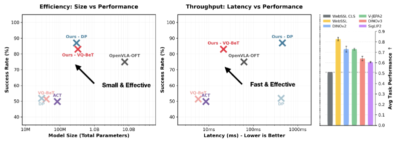
*Figure 1: Patch Policy demonstrates superior performance while remaining computationally lean in both parameter count and inference latency.*

---

## 2 Patch Policy

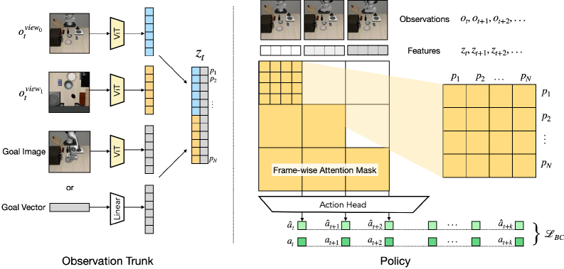
*Figure 2: Patch Policy consists of an observation trunk (left) with a policy head (right). We encode multiview observations into patch features and optionally concatenate goal embeddings (images/states) into the current timestep sequence.*

### 2.1 Observation Trunk

Given an image observation $o_t \in \mathbb{R}^{C \times H \times W}$, a ViT encoder divides it into patches and extracts dense patch features of shape $P \times D$ (number of patches × patch embedding dimension). We simply take all patch features as the visual representation for downstream policy learning. For an observation context window of length $T$, the resulting feature is a sequence of patch features of shape $T \times P \times D$. This formulation is agnostic to the specific ViT architecture or pretraining objective, and is backwards-compatible with global pooled features or state-based environments by setting $P=1$.

For goal-conditioned behavioral cloning, we admit either a goal image or a goal vector input. For goals specified as an image, we encode it with the same encoder and concatenate it with the observation tensor to form a policy input tensor $z_t$ of shape $T \times P \times 2D$. For goals specified as a vector $g \in \mathbb{R}^G$, we concatenate it to every observation token to form a tensor of shape $T \times P \times (D+G)$.

### 2.2 Policy Learning

We formulate policy learning as a sequence modeling problem over the extracted patch features. Patch Policy is compatible with any transformer-based policy architecture taking sequential inputs. To process the spatio-temporal patch feature tensor, we flatten the features into a sequence of length $T \times P$, add a learned 1D positional embedding indexed by the token's position in the flattened sequence, and apply a block-causal attention mask: patches maintain full bidirectional attention intra-frame but are causally masked inter-frame, allowing the model to integrate spatial information across each frame while preserving temporal causality.

This formulation is agnostic to the action head architecture and training objective. In our experiments, we evaluate Patch Policy using two state-of-the-art architectures: Vector-Quantized Behavior Transformer (VQ-BeT) [21], which uses a hybrid classification-regression loss, and Diffusion Policy (DP) [22], which uses a denoising objective.

---

## 3 Experiments

We evaluate Patch Policy across four simulated environments and three real robot manipulation environments.

### 3.1 Environments

We evaluate Patch Policy across four simulated environments (Push-T, LIBERO Goal, BlockPush, Cube) with 2D-to-7D action spaces, and three real-world tasks using a 7-DoF Franka arm with a parallel-jaw gripper (inserting a power cable, hanging a tool, and collecting pens into a holder).

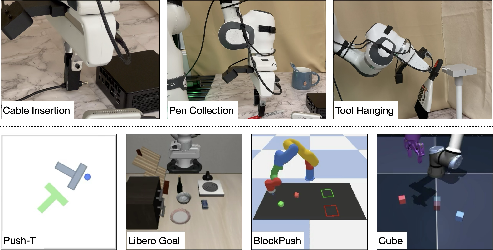
*Figure 3: We evaluate Patch Policy on four simulated and three real-world environments.*

### 3.2 Baselines

**Visual Representation Baselines:**
- **DynaMo [23]:** A global pooled representation learned via dynamics-based joint-embedding predictive architecture.
- **CLS Tokens:** The class token from the Vision Transformer, representing a compressed summary of the scene.
- **Average Pooling:** A baseline that collapses the spatial feature map into a single vector via global average pooling.

**Patch-based baselines:**
- **ACT [24]:** A conditional VAE that predicts action chunks with temporal ensembling. Uses patch features from a ResNet-18 vision encoder trained from scratch.
- **OpenVLA-OFT [25]:** A Vision-Language-Action (VLA) model that finetunes OpenVLA with parallel action decoding and L1 action regression.

### 3.3 How well does Patch Policy work?

**Table 1: Patch Policy on simulated environments.**

| Visual Representation | Policy | Push-T | LIBERO Goal | BlockPush | Cube |
| --- | --- | --- | --- | --- | --- |
| *Standard policies with globally pooled visual features* | | | | | |
| DynaMo | VQ-BeT | 0.66 | 0.93 | 0.65 | 0.28 |
| WebSSL Avg Pool | VQ-BeT | 0.54±0.02 | 0.97±0.04 | 0.84±0.18 | 0.25±0.02 |
| WebSSL CLS | VQ-BeT | 0.59±0.01 | 0.95±0.01 | 0.77±0.08 | 0.23±0.01 |
| DynaMo | Diffusion Policy | 0.73 | 0.68 | 1.06±0.10 | 0.27 |
| WebSSL Avg Pool | Diffusion Policy | 0.79±0.02 | 0.98±0.01 | 1.34±0.02 | 0.21±0.03 |
| WebSSL CLS | Diffusion Policy | 0.68±0.02 | **0.99**±0.01 | 0.99±0.12 | 0.21±0.03 |
| *Patch Policy: patch features* | | | | | |
| WebSSL Patch | VQ-BeT (Ours) | 0.68±0.03 | 0.94±0.01 | **1.68**±0.15 | 1.68±0.03 |
| WebSSL Patch | Diffusion Policy (Ours) | **0.80**±0.01 | 0.98±0.00 | 1.65±0.08 | **1.73**±0.02 |
| *Other patch-based policies (baselines)* | | | | | |
| ResNet-18 Patch | ACT | 0.64±0.03 | 0.93±0.02 | 0.15±0.01 | 0.69±0.11 |
| DINOv2+SigLIP Patch | OpenVLA-OFT | 0.59±0.02 | 0.95 | 1.43±0.17 | 1.50±0.09 |

Patch Policy using WebSSL patch features consistently outperforms global representations on precise, multi-object/spatial tasks (BlockPush, Cube), and competitive elsewhere. Remarkably, Patch Policy outperforms the fine-tuned OpenVLA-OFT baseline which fuses both DINOv2 and SigLIP features on all four environments.

### 3.4 Real World Robotic Manipulation with Patch Policy

We evaluate on three real-world manipulation tasks: Cable Insertion, Pen Collection, and Tool Hanging. We use DINOv2 (ViT-S) patch features for all real-world experiments.

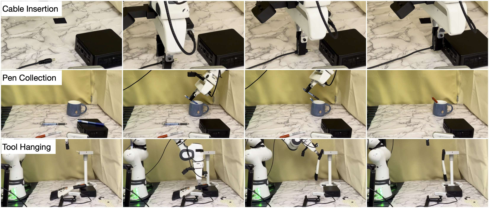
*Figure 4: Real-robot rollout examples for the three evaluation tasks: cable insertion, pen collection, and tool hanging.*

**Table 2: Real-robot success rates through task stages, 20 trials.**

| Task | Method | Stage 1 | Stage 2 | Stage 3 |
| --- | --- | --- | --- | --- |
| Cable Insertion | DINOv2 Patch + VQ-BeT (Ours) | 1.00 | 0.85 | **0.70** |
| | DINOv2 CLS + VQ-BeT | 1.00 | 0.70 | 0.60 |
| | ResNet-18 Patch + ACT | 1.00 | 0.40 | 0.35 |
| | DINOv2+SigLIP Patch + OpenVLA-OFT | 1.00 | 0.55 | 0.30 |
| Pen Collection | DINOv2 Patch + VQ-BeT (Ours) | 1.00 | 1.00 | **0.85** |
| | DINOv2 CLS + VQ-BeT | 1.00 | 0.95 | 0.65 |
| | ResNet-18 Patch + ACT | 1.00 | 0.85 | 0.65 |
| | DINOv2+SigLIP Patch + OpenVLA-OFT | 1.00 | 0.85 | 0.60 |
| Tool Hanging | DINOv2 Patch + VQ-BeT (Ours) | 1.00 | 0.90 | **0.90** |
| | DINOv2 CLS + VQ-BeT | 1.00 | 0.75 | 0.70 |
| | ResNet-18 Patch + ACT | 1.00 | 0.85 | 0.85 |
| | DINOv2+SigLIP Patch + OpenVLA-OFT | 0.95 | 0.90 | 0.65 |

### 3.5 Benchmarking Pre-trained Visual Representations

We evaluate five state-of-the-art visual representations: DINOv2 [6], DINOv3 [11], WebSSL [12], V-JEPA 2 [14], and SigLIP 2 [9].

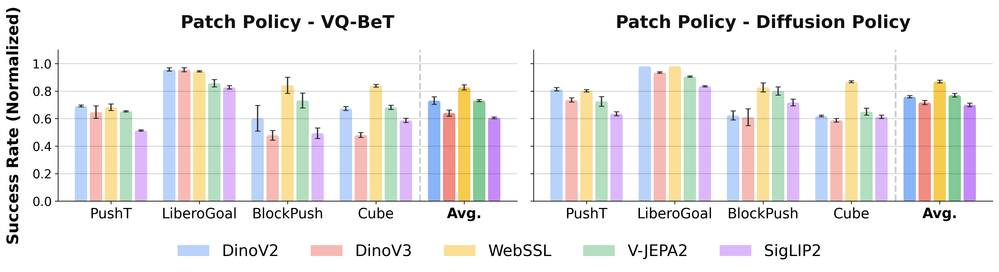
*Figure 5: Comparison of Patch Policy across various pretrained visual representations. DINOv2 and WebSSL are the most effective vision backbones for robot learning tasks.*

WebSSL and DINOv2 achieve the highest performance across the majority of tasks. SigLIP 2 falls short across the environments, likely because its emphasis on semantic language-image alignment sacrifices the dense geometric features necessary for manipulation.

### 3.6 Is Patch Policy computationally efficient?

**Table 3: Computational Resources and Inference Speed of Patch Policy.**

| Method | Total Params | Trainable Params | Inference Latency (ms) |
| --- | --- | --- | --- |
| VQ-BeT (ResNet-18) | 39.95M | 28.77M | 5.79 |
| Ours - VQ-BeT (DINOv2) | 51.55M | 29.49M | 10.99 |
| Ours - VQ-BeT (WebSSL) | 334.00M | 30.34M | 21.43 |
| DP (ResNet-18) | 29.35M | 9.09M | 421.89 |
| Ours - DP (DINOv2) | 40.43M | 9.19M | 445.85 |
| Ours - DP (WebSSL) | 303.66M | 9.35M | 451.68 |
| OpenVLA-OFT | 7.61B | 177.90M | 61.71 |
| ACT | 83.85M | 83.85M | 8.63 |

**Parameter Efficiency:** Patch Policy beats OpenVLA-OFT with under 5% of its parameters (as little as ~0.7% with ViT-S).

**Inference Latency:** Our VQ-BeT variants demonstrate exceptional speed even when processing dense DINOv2 patch features (10.99 ms), comparable to ACT with ResNet-18 at 8.63 ms.

**Training Cost:** Patch Policy with DINOv2 converges in 6.5 hours on 1×L40S (6.5 GPU-hours); OpenVLA-OFT converges in 4 hours on 4×L40S (16 GPU-hours); ACT converges in 12 hours on 2×L40S (24 GPU-hours).

### 3.7 Should we compress patch features?

**Table 4: Patch Compression**

| Resolution | Push-T |
| --- | --- |
| 256 patches | 0.69 |
| 64 patches | 0.52 |
| 16 patches | 0.53 |
| 4 patches | 0.51 |
| 1 patch | 0.48 |

Spatially downsampling the features results in a significant decrease in task success. The fine-grained spatial density of the original tokens is crucial for precise control.

---

## 4 Related Work

### 4.1 Imitation Learning

Imitation Learning (IL) enables agents to learn skills from expert demonstrations without explicit reward engineering [29]. Patch Policy addresses the performance gap between state-based and vision-based agents within vision-based behavioral cloning by equipping standard architectures with dense visual representations.

### 4.2 Visual Representation for Embodied Learning

Visual representation for control has evolved from in-domain self-supervised methods to Vision Transformers (ViTs) — such as DINO, V-JEPA, and SigLIP — that extract dense patch features instead of compressed global vectors. Patch Policy bridges this gap by directly integrating foundational patch features into lightweight policies.

---

## 5 Limitations

While Patch Policy effectively leverages dense spatial features for control, several directions remain for future work. First, we focused exclusively on frozen vision backbones, and future work could explore end-to-end fine-tuning. Second, dense tokens increase sequence length and training time. Optimizations like FlashAttention [58] could accelerate both training and inference. Finally, extending this patch-based architecture to reinforcement learning could be a promising direction.

---

## 6 Conclusion

Patch Policy demonstrates that dense visual representations from pre-trained ViTs can be directly integrated into lightweight policy architectures, achieving performance competitive with or superior to large VLA models at a fraction of the computational cost.

---

## References

[1] Dosovitskiy et al. An image is worth 16x16 words: Transformers for image recognition at scale. *ArXiv*, 2020.
[6] Oquab et al. DINOv2: Learning robust visual features without supervision. *ArXiv*, 2023.
[9] Tschannen et al. SigLIP 2: Multilingual vision-language encoders. *ArXiv*, 2025.
[11] Siméoni et al. DINOv3. 2025.
[12] Fan et al. Scaling language-free visual representation learning. *ArXiv*, 2025.
[14] Assran et al. V-JEPA 2: Self-supervised video models. *arXiv*, 2025.
[21] Lee et al. Behavior generation with latent actions. *ArXiv*, 2024.
[22] Chi et al. Diffusion policy: Visuomotor policy learning via action diffusion. *RSS*, 2023.
[23] Cui et al. DynaMo: In-domain dynamics pretraining for visuo-motor control. *ArXiv*, 2024.
[24] Zhao et al. Learning fine-grained bimanual manipulation with low-cost hardware. *ArXiv*, 2023.
[25] Kim et al. Fine-tuning vision-language-action models: Optimizing speed and success. *ArXiv*, 2025.

*(Full reference list available in the original paper)*

---

## Appendix A

### A.3 Zero-shot Manipulation in the Real World

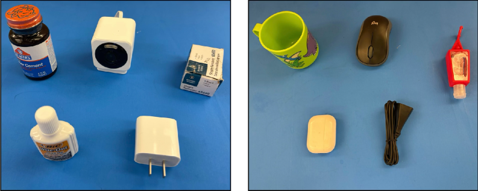
*Figure 6: We evaluate on 10 unseen objects for Real Franka Pickup.*

**Table 5: Real-world zero-shot object pickup results.**

| Method | Real Franka Pickup |
| --- | --- |
| CAP | 79% |
| Ours | **87%** |

**Table 6: Real-to-sim evaluations on EgoGym.**

| Method | EgoGym Pickup | EgoGym Open | EgoGym Close |
| --- | --- | --- | --- |
| CAP | 75.78% | 67.88% | 86.50% |
| Ours | **79.50%** | **71.40%** | **92.44%** |

### A.4 Benchmarking Pretrained Visual Representations

**Table 7: Effect of Pre-trained Visual Representations on Patch Policy-VQ-BeT.**

| Method | Push-T | LIBERO Goal | BlockPush | Cube |
| --- | --- | --- | --- | --- |
| Ours – DINOv2 | **0.69**±0.01 | **0.96**±0.01 | 1.20±0.23 | 1.35±0.03 |
| Ours – DINOv3 | 0.65±0.05 | **0.95**±0.02 | 0.96±0.09 | 0.96±0.04 |
| Ours – WebSSL | **0.68**±0.02 | **0.94**±0.01 | **1.68**±0.15 | **1.68**±0.02 |
| Ours – V-JEPA2 | 0.65±0.01 | 0.86±0.03 | 1.46±0.13 | 1.36±0.03 |
| Ours – SigLIP2 | 0.51±0.01 | 0.83±0.01 | 0.99±0.10 | 1.17±0.03 |

**Table 8: Effect of Pre-trained Visual Representations on Patch Policy-Diffusion Policy.**

| Method | Push-T | LIBERO Goal | BlockPush | Cube |
| --- | --- | --- | --- | --- |
| Ours – DINOv2 | **0.81**±0.01 | **0.98**±0.00 | 1.25±0.08 | 1.24±0.01 |
| Ours – DINOv3 | 0.73±0.02 | 0.94±0.01 | 1.22±0.15 | 1.17±0.03 |
| Ours – WebSSL | **0.80**±0.01 | **0.98**±0.00 | **1.65**±0.08 | **1.73**±0.02 |
| Ours – V-JEPA2 | 0.72±0.04 | 0.91±0.01 | 1.60±0.07 | 1.30±0.05 |
| Ours – SigLIP2 | 0.64±0.02 | 0.83±0.01 | 1.43±0.06 | 1.23±0.03 |

### A.6 Additional Ablations

**Table 12: Attention mask ablation for Patch Policy.**

| Mask | Ours - VQ-BeT Push-T | Ours - VQ-BeT Cube | Ours - DP Push-T | Ours - DP Cube |
| --- | --- | --- | --- | --- |
| Full | 0.64 | 1.09 | 0.83 | 1.10 |
| Token-causal | 0.73 | 1.36 | 0.70 | 0.11 |
| Block-causal (ours) | **0.70** | **1.38** | **0.83** | **1.24** |

**Table 13: Model Size Ablation (DINOv2 ViT-S patch features, Push-T).**

| Method | NN | n_heads | d_emb | Size | Final Coverage (↑) |
| --- | --- | --- | --- | --- | --- |
| Ours – VQ-BeT | 4 | 4 | 64 | 25.62M | 0.50 |
| Ours – VQ-BeT | 6 | 6 | 120 | 26.64M | 0.57 |
| Ours – VQ-BeT | 8 | 8 | 512 | 51.55M | **0.69** |
| Ours – Diffusion Policy | 4 | 4 | 64 | 22.77M | 0.07 |
| Ours – Diffusion Policy | 6 | 6 | 120 | 25.30M | 0.56 |
| Ours – Diffusion Policy | 8 | 4 | 256 | 40.43M | **0.83** |

### A.7 Additional Figures

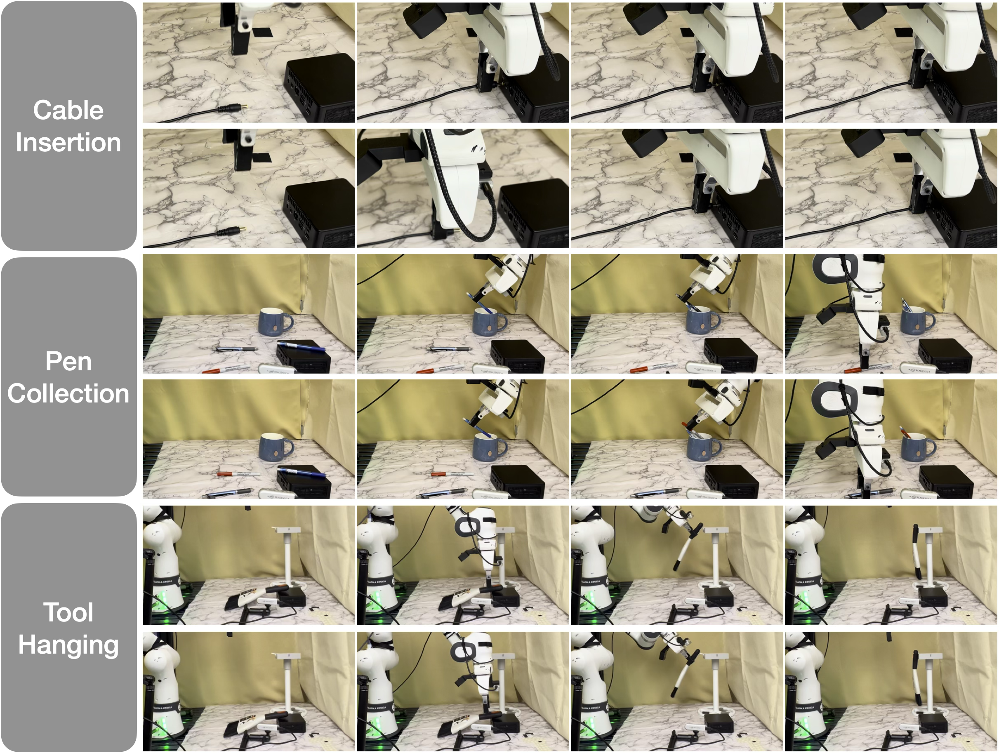
*Figure 7: Successful rollouts of Patch Policy for Cable Insertion, Pen Collection, and Tool Hanging.*

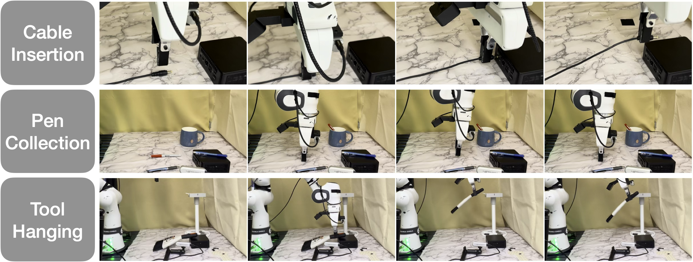
*Figure 8: Failure rollouts of Patch Policy for Cable Insertion, Pen Collection, and Tool Hanging.*

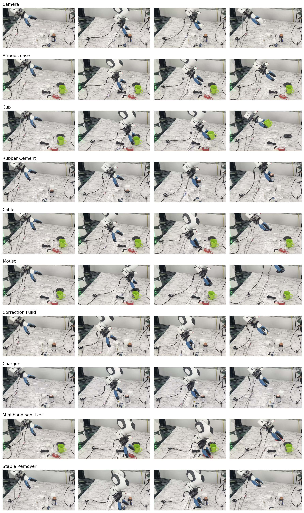
*Figure 9: CAP real Franka object pickup successes.*

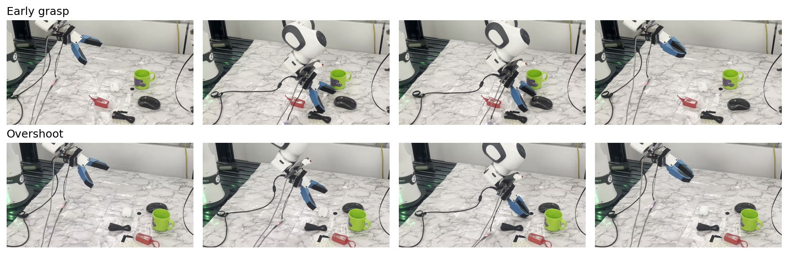
*Figure 10: CAP real Franka object pickup failure modes.*

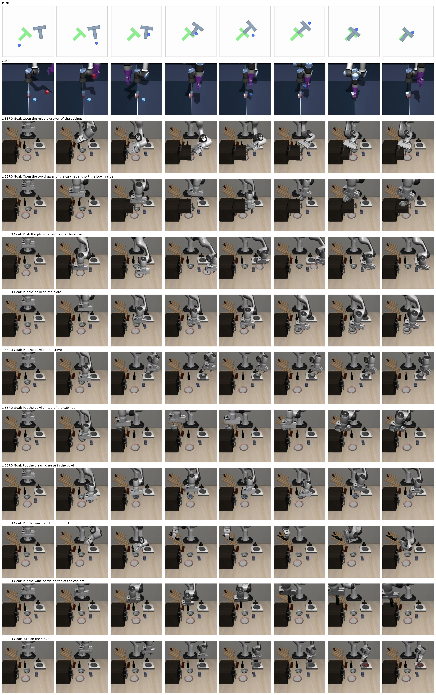
*Figure 11: Push-T, Cube, and LIBERO Goal environment Ours - VQ-BeT evaluation rollouts.*

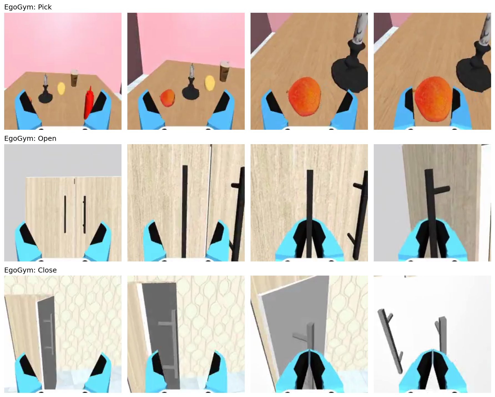
*Figure 12: EgoGym pick, open, and close Patch Policy evaluation rollouts.*

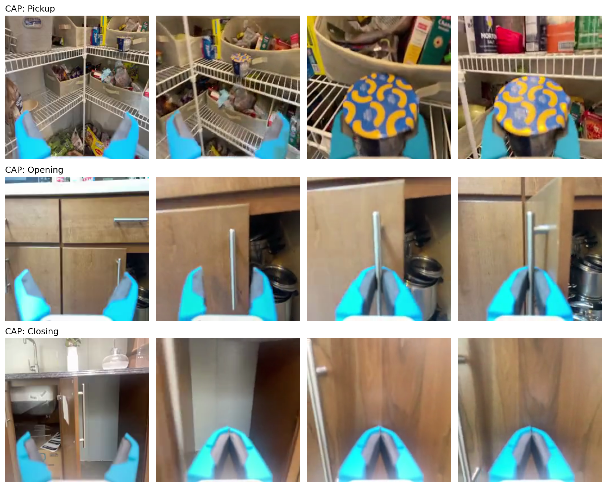
*Figure 13: CAP dataset pick, open, and close trajectory samples.*
