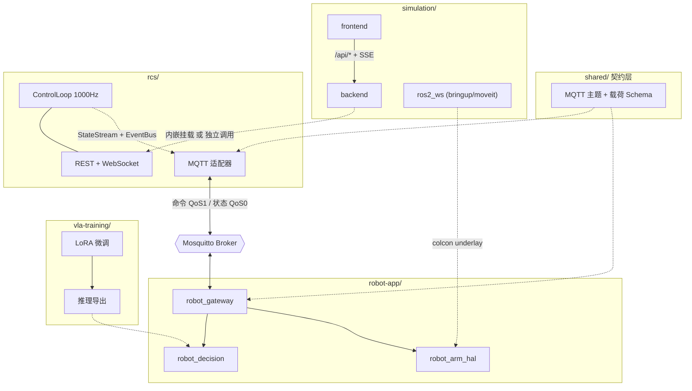

# 四子工程拆分设计文档

- **日期**: 2026-08-07
- **状态**: 已确认，执行中
- **范围**: 将 `robot-logic` 单体工程重构为 monorepo 下的 4 个子工程 + 1 个共享契约层，并落地 MQTT 通信桥接与 VLA 微调训练骨架

---

## 1. 背景与目标

当前工程是「FastAPI 后端 + Vue 前端 + ROS2 工作区」的混合单体结构：

- `backend/` 内同时承载**仿真编排后端**（设备/任务/场地/告警/日志/指标）与 **RCS-1 运动控制**（1000Hz 控制回路、正逆运动学、轨迹规划、仿真 HAL）
- `ros2_ws/src/` 内同时承载**仿真包**（Gazebo bringup、MoveIt 配置）与**机器人端应用包**（gateway/decision/perception/msgs，目前多为占位）
- 完全没有 VLA 训练相关代码，也没有 backend ↔ ROS2 的运行时通信

### 目标

拆分为 4 个职责独立、边界清晰的子工程：

| # | 子工程 | 职责 |
| --- | --- | --- |
| 1 | `rcs/` | RCS 机器人控制系统：控制装卸机器人与其他物流机器人设施 |
| 2 | `simulation/` | 物流装卸仿真系统（当前工程主体实现） |
| 3 | `vla-training/` | 装卸机器人端 VLA 模型训练工程 |
| 4 | `robot-app/` | 装卸机器人端应用，与 RCS 通信，接收命令 / 上传信息 |

外加 `shared/` 共享契约层，承载 RCS 与 robot-app 之间的 MQTT 主题规范与载荷 Schema。

---

## 2. 已确认的决策

| 决策项 | 选择 | 说明 |
| --- | --- | --- |
| 仓库组织 | 单仓 monorepo 子目录 | 同一 git 仓库下建 4 个顶层目录 |
| 交付范围 | 全部 | 结构拆分 + MQTT 桥接落地 + VLA 训练骨架 |
| RCS 定位 | 双模式 | 既能独立部署为 FastAPI 服务，也能被仿真后端内嵌挂载 |
| 仿真后端归属 | 归入 `simulation/` | 让 4 个子工程结构对称 |
| 桥接协议 | MQTT 消息总线 | Mosquitto broker + paho-mqtt |
| VLA 技术栈 | OpenVLA / RT 系列微调 | 数据转换 + LoRA 微调 + 部署导出 |

---

## 3. 现状分析（拆分前）

### 3.1 backend/ 内部边界

**RCS 逻辑（→ `rcs/`）**：`backend/rcs/` 全部

- `registry.py` — DeviceProfile 与控制器/HAL 单例注册表；默认 3 设备 `robot-01`(6轴臂,1000Hz)/`agv-01`(50Hz)/`stacker-01`(50Hz)，支持 `RCS_DEVICE_PROFILES` 环境变量覆盖
- `loop.py` — `ControlLoop`：每设备按 `control_hz` 的 tick 协程，`read → update → write`
- `service.py` — `/api/rcs/*` 路由：`registry`、`{device_id}/command`、`{device_id}/state`、`{device_id}/estop`、`{device_id}/clear_estop`、`_health`；WS `ws_overview` / `ws_device`
- `controllers/`（arm/agv/stacker/base/_common）、`hal/`（protocol 抽象 + SimHAL）、`planning/`（fk/ik/interpolator/trajectory）、`state/`（command/controller_state/error/joint/pose/profile/state_stream）
- `events.py` — 内部异步 `EventBus`，当前**无订阅者**
- `tests/` — 10 个 unit + 5 个 integration + conftest

**仿真/编排逻辑（→ `simulation/backend/`）**：

- `main.py`、`services/`（runtime/alerts/metrics/security）、`algorithm/`（simulator/scheduler/planner/perception）、`data/`（db/models）、`config.py`、`tests/`、`Dockerfile`、`pytest.ini`、`requirements.txt`

### 3.2 已确认的耦合点

| # | 耦合点 | 位置 | 处理方式 |
| --- | --- | --- | --- |
| 1 | 仿真后端挂载 RCS 路由 | `main.py:25` `from backend.rcs import rcs`；`main.py:156` `include_router(rcs.router(), prefix="/api/rcs")`；`main.py:136` `async with rcs.lifespan()` | 保留，改为**配置开关**控制 |
| 2 | RCS 依赖仿真后端鉴权 | `backend/rcs/service.py:10` `from backend.services.security import require_api_key` | **唯一横向依赖**，RCS 自带一份 `security.py` + `config.py` |
| 3 | 前端硬编码 `/api/*` | `frontend/` axios + EventSource | 保持路由前缀不变，前端零改动 |
| 4 | robot_gateway → backend | 仅设计意图（package.xml 描述、bringup stub 注释） | 本次以 MQTT 实现 |

### 3.3 ROS2 包归属

| 包 | 现状 | 归属 |
| --- | --- | --- |
| `robot_bringup` | 有实质内容：`arm.launch.py`(URDF+ros2_control，`use_gazebo` 切 Gazebo Harmonic/mock)、`empty_world.launch.py`、`urdf/robot.urdf.xacro` | `simulation/` |
| `robot_moveit_config` | 有实质内容：srdf/kinematics/ompl/joint_limits/ros2_controllers、`move_group.launch.py` | `simulation/` |
| `robot_arm_hal` | 有内容：`urdf/arm_hal.ros2_control.xacro`(mock/gz 双后端)、`stub.py` | `robot-app/`（仿真侧通过 colcon underlay 引用） |
| `robot_msgs` | 仅占位，无 `.msg`/`.action` | `robot-app/` |
| `robot_decision` | 仅 `__init__.py` 占位 | `robot-app/` |
| `robot_perception` | 仅 `__init__.py` 占位 | `robot-app/` |
| `robot_gateway` | 仅 `__init__.py` 占位 | `robot-app/`（MQTT 桥接落点） |

### 3.4 缺失部分（需从零新建）

- VLA / 机器学习 / 训练代码：全工程零命中（仅文档提及）
- backend ↔ ros2_ws 桥接：双向均无实现
- MQTT：无任何依赖或代码

---

## 4. 目标架构

```
robot-logic/
├── rcs/                  # 子工程1：RCS 机器人控制系统
│   ├── rcs/              #   包源码（含 mqtt/ 适配层、app.py 独立入口）
│   ├── tests/
│   ├── pyproject.toml / pytest.ini / Dockerfile / README.md
│
├── simulation/           # 子工程2：物流装卸仿真系统
│   ├── backend/          #   编排后端（原 backend/ 去掉 rcs/）
│   ├── frontend/         #   Vue3 + Three.js 可视化
│   └── ros2_ws/src/      #   robot_bringup / robot_moveit_config
│
├── robot-app/            # 子工程4：装卸机器人端应用
│   └── ros2_ws/src/      #   robot_gateway / robot_decision / robot_perception
│                         #   / robot_msgs / robot_arm_hal
│
├── vla-training/         # 子工程3：VLA 模型训练工程
│   ├── configs/ src/ scripts/
│
└── shared/               # 共享通信契约层
    ├── contracts/        #   MQTT 主题规范 + JSON Schema
    └── python/robot_contracts/   # Python 契约包
```

### 4.1 依赖方向



**依赖规则**：

- `shared/` 不依赖任何子工程（零运行时依赖）
- `rcs/` 与 `robot-app/` 单向依赖 `shared/`
- `simulation/backend` 可选依赖 `rcs/`（内嵌模式）
- 禁止 `rcs/` → `simulation/` 的反向依赖

---

## 5. 关键技术决策

### 决策一：RCS 双模式 = 工厂函数 + 既有门面

现有 `backend/rcs/__init__.py` 已有 `_RCSFacade` 门面，暴露 `lifespan()` / `router()` / `loop`。这天然就是双模式基础，只需新增独立入口：

- **内嵌模式**：`simulation/backend/main.py` 继续 `rcs.router()` / `rcs.lifespan()`，行为零变化
- **独立模式**：`rcs/rcs/app.py` 的 `create_app()` 构造独立 FastAPI 实例，挂载**同一个** `rcs_router` 于 `/api/rcs`，绑定自身 lifespan

选此方案而非拆两份代码或强制微服务化：复用已有抽象，改动面最小，两模式共享同一份路由与控制回路，无行为漂移风险。

### 决策二：复制而非共享鉴权

唯一横向依赖是 `service.py:10` 的 `require_api_key`（其又依赖 `backend.config.settings`）。

处理：在 `rcs/` 内建 `config.py` + `security.py`，从 `backend/services/security.py` 复制约 70 行实现。

**选择复制的理由**：鉴权是各服务的自治关切，未来演进方向不同（RCS 面向设备可能走 mTLS/证书，仿真后端面向操作员走 API Key）；强行共享会制造反向耦合。`shared/` 只承载真正需要双方**严格一致**的通信契约。

### 决策三：MQTT 适配器模式旁挂，不侵入控制回路

`ControlLoop._run` 是高频热路径 —— `robot-01` 配置 **1000Hz**，每 tick 需在 1ms 内完成 `read → update → write`。**绝不能在 tick 内做网络 I/O**。

设计：

- **状态上报**：复用 `StateStream.subscribe()` 队列（与 WebSocket 相同的消费方式）。
  **重要发现**：`StateStream` 内部已有 `max_fps=10.0` 的速率限制（`state_stream.py:24`），发布侧已是 10Hz，非 1000Hz。MQTT 适配器在此基础上再做**可配置的二次降采样**（默认与 10Hz 一致，即不额外降），并支持配置更低频率以减轻 broker 压力。
- **命令下行**：适配器订阅命令主题，走与 REST 路由**完全相同**的 `registry.get_controller(device_id).on_command(cmd)` 路径，复用 `COMMAND_QUEUE_MAXSIZE = 1024` 背压检查。
- **故障事件**：复用 `events.py` 的 `EventBus`。该总线已发布 `hal_read_timeout` / `hal_write_failure` / `controller_halted` 三类事件，文档注释明确说明「为未来订阅者预留」—— MQTT 适配器正是第一个订阅者，属设计意图内扩展。
- **可选启用**：环境变量开关。未配置 broker 时 RCS 行为与现状完全一致，零回归。

QoS 策略：状态 QoS 0（高频、可容忍丢失）、命令 QoS 1（不可丢失）。发布失败静默计数不抛异常。

### 决策四：`robot_arm_hal` 跨工作区引用

`robot_arm_hal` 同时被仿真侧（`robot_bringup/urdf/robot.urdf.xacro` 引用其 `arm_hal.ros2_control.xacro`）与机器人端需要。归入 `robot-app/ros2_ws/src/`，仿真侧通过 **colcon 多工作区叠加（underlay/overlay）** 引用：

```bash
# 1) 先构建并 source robot-app 工作区（underlay）
cd robot-app/ros2_ws && colcon build && source install/setup.bash
# 2) 再构建 simulation 工作区（overlay）
cd ../../simulation/ros2_ws && colcon build && source install/setup.bash
```

优于符号链接（Windows 兼容差）与复制（双份维护）。

### 决策五：前端零改动

`frontend/vite.config.ts` 代理 `'/api' → http://localhost:8000`，所有请求走相对路径。只要仿真后端仍监听 8000 且保持路由前缀，前端代码与配置**无需修改**，仅随目录整体迁移。启用独立 RCS 时，在 vite 代理新增 `/api/rcs` 指向 RCS 端口即可。

---

## 6. 迁移映射表

### 6.1 backend/ → rcs/ + simulation/backend/

| 源路径 | 目标路径 | 变更 |
| --- | --- | --- |
| `backend/rcs/__init__.py` | `rcs/rcs/__init__.py` | 保留门面，新增 `create_app` 导出 |
| `backend/rcs/service.py` | `rcs/rcs/service.py` | 第 10 行导入改 `from .security import require_api_key` |
| `backend/rcs/loop.py` | `rcs/rcs/loop.py` | 仅相对导入，tick 逻辑严禁改动 |
| `backend/rcs/registry.py` | `rcs/rcs/registry.py` | 无改动 |
| `backend/rcs/events.py` | `rcs/rcs/events.py` | 无改动 |
| `backend/rcs/controllers/` | `rcs/rcs/controllers/` | 无改动 |
| `backend/rcs/hal/` | `rcs/rcs/hal/` | 无改动 |
| `backend/rcs/planning/` | `rcs/rcs/planning/` | 无改动 |
| `backend/rcs/state/` | `rcs/rcs/state/` | 无改动 |
| `backend/rcs/tests/` | `rcs/tests/` | 16 个文件批量改 `from backend.rcs.*` → `from rcs.*` |
| `backend/main.py` | `simulation/backend/main.py` | RCS 导入与挂载改为条件式 |
| `backend/config.py` | `simulation/backend/config.py` | 新增 `rcs_embedded` / `rcs_service_url` |
| `backend/services/` | `simulation/backend/services/` | 改导入前缀 |
| `backend/algorithm/` | `simulation/backend/algorithm/` | 改导入前缀 |
| `backend/data/` | `simulation/backend/data/` | 改导入前缀 |
| `backend/tests/` | `simulation/backend/tests/` | 改导入前缀 |
| `backend/{Dockerfile,pytest.ini,requirements.txt,.env.example}` | `simulation/backend/` | 路径与模块名调整 |

**导入前缀策略**：`simulation/backend/` 内部包名保持 `backend`（即以 `simulation/` 为 `sys.path` 根），这样 `from backend.services.runtime import runtime` 等全部导入语句**无需修改**，只需调整启动命令的工作目录与 Dockerfile 的 COPY 上下文。这是改动面最小的方案。

### 6.2 frontend/ → simulation/frontend/

整体 `git mv`，源码零改动。

### 6.3 ros2_ws/ → simulation/ros2_ws/ + robot-app/ros2_ws/

| 源路径 | 目标路径 |
| --- | --- |
| `ros2_ws/src/robot_bringup/` | `simulation/ros2_ws/src/robot_bringup/` |
| `ros2_ws/src/robot_moveit_config/` | `simulation/ros2_ws/src/robot_moveit_config/` |
| `ros2_ws/src/robot_arm_hal/` | `robot-app/ros2_ws/src/robot_arm_hal/` |
| `ros2_ws/src/robot_msgs/` | `robot-app/ros2_ws/src/robot_msgs/` |
| `ros2_ws/src/robot_gateway/` | `robot-app/ros2_ws/src/robot_gateway/` |
| `ros2_ws/src/robot_decision/` | `robot-app/ros2_ws/src/robot_decision/` |
| `ros2_ws/src/robot_perception/` | `robot-app/ros2_ws/src/robot_perception/` |
| `ros2_ws/README.md` | `simulation/ros2_ws/README.md` |

`build/`、`install/`、`log/` 为 colcon 产物，不迁移，`.gitignore` 同步更新新路径。

---

## 7. 通信契约设计

### 7.1 MQTT 主题规范

| 主题 | 方向 | QoS | Retain | 说明 |
| --- | --- | --- | --- | --- |
| `rcs/{device_id}/command` | RCS ← robot-app/外部 | 1 | false | 命令下发 |
| `rcs/{device_id}/state` | RCS → robot-app | 0 | true | 状态上报（默认 10Hz） |
| `rcs/{device_id}/alert` | RCS → robot-app | 1 | false | 故障告警 |
| `robot/{device_id}/telemetry` | robot-app → RCS | 0 | false | 机器人端遥测上报 |

主题常量与构造函数集中在 `shared/python/robot_contracts/topics.py`，双方 import 使用，杜绝字符串硬编码。

### 7.2 命令载荷

严格对齐现有 `service.py` 的 `CommandRequest`，保证 REST 与 MQTT 两条入口**行为完全一致**：

| 字段 | 类型 | 约束 |
| --- | --- | --- |
| `command_id` | `str \| null` | 为空则服务端生成 uuid4 hex |
| `type` | `str` | 枚举：`move_j` / `move_l` / `stop` / `home` / `estop` / `recover` |
| `target_pose` | `Pose6D \| null` | `{x,y,z,rx,ry,rz}` |
| `target_joints` | `float[] \| null` | 长度需匹配设备 `num_joints` |
| `speed_scale` | `float` | `0.0 ≤ v ≤ 10.0`，默认 1.0 |
| `constraints` | `object \| null` | 自由字段 |

### 7.3 状态载荷

| 字段 | 说明 |
| --- | --- |
| `device_id` | 设备标识 |
| `mode` | 控制器模式（`ControllerMode` 枚举值） |
| `active_command_id` | 当前执行命令 ID |
| `last_error` | 最近错误信息 |
| `joint` | 关节状态（positions/velocities） |
| `err` | 跟踪误差 |
| `iso_ts` | UTC 时间戳 |

直接复用 `StateStream` 已产出的 JSON 帧结构，避免二次转换开销。

### 7.4 告警载荷

对齐 `EventBus` 的三类事件：

| 字段 | 说明 |
| --- | --- |
| `event` | `hal_read_timeout` / `hal_write_failure` / `controller_halted` |
| `device_id` | 设备标识 |
| `error` | 错误详情（`controller_halted` 可为空） |
| `iso_ts` | UTC 时间戳 |

---

## 8. 分阶段执行计划

每阶段结束系统仍可正常运行。

| 阶段 | 内容 | 验证 |
| --- | --- | --- |
| 1 | 设计文档（本文件） | — |
| 2 | `git mv` 目录迁移 + `.gitignore` 更新 | 文件就位 |
| 3 | 修复导入与配置路径（测试/Dockerfile/pytest.ini/deploy/scripts） | 两服务可启动，测试通过 |
| 4 | RCS 双模式：`config.py` / `security.py` / `app.py`，仿真侧加内嵌开关 | 独立与内嵌两种模式均可跑 |
| 5 | `shared/` 契约层 | 契约包可导入 |
| 6 | RCS 侧 MQTT 适配器 + 单元测试 | 降采样/重连/背压测试通过 |
| 7 | robot_gateway MQTT 桥接 + robot_msgs 契约 | 节点可构建 |
| 8 | `vla-training/` 骨架 | 目录与配置就位 |
| 9 | docker-compose、`verify_split.sh`、README 与架构文档 | 端到端链路连通 |

---

## 9. 风险与缓解

| 风险 | 缓解 |
| --- | --- |
| 大范围目录移动导致长时间不可用 | 分阶段，迁移后立即修复引用；全程 `git mv` 保留历史，可回退 |
| 1000Hz 控制回路被 MQTT 拖慢 | 适配器完全在独立协程，复用现有 `StateStream` 队列；tick 内零新增 I/O |
| REST 与 MQTT 两条命令入口行为漂移 | 共用同一 `on_command` 路径与同一背压常量；载荷 Schema 由 `shared/` 单一来源定义 |
| MQTT 引入新故障面 | 默认关闭；broker 不可达时静默降级，不影响 RCS 主功能 |
| Windows 下 colcon 多工作区叠加 | 采用官方 underlay/overlay 标准做法，非符号链接 |
| 前端因路径变更失效 | 后端端口与路由前缀完全不变，前端零改动 |

---

## 10. 明确不在本次范围内

- 真实硬件 HAL / Gazebo HAL 实现（当前仅 SimHAL）
- VLA 模型权重下载与实际训练执行（仅骨架 + 依赖声明）
- `robot_decision` / `robot_perception` 的算法实现（保持占位，仅预留 VLA 推理接入点）
- RBAC 权限体系、地图级路径规划
- 前端 RCS 控制面板
