# 物流园区 RCS 演进路线图

> Last updated: 2026-08-23
> Time span: 2026-08 → 2027-08

---

## 1. 总览（Executive Summary）

本路线图定义 robot-logic 项目从当前原型到四场景全量生产可用的 12 个月演进路径。核心理念：**平台优先（D），场景并行（C），先轻后重**。

### 时间跨度

| 阶段 | 时间范围 | 核心目标 |
|------|----------|----------|
| **M1** | Month 1-3（2026-09 ~ 2026-11） | 打通端到端平台骨架，场景 B（仓储拣选）MVP 上线 |
| **M2** | Month 4-6（2026-12 ~ 2027-02） | 四场景 A/B/C/D 共享平台并行接入，启动 VLA 试点 |
| **M3** | Month 7-12（2027-03 ~ 2027-08） | 从单一园区扩展到多园区多租户，商业化部署 |

### 三阶段里程碑

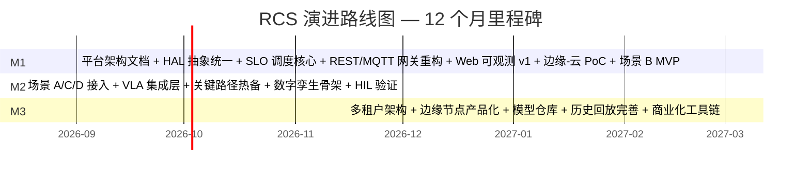

### 关键决策点（Go/No-Go）

| 里程碑 | 决策点 | 通过标准 |
|--------|--------|----------|
| **M1 Go** | 2026-11-30 | SLO 调度 P95 延迟 < 500ms；HAL 抽象覆盖 80% 设备差异；场景 B MVP 完成 100 单试跑 |
| **M2 Go** | 2027-02-28 | 四场景完成 1000 单生产试跑；VLA 双臂抓取成功率 > 85% |
| **M3 Go** | 2027-08-31 | 多园区数据隔离 100% 校验；TCO 达标；续约率 ≥ 80% |

### 资源估算

| 角色 | M1（人月） | M2（人月） | M3（人月） | 合计 |
|------|-----------|-----------|-----------|------|
| 控制算法工程师 | 3 | 4 | 3 | 10 |
| 机器人软件工程师 | 3 | 5 | 4 | 12 |
| MLOps / VLA 工程师 | 1 | 3 | 3 | 7 |
| 前端工程师 | 2 | 2 | 2 | 6 |
| 后端工程师 | 2 | 3 | 3 | 8 |
| SRE / 基础设施 | 1 | 2 | 3 | 6 |
| **合计** | **12** | **19** | **18** | **49** |

---

## 2. 当前状态盘点（As-Is）

### 2.1 已有能力清单

#### shared/ — 零依赖通信契约

| 组件 | 状态 | 说明 |
|------|------|------|
| JSON Schema 契约 | ✅ 完善 | command/state/alert/telemetry 四类 |
| Pydantic 模型 | ✅ 完善 | 与 Schema 同步更新 |
| 坐标系统一 | ✅ 完善 | `Pose` 类 + `SiteTCPPose` 配置 |
|  kinematics.py | ✅ 完善 | FK/IK 通用实现 |

#### rcs/ — 机器人控制系统

| 组件 | 状态 | 说明 |
|------|------|------|
| ArmController（PD 闭环） | ✅ 完善 | 单臂 6-DOF，kp=0.3/kd=0.5 |
| AgvController | ✅ 完善 | diff-drive 底盘 |
| StackerController | ✅ 完善 | 堆垛机 |
| ForkliftController | ✅ 完善 | 3 关节独立 PID |
| DualArmLoaderController | ✅ 完善 | 双 PD 同步闭环 |
| MQTT 适配器 | ✅ 完善 | REST+MQTT 双协议 |
| 控制器状态机 | ✅ 完善 | IDLE/RUNNING/HALTED/FAULT/E_STOP |
| REST API（/api/rcs/*） | ✅ 完善 | 设备注册/命令/状态/E-STOP |

#### simulation/ — 物流仿真

| 组件 | 状态 | 说明 |
|------|------|------|
| FastAPI + SQLite 后端 | ✅ 完善 | 异步 SQLAlchemy |
| Vue 3 + Three.js 前端 | ✅ 完善 | 设备 3D 模型 |
| SSE 端点 | ✅ 完善 | joints(30Hz) / detections(10Hz) / nav_path(1Hz) |
| PointCloudGenerator | ✅ 完善 | 合成深度相机 |
| LaserScanGenerator | ✅ 完善 | 合成 2D LIDAR |
| PointCloudProcessor | ✅ 完善 | 7 步 numpy 管线（Union-Find 聚类） |
| BaseExecutor（Nav2） | ✅ 完善 | NavigateToPose action client |
| Top 3 场景（pallet/box/bag） | ✅ 完善 | 托盘/箱装/袋装 |
| PalletForklift / BoxGripper / BagGripper | ✅ 完善 | Three.js 程序生成 |
| 仓库 3D 迁移设计 | 📋 已设计 | 待实施（Phase 1 范围外） |
| ScenePresets / load_scene | ✅ 完善 | 3 个场景预设 |

#### robot-app/ — 机器人端应用

| 组件 | 状态 | 说明 |
|------|------|------|
| MQTT Gateway | ✅ 完善 | MQTT ↔ ROS 2 桥接 |
| TaskCoordinator | ✅ 完善 | 9 阶段 FSM + ABORTING |
| SafetyMonitor | ✅ 完善 | 独立安全互锁 |
| ArmExecutor（MoveIt） | ✅ 完善 | 轨迹规划 |
| HugController | ✅ 完善 | 双臂同步抱夹 |
| robot_dual_arm_hal | ✅ 完善 | left/right 双臂 URDF |
| robot_base_hal | ✅ 完善 | diff_drive 底盘 |
| robot_msgs | ✅ 完善 | 本地消息契约 |
| VLA VLAPolicy | ✅ 占位 | 需接入真实模型 |

#### vla-training/ — VLA 训练管线

| 组件 | 状态 | 说明 |
|------|------|------|
| 数据采集（collector.py） | ✅ 完善 | SimulationCollector |
| 闭环评估（evaluate.py） | ✅ 完善 | evaluate_closed_loop |
| 模型架构 | ✅ 占位 | 需接入真实 VLA |
| LoRA 微调 | ✅ 占位 | 需完善训练脚本 |
| HyEmbodied Bug | ⚠️ 待修复 | trust_remote_code 变量名 BUG |

### 2.2 已有 HAL 与设备覆盖

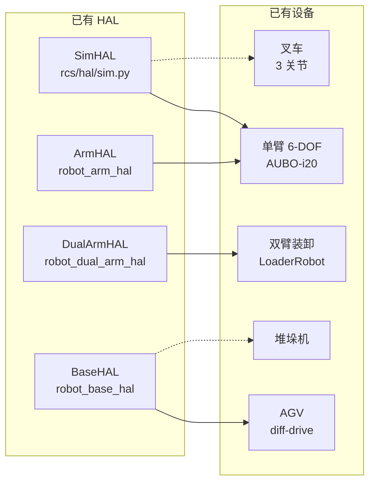

| 设备类型 | 控制器 | 状态 | 缺口 |
|----------|--------|------|------|
| 单臂 6-DOF | ArmController | ✅ PD 闭环 | — |
| 双臂装卸 | DualArmLoaderController | ✅ 双 PD | — |
| AGV | AgvController | ✅ diff-drive | — |
| 堆垛机 | StackerController | ✅ | — |
| 叉车 | ForkliftController | ✅ 3-PID | — |
| **Pallet Forklift** | ForkliftController | ✅ | — |
| 双臂 AGV | — | ⚠️ 待实现 | 需新增复合设备类型 |

### 2.3 已有调度能力与缺口

**已有**：
- 任务调度：`Runtime.create_task()` + 优先级队列
- 控制器调度：设备级闭环控制
- MQTT 桥接：RCS ↔ robot-app 全 MQTT 通信

**缺口**：
- SLO 弹性调度：无（当前为简单 FIFO）
- 规则引擎：无
- VLA 视觉决策：无
- 跨设备协调（多臂 AGV）：无
- 故障重分配：无

### 2.4 已有仿真能力

| 能力 | 状态 | 说明 |
|------|------|------|
| 几何仿真 | ✅ 完善 | 状态机 + 几何计算 |
| 合成传感器 | ✅ 完善 | PointCloud + LaserScan |
| 感知仿真 | ✅ 完善 | 7 步点云管线 |
| 导航仿真 | ✅ 完善 | Nav2 BaseExecutor |
| 场景仿真 | ✅ 完善 | pallet/box/bag 3 场景 |
| 数字孪生 | ⚠️ 设计中 | 仓库 3D 迁移待实施 |
| HIL | ❌ 无 | 待建设 |
| MuJoCo | ❌ 无 | 待引入 |

### 2.5 文档体系完整性

| 文档 | 位置 | 状态 |
|------|------|------|
| 架构文档 | `docs/technical/ARCHITECTURE.md` | ✅ 完善 |
| 运维手册 | `docs/technical/OPERATIONS-ZH.md` | ✅ 完善 |
| 算法总览 | `docs/algorithm/01-overview.md` | ✅ 完善 |
| API 文档 | `docs/technical/API.md` | ✅ 完善 |
| Top 3 RCS 设计 | `docs/superpowers/specs/2026-08-14-top3-rcs-robotapp-design.md` | ✅ 完善 |
| 仿真实施计划 | `docs/superpowers/plans/2026-08-14-top3-simulation-plan.md` | ✅ 完善 |
| 仓库 3D 迁移设计 | `docs/superpowers/specs/2026-08-20-warehouse-3d-migration-design.md` | ✅ 已批准 |
| RCS 对齐优化 | `docs/optimization-execution-plan.md` | ✅ 已完成 |
| **平台架构文档** | `docs/technical/06-platform.md` | ❌ **待新增** |
| **演进路线图** | `docs/technical/ROADMAP.md` | 📍 本文档 |

---

## 3. 目标状态愿景（To-Be）

### 3.1 12 个月后的目标架构

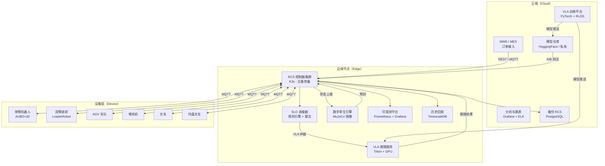

### 3.2 四场景全部生产可用

| 场景 | 设备 | 核心能力 | 目标 |
|------|------|----------|------|
| **A：集装箱拆装箱** | 双臂机器人 + VLA | 视觉引导 + 力控抓取 | 抓取成功率 > 85% |
| **B：仓储拣选** | AGV + 装卸机器人 | SLO 调度 + 规则引擎 | P95 延迟 < 500ms |
| **C：月台装卸** | Pallet Forklift | 3 关节 PID + 托盘对接 | 插入成功率 > 98% |
| **D：跨楼层运输** | STACKER + 电梯联动 | 多设备协调 + 路径规划 | 吞吐量提升 30% |

### 3.3 平台化能力

| 能力 | M1 | M2 | M3 |
|------|----|----|----|
| **HAL 抽象** | 统一接口 + SIM/REAL 双模式 | 全设备覆盖 | 多厂商适配 |
| **SLO 调度** | 规则引擎核心 | 算法优化 + VLA 仲裁 | 多园区弹性调度 |
| **可观测** | Web 看板 v1 | 全链路追踪 | 历史回放 + 根因分析 |
| **数字孪生** | — | 镜像骨架 | 预测性维护 |

### 3.4 VLA 集成路线

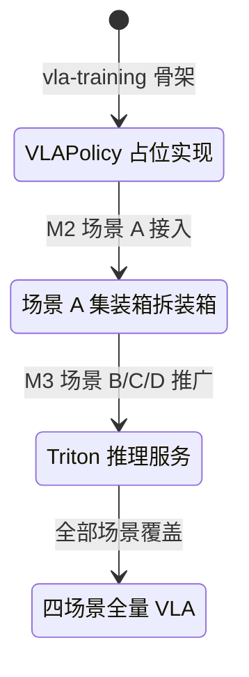

### 3.5 多租户支持

| 阶段 | 隔离级别 | 能力 |
|------|----------|------|
| M1 | 无租户 | 单园区运行 |
| M2 | 逻辑隔离 PoC | 多租户数据隔离验证 |
| M3 | 主园区物理隔离 | 租户独立部署 |
| M3 | 次园区逻辑隔离 | Namespace 级别隔离 |

---

## 4. 阶段 1（M1：Month 1-3）—— 平台骨架 + 单场景 MVP

### 4.1 阶段目标

**2026-09-01 ~ 2026-11-30**

打通端到端平台骨架，场景 B（仓储拣选）MVP 上线，验证平台能力复用性。

### 4.2 关键交付

#### 4.2.1 平台架构文档（`docs/technical/06-platform.md`）

定义平台层的职责边界、模块接口、部署拓扑。

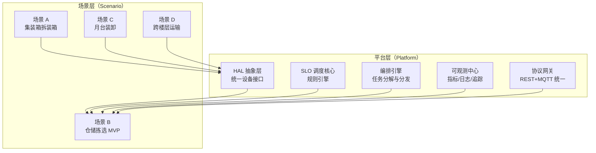

#### 4.2.2 SLO 调度核心

**目标**：实现规则引擎 + 优先级调度的 SLO 调度，支撑场景 B。

**文件结构**：

```
rcs/services/scheduling/
├── __init__.py
├── slo_engine.py         # SLO 定义与评估
├── rule_engine.py        # 规则匹配引擎
├── scheduler.py          # 调度器（规则 + 优先级）
├── priority_queue.py     # 优先级队列
└── tests/
    ├── test_slo_engine.py
    ├── test_rule_engine.py
    └── test_scheduler.py
```

**SLO 定义示例**：

```python
@dataclass
class SLODefinition:
    name: str
    metric: str                    # "latency_p95" | "throughput" | "success_rate"
    target: float
    window_seconds: int = 60
    priority_weight: float = 1.0  # 调度权重

SLO_PROFILES = {
    "critical": SLODefinition("critical", "latency_p95", 500.0, priority_weight=3.0),
    "normal":   SLODefinition("normal",   "latency_p95", 2000.0, priority_weight=1.0),
    "batch":    SLODefinition("batch",    "throughput",  100.0,  priority_weight=0.5),
}
```

**调度决策流程**：

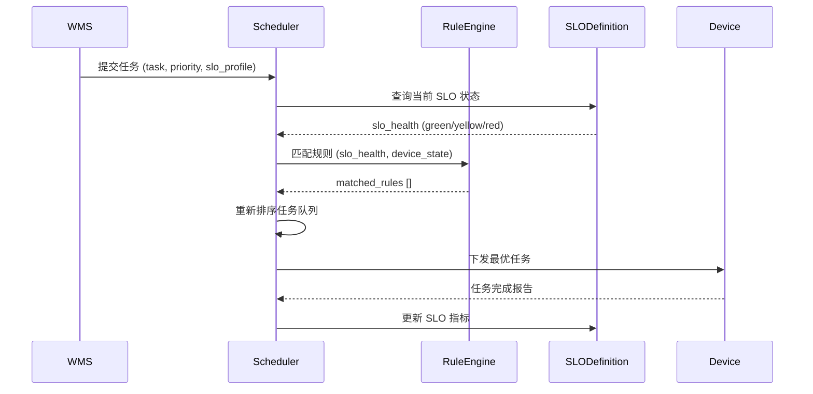

#### 4.2.3 HAL 抽象统一

**目标**：建立统一的 HAL 接口层，支持 SIM/REAL 双模式切换。

**接口定义**：

```python
# rcs/hal/protocol.py
class HALInterface(ABC):
    """HAL 抽象基类 — 所有设备驱动必须实现此接口"""
    
    @abstractmethod
    def read_state(self) -> JointState:
        """读取当前关节状态"""
        pass
    
    @abstractmethod
    def send_command(self, cmd: Command) -> bool:
        """发送控制命令"""
        pass
    
    @abstractmethod
    def estop(self) -> None:
        """紧急停止"""
        pass
    
    @abstractmethod
    def recover(self) -> None:
        """从错误状态恢复"""
        pass
    
    @property
    @abstractmethod
    def device_type(self) -> DeviceType:
        """设备类型标识"""
        pass
    
    @property
    def is_connected(self) -> bool:
        """连接状态"""
        return self._connected
```

**驱动注册表**：

```python
# rcs/hal/registry.py
HAL_REGISTRY: dict[DeviceType, type[HALInterface]] = {
    DeviceType.ARM:           ArmHAL,
    DeviceType.DUAL_ARM:      DualArmHAL,
    DeviceType.AGV:           AgvHAL,
    DeviceType.STACKER:       StackerHAL,
    DeviceType.FORKLIFT:      ForkliftHAL,
    DeviceType.PALLET_FORKLIFT: PalletForkliftHAL,
}

def create_hal(device_type: DeviceType, mode: str = "sim") -> HALInterface:
    """工厂方法：根据设备类型和模式创建 HAL 实例"""
    hal_class = HAL_REGISTRY.get(device_type)
    if hal_class is None:
        raise ValueError(f"Unsupported device type: {device_type}")
    return hal_class(mode=mode)
```

#### 4.2.4 REST + MQTT 网关重构

**目标**：统一协议网关，消除重复代码，支持四场景设备接入。

**架构**：

```mermaid
graph LR
    subgraph "协议网关（Gateway）"
        REST[REST 适配器<br/>/api/rcs/*]
        MQTT_AD[MQTT 适配器<br/>rcs/{device_id}/*]
        UNI[统一命令处理器<br/>on_command()]
    end
    
    REST --> UNI
    MQTT_AD --> UNI
    UNI --> CONTROLLER[控制器层]
    
    style UNI fill:#e1f5fe
```

#### 4.2.5 Web 可观测看板 v1

**目标**：实时展示设备状态、任务进度、SLO 健康度。

**功能**：
- 设备状态面板（在线/运行/故障）
- 任务队列与进度
- SLO 指标仪表盘
- 告警历史

#### 4.2.6 边缘-云架构 PoC

**目标**：验证边缘 RCS 与云端分析平台的通信架构。

**拓扑**：

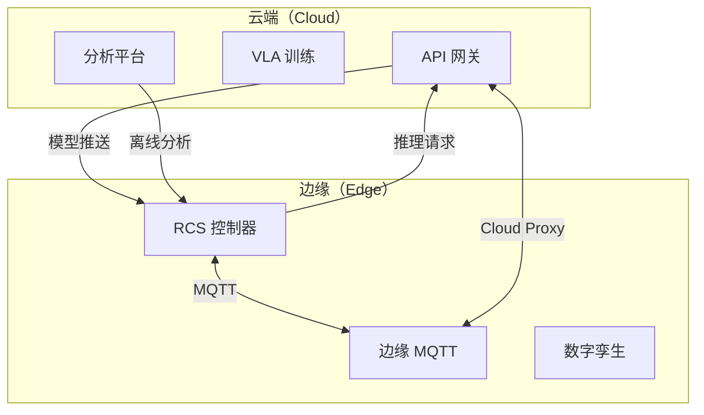

#### 4.2.7 场景 B MVP（仓储拣选）

**设备**：AGV + 装卸机器人

**KPI**：

| 指标 | 目标 | 测量方式 |
|------|------|----------|
| 订单履约率 | ≥ 95% | 完成订单 / 总订单 |
| SLO 达成率 | ≥ 90% | SLO 达标时间 / 总时间 |
| P95 调度延迟 | < 500ms | Prometheus histogram |
| 设备可用性 | ≥ 99% | 正常运行时间 / 总时间 |

**任务流**：

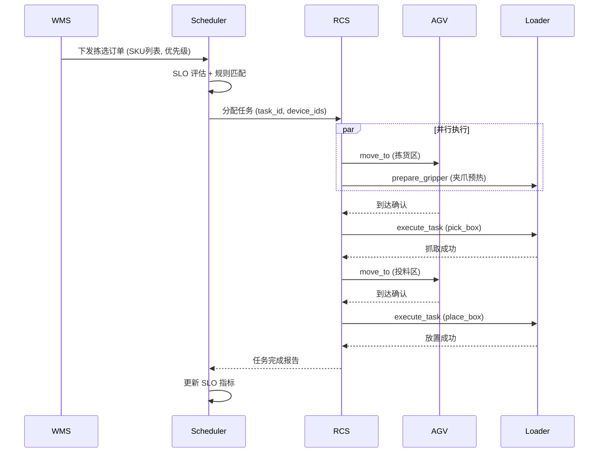

### 4.3 Go/No-Go 标准

| 标准 | 目标 | 验证方法 |
|------|------|----------|
| SLO 调度 P95 延迟 | < 500ms | Prometheus histogram p95 |
| HAL 抽象覆盖率 | ≥ 80% | 接口覆盖率测试 |
| 场景 B 100 单试跑 | 成功率 ≥ 90% | 集成测试 |
| 平台文档 | 完整度 ≥ 80% | 文档审查 |
| CI 通过率 | 100% | GitHub Actions |

### 4.4 风险与缓解

| 风险 | 概率 | 影响 | 缓解措施 | 责任人 |
|------|------|------|----------|--------|
| 调度算法与现有 orchestration 不兼容 | 中 | 高 | M1 前两周先做接口对齐 POC | 控制算法工程师 |
| MQTT 高并发稳定性 | 中 | 中 | 压力测试 + Kafka 备选评估 | 后端工程师 |
| HAL 覆盖 80% 设备差异 | 低 | 高 | 优先实现核心设备，其余延后 | 机器人软件工程师 |
| 场景 B KPI 不达标 | 低 | 高 | 预留 2 周调优缓冲 | 全团队 |

---

## 5. 阶段 2（M2：Month 4-6）—— 四场景并行 + VLA 试点

### 5.1 阶段目标

**2026-12-01 ~ 2027-02-28**

四场景 A/B/C/D 共享平台并行接入，启动 VLA 试点，验证平台扩展性。

### 5.2 关键交付

#### 5.2.1 场景 A — 集装箱拆装箱（双臂机器人 + VLA）

**设备链**：
```
[双臂装卸机器人] → [AGV] → [立体库]
```

**核心能力**：
- VLA 视觉引导：目标检测 + 6-DoF 姿态估计
- 双臂同步抱夹：力控闭合 + 同步误差 ≤ 3mm
- 集装箱内货物识别：遮挡处理 + 抓取顺序规划

**KPI**：

| 指标 | 目标 |
|------|------|
| 抓取成功率 | > 85% |
| 单件节拍 | ≤ 8s |
| 压溃率 | 0% |

#### 5.2.2 场景 C — 月台装卸（Pallet Forklift）

**设备链**：
```
[Pallet Forklift] → [AGV] → [仓库]
```

**核心能力**：
- 3 关节独立 PID 精细控制
- 托盘插入视觉辅助
- AGV 对接精度 ±5mm

**KPI**：

| 指标 | 目标 |
|------|------|
| 插入成功率 | ≥ 98% |
| 单托盘节拍 | ≤ 12s |
| 吞吐量 | ≥ 5 托盘/h |

#### 5.2.3 场景 D — 跨楼层运输（STACKER + 电梯联动）

**设备链**：
```
[STACKER] → [电梯] → [STACKER] → [仓库层]
```

**核心能力**：
- 多设备协调协议
- 立体库路径规划
- 电梯联动时序控制

**KPI**：

| 指标 | 目标 |
|------|------|
| 吞吐量提升 | ≥ 30% |
| 楼层切换时间 | ≤ 30s |
| 任务冲突率 | ≤ 2% |

#### 5.2.4 VLA 集成层

**架构**：

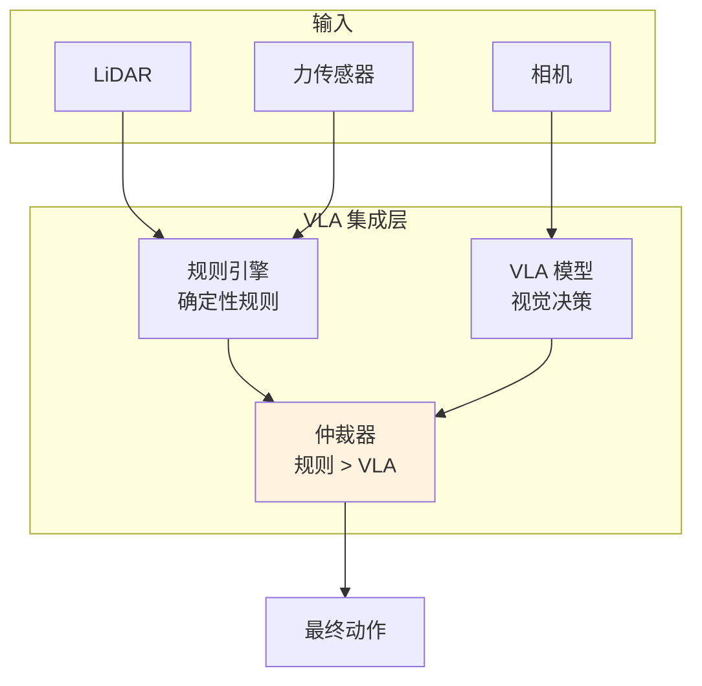

**仲裁策略**：
- 确定性规则优先：安全限制、硬约束
- VLA 辅助决策：抓取点选择、避障路径
- 冲突时降级：VLA 不可用时回退到规则

#### 5.2.5 关键路径热备切换

**目标**：关键 RCS 节点热备，故障自动切换。

**架构**：

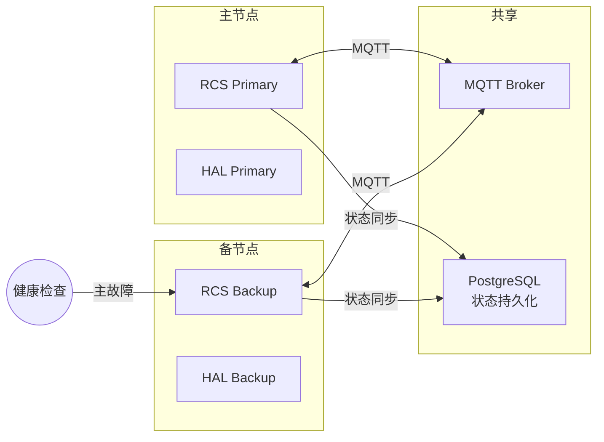

**故障检测**：
- RCS 心跳超时（3s）
- HAL 状态异常
- MQTT 连接断开

**切换流程**：
1. 检测主节点故障
2. 备节点晋升为主节点
3. 接管设备控制
4. 告警通知
5. 事后复盘

#### 5.2.6 数字孪生骨架

**目标**：建立仓库数字孪生镜像，支持离线仿真。

**能力**：
- 仓库布局 1:1 镜像（来自仓库 3D 迁移设计）
- 设备运动学镜像
- 任务流仿真
- 瓶颈分析

#### 5.2.7 HIL 验证环境

**目标**：Hardware-in-the-Loop 验证关键算法。

**拓扑**：

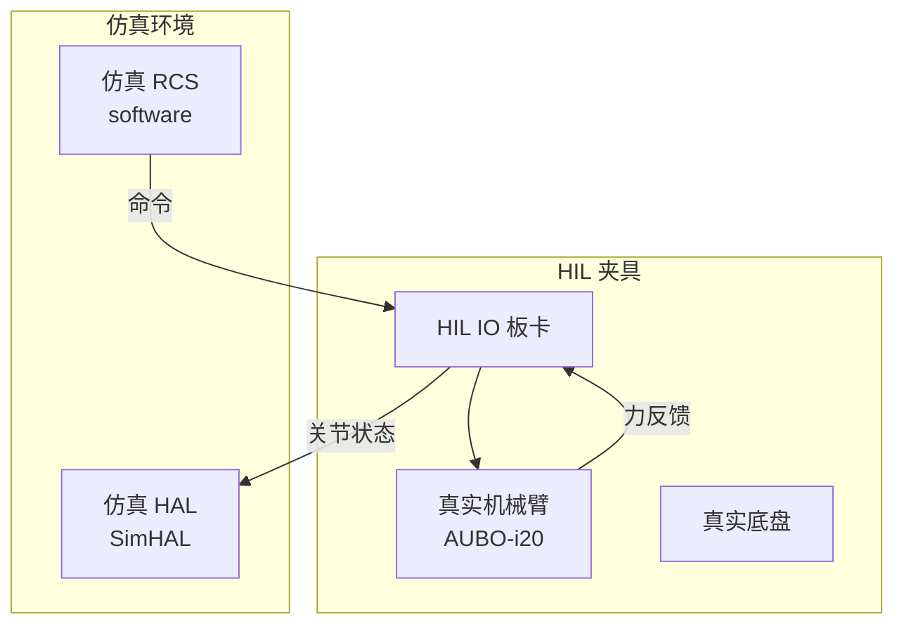

### 5.3 Go/No-Go 标准

| 标准 | 目标 | 验证方法 |
|------|------|----------|
| 四场景 1000 单试跑 | 成功率 ≥ 90% | 集成测试 |
| VLA 抓取成功率 | > 85% | 场景 A 实测 |
| 热备切换时间 | < 5s | 故障注入测试 |
| 数字孪生同步误差 | < 100ms | 时间戳比对 |
| HIL 验证覆盖率 | ≥ 80% 关键算法 | HIL 测试用例 |

### 5.4 风险与缓解

| 风险 | 概率 | 影响 | 缓解措施 | 责任人 |
|------|------|------|----------|--------|
| 四场景并行资源分散 | 高 | 中 | 优先级排序，场景 B/C 优先 | 项目经理 |
| VLA 推理延迟不满足实时 | 中 | 高 | 提前评估推理框架（Triton） | MLOps |
| 热备切换数据一致性 | 中 | 高 | PostgreSQL WAL +幂等设计 | 后端工程师 |
| HIL 环境搭建周期长 | 中 | 中 | M2 第一个月完成 HIL 搭建 | 机器人软件工程师 |

---

## 6. 阶段 3（M3：Month 7-12）—— 规模复制 + 多租户

### 6.1 阶段目标

**2027-03-01 ~ 2027-08-31**

从单一园区扩展到多园区多租户，建立商业化部署工具链。

### 6.2 关键交付

#### 6.2.1 多租户架构

**隔离策略**：

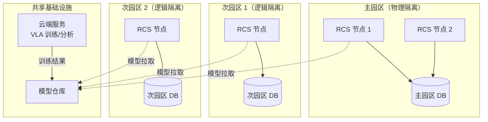

**数据隔离校验**：
- 租户 ID 强制校验
- 跨租户查询禁止
- 审计日志完整

#### 6.2.2 边缘节点产品化

**目标**：K3s / Docker Compose 一键部署。

**交付物**：
- Helm Chart（K3s）
- Docker Compose（轻量部署）
- 升级回滚脚本
- 配置管理（ConfigMap + Secret）

**部署架构**：

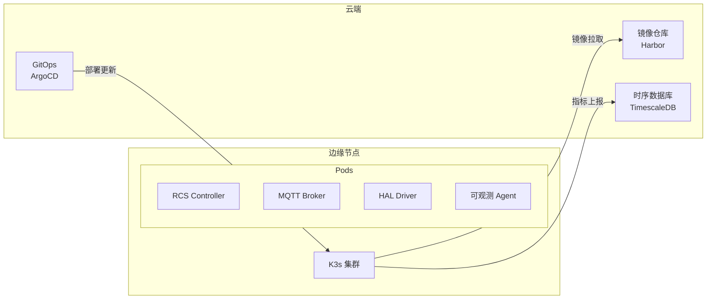

#### 6.2.3 模型仓库 + 数据闭环

**数据闭环流程**：

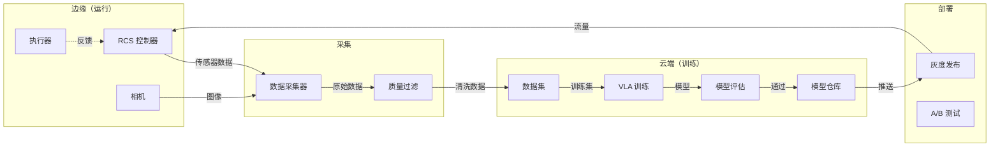

#### 6.2.4 历史回放系统完善

**功能**：
- 全量事件录制
- 高效压缩存储
- 快速检索回放
- 异常标记与分享

#### 6.2.5 商业化部署工具链

**工具链组成**：

| 工具 | 用途 | 选型 |
|------|------|------|
| 镜像构建 | 容器化 | Docker + Kaniko |
| 配置管理 | 参数化 | Helm + Kustomize |
| 秘钥管理 | 敏感信息 | Vault / Sealed Secrets |
| 监控告警 | 可观测 | Prometheus + Alertmanager |
| 日志收集 | 集中日志 | Loki + Promtail |
| CI/CD | 流水线 | GitHub Actions + ArgoCD |
| 文档 | 部署手册 | MkDocs |

### 6.3 Go/No-Go 标准

| 标准 | 目标 | 验证方法 |
|------|------|----------|
| 多园区数据隔离 | 100% 校验 | 安全审计 |
| TCO | 单园区 < 阈值 | 成本分析报告 |
| 续约率 | ≥ 80% | 客户反馈 |
| 系统可用性 | ≥ 99.5% | SLA 监控 |
| 部署时间 | < 4h | 端到端部署演练 |

### 6.4 风险与缓解

| 风险 | 概率 | 影响 | 缓解措施 | 责任人 |
|------|------|------|----------|--------|
| 多租户安全隔离边界 | 中 | 极高 | 安全评审 + 渗透测试 | 安全工程师 |
| 模型迭代速度 vs 业务变化 | 高 | 中 | 建立需求优先级机制 | MLOps |
| 边缘节点运维复杂度 | 高 | 中 | GitOps + 自动化运维 | SRE |
| 商业化交付周期 | 中 | 中 | 敏捷迭代 + MVP 验证 | 项目经理 |

---

## 7. 关键模块演进细节

### 7.1 HAL 抽象演进

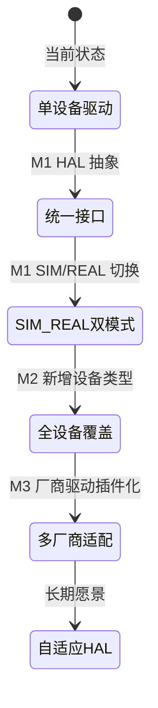

**M1**：统一接口定义 + SIM/REAL 双模式
**M2**：覆盖所有四场景设备
**M3**：厂商驱动插件化，支持热插拔

### 7.2 SLO 调度演进

| 阶段 | 能力 | 算法 |
|------|------|------|
| M1 | 规则引擎 + 优先级 | FIFO + 静态优先级 |
| M2 | SLO 弹性调度 | 动态权重 + VLA 仲裁 |
| M3 | 多园区弹性调度 | 分布式调度 + 预测性调度 |

### 7.3 VLA 集成演进

| 阶段 | 能力 | 部署 |
|------|------|------|
| 当前 | VLAPolicy 占位 | — |
| M1 | 训练管线完善 | 本地训练 |
| M2 | 场景 A 试点 | Triton 推理服务 |
| M3 | 四场景全量 | GPU 边缘节点 |

### 7.4 可观测演进

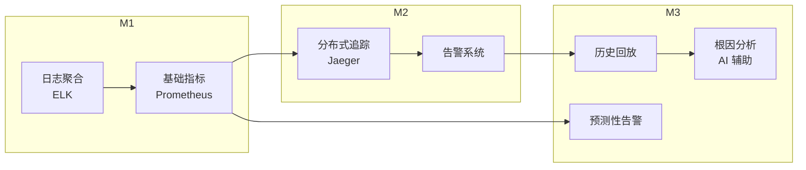

### 7.5 数字孪生演进

| 阶段 | 能力 | 数据 |
|------|------|------|
| M2 | 镜像骨架 | 静态布局 |
| M3 | 实时同步 | 设备状态 |
| 长期 | 预测性维护 | 历史 + 实时 |

### 7.6 HIL 演进

| 阶段 | 能力 | 覆盖 |
|------|------|------|
| M2 | PoC 环境 | 核心算法 |
| M3 | 产品化 HIL | 全部场景 |
| 长期 | 云端 HIL | 远程验证 |

### 7.7 多租户演进

| 阶段 | 隔离级别 | 部署模式 |
|------|----------|----------|
| M1 | 无租户 | 单园区 |
| M2 | 逻辑隔离 PoC | Namespace 级别 |
| M3 | 主园区物理 + 次园区逻辑 | 多集群 |

---

## 8. 资源与团队

### 8.1 所需角色

| 角色 | 技能要求 | 人数 |
|------|----------|------|
| 控制算法工程师 | 运动规划、PID 控制、Nav2 | 2-3 |
| 机器人软件工程师 | ROS 2、HAL 驱动、MQTT | 3-4 |
| MLOps / VLA 工程师 | PyTorch、Triton、数据闭环 | 1-2 |
| 前端工程师 | Vue 3、Three.js、看板 | 1-2 |
| 后端工程师 | FastAPI、PostgreSQL、K8s | 2-3 |
| SRE / 基础设施 | K3s、监控、日志 | 1-2 |
| 测试工程师 | 集成测试、HIL | 1 |

### 8.2 各阶段人员配置

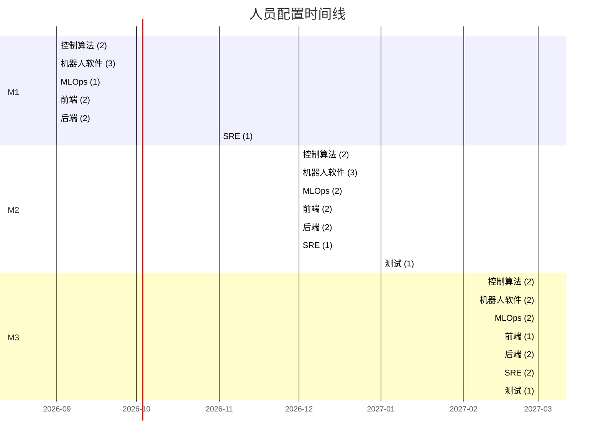

### 8.3 外部合作

| 合作方 | 合作内容 | 阶段 |
|--------|----------|------|
| 设备厂商（AUBO/UR） | HAL 驱动支持、故障支持 | M1-M3 |
| VLA 模型供应商 | 模型定制、推理优化 | M2-M3 |
| 云服务商 | GPU 实例、存储 | M2-M3 |
| 集成商 | 现场部署、运维 | M3 |

---

## 9. 关键技术决策点

### 9.1 数据库选型

| 选项 | 优点 | 缺点 | 推荐场景 |
|------|------|------|----------|
| **SQLite** | 简单、零配置 | 不支持并发写入 | M1 原型 |
| **PostgreSQL** | 成熟、ACID、强一致 | 需要运维 | M2 生产 |
| **TimescaleDB** | 时序优化、压缩 | 生态较小 | M3 时序数据 |
| **MongoDB** | 灵活 schema | 不适合关联查询 | 不推荐 |

**决策**：M1 沿用 SQLite → M2 迁移 PostgreSQL → M3 TimescaleDB 处理时序数据

### 9.2 消息总线选型

| 选项 | 优点 | 缺点 | 推荐场景 |
|------|------|------|----------|
| **MQTT** | 轻量、设备友好 | 无持久化 | 设备通信（当前） |
| **Kafka** | 高吞吐、持久化 | 运维复杂 | M3 云端分析 |
| **Pulsar** | 云原生、多租户 | 生态较小 | M3 多租户 |

**决策**：设备层继续 MQTT → 云端引入 Kafka/Pulsar

### 9.3 模型服务化框架

| 选项 | 优点 | 缺点 | 推荐场景 |
|------|------|------|----------|
| **Triton** | 多框架支持、高性能 | 配置复杂 | M2 VLA 推理 |
| **TorchServe** | PyTorch 原生 | 性能一般 | M1 快速验证 |
| **自研** | 完全可控 | 开发成本高 | 长期 |

**决策**：M1 TorchServe → M2 Triton

### 9.4 边缘计算平台

| 选项 | 优点 | 缺点 | 推荐场景 |
|------|------|------|----------|
| **K3s** | 轻量、简易 | 功能有限 | M2-M3 边缘 |
| **KubeEdge** | 云原生、边云协同 | 复杂度高 | M3 多园区 |
| **OpenYurt** | 阿里云集成 | 厂商绑定 | 不推荐 |

**决策**：M2 K3s → M3 KubeEdge（多园区）

### 9.5 数字孪生引擎

| 选项 | 优点 | 缺点 | 推荐场景 |
|------|------|------|----------|
| **MuJoCo** | 物理仿真强、开源 | 渲染能力有限 | M2 运动学镜像 |
| **Webots** | 仿真完整、ROS 集成 | 商业授权 | M3 完整仿真 |
| **自研** | 完全可控 | 开发成本高 | 不推荐 |

**决策**：M2 MuJoCo 镜像 → M3 评估 Webots

---

## 10. 风险登记册

| # | 风险描述 | 概率 | 影响 | 缓解措施 | 责任人 | 触发条件 |
|---|----------|------|------|----------|--------|----------|
| R1 | 调度算法与现有 orchestration 不兼容 | 中 | 高 | M1 前两周做接口对齐 POC | 控制算法工程师 | M1 第 15 天仍未对齐 |
| R2 | MQTT 高并发下稳定性不足 | 中 | 中 | 压力测试 + Kafka 备选评估 | 后端工程师 | 单节点 > 100 设备 |
| R3 | HAL 抽象无法覆盖 80% 设备差异 | 低 | 高 | 优先实现核心设备 | 机器人软件工程师 | M1 第 45 天覆盖率 < 60% |
| R4 | VLA 推理延迟不满足实时约束 | 中 | 高 | 提前评估 Triton 推理性能 | MLOps | 推理 P99 > 200ms |
| R5 | 四场景并行导致资源分散 | 高 | 中 | 优先级排序，场景 B/C 优先 | 项目经理 | M2 第 30 天任一场景进度 < 20% |
| R6 | 热备切换数据一致性问题 | 中 | 高 | PostgreSQL WAL + 幂等设计 | 后端工程师 | 切换后任务丢失 |
| R7 | HIL 环境搭建周期过长 | 中 | 中 | M2 第一个月完成 HIL 搭建 | 机器人软件工程师 | M2 第 45 天 HIL 不可用 |
| R8 | 多租户安全隔离边界漏洞 | 中 | 极高 | 安全评审 + 渗透测试 | 安全工程师 | 跨租户数据访问 |
| R9 | 模型迭代速度 vs 业务变化 | 高 | 中 | 需求优先级机制 + 自动化训练 | MLOps | 模型更新周期 > 2 周 |
| R10 | 边缘节点运维复杂度 | 高 | 中 | GitOps + 自动化运维 | SRE | 边缘节点故障 MTTR > 30min |
| R11 | 商业化交付周期不可控 | 中 | 中 | 敏捷迭代 + MVP 验证 | 项目经理 | M3 第 60 天仍未完成部署 |
| R12 | 仓库 3D 迁移延期 | 低 | 中 | 并行实施 + 分阶段交付 | 前端工程师 | M1 结束仍未完成迁移 |
| R13 | 关键人员离职 | 低 | 高 | 知识文档化 + 交叉培训 | 项目经理 | 任意关键角色离职 |
| R14 | 供应商交付延迟 | 低 | 中 | 多供应商备份 | 采购 | 设备到货 > 承诺周期 |
| R15 | 政策法规变化影响部署 | 极低 | 高 | 持续监控政策动态 | 合规 | 新规要求安全认证 |

---

## 11. 成功指标（KPI）

### 11.1 业务指标

| 指标 | 定义 | M1 目标 | M2 目标 | M3 目标 |
|------|------|---------|---------|---------|
| 场景覆盖率 | 已上线场景数 / 4 | 25% | 100% | 100% |
| 订单履约率 | 完成订单 / 总订单 | ≥ 90% | ≥ 95% | ≥ 98% |
| SLO 达成率 | SLO 达标时间 / 总时间 | ≥ 85% | ≥ 90% | ≥ 95% |
| 客户数 | 签约客户数 | — | 1 | ≥ 3 |
| 合同金额 | 签约合同总额 | — | — | ≥ 阈值 |

### 11.2 技术指标

| 指标 | 定义 | M1 目标 | M2 目标 | M3 目标 |
|------|------|---------|---------|---------|
| P95 调度延迟 | 任务从提交到下发的时间 P95 | < 500ms | < 300ms | < 200ms |
| P99 调度延迟 | 同上 P99 | < 1000ms | < 600ms | < 400ms |
| VLA 推理延迟 | 单次推理 P99 | — | < 200ms | < 150ms |
| 系统可用性 | uptime / (uptime + downtime) | ≥ 99% | ≥ 99.5% | ≥ 99.9% |
| 故障恢复时间 | MTTR | < 30min | < 15min | < 5min |
| 设备接入率 | 已接入设备 / 计划设备 | ≥ 80% | 100% | 100% |
| 测试覆盖率 | 代码覆盖率 | ≥ 70% | ≥ 80% | ≥ 90% |
| CI 通过率 | 每次提交通过率 | 100% | 100% | 100% |

### 11.3 商业指标

| 指标 | 定义 | M1 目标 | M2 目标 | M3 目标 |
|------|------|---------|---------|---------|
| 客户满意度 | NPS 评分 | — | ≥ 7 | ≥ 8 |
| 续约率 | 续约客户 / 到期客户 | — | — | ≥ 80% |
| 交付准时率 | 按期交付项目 / 总项目 | — | ≥ 80% | ≥ 95% |
| 成本控制 | 实际成本 / 预算成本 | ≤ 110% | ≤ 105% | ≤ 100% |

---

## 12. 时间线甘特图

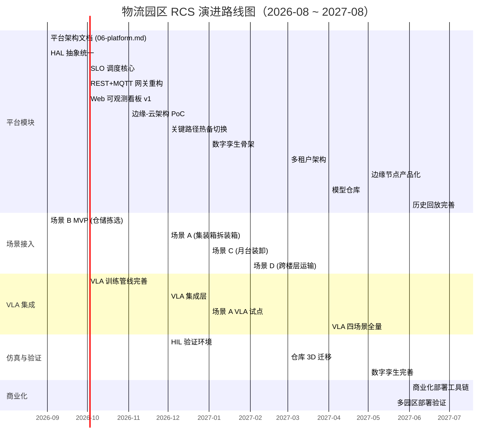

### 12.1 详细里程碑

| 里程碑 | 日期 | 交付物 | 验收标准 |
|--------|------|--------|----------|
| M1 Kickoff | 2026-09-01 | 项目启动 | 团队到位、工具就绪 |
| M1 平台骨架 | 2026-10-15 | HAL + SLO 调度核心 | 接口测试通过 |
| M1 场景 B MVP | 2026-11-30 | 场景 B 上线 | 100 单试跑成功率 ≥ 90% |
| M1 Go/No-Go | 2026-11-30 | 评审会议 | P95 < 500ms，HAL 覆盖 80% |
| M2 场景 A+C | 2027-01-15 | 场景 A+C 上线 | 各 100 单试跑 |
| M2 VLA 试点 | 2027-02-15 | VLA 场景 A 运行 | 抓取成功率 > 85% |
| M2 Go/No-Go | 2027-02-28 | 评审会议 | 四场景 1000 单试跑 |
| M3 多租户 | 2027-04-30 | 多租户上线 | 隔离校验 100% |
| M3 商业化 | 2027-07-31 | 商业部署工具链 | 部署时间 < 4h |
| M3 终验 | 2027-08-31 | 项目终验 | 全部 KPI 达标 |

---

## 附录 A：与其他文档的引用关系

| 引用文档 | 关系 | 说明 |
|----------|------|------|
| `docs/technical/ARCHITECTURE.md` | 基础 | 当前架构定义 |
| `docs/technical/OPERATIONS-ZH.md` | 运维依据 | 部署与运维手册 |
| `docs/technical/API.md` | 接口定义 | REST+MQTT 接口规范 |
| `docs/technical/06-platform.md` | 本路线图产出 | M1 平台架构文档 |
| `docs/algorithm/01-overview.md` | 算法基础 | 运动规划与参数化 |
| `docs/superpowers/specs/2026-08-14-top3-rcs-robotapp-design.md` | 设计参考 | Top 3 场景设计 |
| `docs/superpowers/plans/2026-08-14-top3-simulation-plan.md` | 实施依据 | 仿真实施计划 |
| `docs/superpowers/specs/2026-08-20-warehouse-3d-migration-design.md` | 迁移依据 | 仓库 3D 迁移 |
| `docs/optimization-execution-plan.md` | 对齐基准 | RCS 对齐优化 |

---

## 附录 B：术语表

| 术语 | 全称 | 说明 |
|------|------|------|
| RCS | Robot Control System | 机器人控制系统 |
| HAL | Hardware Abstraction Layer | 硬件抽象层 |
| SLO | Service Level Objective | 服务级别目标 |
| VLA | Vision-Language-Action Model | 视觉-语言-动作模型 |
| HIL | Hardware-in-the-Loop | 硬件在环 |
| MQTT | Message Queuing Telemetry Transport | 物联网消息协议 |
| FIFO | First In First Out | 先进先出调度 |
| PID | Proportional-Integral-Derivative | 比例积分微分控制 |
| AGV | Automated Guided Vehicle | 自动导引车 |
| STACKER | Stacker Crane | 堆垛机 |
| WMS | Warehouse Management System | 仓库管理系统 |
| MES | Manufacturing Execution System | 制造执行系统 |
| DT | Digital Twin | 数字孪生 |
| TCO | Total Cost of Ownership | 总拥有成本 |
| MTTR | Mean Time To Recovery | 平均恢复时间 |

---

*文档版本: 1.0*
*最后更新: 2026-08-23*
*下次评审: 2026-09-30（M1 中期评审）*
